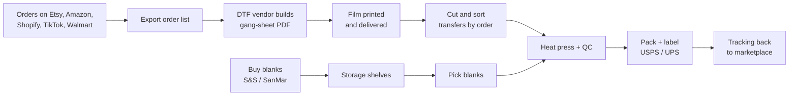
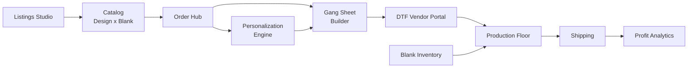
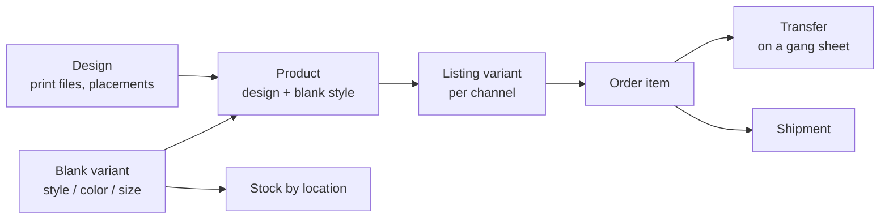

# InvAI — Platform Concept & Research

As of Sep 23, 2026 · Source doc: https://claude.ai/code/artifact/810068bd-1e49-4792-b2e7-e5fa74d916aa

InvAI (working name) is one subscription platform where a DTF t-shirt shop runs its whole business: AI listings on every marketplace, one order queue, automatic gang sheets labeled by order number, blank inventory, scan-verified pressing, built-in shipping labels and true profit per design. No product on the market connects marketplace orders to DTF production and AI listings in one place.

## Target customer

The first customer is a medium-size shop that makes its own product from DTF transfers and sells on several marketplaces. Each company gets one account and runs its whole operation inside it.

| Attribute | Profile |
| --- | --- |
| Volume | 100–1,000 orders per day |
| Staff | About 5–30: owner/designer, order prep, pressers, packers, a blank receiver |
| Print method | DTF transfers, heat pressed onto blanks |
| Film printing | Outsourced: the shop sends order info, a DTF vendor builds the gang-sheet PDF and prints the film |
| Order-to-design mapping | SKU codes carry design, style, color and size |
| Channels | Etsy, Amazon, Shopify, TikTok Shop, Walmart |
| Personalized orders | A lot (names, dates, photos) |
| Tools today | Spreadsheets, marketplace dashboards, ShipStation or Pirate Ship |
| Blanks | Gildan, Comfort Colors, Bella+Canvas and similar, bought wholesale and kept in storage |
| Access | You know owners; 2–3 shops will likely pilot and share real files |

Second customer later: the DTF vendors themselves. A vendor portal lets them receive gang sheets from many shops, which turns the platform into a network.

## How shops work today

Every handoff in the chain below is a spreadsheet, an export or a person reading a screen, and each one is where orders get lost, mixed up or shipped late.

Where it breaks, ranked by how often and how badly (from seller forums, reviews and industry sources):

| # | Pain | What it costs the shop |
| --- | --- | --- |
| 1 | Late shipment penalties | Amazon late-shipment rate must stay under 4%, Walmart needs 99% on time, TikTok caps late dispatch at about 4%, Etsy Star Seller needs 95%. Losing Etsy Star Seller also brings payment reserves |
| 2 | Trademark and IP takedowns | Listings removed, accounts suspended with no appeal. Etsy's Creativity Standards (June 10, 2025) banned templated designs |
| 3 | Order chaos across channels | Spreadsheets, wrong design or size pressed, transfers matched to the wrong order after cutting |
| 4 | Personalized orders | Etsy now allows 5 questions per listing; Amazon Custom arrives as a ZIP per order. Each needs its own artwork by hand |
| 5 | Gang-sheet building | Vendor figures: 20–45 minutes per sheet by hand and 12–20% film waste |
| 6 | Unknown true profit | Fees, blanks, transfers, labels and ads are never combined per design |
| 7 | Blank stockouts and overselling | One black size-M blank serves hundreds of designs, but marketplaces count stock per listing |
| 8 | Label costs | USPS commercial rates rose 11.8% in July 2026. ShipStation's 1,000-label plan went from $59.99 to $149.99 |
| 9 | Listing time | 15–20 minutes per optimized listing; Etsy CSV upload breaks with images and variations |
| 10 | Peak season | Q4 and TikTok viral spikes overwhelm staff; untrained seasonal staff make mistakes |

The supply side is also shifting: S&S is now the exclusive US wholesaler for Gildan, Comfort Colors and Hanes, while SanMar bought Bella+Canvas (closed June 29, 2026). Most shops now buy from two distributors.

## Competitors and the gap

Today a shop stitches together 5–8 tools for roughly $150–400 a month, and none of them links a listing to the production floor. The two closest competitors each cover only one half.

| Product | What it covers | Price | What it lacks |
| --- | --- | --- | --- |
| [Pythias Technologies](https://pythiastechnologies.com/pricing) | Marketplace orders to DTF/DTG production, labels, blank inventory. Built inside TShirtPalace | $199 (500 orders, 2 channels) to $3,000/mo | No AI listing, SEO or design tools; still early (founding cohort of 100 shops) |
| [MyDesigns.io](https://mydesigns.io/pricing) | AI designs, mockups, bulk publishing to Etsy, Shopify, TikTok | $0–79.99/mo | "Self fulfillment" is only a file download: no inventory, gang sheets or production queue |
| [STAHLS' Fulfill Engine](https://fulfillengine.com/pages/pricing) | Scan-to-print, automated transfer and blank ordering | $500/mo for in-house production, plus per-item fees | No Etsy, Amazon, TikTok or Walmart |
| Printavo, DecoNetwork, YoPrint, shopVOX, Teesom | Quotes, invoices, jobs for B2B print shops | $67–439/mo, often per seat | No native marketplace orders; built for custom B2B work |
| ShipStation, Veeqo, Sellbrite, Order Desk | Orders and labels across channels | $15–180/mo plus per-order fees | Don't know what a print file, gang sheet or blank is |
| Build A Gang Sheet, Antigro, DTF Gang Sheet App, CADlink | Gang-sheet building and nesting | Revenue share, $40–799/mo, or about $850 license | Built for DTF vendors selling to customers; not fed by the shop's own marketplace orders |
| eRank, Alura, Helium 10, Placeit, Merch Informer | SEO, research, mockups, trademark alerts | $6–129/mo each | Separate tools, no link to orders or production |

The gap InvAI fills:

1. Marketplace orders become order-labeled gang sheets automatically. No tool found does this.
2. Blank stock is one shared pool across all listings and channels, with reorders sent to S&S and SanMar.
3. A scan-driven floor: every transfer and shirt is checked against its order before pressing.
4. Profit per order and per design, with every cost included.
5. AI listings with a trademark check, tied to what the shop can actually print.
6. One price by order volume, all channels and users included.

## The platform: 11 modules

The complete version has 11 modules around one shared catalog, so an order flows from listing to delivered package without leaving the platform.

1. **Company workspace.** One account per company, with staff roles (owner, designer, order prep, presser, packer, receiver), permissions, multiple warehouses or stations, and an audit log of who did what.
2. **Catalog.** Designs (print files, placements, print size) and blanks (brand, style, color, size, cost). A product is a design on a blank. It powers everything else.
3. **Channel connections and SKU mapper.** Connect Etsy, Amazon, Shopify, TikTok Shop, Walmart (eBay later). Import existing listings and parse the shop's SKU scheme into design + blank + color + size automatically. Unmatched items get flagged once, then remembered.
4. **Order Hub.** One queue for all channels, sorted by each marketplace's real ship-by deadline. At-risk alerts, rush lanes, holds, cancellations, split orders, and a dashboard of each channel's performance metrics (late rate, tracking rate, Star Seller).
5. **Personalization Engine.** Reads Etsy's 5-question personalization, Amazon Custom ZIPs and Shopify line-item properties. Renders names, dates and photos into print-ready artwork from design templates, flags cut-off or unclear text, and shows a proof on the pick ticket.
6. **Gang Sheet Builder.** One click turns the day's orders into nested 22-inch sheets at 300 DPI. It prints the order number, item, size and color plus a QR code beside every design. Batches by due date, rush first; reprints get tagged. Exports PDF or PNG to the vendor's spec, or to a RIP hot folder if the shop prints in-house later.
7. **DTF Vendor Portal.** Sheets go straight to the vendor, who confirms, marks printed and marks shipped. Shops see transfer status per order. Vendors can serve many shops from one login.
8. **Blank Inventory and Purchasing.** Stock by style, color and size, shared by every listing. Counts go down as orders are made, and listings pause or cap when a blank runs out. Reorder suggestions reach the $200 free-freight line at S&S and SanMar, with live supplier stock, purchase orders and receiving by scan.
9. **Production Floor.** Tablet station views for pick, press, QC and pack. Scan the transfer QR and the shirt label; the screen confirms design, size and color before pressing, and blocks a mismatch. Tote or bin per order, reprint and misprint reasons, output per staff member, and capacity planning for how many orders the team can finish today.
10. **Shipping.** Built-in USPS and UPS labels through EasyPost or Shippo with rate shopping and weight presets per blank. Batch 4x6 thermal printing in pack order, and tracking sent back to each marketplace immediately. Returns and exchanges reuse the same print file.
11. **Profit Analytics.** True profit per order, design, blank and channel: sale price minus marketplace fees, blank cost, transfer cost per square inch, label, packaging, labor minutes, ads and refunds.

## AI features

All four AI areas you picked are feasible, but two limits shape them. Etsy and Amazon have no API for free-form buyer messages. Etsy requires human-curated, disclosed AI content. So AI drafts and a person approves.

| Area | Feature | Feasibility | Notes |
| --- | --- | --- | --- |
| Create listings | Titles, tags, descriptions, bullets per channel from one design | High | Enforce each channel's limits: Etsy 140-character title and 13 tags; Amazon SHIRT schema checked in preview mode before submitting |
| Create listings | Mockups on the shop's real blanks and colors | High | Composite the design onto blank photos rather than generating images, so the product is shown accurately |
| Create listings | Bulk publish with variation templates per blank | High | Etsy must receive the full variations array each time; add the AI and production-partner disclosure automatically |
| Create listings | Trademark and IP pre-check before publishing | Medium–high | Local index of live USPTO marks in clothing class 25, checked against title, tags and text read from the design (OCR). Show a risk score, not legal advice |
| Analyze & research | Which designs, colors and sizes make money | High | Built from the shop's own orders and fees |
| Analyze & research | Keyword and trend ideas | Medium | No Etsy search-volume API. Use Google Trends, Amazon Brand Analytics (needs Brand Registry) and the shop's own conversion data. No scraping |
| Analyze & research | AI business assistant: "what was my TikTok margin this week?" | High | Answers questions from the shop's own data |
| Operations AI | Auto-nesting of gang sheets | High | Rectangle packing gets 80–90% film use; shape-aware packing later |
| Operations AI | Print-file checks: DPI, transparency, upscaling, background removal | High | Flag art below about 150 effective DPI; clean semi-transparent pixels that print badly on DTF |
| Operations AI | Blank demand forecast and reorder points | Medium | Reliable after about 3 months of history; industry size curves for new shops |
| Operations AI | Personalization checks | High | Flags cut-off names, typos and odd dates before printing |
| Operations AI | Draft replies to buyer messages | Medium | Copy-and-paste for Etsy and Amazon; direct replies for Shopify, email and TikTok |
| Design generation | AI design ideas and artwork | Medium | Purely AI images can't be copyrighted in the US and can copy brands. Block brand, character and celebrity prompts; require human edit and approval; auto-disclose |

## Core data model

The key idea is that a product is not stock. A product is a design printed on a blank, so stock lives on blanks and on designs separately. This is what every existing order tool gets wrong.

| Entity | Key fields |
| --- | --- |
| Company | Plan, users and roles, locations, channel connections |
| Design | Print files by placement (front, back, sleeve), print size, personalization template |
| Blank variant | Brand, style, color, size, supplier SKU (S&S, SanMar), cost, weight |
| Product | Design + blank style, allowed colors and sizes, default placements |
| Listing variant | Channel, listing id, channel SKU, price, linked product + color + size |
| Order item | Channel order, ship-by date, personalization answers, status by stage |
| Gang sheet | Transfers, length, film use %, vendor, status |
| Stock and purchase order | On hand, reserved, incoming, reorder point, supplier order |

The SKU mapper learns each shop's scheme. For example, `BC3001-BLK-M-D1042` becomes Bella+Canvas 3001, black, M, design 1042. Every company has its own data, kept separate in one database.

## Integrations and approvals

Marketplace approvals, not code, set the launch date: Etsy commercial access and Amazon's personal-data review both take weeks, so apply in the first month.

| Integration | Access needed | Difficulty | Key facts |
| --- | --- | --- | --- |
| [Etsy Open API v3](https://developers.etsy.com/documentation/essentials/authentication/) | Personal app first, then Commercial Access (manual review) | High | Order webhooks, tracking upload. Personalization changed Feb 2026 (property 54, file URLs). No messages API. Brand name can't include "Etsy" |
| [Amazon SP-API](https://developer-docs.amazon/sp-api/docs/register-as-a-public-developer) | Public developer + restricted role for buyer addresses | Highest | Security architecture review, encryption, yearly pen test, delete addresses 30 days after shipping. Use Orders API v2026-01-01. Planned API fees were cancelled May 2026 |
| [Shopify](https://shopify.dev/docs/api/usage/limits) | Public app (GraphQL only) | Low | Easiest channel to launch with. Customer data access needs a separate request |
| [TikTok Shop](https://partner.tiktokshop.com/docv2/page/tts-api-concepts-overview) | Partner Center app | Medium | Check whether seller-bought labels are still allowed in the US in 2026 |
| [Walmart](https://developer.walmart.com/us-marketplace/docs/introduction-to-marketplace-apis) | Solution Provider program | Medium | 99% on-time and 99% valid tracking required |
| [EasyPost](https://www.easypost.com/pricing) or [Shippo](https://goshippo.com/pricing/api) | Platform partner account | Low | Discounted USPS/UPS rates; partner programs let InvAI add a margin per label. USPS's own new APIs need per-shop accounts, so skip them |
| [S&S Activewear](https://api.ssactivewear.com/V2/Default.aspx) | Shop's account number + API key | Low | REST, 60 requests/minute, stock refreshed about every 15 minutes, orders by API |
| SanMar | Web services enrollment | Medium | SOAP or PromoStandards; inventory capped at 500 per warehouse in replies |
| DTF vendors | None | Low | PDF or PNG at 22 inches wide, 300 DPI; vendor portal or email |

Design the security needed for Amazon from day one: encrypted data, access logs and automatic deletion of buyer addresses.

## Pricing and revenue

Proposed prices are tiered by monthly orders, with every channel, user and module included. They sit below Pythias at every volume and replace ShipStation, a listing tool, a gang-sheet app and spreadsheets. These are starting numbers to test with pilot shops.

| Plan | Orders per month | Price per month | Fits |
| --- | --- | --- | --- |
| Starter | Up to 3,000 | $149 | About 100 orders a day |
| Growth | Up to 10,000 | $349 | About 300 a day |
| Pro | Up to 30,000 | $699 | About 1,000 a day |
| Scale | 30,000+ | Custom | Multi-location shops |

Other revenue:

- **Shipping labels:** billed per label on top of the plan, because the label platform fee (about $0.08 per label at EasyPost's unconfirmed list price) is the platform's largest cost. Proposed: $0.10 per label, with EasyPost negotiated to $0.05 or less. See [tools-stack.md](tools-stack.md).
- **AI credits:** a monthly allowance is included; heavy design generation and mockups are sold as extra packs.
- **Vendor portal:** free for DTF vendors, because each vendor brings its other shop customers to InvAI.

Pilot shops get 3 months free in exchange for real data and weekly feedback.

## Build plan

The goal is the complete version with all 11 modules. Built solo with AI help, that is roughly 10–12 months. The order below gets pilot shops using real features by month 4, while the marketplace approvals are still in review.

| Phase | Months | Build | Pilot outcome |
| --- | --- | --- | --- |
| 0. Paperwork | 0–1 | Apply for Etsy commercial access, Amazon public developer, TikTok, Walmart and EasyPost partner. Collect pilot files | Real order exports, SKU sheets and a sample vendor PDF in hand |
| 1. Foundation | 1–3 | Company workspace and roles, catalog, SKU mapper, Order Hub. Shopify API plus CSV import for other channels until approvals land | One queue with ship-by deadlines |
| 2. Production core | 3–5 | Gang Sheet Builder, Personalization Engine, Production Floor scanning, built-in labels | Pilots stop using the outside gang-sheet service and ShipStation |
| 3. Inventory and channels | 5–7 | Blank inventory, S&S and SanMar, direct Etsy, Amazon, TikTok and Walmart, Profit Analytics | Stock never oversells; true profit per design |
| 4. AI listings | 7–9 | Listings Studio, mockups, trademark check, bulk publish | Listing time drops from 15–20 minutes to about 2 |
| 5. AI and network | 9–12 | DTF Vendor Portal, AI assistant, forecasting, design generation, message drafts | Paid launch to other shops in the city |

Suggested stack:

- **App:** TypeScript, Next.js, PostgreSQL with row-level security per company
- **Jobs:** background queue for order sync, webhooks and sheet rendering
- **Imaging:** a Python service for nesting, upscaling and PDF output
- **AI:** Claude API
- **Files:** S3-compatible storage
- **Floor devices:** tablets plus USB barcode scanners and 4x6 thermal printers

## Risks

| Risk | Likelihood | Mitigation |
| --- | --- | --- |
| Etsy or Amazon approval is slow or rejected | Medium | Apply in month 0; CSV import and Shopify keep pilots running meanwhile |
| Pythias adds AI listings, or MyDesigns adds production | Medium | Win locally first with pilots and vendor relationships; ship the gang-sheet chain early |
| Scope is too large for one developer | High | Follow the phase order; each phase must be used by pilots before starting the next |
| A wrong print or lost order blamed on the software | Medium | Scan checks block mismatches; audit log of every step |
| AI listings trigger IP strikes | Medium | Trademark check, human approval, auto disclosure, publish limits |
| Buyer data leak | Low, but severe | Amazon-level security from day one, address deletion after 30 days |
| Supplier and carrier changes (brand acquisitions, USPS rate rules) | High | Supplier and carrier logic kept as swappable adapters |

## Questions for pilot shops

- [ ] How many orders a day per channel, and which channel is growing fastest?
- [ ] Exactly what file does the DTF vendor receive and return? Get a real gang-sheet PDF and the order list sent to them
- [ ] What does the vendor charge per sheet or inch, and how long until film arrives?
- [ ] What is their SKU format? Get the full SKU sheet
- [ ] Where do personalized designs get made today, and by whom?
- [ ] How do staff match cut transfers to shirts? What goes wrong most often?
- [ ] What share of orders are reprints or misprints?
- [ ] Blank suppliers used, order frequency, and how often a blank runs out
- [ ] What they pay today for ShipStation, listing tools and the gang-sheet service
- [ ] Who creates listings, how many a week, and whether they have had IP strikes
- [ ] Would they pay $149–699 a month for this? Which module would they buy first on its own?
- [ ] Would their DTF vendor use a portal instead of email?

## Sources

- [Pythias Technologies pricing](https://pythiastechnologies.com/pricing)
- [MyDesigns pricing](https://mydesigns.io/pricing) and [self-fulfillment](https://mydesigns.io/blog/introducing-mydesigns-new-self-fulfillment-feature/)
- [STAHLS' Fulfill Engine pricing](https://fulfillengine.com/pages/pricing)
- [Printavo alternatives 2026](https://printshopcrm.com/blog/best-printavo-alternative-2026/)
- [DecoNetwork pricing](https://www.deconetwork.com/pricing/), [YoPrint pricing](https://www.yoprint.com/pricing), [Teesom pricing](https://teesom.com/pricing/)
- [Order Desk pricing](https://www.orderdesk.com/pricing), [ShipStation review](https://ship-audit.com/shipstation-review/)
- [DTF Gang Sheet App](https://dtfgangsheetapp.com/), [Build A Gang Sheet](https://buildagangsheet.io/)
- [Etsy API authentication](https://developers.etsy.com/documentation/essentials/authentication/), [rate limits](https://developers.etsy.com/documentation/essentials/rate-limits/), [webhooks](https://developers.etsy.com/documentation/essentials/webhooks/), [personalization migration](https://developers.etsy.com/documentation/tutorials/personalization-migration/)
- [Etsy Creativity Standards](https://www.etsy.com/legal/creativity)
- [Amazon SP-API public developer](https://developer-docs.amazon/sp-api/docs/register-as-a-public-developer), [Orders API migration](https://developer-docs.amazon/sp-api/docs/orders-api-migration-guide), [late shipment rate](https://sellercentral.amazon.com/help/hub/reference/external/G200285190)
- [TikTok Shop dispatch rules](https://seller-us.tiktok.com/university/essay?knowledge_id=3668989549299511), [Walmart shipping policy](https://marketplacelearn.walmart.com/guides/Policies%20&%20standards/Shipping%20&%20fulfillment/Shipping-and-fulfillment-policy)
- [EasyPost pricing](https://www.easypost.com/pricing), [Shippo API pricing](https://goshippo.com/pricing/api), [USPS July 2026 changes (Pirate Ship)](https://support.pirateship.com/en/articles/15453569-july-2026-usps-rate-and-rule-changes)
- [S&S Activewear API](https://api.ssactivewear.com/V2/Default.aspx), [SanMar integrations](https://www.sanmar.com/resources/electronicintegration/integrationofferings), [SanMar acquires Bella+Canvas](https://members.asicentral.com/news/industry-news/june-2026/sanmar-completes-acquisition-of-bellapluscanvas/)
- [Ninja Transfers FAQ](https://ninjatransfers.com/a/faq), [manual vs automatic gang sheets (vendor)](https://www.cheetahdtf.com/blogs/dtf-transfers/manual-gang-sheets-vs-automatic-gang-sheet-builder-a-complete-cost-quality-comparison)
- [Shopify: heat-press transfer and shirt inventory thread](https://community.shopify.com/t/help-i-need-a-better-way-to-keep-track-both-heat-press-transfers-and-my-shirt-inventory-separately/265901/1)
- [Etsy FY2025 results](https://investors.etsy.com/news-events/press-releases/detail/218/etsy-inc-reports-fourth-quarter-and-full-year-2025-results)

Reddit and Facebook groups could not be read, so seller quotes come from Etsy, Amazon and Shopify forums, reviews and industry blogs. Vendor figures are marked as such.
