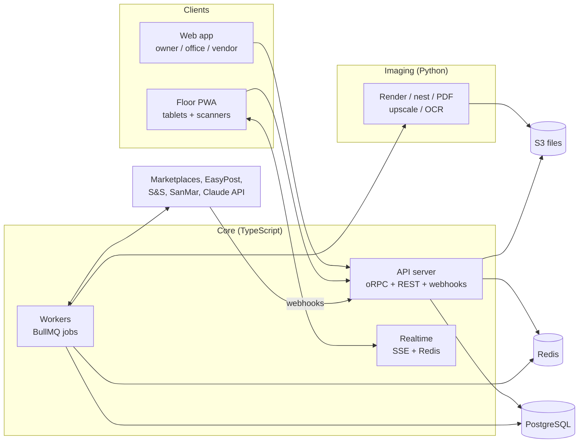
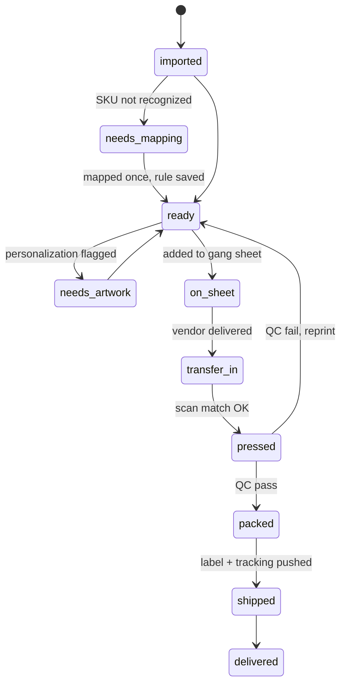
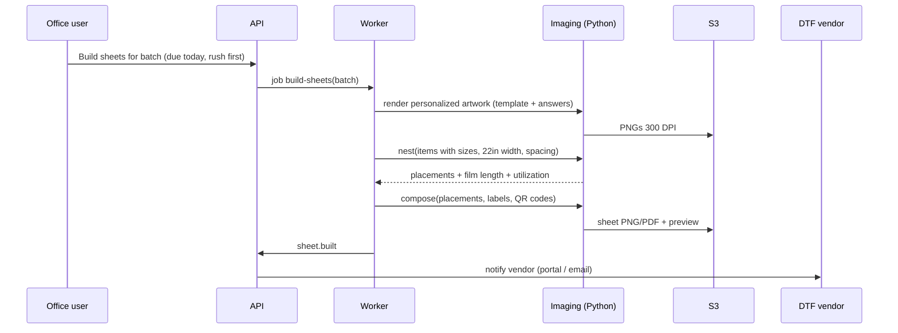
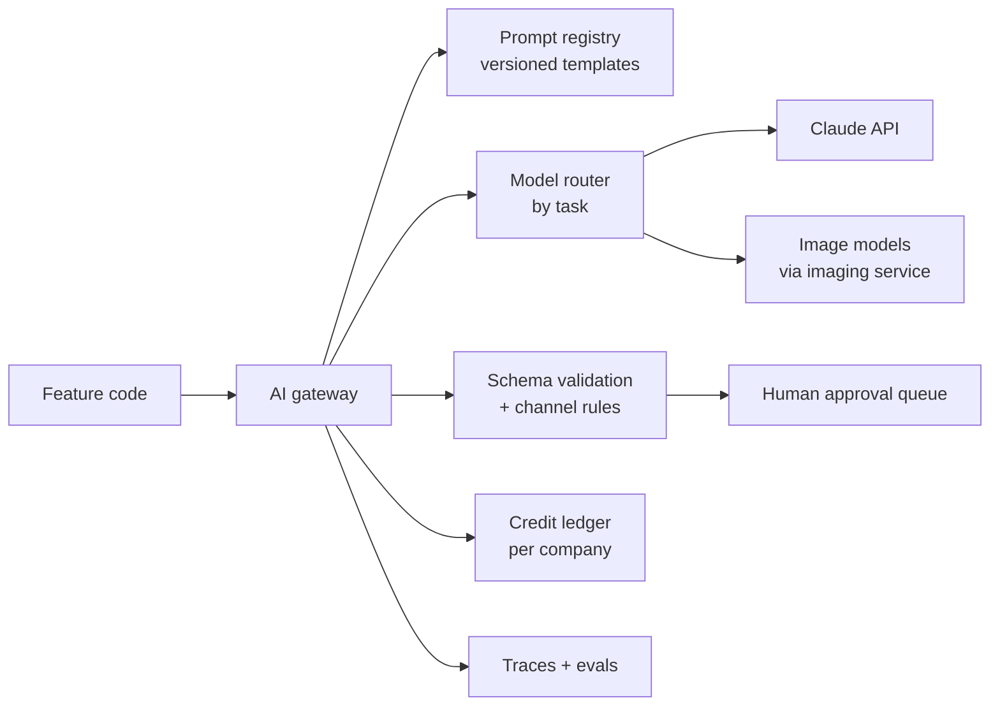

# InvAI — System Architecture

As of Sep 23, 2026. Companion to [00-platform-concept.md](00-platform-concept.md). Tool choices and costs are justified in [tools-stack.md](tools-stack.md).

**Decision in one line:** build InvAI as a **modular monolith in one TypeScript monorepo**, with one Python service for image work. It runs on **PostgreSQL + Redis + S3**, with **event-driven background workers**, and deploys to AWS as containers.

Why this shape, and not microservices:

- **One developer.** Every extra deployable is extra operations work.
- **The volume is small for a database.** 50 shops × 1,000 orders/day = 50k orders/day, under 1 order per second. Throughput is not the hard part.
- **The hard parts are elsewhere:**
  - Correctness: never press the wrong shirt, never double-ship.
  - External APIs: rate limits, webhooks, approvals.
  - Heavy image rendering for gang sheets.
- **The architecture is built for those three things.**

---

## 1. System map



| Deployable | Tech | Job |
| --- | --- | --- |
| `web` | Vite 8 + React 19 SPA, TanStack Router, Tailwind v4, shadcn/ui, TanStack Query | Dashboard for owners, office staff and DTF vendors |
| `floor` | Vite + React PWA (installable, works through brief offline gaps) | Big-button station screens: pick, press, QC, pack; USB barcode scanners |
| `api` | Node 24 + Hono, oRPC for the apps (same procedures exposed as public REST/OpenAPI later), REST for webhooks | All reads/writes, auth, webhook intake |
| `worker` | Same codebase as `api`, started in worker mode; BullMQ | Order sync, mapping, sheet building, labels, tracking push, AI jobs, reports |
| `imaging` | Python + FastAPI + pyvips + Pillow + OpenCV | Personalization rendering, nesting, big sheet PNG/PDF, DPI checks, background removal, OCR prep |

`api` and `worker` are one codebase with two start commands. The business logic lives in shared packages, not in either process.

---

## 2. Monorepo layout

```
invai/
  apps/
    web/            Vite + React SPA dashboard (owner, office, vendor portal)
    floor/          PWA for production stations
    api/            Hono server: oRPC router, REST webhooks, auth, SSE
    worker/         BullMQ job runners (imports the same modules)
  services/
    imaging/        Python FastAPI: render, nest, compose, pdf, image QA
  packages/
    db/             Drizzle schema, migrations, RLS policies, seed
    core/           Domain modules (see section 3) — pure business logic
    integrations/   Channel, carrier, supplier and vendor adapters
    ai/             Model gateway, prompts, schemas, evals, credit metering
    ui/             Shared React components
    config/         tsconfig, eslint, env schema (zod)
  infra/            SST (or Terraform) for AWS
  docs/             This folder
```

Tooling:

- **pnpm workspaces + Turborepo**
- **Vitest** for unit tests
- **Playwright** for end-to-end tests
- **Biome or ESLint** for linting
- **Zod** for every external payload and env var

---

## 3. Backend: domain modules

Each module owns its tables and exposes functions and events. Other modules call a module's public functions and never touch its tables directly. That keeps a later split into services possible, though it should not be needed.

| Module | Owns | Key events emitted |
| --- | --- | --- |
| `tenancy` | companies, users, roles, locations, stations, plans | `company.created` |
| `catalog` | designs, print files, placements, blanks, products | `design.updated` |
| `channels` | connections, OAuth tokens, listings, listing variants, SKU rules | `connection.connected`, `import.completed` |
| `orders` | orders, order items, state machine, holds | `order.imported`, `item.ready`, `order.cancelled` |
| `personalization` | templates, answers, rendered artwork, proofs | `artwork.rendered`, `artwork.flagged` |
| `production` | gang sheets, transfers, batches, station scans, reprints | `sheet.built`, `item.pressed`, `item.qc_failed` |
| `vendors` | DTF vendor orgs, sheet deliveries, status | `sheet.printed`, `sheet.shipped` |
| `inventory` | stock ledger, reservations, locations, purchase orders, suppliers | `stock.low`, `po.received` |
| `shipping` | shipments, labels, rates, carrier accounts, returns | `shipment.labeled`, `shipment.delivered` |
| `finance` | fees, costs, profit per order line, ad spend imports | `profit.recomputed` |
| `ai` | AI jobs, drafts, approvals, credit ledger, trademark index | `listing_draft.ready` |
| `billing` | Stripe subscriptions, usage meters | `plan.limit_reached` |

### 3.1 Order item state machine

This is the core of the product. Every transition is written to an audit log with who, when and which station.



Items can also move to `on_hold` or `cancelled` from any state before `shipped`. A cancellation after `on_sheet` marks that transfer as scrap and returns the blank to stock.

### 3.2 Events and jobs: transactional outbox

- **Same transaction.** Every state change writes its row and an `outbox_events` row in the same Postgres transaction.
- **Relay.** A small relay process moves outbox rows into BullMQ queues.
- **Why.** An event is never lost when a process crashes, and no event fires for a change that was rolled back.
- **Idempotent jobs.** Each job carries a key (for example `push-tracking:{shipment_id}`), so a retry cannot push the same tracking twice.

Queues are split by kind so one slow area cannot block another:

| Queue | Examples | Concurrency notes |
| --- | --- | --- |
| `sync` | fetch orders, webhook processing, listing sync | Per-connection rate limiting (below) |
| `render` | personalization, gang sheet compose | CPU/memory heavy; separate worker size |
| `ship` | buy labels, push tracking | High priority, deadline-sensitive |
| `ai` | listing drafts, OCR, trademark checks, batches | Metered per company |
| `reports` | profit recompute, forecasts, emails | Low priority, nightly |

Failed jobs retry with exponential backoff, then land in a dead-letter view in the admin panel with the payload and error.

### 3.3 Inventory as a ledger

- **Append-only.** Stock is never overwritten. Every change is an `inventory_movements` row: receive, reserve, consume, adjust, return, scrap.
- **Derived numbers.**
  - on hand = sum of movements
  - available = on hand − reserved
  - A materialized cache table keeps these fast.
- **Pushing stock to channels.** Each listing variant draws on one blank variant, so the quantity pushed to a marketplace is that blank's available count, capped by an optional per-listing limit.
- **One sync job.** When a blank crosses a threshold, one debounced job updates every affected listing on every channel.

---

## 4. Integrations layer

Every outside system sits behind an adapter interface in `packages/integrations`, so a new channel is a new adapter, not a rewrite.

```ts
interface ChannelAdapter {
  kind: 'etsy' | 'amazon' | 'shopify' | 'tiktok' | 'walmart' | 'ebay' | 'csv';
  verifyWebhook(req): boolean;
  parseWebhook(req): ChannelEvent[];
  fetchOrders(conn, cursor): { orders: NormalizedOrder[]; nextCursor };
  pushTracking(conn, order, shipment): void;
  fetchListings(conn, cursor): NormalizedListing[];
  upsertListing(conn, draft): ListingRef;     // phase 4
  setAvailability(conn, updates): void;
}
```

The same pattern applies to three other adapter families:

- **Carriers:** `CarrierAdapter` for EasyPost first, Shippo as a backup.
- **Suppliers:** `SupplierAdapter` for S&S REST, SanMar SOAP/PromoStandards and CSV.
- **DTF vendors:** `VendorAdapter` for the portal, email plus a download link, or SFTP.

Rules every adapter follows:

- **Normalize at the edge.** Adapters turn channel payloads into `NormalizedOrder` and the core never sees Etsy or Amazon shapes. The raw payload is stored, encrypted, for 30 days for debugging.
- **Webhooks plus polling.** Webhooks give speed. A polling job every 5–10 minutes per connection catches anything missed; Etsy retries webhooks for about 37 hours, which is not a guarantee.
- **Cursors.** Each connection stores its last sync cursor, so restarts resume cleanly.
- **Rate limits.** A token bucket in Redis per connection and per app key, fed by each API's own headers (Etsy daily and per-second limits, S&S 60/min, Amazon per-operation limits).
- **Tokens.** OAuth tokens are encrypted with AWS KMS envelope encryption and refreshed by a job before they expire (Etsy access tokens last 1 hour).
- **Contract tests.** Recorded real payloads (with personal data scrubbed) from pilot shops are replayed in tests for every adapter.
- **CSV adapter.** It is a real adapter, not a hack. Pilots use it for Etsy and Amazon while approvals are pending.

---

## 5. Gang sheet and imaging pipeline

This is the most technically distinctive part of the product and the one that needs the most care.



**Step 1: artwork per item**
- Plain designs: the stored print file, scaled to the placement size.
- Personalized designs: an SVG template with named text and photo slots. Fonts are installed on the imaging service. The output is rendered to PNG at 300 DPI.
- Quality checks run on every file:
  - effective DPI of 150 or more
  - transparency cleanup, because soft alpha prints badly on DTF
  - minimum line thickness

**Step 2: nesting**
- Start with a MaxRects rectangle packer (the `rectpack` library), allowing 90° rotation and about 0.25 inch spacing. That gives about 80–90% film use.
- Add shape-aware nesting later, only if pilots care about the last 5–10%.

**Step 3: composing the sheet**
- A 22 inch × 20 foot sheet at 300 DPI is 6,600 × 72,000 pixels. Pillow runs out of memory at that size, so use **pyvips**, which streams the image in tiles.
- Beside every design, print:
  - the order number
  - the item number
  - size and color
  - a QR code with `transfer_id`

**Step 4: output**
- A transparent PNG, or a PDF, to the vendor's spec (sheet width, maximum length, color profile).
- A low-resolution preview for the web app.
- Each vendor's spec is a saved profile.

**Why a separate Python service:** the best libraries for this work are Python-only (pyvips, OpenCV, rectpack, rembg/BiRefNet and Real-ESRGAN bindings). It runs as its own container with more memory. The worker calls it over internal HTTP, and it writes straight to S3.

**GPU work:** upscaling, background removal and AI image generation use open models (Real-ESRGAN, BiRefNet) on Modal serverless GPUs; design generation calls Ideogram 3 via fal (Recraft for vector). All are called from the imaging service; no GPU servers of our own.

---

## 6. Production floor (hardware and realtime)

- **Tablets** run the `floor` PWA. Staff log in with a 4–6 digit PIN or a badge scan on a shared device, while the station stays signed in as the company.
- **Barcode scanners** are USB/Bluetooth "keyboard wedge" devices, so the PWA just listens for fast keystrokes ending in Enter. No drivers are needed.
- **Scan check at the press:**
  1. Scan the transfer QR, which gives the `transfer_id`.
  2. Scan the blank or tote label.
  3. The server checks that design, size and color all match.
  4. A green screen means press. A red screen blocks the press and says why.
- **Label printing:** 4×6 thermal printers (Zebra, Rollo). Silent printing from the browser goes through **PrintNode** (hosted) or **QZ Tray** (local), because browsers can't print silently by themselves. Labels are ZPL or PDF from EasyPost.
- **Realtime:** Server-Sent Events from the `api` process, fed by Redis pub/sub, with a Redis Stream for replay after reconnect. Tablets send commands with ordinary requests.
- **Offline gaps:** scans are queued in IndexedDB and replayed when the connection returns. The server stays the single source of truth and rejects stale scans.

---

## 7. Database

**PostgreSQL 16+** (AWS RDS or Aurora Serverless v2), with **Drizzle ORM** and SQL migrations.

**Multi-tenancy**
- One shared database and schema. Every tenant table has `company_id`.
- **Row-Level Security** policies enforce it: the API sets `app.company_id` on every connection from the logged-in user.
- A bug in a query can't leak another company's data, and this is strong evidence for Amazon's security review.
- **DTF vendors** are their own organization type. They see only the sheets that shops share with them, through an explicit `vendor_access` table.

**Extensions**
- `pg_trgm` for fuzzy SKU and trademark matching.
- `pgvector` for design similarity and duplicate detection.
- `pg_partman` if order tables grow large.

**Buyer personal data** (names, addresses, emails)
- Kept in separate columns, encrypted per field with KMS data keys.
- Deleted or anonymized **30 days after delivery** by a nightly job, as Amazon's policy requires. Order history keeps the non-personal fields.

**Analytics**
- Start with materialized views: profit per order line, design, channel and day.
- Move to ClickHouse or a warehouse only when those queries get slow.

**Search**
- Postgres full-text search to start. Add Meilisearch or Typesense only if needed.

**Backups**
- RDS point-in-time recovery for 7–35 days, plus a monthly snapshot copied to a second region.

**Other stores**

| Store | Holds |
| --- | --- |
| Redis (ElastiCache or Upstash) | BullMQ queues, rate-limit buckets, pub/sub, short caches, idempotency keys |
| S3 | design files, rendered artwork, sheets, labels, mockups, raw payload archives. Private buckets, signed URLs, lifecycle rules (rendered sheets expire after 90 days) |

---

## 8. AI orchestration

All AI goes through **`packages/ai`**, one gateway, so every call is metered per company, logged, validated and replaceable.



### 8.1 Four patterns (use the simplest that works)

| Pattern | Used for | How |
| --- | --- | --- |
| **Single structured call** | Listing title/tags/description per channel, personalization checks, SKU-mapping suggestions, trademark "is this a real conflict?" judge | One Messages API call with **structured outputs** (`output_config.format`, a JSON schema per channel). Then our own validator enforces hard limits (Etsy 140-character title, 13 tags ≤ 20 characters; Amazon SHIRT schema via its validation-preview mode) and retries once with the errors attached |
| **Batch** | "Generate listings for 300 new designs", nightly re-scoring of listings | **Message Batches API**, about 50% cheaper and asynchronous; results matched by `custom_id` = draft id |
| **Vision** | Read text inside a design (OCR) for the trademark check, describe a design to seed listing copy, check a mockup | Image content blocks in a normal call. Send a downsized preview, never the 6,600 px original |
| **Agent with tools** | The in-app business assistant ("what was my TikTok margin this week?", "which designs should I reorder blanks for?") | Tool Runner from the Anthropic TypeScript SDK with **read-only, company-scoped tools** (`get_profit`, `get_orders_summary`, `get_stock`, `get_listing_performance`). No raw SQL. Every tool runs under the user's own RLS context. Streamed to the UI |

Image *generation* (design ideas) and upscaling don't use Claude, which doesn't generate images. They go through the imaging service to a hosted image model, and Claude writes and filters the prompts.

### 8.2 Model choice

- **Default model:** `claude-opus-5` with adaptive thinking, tuned per task with `output_config.effort`:
  - `low` for high-volume, simple jobs (tags, personalization checks, SKU suggestions)
  - `medium` for listing copy
  - `high` for the business assistant
- **Why effort first:** lowering effort on the strongest model is the first cost lever to measure, before switching models.
- **Cheaper models:** `claude-sonnet-5` or `claude-haiku-4-5` for bulk routes, but only where an eval on real pilot data shows the same quality. That's a cost decision to make with data.
- **Refusal fallback:** turn on the server-side refusal fallback for `claude-opus-5` calls, and always check `stop_reason` before reading output.
- **Model IDs** live in one config file, so a new model is a one-line change.

### 8.3 Cost control

- **Prompt caching.**
  - Channel rules, style guides and each company's brand voice sit in a stable system prefix with `cache_control`.
  - The varying part (this design, these attributes) goes last.
  - Check `usage.cache_read_input_tokens` in traces.
- **Batch** everything that isn't interactive.
- **Credits ledger.**
  - Every call records tokens and cost against the company.
  - Plans include a monthly allowance; going over requires packs, or the feature pauses.
  - Per-company rate limits stop one shop from draining the budget.
- **Downsize images** before vision calls, and cache OCR results per design file hash.

### 8.4 Safety and compliance

- **Human approval before publishing.** AI output always lands as a *draft*; nothing goes live on a marketplace until a person approves it. This is Etsy's Creativity Standards requirement and it protects the shop.
- **Disclosure.** AI-use and production-partner disclosures are added to listings automatically.
- **Trademark index.**
  - Built nightly from USPTO bulk data: live marks in clothing class 25.
  - Matched with trigram similarity against the title, tags and design text (from OCR).
  - Claude judges the ambiguous matches.
  - Output is a risk score shown in the UI, not legal advice.
- **Design prompts** mentioning brands, characters or celebrities are blocked.
- **No buyer personal data to the model.** Names and addresses are removed before any AI call. Personalization text is sent only for the personalization check.
- **Evals.** Each prompt has a small eval set (real designs with expected outputs) run in CI whenever the prompt or model changes.

---

## 9. Frontend

| App | Users | Notes |
| --- | --- | --- |
| **Web** (Vite + React SPA) | Owner, office, designer, DTF vendor | oRPC client + TanStack Query for data; tables with TanStack Table (virtualized, since queues run to thousands of rows); forms with react-hook-form + zod; charts with Recharts. Role-based navigation. The vendor portal is the same app with a different org type and its own routes |
| **Floor** (PWA) | Pickers, pressers, packers | Large touch targets, color-coded result screens, sound on scan success or failure, keyboard-wedge scanner input, works in landscape on 10-inch tablets |
| **Later: mobile** | Owner | Not needed early. The web app should work well on a phone for alerts and metrics |

**Auth**
- **Better Auth** (open source, users in our own Postgres), with its organizations plugin for companies and roles.
- 2FA for owners; PIN login for floor stations.
- Keeping users in our own database avoids per-user fees when shops have many floor staff, and keeps all personal data inside our security boundary.

---

## 10. Infrastructure and deployment

**Hosting: AWS, set up as code with SST v3 (or Terraform).**

- **Why AWS:** KMS, RDS encryption, CloudTrail and private networking make Amazon's personal-data security review much easier to pass.
- **Services:**

| Piece | AWS service |
| --- | --- |
| `web`, `api`, `worker`, `imaging` | ECS Fargate containers (imaging gets 4–8 GB of memory) |
| Database | RDS PostgreSQL, encrypted, in a private subnet |
| Redis | ElastiCache |
| Files | S3, with CloudFront for previews and mockups |
| Keys and secrets | KMS, Secrets Manager |
| Email | SES for alerts and vendor notifications |

- **Environments:** `dev` (local via Docker Compose: Postgres, Redis, MinIO, imaging), `staging`, `prod`.
- **CI/CD:** GitHub Actions runs lint, type-check, tests, migrations and prompt evals, then deploys to staging automatically and to prod on a tag.
- **Early cost estimate:** roughly $150–350 a month on AWS for pilot scale, plus Claude API usage and EasyPost fees.
- **Observability:**
  - **Sentry** for errors in all apps.
  - **OpenTelemetry** traces to Grafana Cloud or Axiom, so a request can be followed across api → worker → imaging.
  - **Bull Board** for queues.
  - An internal admin panel for tenants, connections, failed jobs and replays.
- **Alerts** that matter to shops:
  - an order approaching its ship-by deadline without a label
  - sync broken for any connection for 30+ minutes
  - a sheet stuck with the vendor
  - stock below its reorder point

---

## 11. Security baseline (from day one, because Amazon checks it)

- Encryption everywhere: TLS in transit; KMS at rest for the database, S3, Redis and backups; per-field encryption for buyer personal data and OAuth tokens.
- Row-Level Security per company, plus role checks in every API procedure.
- Least-privilege IAM roles per service; no long-lived AWS keys in code.
- Audit log of logins, permission changes, data exports and every production scan.
- Automatic personal-data deletion 30 days after delivery; raw payload archive expires after 30 days.
- Dependency and container scanning in CI; vulnerability scans at least every 180 days; a pen test before applying for Amazon's restricted role.
- A written incident-response plan (Amazon must be notified of incidents quickly).
- Webhook signatures verified (Etsy HMAC-SHA256, Shopify HMAC, and each channel's own scheme).

---

## 12. Build order mapped to the architecture

| Phase | Architecture pieces built |
| --- | --- |
| 1. Foundation | Monorepo, db + RLS, tenancy/auth, catalog, channels (Shopify + CSV adapters), orders + state machine, outbox + queues, web app shell |
| 2. Production core | Imaging service (render, nest, compose), gang sheets, floor PWA + scanning + realtime, EasyPost labels + tracking push |
| 3. Inventory and channels | Inventory ledger, S&S and SanMar adapters, availability sync, Etsy/Amazon/TikTok/Walmart adapters, finance + profit views |
| 4. AI listings | AI gateway, prompt registry, structured outputs, batches, mockup compositing, trademark index, listing upsert in adapters |
| 5. AI and network | Vendor portal, business assistant agent, forecasting job (Python, statsforecast), design generation, message drafts |

## 13. Decisions to confirm

- [ ] TypeScript + Python split (recommended), or all-Python backend (FastAPI + Celery) if you're stronger in Python
- [ ] AWS + SST (recommended for the Amazon review), or a simpler host (Railway/Render) for the pilot only, moving to AWS before the Amazon application
- [ ] Better Auth (self-hosted) or Clerk (faster setup, per-user pricing)
- [ ] EasyPost (recommended) or Shippo as the first carrier aggregator
- [ ] PrintNode or QZ Tray for silent label printing on the floor
