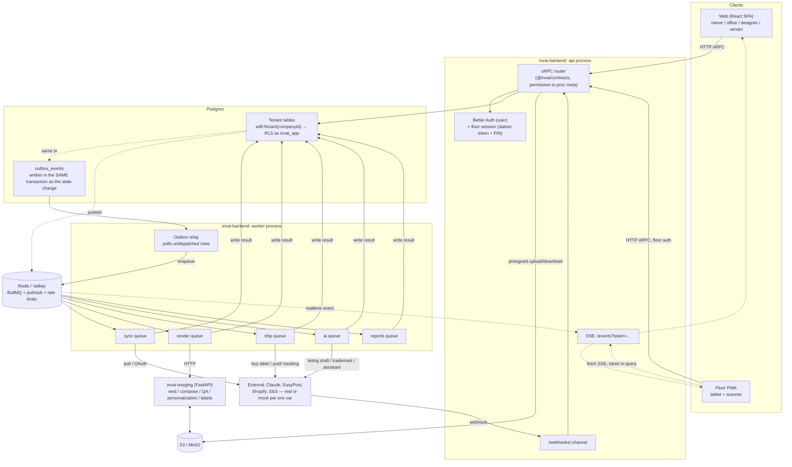

# Architecture: as built vs. `architecture.md`

`architecture.md` was the plan going into the overnight build. This is what actually shipped and
where it differs — not a restatement of the whole document, just the deltas. Cuts and deferrals
that were already decided *before* coding started are in `v1-plan.md` §2 ("Cut or deferred") and
aren't repeated here; this page is about things that changed shape during the build itself.

## What differs

| Area | `architecture.md` said | As built | Why |
| --- | --- | --- | --- |
| Repo layout | One monorepo (`invai/apps/*`, `services/imaging`, `packages/{db,core,integrations}`) | 8 separate git repos side by side (`invai-contracts`, `invai-ui`, `invai-backend`, `invai-imaging`, `invai-web`, `invai-floor`, `invai-infra`, `invai-docs`), all on branch `main` (v1 was built on `platform-v1` and merged Sep 24). Shared packages (`@invai/contracts`, `@invai/ui`) are linked with `link:../<repo>` instead of a workspace | The repos, CI and deploy keys already existed as separate repos; switching to a monorepo tonight would cost a day of migration for no runtime benefit at this scale. Kept multi-repo (`v1-plan.md` §2) |
| Order items | Described generically as "orders, order items" with quantities on channel lines | Each **physical unit is its own `OrderItem` row** (`unitNo` 1..quantity). A channel line with quantity 3 explodes into 3 items at import. `NormalizedOrderItem` (the channel-adapter shape) still carries `quantity`; the orders module does the exploding | Every downstream step — mapping, personalization, gang-sheet placement, the press scan, QC, pack — needs to key off one physical shirt, not one order line. A 3-shirt line can have one artwork mistake on shirt #2; per-unit rows are what make the press scan block *that one shirt* instead of the whole line |
| Authorization | "Row-Level Security per company, plus role checks in every API procedure" (no detail on where the check lives) | Every contract procedure declares its required permission as **metadata on the procedure itself** (`proc("orders.manage")` in `invai-contracts`), read by backend middleware off `procedure['~orpc'].meta.permission`. `PROCEDURE_PERMISSIONS` (contracts) is the same map for tests and docs | Putting the permission in the contract, not scattered across handler bodies, means one test (`src/api/authz.test.ts`) can walk all 190 procedures through the real router and assert every single one enforces something — a new procedure with no declared permission fails to typecheck, not just fails a manual review |
| Marketplace availability push | "One sync job. When a blank crosses a threshold, one debounced job updates every affected listing on every channel" (implied always-on) | **Opt-in per connection** — a `pushAvailability` flag on each channel connection. Availability sync only writes to connections where the shop turned it on; onboarding prompts them to | Silently overwriting a shop's live marketplace quantities on day one, before they've verified the mapping is right, is riskier than a missed stock update. Decision recorded in `v1-plan.md` §6 |
| Pack semantics | State diagram only: `pressed --pass--> packed` | Same state transition, but the **pack station scan itself doesn't change state** — every scan at pack just records a `pack` scan against an already-`packed` item. A separate **"mark packed"** action checks that every non-cancelled unit in the order is `packed`, releases the tote, and moves the *order* into the shipping queue. A label purchase then moves items `packed → shipped` when tracking is pushed | The state diagram alone doesn't say what makes an *order* (not just an item) ready to ship — a partially-packed order can't leave the floor. Decision recorded in `v1-plan.md` §6 |
| Floor realtime auth | "Realtime: SSE + Redis" (no auth detail) | Browser `EventSource` can't send an `Authorization` header, so the floor session token travels as a query parameter (`/events?token=...`) instead, with a custom fetch-based SSE client (backoff, `Last-Event-ID`) rather than the native `EventSource` | Needed a concrete answer for a tablet PWA that has no bearer-header-capable SSE primitive in the browser. Flagged as open issue #4 in `v1-plan.md`, closed during the floor build; the token-in-URL tradeoff is tracked as security finding S-30 (open, low severity) |
| Security posture | Baseline: RLS, role checks, encrypted PII, audit log | A full security review (`invai-docs/security/v1-review.md`) ran against the built system and found (then mostly fixed) 32 issues beyond the baseline design — most seriously, Better Auth's own organization-management endpoints were reachable and bypassed the app's role rules (S-01/S-02/S-03), and a Shopify webhook could be routed to the wrong company before OAuth completed (S-04). All 4 High findings are fixed; 13 of 15 Medium are fixed (one mitigated, one open); see the review for the rest | Architecture reviews rarely catch framework-default endpoints (Better Auth ships its own REST surface) or timing/ordering bugs (a `pending` connection receiving webhooks before ownership is proven) — those only show up once the real code exists |
| AI model policy | Not specified in `architecture.md` (covered in `tools-stack.md` at a cost-model level) | `claude-opus-5` by default with adaptive thinking; effort tuned per route (`low` for tags/SKU suggestions/personalization checks, `medium` for listing copy, `high` for the assistant); one config file for model IDs; server-side refusal fallback; deterministic mock provider when there's no key | Decided during the build (`v1-plan.md` §2) once the AI gateway's actual call sites were known |

## Request and job flow, as built

Key invariants that hold at every step above: a request never mutates a tenant table outside
`withTenant`/`withSystem`; a state change and its outbox event commit together or not at all; a
job is idempotent by a stable `jobId`; and every external call in the `EXT` box is either the
real adapter or its mock, selected by whether the matching env var is set (`invai-backend/src/env.ts`,
`env.mocks.*`) — nothing downstream of that box knows or cares which one it's talking to.
