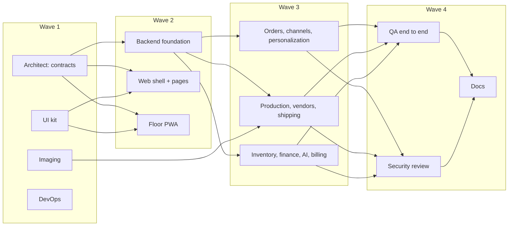

# InvAI v1 build plan

As of Sep 24, 2026. Owner: tech lead (Claude Opus 5.5). This is the single source of truth for the overnight v1 build: what we build, what we cut, who owns what, and the cross-service specs agents must agree on.

## 1. Goal

A working, demoable platform that runs end to end on a laptop:

> A seeded demo shop imports marketplace orders (CSV and Shopify), maps SKUs to design + blank, builds order-labeled gang sheets, sends them to a DTF vendor portal, scan-checks every shirt at the press on a tablet, buys labels, pushes tracking, and shows true profit per design. AI drafts listings with a trademark risk check.

Everything external (Claude, EasyPost, Shopify, S&S, marketplaces) runs through adapters with a **mock provider** that is used automatically when credentials are missing. Real adapters are written against the official docs, so adding a key switches them on.

## 2. Product decisions (PM + tech lead trade-offs)

### Keep and build now (ranked by pilot value)

| # | Feature | Why now |
|---|---|---|
| 1 | Order Hub sorted by real ship-by, at-risk alerts, holds, cancel | Late-shipment penalties are pain #1 |
| 2 | CSV import for Etsy, Amazon, TikTok, Walmart, Shopify exports, plus the Shopify API adapter | Pilots can use it before marketplace approvals land |
| 3 | SKU mapper: learned rules, pattern inference, one-time manual map | Every downstream step depends on design + blank being known |
| 4 | Gang Sheet Builder: nesting, order/QR labels, PNG + PDF, preview | Core differentiator; no competitor has it |
| 5 | Production floor PWA: pick/press/QC/pack, scan match, offline queue | Stops wrong-shirt pressing |
| 6 | Blank inventory ledger, reservations, POs, receiving, reorder to the free-freight line | One blank serves many listings |
| 7 | Shipping: rate shop, labels, batch 4x6 PDF, tracking push | Replaces ShipStation |
| 8 | Profit per order, design, blank and channel | Pain #6 |
| 9 | DTF vendor portal (vendor org type) | Network effect; cheap once sheets exist |
| 10 | AI listing drafts with channel validators, human approval, disclosure | Phase 4 value, low risk with drafts only |
| 11 | Trademark risk check (pg_trgm over a seeded class-25 marks table, Claude judges ambiguous matches) | Protects shops from IP strikes |
| 12 | Personalization: text templates rendered at 300 DPI, overflow and typo flags | A lot of orders are personalized |
| 13 | AI business assistant with read-only, company-scoped tools | Cheap to add once finance data exists |

### Added (not in the original concept)

- **"Today" command center** as the home screen: due today, at-risk, blocked (needs mapping or artwork), sheets waiting on the vendor, capacity against the day's work.
- **Demo mode and seed data**: a realistic shop ("Desert Bloom Tees") so the product can be shown and tested without real data.
- **Onboarding checklist**: connect a channel, import blanks, map SKUs, add a vendor, invite staff.
- **Reprint and misprint reasons** captured at QC, reported in analytics.
- **Spanish UI on the floor** (already in the concept's i18n); many pressers are Spanish speakers.

### Cut or deferred (and why)

| Item | Decision | Reason |
|---|---|---|
| AI design generation (Ideogram/Recraft) | **Cut from v1** | Copyright/IP risk, conflicts with Etsy Creativity Standards, MyDesigns already owns it; not our wedge |
| Direct Amazon SP-API | Deferred; CSV now | Restricted role needs a security review and pen test (months) |
| Direct Etsy, TikTok, Walmart APIs | Adapter code plus fixtures, marked "pending approval"; CSV works today | Approvals, not code, gate them |
| SanMar SOAP | Deferred; CSV plus S&S REST adapter | S&S covers Gildan, Comfort Colors and Hanes |
| GPU upscaling and background removal | Deferred | DPI check and alpha cleanup run on CPU now |
| Shape-aware nesting | Deferred | rectpack gives 80–90%; wait for pilot demand |
| Statistical forecasting | Replaced by velocity-based reorder points | Needs about 3 months of history |
| Silent label printing (PrintNode/QZ) | Browser print of a 4x6 PDF | No hardware tonight; adapter slot kept |
| Buyer message drafts | Deferred | No Etsy or Amazon messages API |
| Stripe billing | Plan limits enforced (orders/month); Stripe checkout stubbed | No keys; limits matter more than payment tonight |
| Monorepo migration | **Keep multi-repo** | The repos, CI and deploy keys already exist; switching costs a day and gains little |

### AI model policy (product)

- Default `claude-opus-5` with adaptive thinking; effort per route: `low` for tags, SKU suggestions and personalization checks; `medium` for listing copy; `high` for the assistant.
- `claude-haiku-4-5` or `claude-sonnet-5` only for bulk routes after an eval shows equal quality.
- Server-side refusal fallback on (`fallbacks: "default"`), with `stop_reason` always checked.
- Model IDs live in one config file.
- Mock provider when there is no key: deterministic, schema-valid output.

## 3. The agent team

| Role | Model | Why that model | Owns |
|---|---|---|---|
| Tech lead / decision maker | Opus 5.5 (this session) | Plans, reviews every wave, resolves conflicts, commits | This plan, integration, final report |
| Architect | **Fable 5.1** | Keystone contract; one mistake costs every repo | `invai-contracts` |
| Backend foundation engineer | **Fable 5.1** | Longest-horizon, most correctness-critical work (RLS, auth, outbox, state machine) | `invai-backend` core |
| Backend engineers ×3 | Opus 5.5 | Strong coding at a lower price; scoped, well-specified modules | `invai-backend/src/modules/*` by area |
| Imaging engineer | Opus 5.5 | Numeric and image work; needs care, not frontier reasoning | `invai-imaging` |
| Web frontend engineer | Opus 5.5 | The largest UI surface; needs product judgment | `invai-web` |
| Floor PWA engineer | Opus 5.5 | Offline, idempotency and scan correctness | `invai-floor` |
| Design-system engineer | Sonnet 5 | Well-trodden shadcn and Tailwind patterns; fast | `invai-ui` |
| DevOps engineer | Sonnet 5 | Config-heavy, well-documented tools (SST, Compose, Actions) | `invai-infra` |
| QA / integration engineer | **Fable 5.1** | Cross-repo debugging of an unfamiliar system | E2E tests, cross-repo fixes |
| Security reviewer | Opus 5.5 | Focused audit: RLS, PII, webhooks | Findings and fixes |
| Technical writer | Sonnet 5 | Docs from working code | READMEs, runbook |

Haiku 4.5 is not used for building. Its cost advantage doesn't matter at this scale, and a mistake costs more than it saves.

## 4. Waves



## 5. Cross-service specs

### 5.1 Imaging HTTP API (`invai-imaging`, port 8000)

All file references are S3 keys in `S3_BUCKET` (MinIO locally). Imaging reads inputs from and writes outputs to S3 itself; it never streams large images over HTTP. Units are inches unless named `_px`. Errors return `422` with `{detail}`.

| Endpoint | Request | Response |
|---|---|---|
| `GET /health` | | `{ok, vips_version}` |
| `POST /qa/check` | `{file_key, target_width_in?, target_height_in?}` | `{width_px, height_px, has_alpha, soft_alpha_ratio, effective_dpi (if target given), issues: [{code, severity: "error"\|"warn", message}]}`. Codes: `low_dpi` (<150 error, <300 warn), `soft_alpha`, `no_alpha`, `tiny_file`, `unreadable` |
| `POST /qa/clean-alpha` | `{file_key, out_key, threshold=128}` | `{key}`: alpha snapped to 0/255 for DTF |
| `POST /render/personalization` | `{template: {width_in, height_in, background_key?, slots: [{name, kind: "text", x_in, y_in, w_in, h_in, font_family, font_size_pt, color, align, max_chars?, uppercase?}]}, values: {slot: text}, out_key, dpi=300}` | `{key, width_px, height_px, flags: [{slot, code: "overflow"\|"empty"\|"too_long"\|"suspicious_chars", message}]}`: text auto-shrinks to fit down to 60% of its size, then flags `overflow` |
| `POST /nest` | `{items: [{id, width_in, height_in, quantity?}], sheet_width_in=22, spacing_in=0.25, margin_in=0.25, max_length_in=240, allow_rotation=true, label_height_in=0.35}` | `{sheets: [{index, length_in, utilization, placements: [{id, copy, x_in, y_in, width_in, height_in, rotated}]}]}`. Splits into several sheets when `max_length_in` is exceeded. The label strip under each design is included in its footprint |
| `POST /compose` | `{width_in, length_in, dpi=300, placements: [{transfer_id, file_key, x_in, y_in, width_in, height_in, rotated, label: {order_no, item_no, size, color, design, reprint: bool}}], out_key, pdf_key?, preview_key, preview_width_px=1200}` | `{key, pdf_key?, preview_key, width_px, height_px, bytes}`. pyvips streaming; the QR code encodes `transfer_id`; the label text is printed under each design |
| `POST /mockup` | `{design_key, blank_color_hex, placement: "front"\|"back", out_key, size_px=1200}` | `{key}`: composites the design onto a generated shirt silhouette tinted by color |
| `POST /labels/mock` | `{shipment_id, carrier, service, tracking_code, from, to (name, city, state, zip only), weight_oz, out_key}` | `{key}`: a 4x6-inch PDF label with a Code128 barcode for the mock carrier |
| `POST /sample-art` | `{text, out_key, width_in, height_in, dpi=300, color_hex}` | `{key}`: generates simple transparent PNG artwork for seed designs |


#### 5.1a Imaging implementation notes (as built, Sep 24)

- `/compose` takes an optional `label_height_in` (default 0.35). It must equal the value sent to `/nest`.
- Nest `placements[].copy` is 0-based. `width_in`/`height_in` are the size after rotation. Pass placements straight to compose.
- `/qa/check` on a non-image returns 200 with an `unreadable` issue; a missing key returns `422 "file not found: <key>"`.
- Fonts for `font_family`: Inter, Inter Bold, Inter Black, Oswald, Pacifico, Bebas Neue (unknown names fall back to Inter).
- Personalization flags: `empty` (not drawn), `too_long` (still drawn), `overflow` (drawn at 60% and clipped).
- PDFs over 200 inches use `/UserUnit` to keep their true physical size.
- Performance: a 22 × 240-inch sheet with 93 designs renders in 4.1 s at 440 MB peak (10.2 s with PDF).

### 5.2 Backend layout (`invai-backend`)

```
src/
  api/        app.ts, server.ts, router.ts (composes module routers), webhooks.ts, events.ts (SSE)
  worker/     index.ts (starts processors), outbox-relay.ts
  db/         client.ts (db, withTenant, withSystem), schema/<module>.ts, migrations/, seed/
  lib/        outbox.ts, queues.ts, s3.ts, crypto.ts (field encryption), errors.ts, audit.ts, realtime.ts
  modules/<name>/  service.ts (public functions), router.ts (oRPC handlers), jobs.ts, *.test.ts
  integrations/ channels/{csv,shopify,etsy,amazon,tiktok,walmart}, carriers/{mock,easypost},
                suppliers/{mock,ssactivewear}, vendors/{portal,email}, imaging/client.ts
  ai/         gateway.ts, models.ts, providers/{anthropic,mock}.ts, prompts/, validators/
```

Rules:
- A module never queries another module's tables; it calls that module's `service.ts`.
- Every state change goes through `modules/orders/state-machine.ts`, with an audit row and an outbox event in the same transaction.
- `withTenant(companyId, fn)` for every request-scoped query. `withSystem(fn)` (owner connection, `MIGRATION_DATABASE_URL`) only for the outbox relay, cross-tenant jobs and seeding.
- Jobs are idempotent with a `jobId` key.

### 5.3 Roles

`owner`, `admin`, `office`, `designer`, `presser`, `packer`, `receiver`, and for vendor organizations `vendor`. Floor staff log in on a station with a 4–6 digit PIN (a station token is issued to the tablet by an owner or admin).

### 5.4 Demo seed ("Desert Bloom Tees")

- 1 company, 8 users (one per role; password `demo1234!`), PINs `1111`–`1188`.
- 1 DTF vendor org ("Sun City DTF") with a vendor user.
- Blanks: Gildan 64000, Comfort Colors 1717, Bella+Canvas 3001 × 6 colors × S–3XL, with realistic costs and weights.
- 40 designs (sample art generated through imaging), 3 of them personalized.
- Channels: Shopify (mock), Etsy (CSV), Amazon (CSV), TikTok (CSV).
- About 300 orders over the last 30 days across every state, and 60 open orders due today and tomorrow.
- Stock levels with a few blanks below their reorder point.

Logins: `owner@desertbloom.test` / `demo1234!` and `vendor@suncitydtf.test` / `demo1234!`.

## 6. Open issues and backlog (tech lead log)

| # | Issue | Owner | Status |
|---|---|---|---|
| 1 | AWS: nothing creates the low-privilege `invai_app` role in RDS (local `init.sql` does) | DevOps | Open, needs a one-time bootstrap script or an SST dynamic provider |
| 2 | Docker builds from scratch fail pnpm's `minimumReleaseAge` policy for packages published hours ago | DevOps | Open, will clear with time; consider a pinned `minimumReleaseAgeExclude` |
| 3 | `deploy.yml` role ARN and deploy-key secrets are placeholders | Owner (human) | Needs real AWS and GitHub values |
| 4 | Floor SSE auth: EventSource can't send a bearer header | Backend + floor | To be settled in wave 3 |
| 5 | OrbStack hung once (Docker commands hung); fixed with `orb stop && orb start` | — | Fixed |
| 6 | Floor: no `floor.station` procedure; before the first login the station info comes only from the QR payload | Architect (later) | Open, minor |
| 7 | Floor: the queue has no shelf/bin location for blanks | Inventory engineer | Wave 3: add `shelf` to blank stock and include it in `production.queue` pick items |
| 8 | QC and bin calls have no idempotency key | Production engineer | Wave 3: treat a replayed QC on an already-transitioned item as success with the same result |
| 9 | CORS must allow the floor origin (5174) | Backend foundation | Asked |

### Decision: pack semantics (tech lead)

- A **QC pass** moves the item `pressed → packed` (architecture 3.1), meaning "QC'd and ready to pack".
- The **pack station** checks that the order is complete: each scan records a `pack` scan with no state change. "Mark packed" checks that every non-cancelled unit is `packed`, releases the tote and puts the order in the **shipping queue**.
- A label purchase moves the items `packed → shipped` when tracking is pushed.

### Decision: marketplace stock push is opt-in per connection (tech lead)

Availability sync only pushes to connections where the shop turned on `pushAvailability`. Silently overwriting a shop's live marketplace quantities on day one is riskier than a missed update; onboarding will prompt the shop to turn it on.

| # | Issue | Owner | Status |
|---|---|---|---|
| 10 | Seed leaves some blanks with negative on-hand counts (e.g. Sport Grey M at -17) | QA | Open: the seed must receive enough stock |
| 11 | AI publish falls back to a CSV export until channel adapters get `upsertListing` | Later | Accepted for v1 |
| 12 | `AssistantEvent` has no `get_production_status` tool name | Architect (later) | Open, minor |
| 13 | Web tabs should use the new `orders.list` `itemState` filter | QA | Open |
