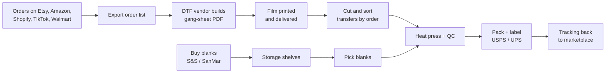

# Lesson 1.1 — The DTF business InvAI serves

## 1. In one sentence
InvAI is software for a direct-to-film (DTF) t-shirt shop: a small business that prints
designs onto blank shirts and sells them on marketplaces like Etsy and Amazon, and today
does that with spreadsheets instead of one connected system.

## 2. Why it exists
Before you can judge any part of InvAI's code, you need to know what a "shop" actually
does all day, because every table, screen and job in this codebase maps to one step of
that work.

A DTF shop's job, start to finish:
1. **Sell** — list designs on 2–5 marketplaces (Etsy, Amazon, Shopify, TikTok Shop,
   Walmart).
2. **Get the order** — a buyer orders a shirt: a design, a blank style/color/size, maybe
   a personalized name or photo.
3. **Print the film** — the design gets printed onto a sheet of DTF transfer film (often
   by an outside vendor, not the shop itself).
4. **Press** — a heat press bonds the film to a blank shirt.
5. **Pack and ship** — the shirt goes in a bag with a shipping label, and tracking goes
   back to the marketplace.
6. **Know if it made money** — after marketplace fees, blank cost, film cost, labels and
   labor, was this order profitable?

`invai-docs/00-platform-concept.md:9-24` describes the actual target customer: 100–1,000
orders/day, 5–30 staff, buying blanks wholesale from S&S/SanMar, outsourcing film
printing to a DTF vendor, and running the whole thing on spreadsheets, marketplace
dashboards and tools like ShipStation today.

Without InvAI, every step above is a **separate tool or a spreadsheet**, and the
handoffs between them are where things go wrong — an order gets missed, the wrong size
gets pressed, a transfer gets matched to the wrong order after it's cut from the sheet.
`invai-docs/00-platform-concept.md:26-42` draws this as a flowchart of today's process;
every arrow in that diagram is a place a human has to manually carry information from
one tool to the next.

## 3. How it works

The shop's current process, redrawn from `invai-docs/00-platform-concept.md:30-42`:

Ten ranked pains come out of that chain (`invai-docs/00-platform-concept.md:46-58`).
The three that shape the most code:

- **Late shipment penalties.** Every marketplace has an on-time-ship rule (Amazon under
  4% late, Walmart 99% on-time, Etsy Star Seller 95%). Miss it and the shop's account
  gets throttled or suspended. This is why InvAI's Order Hub sorts by *real* ship-by
  date, not just order date (scope item 1, `invai-docs/product/scope.md:22`).
- **Order chaos / wrong-shirt mistakes.** A spreadsheet has no way to *block* a presser
  from pressing the wrong design onto the wrong shirt. This is why InvAI makes
  **one order item = one physical unit**, each with its own QR code and state — see
  §4 below.
  — if a buyer orders 3 shirts, that is 3 rows, 3 scans, 3 chances to catch a mistake,
  not one row for "quantity 3".
- **Unknown true profit.** Nobody combines marketplace fees + blank cost + film cost +
  label cost + labor per design. InvAI's Profit Analytics module exists only because no
  spreadsheet does this well across hundreds of orders a day.

A key idea that trips up new readers: **a product is not stock.** A "product" in InvAI
is a *design printed on a blank* — stock is tracked on the blank (a plain shirt) and
separately a design has its own print files. The same black size-M blank can be pressed
with a hundred different designs; only one pool of black-M stock exists, shared across
every listing (`invai-docs/00-platform-concept.md:136-147`). This single idea explains
why InvAI has separate `designs` and `blanks` tables joined by a `products` table rather
than one big "products with a stock count" table.

## 4. In our code
- `invai-backend/src/db/schema/orders.ts:173-183` — the comment and the `unitNo` column
  are the business rule "one item = one physical unit" turned into a database column: a
  channel order line with quantity 3 becomes three `order_items` rows, `unitNo` 1, 2, 3.
- `invai-backend/src/db/schema/catalog.ts:22` (`designs`) and `:127` (`products`) — a
  `design` (the print file/artwork) and a `product` (design + blank combination) are
  separate tables, matching the "a product is not stock" idea from
  `invai-docs/00-platform-concept.md:136`.
- `invai-docs/product/scope.md:20-38` — the MVP feature list (Order Hub, SKU mapper,
  Gang Sheet Builder, Production Floor, Blank Inventory, Shipping, Profit, AI listings,
  trademark check) is literally the six business steps in §2 above, one scope line per
  step.
- `invai-docs/00-platform-concept.md:61-73` — the competitor table. Worth reading once:
  it's why InvAI exists as *one* platform instead of a shop stitching together 5–8
  separate tools, and it's the yardstick the product-manager role uses to decide what's
  in scope.

## 5. What it uses
Nothing technical yet — this lesson is the business, not the stack. Module 03
("the stack") covers the tools; module 02 (next) covers how the 8 repos implement this
business.

## 6. Try it yourself
1. Read `invai-docs/00-platform-concept.md:1-60` yourself and write, in your own words,
   one sentence for each of the ten pains in the table at line 46 — this is read-only,
   no setup needed.
2. Open `invai-backend/src/db/schema/orders.ts` around line 170–190 and find the
   `unitNo` column. Without running anything, answer: if a buyer orders 2 of the same
   t-shirt design/size, how many rows does that create in `order_items`, and what makes
   them different from each other?
3. If your local stack is already running (`invai-infra`'s `pnpm dev:all` — ask before
   starting it if you're not sure it's up), sign in to the web dashboard at
   `http://localhost:5173` as `owner@desertbloom.test` / `demo1234!` and open the Order
   Hub. Pick any order with quantity > 1 and find where the UI shows you the individual
   units, not just the line.

## 7. Common mistakes
- Thinking "order item" means an order *line* (e.g. "red shirt x3"). In InvAI it always
  means one physical shirt. A reorder, a reprint, a scan — all of these happen to one
  `order_items` row, never to "the line."
- Assuming stock is tracked per listing (per marketplace SKU). It isn't — stock is
  tracked per blank variant and shared across every design and every channel
  (`invai-docs/00-platform-concept.md:108-109`, scope item 6). A shop that oversells a
  blank because each marketplace showed separate stock is exactly the pain (#7 in the
  pains table) InvAI's shared pool fixes.
- The team itself nearly repeated the shop's own mistake once: `invai-docs/team/lessons.md`
  (2026-09-24, "v1 build") records that unrealistic seed data once made gang sheets look
  only 51.7% efficient — a reminder that the *demo data* has to reflect the real business
  (realistic shirt/sheet sizes) or every number you see while learning will be wrong.

## 8. Check yourself

1. A buyer orders 3 of the same shirt in one Etsy order. How many `order_items`
rows does InvAI create, and why not just one row with quantity 3?

Three rows (`unitNo` 1, 2, 3). One row with quantity 3 couldn't represent "shirt #2 got
the wrong design pressed on it" — state, scans and reprints all happen per physical
shirt, not per line.

2. Why does InvAI keep "design" and "blank" as separate tables instead of one
"product with stock" table?

Because stock belongs to the blank (a plain shirt bought wholesale), not to the design.
One size-M black blank can be pressed with any of hundreds of designs; tracking stock on
"product" would mean tracking it separately per design × blank combination, which both
wastes stock and risks overselling.

3. Name one marketplace rule that directly shaped a scope item, and the scope
item it shaped.

Amazon/Walmart/Etsy/TikTok on-time-ship thresholds (late-shipment pain #1) shaped scope
item 1, the Order Hub sorted by real ship-by date with at-risk alerts
(`invai-docs/product/scope.md:22`).

## 9. Words to know
- **DTF (direct-to-film)** — a t-shirt printing method: a design is printed onto film,
  then heat-pressed onto a blank shirt.
- **Blank** — a plain, undecorated shirt bought wholesale (brands like Gildan, Bella+Canvas).
- **Gang sheet** — one large sheet of film with many designs nested onto it to save film
  and press time; see module 02 for how InvAI builds these.
- **SKU (stock-keeping unit)** — the code a marketplace uses to identify a listing
  variant; shops often encode design+style+color+size into it.
- **Marketplace / channel** — a sales platform (Etsy, Amazon, Shopify, TikTok Shop,
  Walmart) where a shop lists and sells products.
- **One order item = one physical unit** — InvAI's core modeling rule: a quantity-3 order
  line becomes 3 separate `order_items` rows, each independently trackable.
