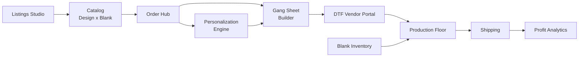

# Lesson 1.2 — The user journey, and the 11 modules that cover it

## 1. In one sentence
InvAI follows one order from "a buyer clicks Buy" to "the owner sees whether it made
money," and every module in the product owns one leg of that journey.

## 2. Why it exists
Lesson 1.1 covered *why* shops need this. This lesson covers the shape of the product
itself: the modules a new reader will keep bumping into (Order Hub, Gang Sheet Builder,
Production Floor, Profit Analytics, ...), and which leg of the journey each one owns.
Knowing this mapping is what lets you guess, correctly, which repo/module a feature
request belongs in before you go searching.

## 3. How it works
`invai-docs/00-platform-concept.md:84-100` lays out the full (not just v1) product as 11
modules around one shared catalog:

Walking one real order through this diagram, left to right:

1. **Listings Studio** — an AI-drafted listing (title, tags, description, mockup, a
   trademark-risk check) goes live on a marketplace. This is where the order starts, but
   it happens once per *listing*, long before any specific order exists.
2. **Catalog** — the listing is backed by a `design` × `blank` combination. This is the
   shared "parts list" every other module reads from.
3. **Order Hub** — a buyer orders. The order lands here, in one queue across every
   channel, sorted by real ship-by date (not just order date).
4. **Personalization Engine** — if the order needs a custom name/photo/date (Etsy's
   5-question personalization, Amazon Custom ZIPs, Shopify line-item properties), this
   renders the print-ready artwork and flags anything unclear before it reaches a gang
   sheet.
5. **Gang Sheet Builder** — today's orders (plus any personalized art) get nested onto
   22-inch sheets, each design labeled with order number, size, color and a QR code.
6. **DTF Vendor Portal** — sheets go to whoever prints the film (often an outside
   vendor); they confirm, mark printed, mark shipped.
7. **Blank Inventory** feeds into **Production Floor**: a presser picks a blank, scans
   the shirt and the transfer's QR code, and the screen blocks the press if they don't
   match.
8. **Shipping** — once every unit in an order is packed, a label is bought (rate-shopped
   across carriers) and tracking is pushed back to the marketplace automatically.
9. **Profit Analytics** — once an order ships, its real cost (marketplace fee + blank +
   film + label + labor) is known, and profit per order/design/blank/channel can be
   computed.

**What v1 actually built**, versus this full picture, is scope-gated:
`invai-docs/product/scope.md:20-38` lists MVP-in items 1–17 (Order Hub, SKU mapper, Gang
Sheet Builder, Production Floor, Blank Inventory, Shipping, Profit, DTF Vendor Portal, AI
listings + trademark check, Personalization, AI assistant, Today command center, plan
limits, market signals, weekly digest), and `:52-57` lists what's explicitly out for now
(AI design generation, direct Amazon/Etsy/TikTok/Walmart APIs until approvals land,
SanMar, GPU upscaling, shape-aware nesting, statistical forecasting, silent label
printing, buyer-message drafts). If you're ever unsure whether a feature should exist,
`scope.md` — owned by the product-manager role — is the answer, not a guess.

## 4. In our code
- `invai-docs/product/scope.md:20-38` — the MVP-in list; each numbered line is one of
  the 11 modules above, scoped down to what v1 actually ships.
- `invai-docs/product/scope.md:5-13` — the three customer segments (small/mid/large)
  and what each needs *first*; this is why, e.g., self-serve onboarding matters for
  small shops but throughput and roles matter more for large ones.
- `invai-docs/build/demo-guide.md` — a 15-minute click-by-click walkthrough of the
  golden path above, built for showing the product to a real shop owner; it's the
  fastest way to see every module in one sitting.
- `invai-backend/src/modules/` (seen in module 02's repo map) has one subfolder per
  journey leg — `orders`, `personalization`, `production`, `shipping`, `finance`,
  `vendors`, `inventory`, `channels` — which is the backend's mirror of this same
  journey; you'll meet it properly in module 02.

## 5. What it uses
Still business-level: no stack detail here. The journey above is implemented across all
8 repos, which is exactly what module 02 covers next.

## 6. Try it yourself
1. Read `invai-docs/build/demo-guide.md` top to bottom (read-only) and match each step
   of its walkthrough to one of the 11 modules in §3's diagram.
2. Open the web dashboard (if it's running) as the owner and find the screen for each of:
   Order Hub, Gang Sheet Builder, Production Floor (this one's really in `invai-floor`,
   a separate app on :5174), Shipping, Profit. Note which ones you can reach from the
   main nav versus which are nested under a settings/detail page.
3. In `invai-docs/product/scope.md`, find one "MVP: out" item (line 52–57) and one
   "Later, with a trigger" item (the table at line 59–69), and write one sentence each
   on *why* it's deferred rather than cut outright. (Hint: compare the fences at
   `:40-50`.)

## 7. Common mistakes
- Treating the 11-module diagram as "11 separate apps." It's one product; the repos
  (module 02) cut across these modules differently than you'd expect — e.g. Gang Sheet
  Builder's actual pixel-pushing work lives in `invai-imaging`, a whole separate repo,
  while the business logic around it (which orders, which sheet, what to charge) lives
  in `invai-backend`.
- Assuming every module in the concept doc shipped in v1. Always check
  `invai-docs/product/scope.md` before assuming a feature exists; several concept-doc
  ideas (statistical demand forecasting, AI design generation, silent label printing)
  are explicitly cut, not just "not built yet" (`invai-docs/decisions/0006-v1-cuts.md`).
- Forgetting that "Later" items have a stated *trigger*, not just a vague someday. If
  you ever want to argue for building one, the trigger (e.g. "Etsy's written permission"
  for competitor price analytics) is the bar to clear — see
  `invai-docs/product/scope.md:59-69`.

## 8. Check yourself

1. Put these in journey order: Shipping, Gang Sheet Builder, Order Hub,
Profit Analytics, Production Floor.

Order Hub → Gang Sheet Builder → Production Floor → Shipping → Profit Analytics.

2. Which module decides whether a buyer's custom name fits on the shirt before
a gang sheet is ever built?

The Personalization Engine — it renders and flags personalized artwork, feeding into the
Gang Sheet Builder, not after it.

3. Is "AI design generation" in InvAI's v1 scope?

No — it's explicitly MVP-out (`invai-docs/product/scope.md:53`, and cut in
`invai-docs/decisions/0006-v1-cuts.md`). InvAI drafts *listing copy*, not artwork.

## 9. Words to know
- **Golden path** — the one critical sequence (order → gang sheet → press → ship →
  profit) that must always work end to end; InvAI's E2E tests are named for it
  (`e2e/api-golden-path.spec.ts`).
- **Ship-by date** — the real deadline a marketplace sets for dispatching an order,
  used to sort the Order Hub (not the same as the order date).
- **Trademark-risk check** — an automated check (not legal advice) that flags a listing
  likely to infringe a trademark before it's published.
- **Scope ("MVP in/out/later")** — the product-manager-owned document
  (`invai-docs/product/scope.md`) that is the single source of truth for what gets
  built; nothing outside it gets built without going through a scope-change request.
