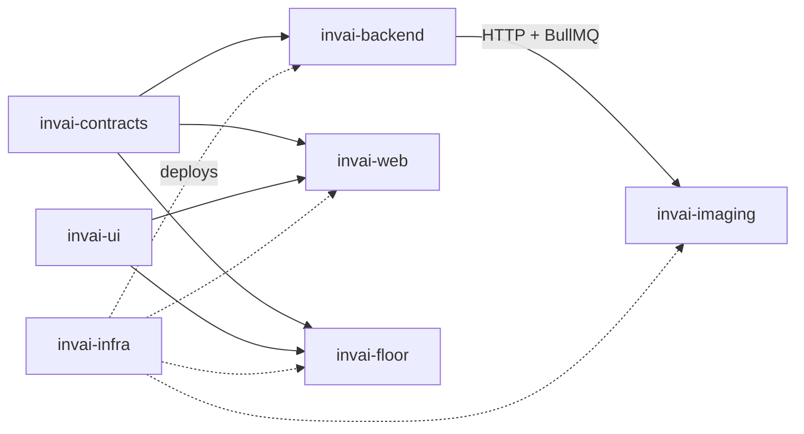

# Lesson 2.1 — The 8 repos, and why not one

## 1. In one sentence
InvAI's code lives in 8 separate git repositories, side by side on disk, each with one
clear owner and one job, glued together by a shared API contract and a shared UI kit.

## 2. Why it exists
Most tutorials show you a single repo. InvAI deliberately isn't one, and that choice
shapes almost every workflow rule in this project (who can edit what, what order you
build in, how a change rolls out). If you don't understand the repo split first, the
rest of the architecture — and the team's own operating rules — will look arbitrary.

## 3. How it works
From `README.md:7-16`, the 8 repos and what each is:

| Repo | What it is | Stack |
| --- | --- | --- |
| `invai-docs` | Research, concept, architecture, cost model, and (now) this course | Markdown |
| `invai-contracts` | The shared API contract: procedures, schemas, states, events (`@invai/contracts`) | TypeScript, Zod, oRPC |
| `invai-ui` | Shared components, theme, English/Spanish strings (`@invai/ui`) | React, Tailwind |
| `invai-backend` | API server + background workers, database, integrations, AI gateway | Node 24, Hono, oRPC, Drizzle, BullMQ, Better Auth |
| `invai-imaging` | Rendering: gang-sheet nesting/composing, print checks, mockups | Python, FastAPI, pyvips |
| `invai-web` | Dashboard for owners, office staff, designers, DTF vendors | Vite, React, TanStack |
| `invai-floor` | Tablet app for pick/press/QC/pack stations | Vite PWA, Dexie |
| `invai-infra` | Local Docker services + AWS (SST) deploy config | SST, Docker Compose |

How they depend on each other, from `README.md:20-32`:

Two repos (`invai-contracts`, `invai-ui`) are **shared packages**, not apps — they get
consumed, not run. Locally they're linked with `link:../<repo>` (`README.md:34`); in a
real deploy they'd be versioned packages instead. Note the arrows: `invai-contracts`
feeds *three* repos (backend, web, floor) — which is exactly why it's the one repo that
can break everything downstream at once, and why it has its own dedicated owner role
(`architect`) and its own change-management playbooks (`add-contract-procedure`,
`contract-deprecation`).

**Why not one monorepo?** The original plan (`architecture.md`) actually *was* one
monorepo. `invai-docs/decisions/0001-keep-multi-repo.md` records why it changed: the 8
GitHub repos, their CI and their deploy keys already existed before the rebuild started,
and migrating to a monorepo that night would have cost a day for no runtime benefit. The
tradeoff the team accepted on purpose (same decision, "Consequences"): a contract change
must be fixed in *every* consumer the same day, and each repo's checks (typecheck, lint,
test) have to be run and verified separately — there's no single `pnpm test` at the
workspace root that catches a backend/web mismatch for you.

**The order you build in** follows the dependency arrows exactly:
`invai-contracts → invai-backend → invai-web / invai-floor` (`README.md:35`,
restated in `CLAUDE.md`'s "Change order for a feature"). You change the contract first,
implement it in the backend second, and update the consuming UI(s) last — never the
other way, because the UI's typed client is *generated from* the contract, not the
reverse.

**Ownership matches this split.** `invai-docs/team/operating-system.md:19-41` assigns
one role per repo area (`architect` → contracts, `backend-foundation`/`backend-engineer`
→ backend, `imaging-engineer` → imaging, `web-engineer` → web, `floor-engineer` → floor,
`platform-sre` → infra, `product-designer` → ui, `docs-writer`/others → docs), and the
project's git rule (`CLAUDE.md`, "Repos, branches, ownership") is blunt about why that
matters in a multi-repo, multi-agent setup: everyone pushes straight to each repo's
`main` (no branches, no PRs), so staying inside your own owned paths and committing only
your own paths (`git add <paths>`, never `git add -A`) is the only thing stopping one
agent's work from colliding with another's in a shared working tree.

## 4. In our code
- `README.md:7-16` — the repo table itself; start here whenever you forget which repo
  owns what.
- `README.md:20-32` — the dependency diagram quoted above, straight from the workspace
  README.
- `invai-docs/decisions/0001-keep-multi-repo.md` — the actual decision record: context,
  decision, consequences, in the project's standard ADR format (see module 10 for how
  decisions get written in general).
- `invai-docs/team/operating-system.md:19-53` — the role-to-owned-paths table; this is
  the source of truth for "who may edit this file," more precise than the repo-level
  table above (e.g. `backend-foundation` owns backend's core/auth/db-client, while
  `backend-engineer` owns one `src/modules/<area>` at a time).
- `invai-contracts/src/contract.ts:1-21` — the single file that imports every domain's
  contract module (`orders`, `channels`, `shipping`, `ai`, …) into one `contract` object;
  this is the literal file both `invai-backend` and `invai-web`/`invai-floor` depend on,
  shown structurally so you can see what "the shared contract" means as code, not just
  as a diagram box.

## 5. What it uses
- **Git, 8 repos** instead of one, each with its own GitHub remote, CI and (eventually)
  deploy keys.
- **pnpm `link:`** for local cross-repo dependencies (`@invai/contracts`,
  `@invai/ui`), swapped for versioned packages from GitHub Packages once CI publishes
  them (`README.md:34`) — this is why the lessons log repeatedly warns about breaking
  the `node_modules` symlink (see §7).
- No monorepo tool (no Turborepo/Nx workspace graph) — each repo's `pnpm` scripts are
  independent; nothing enforces "build contracts before backend" except habit and the
  change-order rule above.

## 6. Try it yourself
1. From `/Users/bekbolsun/invai`, run `ls -d invai-*` and confirm you see all 8 repos
   side by side, each its own git repo (`ls invai-backend/.git` should exist, etc.) —
   read-only, no setup needed.
2. Open `invai-contracts/src/contract.ts` and count how many domain contract files it
   imports (the block at lines 1–21). Each one roughly maps to a `invai-backend/src/modules/<area>`
   folder — open that folder listing and check the mapping holds for `orders`,
   `shipping`, and `channels`.
3. Read `invai-docs/decisions/0001-keep-multi-repo.md` in full (it's 16 lines) and, in
   your own words, write the one sentence that would change if the team ever decided to
   revisit it (hint: it's in "Consequences").

## 7. Common mistakes
- Running `pnpm install` inside a review worktree or a second checkout of a repo that
  has the shared `node_modules/@invai/contracts` symlink. `invai-docs/team/lessons.md`
  (2026-09-24, "Wave 1" and again 2026-09-25, "Wave 6/7") logs this exact mistake twice:
  pnpm relinks workspace deps *relative to where you ran install*, so one `pnpm install`
  in the wrong place silently repoints the shared link for everyone. The fix recorded
  there: never run `pnpm install` in a worktree; run `node_modules/.bin/*` directly.
- `git add -A` or a bare `git commit` in one of these repos when more than one agent (or
  more than one of your own changes) touched it. Because all 8 repos push straight to
  `main` with no branches, a bare commit can sweep up someone else's staged work — see
  `invai-docs/team/lessons.md` (2026-09-24, "Wave 1": "A card's commit nearly included
  another agent's staged deletion").
- Assuming a contract change "doesn't need" the backend and web/floor updated the same
  day because "it's just adding a field." `README.md:35` and `CLAUDE.md` are explicit:
  a *breaking* contract change must be fixed in every consumer the same day — and
  `invai-docs/team/lessons.md` (2026-10-01, "wave A2") records a case where new contract
  enum values broke backend exhaustive maps the plan review hadn't even listed.

## 8. Check yourself

1. Which two repos are "libraries" rather than runnable apps, and who consumes
each?

`invai-contracts` (consumed by `invai-backend`, `invai-web`, `invai-floor`) and
`invai-ui` (consumed by `invai-web`, `invai-floor`).

2. In one sentence, why is InvAI 8 repos instead of 1 monorepo?

The 8 GitHub repos, their CI and their deploy keys already existed before the rebuild,
and migrating to a monorepo would have cost a day of migration for no runtime benefit
at the time (`invai-docs/decisions/0001-keep-multi-repo.md`).

3. What is the required build order for a new feature that touches the
contract, the backend, and the web dashboard?

`invai-contracts` first, then `invai-backend`, then `invai-web` (and `invai-floor` if it
also needs the change) — never backend or UI before the contract.

## 9. Words to know
- **Repo (repository)** — one independent git project; InvAI has 8, side by side on
  disk, each pushed to its own `main` branch.
- **Monorepo** — a single repository holding multiple apps/packages, usually with a
  workspace tool that builds them together. InvAI explicitly does *not* use this.
- **`@invai/contracts` / `@invai/ui`** — the two shared npm packages InvAI publishes
  from the `invai-contracts` and `invai-ui` repos; everything else depends on them.
- **`link:../<repo>`** — a pnpm dependency type that points at a local folder instead of
  a published package version; used so changes to `invai-contracts` show up immediately
  in `invai-backend` without a publish step.
- **Worktree** — a second working copy of the same git repo on a different branch,
  usually used for isolated review or testing; risky here if it ever runs `pnpm install`
  (see §7).
