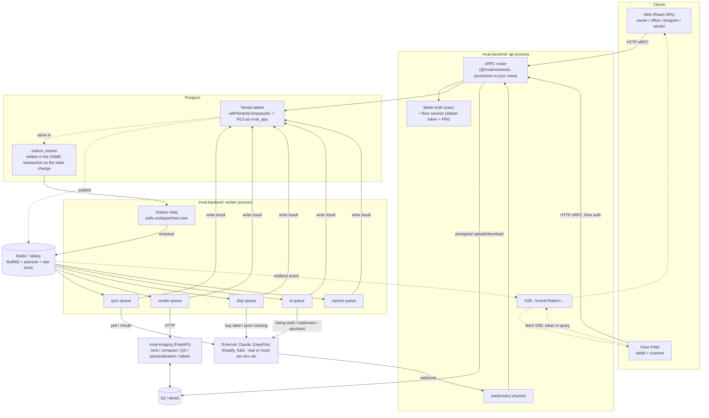

# Lesson 2.2 — How a request travels through the 8 repos

## 1. In one sentence
A click in the browser becomes a typed function call across the network, checked against
one shared contract, run inside a per-tenant database transaction, and — if it's heavy
work — handed off to a background job queue that may call out to the imaging service or
the outside world, with the result flowing back over a live connection, not a page
refresh.

## 2. Why it exists
This is the lesson the role file asked for by name: the diagram of how one request moves
through all 8 repos. Everything else in modules 03–09 (the stack, tenancy, reliability,
AI, quality, security) is really detail on top of this one picture. If you can trace a
single click through every box below, you can read almost any file in this codebase and
know *where it sits* in the flow before you've read a single line of its logic.

## 3. How it works

### The full picture
This is `invai-docs/build/architecture-as-built.md:23-78`, the team's own "as built"
diagram, reproduced here because it's the canonical answer:

Three invariants hold at every step of this diagram
(`invai-docs/build/architecture-as-built.md:80-84`), and they're worth memorizing before
the walkthrough:
1. A request never touches a tenant table outside `withTenant`/`withSystem`.
2. A state change and its outbox event commit together, or neither commits.
3. Every box in `EXT` is either the real provider or its mock, chosen by whether an env
   var is set — nothing downstream knows or cares which.

### Walking one request: "the owner opens the Order Hub"
Trace this one GET-ish call end to end, repo by repo:

1. **Browser → `invai-web`.** The dashboard's typed client is built once, in
   `invai-web/src/lib/rpc.ts:1-14`: an `RPCLink` posts to `${API_URL}/rpc` with
   `credentials: "include"` (so the session cookie travels), wrapped by
   `createORPCClient` into `client`, a `ContractRouterClient<Contract>` — meaning every
   method you call on `client.orders.list(...)` is typed straight from the contract, not
   hand-written. (`invai-floor` does the same thing in `invai-floor/src/api/rpc.ts:1-30`,
   except its `Ctx` carries a `Station`/`Bearer` auth scheme instead of a cookie, because
   a tablet doesn't have a browser session.)

2. **`invai-web` → `invai-contracts`.** Calling `orpc.orders.list.useQuery(...)` only
   type-checks because `orders` is a key on the `contract` object exported from
   `invai-contracts/src/contract.ts:28-50` — the single file that assembles every
   domain's procedures (`orders`, `channels`, `shipping`, `ai`, …) into one shape both
   the backend and every client import. Each procedure also carries metadata —
   `invai-contracts/src/contract/_base.ts:15-20` defines `ProcedureMeta` as
   `{ permission, auth?, audit? }` — so "who's allowed to call this" is declared *in the
   contract*, not buried in a handler somewhere downstream.

3. **HTTP → `invai-backend`'s oRPC router.** The backend builds its router from the same
   contract: `invai-backend/src/api/orpc.ts:34` — `export const os =
   implement(contract).$context<Context>();` — then wraps it with `pub` (auth-mode +
   permission guard only) and `authed` (guarantees a resolved tenant on top). The
   permission check itself is one line:
   `invai-backend/src/api/orpc.ts:127` —
   `if (meta.permission !== "none" && !context.permissions.has(meta.permission))` throws
   `forbidden(...)`. Because every procedure declares its permission in the contract
   (step 2), this one guard covers all ~190 procedures — a new procedure with no
   declared permission fails to typecheck rather than silently allowing anyone in
   (`invai-docs/build/architecture-as-built.md:14`).

4. **Auth and tenant resolution.** `invai-backend/src/api/context.ts:24-36` builds one
   `Context` per request from either a Better Auth cookie session, a floor session
   (station token + PIN), or a station token alone — resolving `companyId`, `role` and a
   `permissions` set before the handler ever runs. This is where "which shop am I even
   looking at" gets decided, once, per request.

5. **Backend → Postgres, tenant-scoped.** The handler calls
   `withTenant(context.tenant.companyId, (tx) => ...)`
   (`invai-backend/src/db/client.ts:70-72`). Under the hood,
   `invai-backend/src/db/client.ts:47-64` opens a transaction and runs
   `select set_config('app.company_id', '<id>', true)` — transaction-local, so a pooled
   connection never leaks one tenant's setting into another request. Postgres then
   enforces the boundary itself: every tenant table calls `tenantPolicy(...)` and
   `.enableRLS()` in its schema file, e.g.
   `invai-backend/src/db/schema/orders.ts:135` and `:139` for the `orders` table. The
   query only ever *sees* rows matching the connection's `app.company_id` — this is why
   a bug in application code can't leak another company's orders; the database itself
   won't return them.

6. **Reading back out.** For a plain read like "list orders," the response is just the
   query result, serialized back through the same typed contract to the browser. No
   queue, no outbox — that machinery (steps 7+) is for *writes* and heavy work.

### The other half: a write that triggers background work
Take a heavier example — "office staff presses Mark Packed on an order" (or
equivalently, a marketplace webhook delivering a new order):

7. **Same transaction, plus an event.** A state-changing handler calls
   `emit(tx, companyId, eventName, payload)` —
   `invai-backend/src/lib/outbox.ts:14-37` — *inside* the same `withTenant` transaction
   as the state change itself, inserting a row into `outbox_events`. Because it's the
   same transaction, the event can never fire for a change that got rolled back, and a
   change can never silently skip its event on a crash.

8. **The outbox relay.** A separate `worker` process
   (`invai-backend/src/worker/outbox-relay.ts`) polls `outbox_events` for undispatched
   rows every 500 ms (`POLL_MS`), and turns each one into a BullMQ job id
   (`relayJobId`, same file) before enqueuing it onto one of five named queues —
   `sync`, `render`, `ship`, `ai`, `reports` (`invai-backend/src/lib/queues.ts:19-20`) —
   backed by Redis/Valkey (`invai-backend/src/lib/queues.ts:16`).

9. **A queue worker runs the job**, inside its own `withTenant`/`withSystem` call, and
   may call out further:
   - the **render** queue calls `invai-imaging` over plain HTTP — the typed client is
     `invai-backend/src/integrations/imaging/client.ts:1-13`; imaging's FastAPI app
     (`invai-imaging/app/main.py:1-20`) reads and writes files as S3 keys, never raw
     bytes over the wire, and does the actual gang-sheet nesting/composing with pyvips.
   - the **ship**, **sync** and **ai** queues call external providers (EasyPost,
     marketplace APIs, Claude) — real or mock, chosen by an env var
     (`invai-backend/src/env.ts`), per the third invariant in §3 above.
   - the job writes its result back into a tenant table through `withTenant` again,
     which (per step 5's RLS mechanism) is the only way it's allowed to write.

10. **Marketplace webhooks come in the other door.** `invai-backend/src/api/webhooks.ts:20-29`
    documents the exact 4-step contract for every channel: verify the signature on the
    raw body (401, nothing written, if it fails), read the channel's own delivery id
    (400 if missing), record it in `webhook_deliveries` (unique per channel — a
    redelivery gets 200 and stops there), then enqueue a `channels.<channel>.webhook`
    job and answer 200 *before* the work is even done. The webhook handler's job is to
    answer fast and safely; the worker does the work afterward, same as step 9.

11. **Realtime back to the client.** Once a tenant-table write commits, the backend
    publishes to Redis pub/sub, and `invai-backend/src/api/events.ts:1-13` streams it to
    connected clients over Server-Sent Events via `hono/streaming`'s `streamSSE`. Because
    a browser `EventSource` can't send an `Authorization` header, the floor app's token
    travels as a query parameter (`/events?token=...`,
    `invai-docs/build/architecture-as-built.md:17`) through a custom fetch-based SSE
    client instead of the native `EventSource` API. This is how a presser's scan on a
    tablet can make an office dashboard update live, with no page refresh and no
    polling loop in the browser.

## 4. In our code
- `invai-docs/build/architecture-as-built.md:21-84` — the full diagram and its three
  invariants; the canonical reference for this whole lesson.
- `invai-contracts/src/contract.ts:28-50`, `invai-contracts/src/contract/_base.ts:15-20`
  — the contract object and the permission/auth metadata every procedure carries.
- `invai-backend/src/api/orpc.ts:34`, `:127` — the router built from the contract, and
  the one-line permission guard that covers every procedure.
- `invai-backend/src/db/client.ts:47-72` — `withTenant`/`withSystem` and the
  transaction-local `set_config` that makes RLS actually bite.
- `invai-backend/src/lib/outbox.ts:14-37` — `emit()`, the transactional-outbox write.
- `invai-backend/src/api/webhooks.ts:20-29` — the marketplace webhook contract (verify →
  dedupe → record → enqueue → 200).
- `invai-backend/src/api/events.ts:1-13` — the SSE stream backend clients read from.

## 5. What it uses
- **oRPC** — the contract-first RPC layer that generates both the backend router and
  the typed browser/tablet clients from one `@invai/contracts` definition.
- **Hono** — the lightweight HTTP framework the backend's `api` process runs on
  (routes, webhooks, SSE streaming).
- **Better Auth** — user session cookies; a separate floor-session/station-token scheme
  covers tablets, which don't have a normal browser login.
- **Postgres + Row-Level Security (RLS)** — the database-enforced tenant boundary;
  application code requests a scope (`withTenant`), the database enforces it.
- **Redis/Valkey + BullMQ** — the queue backing the outbox relay's five named queues.
- **FastAPI + pyvips (Python)** — `invai-imaging`'s HTTP service for the actual pixel
  work, called over plain HTTP from the backend's queue workers.
- **S3 (MinIO locally)** — where files (print art, gang sheets, labels) actually live;
  the backend and imaging both read/write it directly by key, never by shipping bytes
  through the backend's own API body.
- Module 03 covers *why* each of these was chosen over alternatives; this lesson only
  needed to place them on the map.

## 6. Try it yourself
1. With the local stack up (`invai-infra`'s `pnpm dev:all`), hit
   `curl http://localhost:3000/health` and read the JSON back — this is the one
   unauthenticated endpoint, good for confirming the API process itself is alive before
   you trace anything through it.
2. Open `invai-contracts/src/contract/_base.ts` and find the `ProcedureMeta` type (around
   line 15). Then open `invai-contracts/src/contract/orders.ts` and find one procedure's
   `.meta({...})` call — note its `permission` value, and guess which role
   (`invai-docs/team/operating-system.md` names the roles, but shop *roles* like owner/
   office/designer are a separate concept — see module 09) would be missing it.
3. Sign in to the web dashboard as `owner@desertbloom.test` / `demo1234!`, open your
   browser's network tab, and watch one request to `/rpc` — confirm it's a POST, and
   that the request body shape matches the procedure name you'd expect for the screen
   you're on (e.g. `orders.list`).

## 7. Common mistakes
- Assuming a GET-shaped action ("I'm just reading data") never touches the outbox or
  queues. Only true for pure reads; anything that changes state — even a read that
  triggers a side effect like marking a notification seen — may still `emit()` an event.
  Check the handler, don't assume from the screen.
- Confusing the **worker** process with the **api** process. They're the same codebase
  (`invai-backend`) but two separate running processes (`pnpm dev:api` vs
  `pnpm dev:worker`) — the outbox relay and queue consumers only run in `worker`. A
  symptom this project has hit more than once:
  `invai-docs/team/lessons.md` (2026-09-24, "v1 build") — "`tsx watch` restarts the API
  when other agents edit files"; if you're debugging why a job never seems to run, check
  whether the worker process is even up, not just the API.
- Treating the mock/real provider switch as something you'd ever need to detect in your
  own code. Per the third invariant in §3, nothing downstream of the `EXT` box is
  supposed to know or care — if you find yourself writing an `if (isMock)` branch outside
  `src/integrations/*`, that's very likely the wrong layer.

## 8. Check yourself

1. A handler changes an order's status and wants that change to be visible to
a background job. What two things must happen in the exact same database transaction?

The state change itself and the `emit()` call that writes the `outbox_events` row — if
either is outside the transaction, a crash or rollback can desync them (event fires with
no change, or change happens with no event).

2. Why can a browser-tab's `EventSource` not simply send the user's session
cookie like a normal fetch would, and what did InvAI do instead for the floor app?

Trick question for cookies (cookies *do* travel automatically with `EventSource` same-
origin) — the real constraint is that `EventSource` can't set custom headers like
`Authorization`, so the floor session token travels as a query parameter
(`/events?token=...`) through a custom fetch-based SSE client instead of the native API.

3. Which repo actually performs gang-sheet nesting and composing — and how
does the backend send it the image data?

`invai-imaging` (Python/FastAPI/pyvips). The backend doesn't send image bytes in the
request body; it sends S3 keys, and imaging reads/writes the actual files from S3/MinIO
directly.

## 9. Words to know
- **oRPC** — the contract-first RPC framework: one TypeScript contract generates both
  the backend's implementation surface and every client's typed call signatures.
- **Procedure** — one callable contract endpoint (e.g. `orders.list`), with its
  permission and auth mode declared as metadata on the procedure itself.
- **RLS (Row-Level Security)** — a Postgres feature that filters every query against a
  table by a policy condition; InvAI's policy checks a transaction-local
  `app.company_id` setting.
- **`withTenant` / `withSystem`** — the two ways backend code opens a scoped database
  transaction: `withTenant(companyId, fn)` for normal per-shop requests,
  `withSystem(fn)` for the outbox relay, cross-tenant jobs and the seed (bypasses RLS).
- **Transactional outbox** — the pattern of writing an event row in the same transaction
  as the state change it describes, so the event and the change can never disagree.
- **BullMQ** — the Redis-backed job queue library the `worker` process uses to run
  background jobs (sync, render, ship, ai, reports queues).
- **SSE (Server-Sent Events)** — a one-way, long-lived HTTP connection a server uses to
  push events to a client without the client polling.
- **Mock provider** — a deterministic stand-in for a real external integration (e.g.
  EasyPost, Claude), automatically selected when the matching env var/key is absent, so
  the whole platform works end to end with no real credentials.
