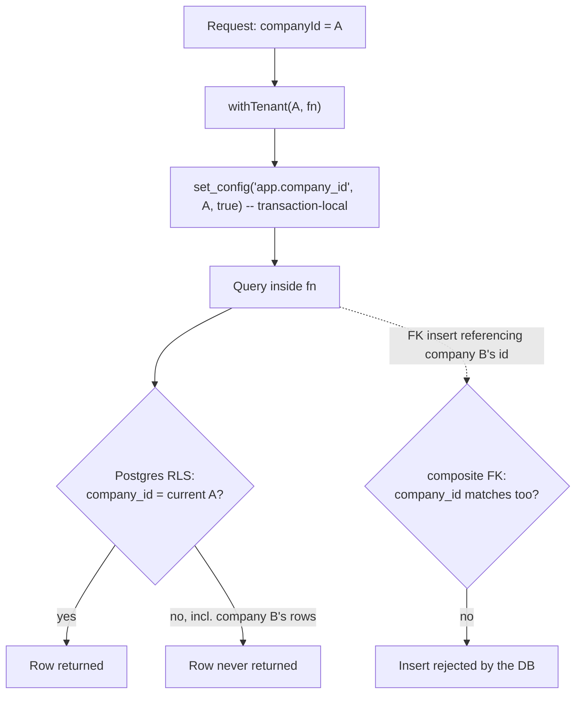

# Lesson 4.2 — Tenancy, `company_id` and RLS, in full

## 1. In one sentence
Every tenant table carries a `company_id` column and a Postgres Row-Level Security
policy that only lets the app role see or touch rows matching one transaction-local
setting (`app.company_id`) — and three separate tests continuously check that this is
actually true, not just intended.

## 2. Why it exists
Module 02 gave you the shape of this (`withTenant` opens a scoped transaction, RLS
filters queries). This lesson goes deeper, because "deeper" here means the actual
mechanics that make the promise unbreakable rather than merely usual: how the setting
gets into Postgres, why a foreign key needs special handling, and — concretely — how
InvAI *proves*, in CI, that no new table can quietly skip this protection.

## 3. How it works

### The policy itself, and the setting it reads
`invai-backend/src/db/schema/_shared.ts:16-33`:
```ts
export const currentCompanyId = sql`nullif(current_setting('app.company_id', true), '')::uuid`;
const tenantMatch = sql`company_id = ${currentCompanyId}`;

export function tenantPolicy(table: string) {
  return pgPolicy(`${table}_tenant`, {
    for: "all",
    to: appRole,
    using: tenantMatch,
    withCheck: tenantMatch,
  });
}
```
Two details matter:
- `current_setting('app.company_id', true)` reads a **session/transaction setting**,
  not a table value — it's the thing `withTenant` writes (next section). The `true`
  argument means "don't error if it's unset," and `nullif(..., '')` turns an unset or
  empty setting into SQL `NULL` — which, compared against any real `company_id`, never
  matches. **Unset means "no rows," not "all rows."** That's the fail-safe direction: a
  bug that forgets to set the tenant leaves you with an empty result, never someone
  else's data.
- `for: "all", to: appRole` — the policy applies to every operation (select, insert,
  update, delete) and only to the `appRole` connection (`invai_app`). The database
  owner role (`invai`) isn't bound by it at all, which is exactly why `withSystem`
  (below) has to be a deliberate, separate escape hatch, not a setting you forget to
  apply.

### `withTenant`, `withVendor`, `withSystem` — one scoping function, three doors
`invai-backend/src/db/client.ts:7-13` sets up two separate Postgres connections as two
different roles:
```ts
export const db = drizzle(appPool, ...);       // invai_app — RLS enforced
export const systemDb = drizzle(systemPool, ...); // invai (owner) — bypasses RLS
```
`:44-61`'s `scoped()` is the one real mechanism underneath all three public functions:
open a transaction, run `select set_config(key, value, true)` for each setting (`true`
= transaction-local, so it can never leak to another request on a pooled connection),
then run the caller's function inside that transaction. `:66-72 withTenant(companyId,
fn)` calls `scoped(db, { "app.company_id": companyId }, fn)` — the normal, 99%-of-
requests path. `:74-84 withVendor(vendorCompanyId, fn)` is almost the same, but also
sets `app.vendor_org_id`, which the separate `vendor*Policy` helpers
(`_shared.ts:35-48`) key off of, so a DTF vendor's portal session can read (and, for
specific actions, update) exactly the sheets a shop shared with it — a second, narrower
kind of cross-tenant access, deliberately modeled as its own policy type rather than
reusing the normal tenant policy. `:90-92 withSystem(fn, companyId?)` runs against
`systemDb` instead — the owner role, so RLS doesn't apply at all. Its own doc comment
is blunt: "Only for the outbox relay, seeding and cross-tenant jobs." If you're writing
request-path code and you reach for `withSystem`, that should feel wrong by default —
module 02 already told you this is the second invariant worth memorizing, and this
lesson is where you see exactly what it bypasses.

### Why a normal foreign key is a tenant-isolation hole
Here's the part that's easy to miss: RLS protects *queries*, but **foreign key
constraint checks run with elevated privilege and ignore RLS entirely**. A single-
column FK like `orderId: uuid().references(() => orders.id)` lets a row in company B
point at a row that belongs to company A, as long as that id exists *anywhere* in the
table — Postgres's FK check never asks whether the two rows share a tenant.

The fix, `invai-backend/src/db/schema/_shared.ts:50-59`'s `tenantKey` helper:
```ts
export const tenantKey = (table: string, t: { companyId: PgColumn; id: PgColumn }) =>
  unique(`${table}_company_id_id_unique`).on(t.companyId, t.id);
```
A parent table adds `tenantKey("orders", t)` to its extras (a unique constraint on
`(company_id, id)`, not just `id` alone); a child table then declares its FK against
*both* columns —
```ts
foreignKey({
  name: "order_items_order_id_fk",
  columns: [t.companyId, t.orderId],
  foreignColumns: [orders.companyId, orders.id],
}).onDelete("cascade"),
```
(this exact shape is in `orders.ts`'s `orderItems` table, lesson 4.1). Now the FK
itself enforces "the child's company must match the parent's company," entirely inside
the constraint — no amount of missing a `WHERE` clause in application code can create a
cross-tenant pointer, because Postgres rejects the insert outright.

### Three tests that make this a guarantee, not a hope
1. **`invai-backend/src/db/rls-coverage.test.ts`** — a structural test with its own
   stated purpose: "so a new table without RLS (or a role change) fails CI instead of
   leaking data." It introspects Postgres's own catalogs (`pg_class`, `pg_policy`) for
   every table in the `public` schema, and asserts: any table with a `company_id`
   column has RLS *enabled* and has a policy covering `invai_app`. Two small, named
   exception lists — `GLOBAL_TABLES` (Better Auth's own identity tables, which are
   deliberately not tenant-scoped) and `PUBLIC_READ_TABLES` (shared catalogs like
   `plans`, `trademark_marks`) — are the *only* escape, and they're visible in the test
   file itself, not silently assumed.
2. **`invai-backend/src/db/fk-coverage.test.ts`** — the equivalent structural check for
   foreign keys: it reads `pg_constraint` directly and asserts every FK between two
   `company_id`-bearing tables uses the composite `(company_id, id)` shape, not a bare
   `id` reference. Its own comment names the real-world finding this exists to prevent:
   "S-26, B-30, T-22-2."
3. **`invai-backend/src/db/rls.test.ts`** — the *behavioral* proof, not just the
   structure. It creates two real companies (`createCompany({ name: "Company A" })`,
   `"Company B"`), inserts a row for each, and then actually tries to break isolation
   as company A: read company B's row by id (0 rows back), update it (0 rows
   affected), delete it (0 rows affected), and insert a row claiming to belong to
   company B while connected as company A (rejected — the test's `rlsViolation()`
   helper checks for Postgres's own "row-level security" error in the driver's
   wrapped error). This is the test that answers "does it actually work," as opposed
   to "is it structurally present."



## 4. In our code
- `invai-backend/src/db/schema/_shared.ts:16-33` — `currentCompanyId`, `tenantMatch`,
  `tenantPolicy()`: the policy definition itself.
- `invai-backend/src/db/schema/_shared.ts:35-48` — `vendorReadPolicy`/
  `vendorUpdatePolicy`: the narrower, vendor-portal variant.
- `invai-backend/src/db/schema/_shared.ts:50-59` — `tenantKey()`, the composite
  `(company_id, id)` unique constraint every referenced tenant table adds.
- `invai-backend/src/db/client.ts:7-13, 47-64, 66-72, 74-84, 90-92` — `db`/`systemDb`,
  `scoped()`, `withTenant`, `withVendor`, `withSystem`.
- `invai-backend/src/db/schema/orders.ts` (the `orderItems` table, lesson 4.1) — a real
  composite FK in use (`order_items_order_id_fk`).
- `invai-backend/src/db/rls-coverage.test.ts` — the structural "every `company_id`
  table has RLS" test, with its `GLOBAL_TABLES`/`PUBLIC_READ_TABLES` exception lists.
- `invai-backend/src/db/fk-coverage.test.ts` — the structural composite-FK test.
- `invai-backend/src/db/rls.test.ts` — the behavioral cross-tenant isolation test
  (`createCompany`, two companies, read/update/delete/insert all blocked).
- `invai-backend/src/api/orpc.ts:127-128` — the permission guard every procedure
  passes through (`if (meta.permission !== "none" && !context.permissions.has(...))
  throw forbidden(...)`) — a second, narrower layer on top of tenancy: even inside the
  right company, a role still needs the right permission.

## 5. What it uses
- **Postgres RLS** — the actual enforcement mechanism; nothing here is a library
  feature, it's a core Postgres capability Drizzle exposes typed helpers for (module
  03, lesson 2).
- **`set_config(..., true)`** — the Postgres function that makes a setting
  transaction-local, so a pooled connection serving request B right after request A
  never inherits A's `app.company_id`.
- **`pg_class`/`pg_policy`/`pg_constraint`** — Postgres's own system catalogs, queried
  directly by the coverage tests instead of trusting a code-level convention.

## 6. Try it yourself
1. Run `cd invai-backend && export PATH="$HOME/.local/share/pnpm/bin:$HOME/.local/share/pnpm:$PATH" && pnpm vitest run src/db/rls.test.ts src/db/rls-coverage.test.ts src/db/fk-coverage.test.ts --reporter=dot 2>&1 | tail -n 20` and read the output — three different kinds of proof, all green.
2. Open `invai-backend/src/db/rls-coverage.test.ts` and read the `GLOBAL_TABLES` set
   near the top. Pick one name (e.g. `sessions`) and explain to yourself why a Better
   Auth session row shouldn't have a `company_id` at all — whose data is it, really?
3. In `invai-backend/src/db/schema/orders.ts`, find one more tenant-to-tenant foreign
   key besides `order_items_order_id_fk` (search for `foreignColumns:` in the same
   file) and confirm both sides include `companyId`.

## 7. Common mistakes
- Adding `.references(() => parentTable.id)` on a new tenant table, the "normal"
  Drizzle way. `fk-coverage.test.ts` exists specifically to fail this in CI — the fix
  is `tenantKey` on the parent and a composite `foreignKey({...})` on the child, per
  this lesson's walkthrough.
- Writing a new tenant table and forgetting `tenantPolicy(...)` + `.enableRLS()`.
  `rls-coverage.test.ts` fails this too — but don't rely on the test catching it after
  the fact; follow the pattern from an existing table (lesson 4.1) when you add one.
- Reaching for `withSystem` because a query "needs to see across companies" inside
  request-path code. The only legitimate callers are the outbox relay, the seed, and
  genuinely cross-tenant jobs — a request handler needing cross-tenant data is almost
  always a sign the data shouldn't be tenant-scoped in the first place, not a reason to
  bypass RLS.

## 8. Check yourself
<details>
<summary>1. `app.company_id` is unset in a transaction (say, a bug forgot to call
`withTenant`). What does a query against a tenant table return — an error, every
row, or no rows?</summary>

No rows. `nullif(current_setting('app.company_id', true), '')` turns an unset/empty
setting into SQL `NULL`, and `company_id = NULL` never matches anything — the fail-safe
direction is "see nothing," never "see everything."
</details>

<details>
<summary>2. Why does a plain single-column foreign key between two tenant tables count
as a real isolation bug, even though RLS is correctly set up on both tables?</summary>

Because FK constraint checks run with elevated privilege and ignore RLS — they only
check that the referenced id exists *somewhere*, not that it belongs to the same
company. A row in company B could point at a row owned by company A.
</details>

<details>
<summary>3. Name the three different tests this lesson covers and, in one phrase each,
what each one actually proves.</summary>

`rls-coverage.test.ts` — every `company_id` table has RLS enabled and an app-role
policy (structural). `fk-coverage.test.ts` — every tenant-to-tenant FK is composite,
not single-column (structural). `rls.test.ts` — two real companies, and an actual
attempt to read/write across them, all blocked (behavioral).
</details>

## 9. Words to know
- **`set_config(key, value, true)`** — the Postgres function `withTenant`/`withSystem`
  use to set a transaction-local session variable, scoped so it can never leak across
  pooled connections or requests.
- **Composite foreign key** — a foreign key spanning two columns (`company_id, id`)
  instead of one, so the database itself enforces that a child row's tenant matches
  its parent's.
- **`tenantKey`** — the Drizzle helper that adds the `(company_id, id)` unique
  constraint a composite foreign key points at.
- **Structural test vs. behavioral test** — a structural test checks that the right
  *configuration* exists (RLS enabled, a composite FK declared); a behavioral test
  actually performs the action it's trying to prevent and checks it fails.
- **Vendor scope (`withVendor`)** — a second, narrower cross-tenant access pattern for
  the DTF vendor portal, using its own policy type (`vendor*Policy`) rather than the
  normal tenant policy.
