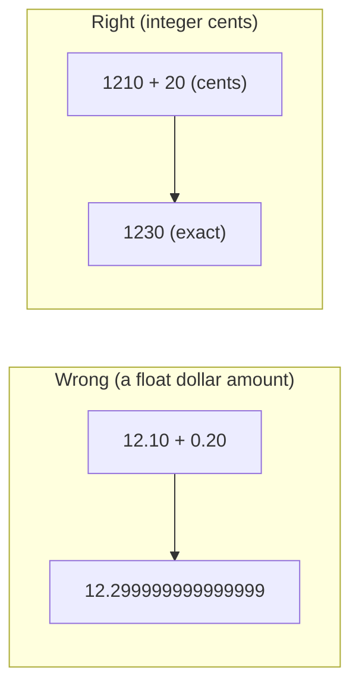

# Lesson 4.3 — Money, units, and one order item = one physical unit

## 1. In one sentence
InvAI stores every dollar amount as a whole number of cents, every percentage as a
plain number like `6.5` (never `0.065`), every size in inches as an unrounded decimal,
and every order line as however many separate, individually trackable rows its
quantity actually is — four small conventions that, broken even once, produce either a
rounding bug or a unit nobody can scan, press or ship correctly.

## 2. Why it exists
Money and quantities are the two kinds of number a shop owner will notice being wrong
immediately — a profit report that's off by a cent on every line looks broken even if
no single line is "wrong," and an order that thinks it has 1 unit when the buyer
bought 3 shirts means 2 shirts never get pressed. These conventions exist so that
*every* schema file, contract and calculation agrees on the same representation
without anyone having to remember a special case.

## 3. How it works

### Money: integer cents, never a float
Every money column in the schema is an integer counted in cents. Real examples from
`invai-backend/src/db/schema/finance.ts:37-39` — `costSettings`:
```ts
transferCentsPerSqIn: integer().notNull().default(3),
packagingPerOrderCents: integer().notNull().default(45),
laborRatePerHourCents: integer().notNull().default(1800),
```
and `orders.ts`'s `orderItems.unitPriceCents: integer().notNull().default(0)` (lesson
4.1). The reason is ordinary but easy to forget under pressure: a floating-point
dollar amount (`12.1 + 0.2` in JavaScript is `12.299999999999999`, not `12.3`)
accumulates tiny errors across thousands of line items, and a profit report is exactly
the kind of place those errors compound into a real, visible discrepancy. An integer
number of cents has no fractional part to round, ever — `profit.ts`'s own doc comment
(lesson 5.3) states this as a hard rule: "Every amount is integer cents; splits use
largest-remainder allocation so the parts always add up to the whole."

### Percentages: plain percent, not a 0–1 ratio
`invai-backend/src/db/schema/finance.ts:19-26`'s own comment: *"Contracts
`ChannelFeeTable`: percentages are plain percent (6.5 = 6.5%)."* — `transactionPct`
and `paymentPct` are stored as `6.5`, not `0.065`. This is a deliberate, explicit
choice because the alternative (a 0–1 ratio sharing the *Pct name) is exactly the kind
of ambiguity that produces a 100x bug the moment someone multiplies by 100 (or forgets
to). `CLAUDE.md`'s own convention line draws the distinction cleanly: "percents are
`*Pct` numbers (6.5); ratios are 0..1" — two different naming and numeric conventions
for two genuinely different kinds of number, never mixed.

### Ratios: 0..1, and where they actually show up
A true 0–1 ratio is used where the number really is a *fraction of a whole*, not a
"percent of a price." `invai-imaging/app/nesting.py:198-208, 231-232`'s
`overall_utilization()` and `_pack_one`'s per-sheet `utilization` are exactly this:
`utilization = area / (SCALE * SCALE) / (sheet_width_in * length)` — a plain fraction
of the sheet's area actually used, rounded to `0..1` (e.g. `0.87` for 87% film
utilization), never expressed as `87`. If you ever see a `*Pct` field holding `0.87`,
or a ratio field holding `87`, something upstream got the convention backward — check
which naming pattern the field actually has before trusting its scale.

### Sizes: inches, numeric, never rounded
`invai-backend/src/db/schema/orders.ts:202-203` — `printWidthIn`,
`printHeightIn: doublePrecision()` — and `shipping.ts:71-72, 124-125` — `widthIn`,
`heightIn: doublePrecision()`. Every physical dimension in the system is a plain
`doublePrecision` number of inches, with no rounding applied anywhere in storage.
`CLAUDE.md`'s convention line is explicit: "sizes are inches (numeric, never
rounded)." The reason connects directly to lesson 5.2: a gang sheet's nesting math
(`invai-imaging/app/nesting.py`) needs the *real* dimension to pack designs tightly —
rounding a 10.37-inch design down to 10 inches either wastes film (if you then add
margin generously to compensate) or, worse, produces a design that doesn't actually
fit the space the nester thought it reserved.

### One order item = one physical unit
This is the modeling rule module 01 and lesson 5.1 both named; here's what actually
enforces it as data, not just as a description. `invai-contracts/src/states.ts:7-21`:
```ts
export const ORDER_ITEM_STATES = [
  "imported", "needs_mapping", "ready", "needs_artwork", "on_sheet",
  "transfer_in", "pressed", "packed", "shipped", "delivered",
  "on_hold", "cancelled",
] as const;
```
— twelve states, one per `order_items` row, each independently in exactly one of
them. A quantity-3 channel line becomes three separate rows, each with its *own*
`state` column, so one unit of a 3-unit order can be `pressed` while its siblings are
still `on_sheet` — something a single "order status" field could never represent.
`invai-contracts/src/states.ts:53-69`'s `ITEM_TRANSITIONS` table (a `Record<
OrderItemState, readonly OrderItemState[]>`) is the one place that says which state
can move to which — e.g. you can't jump straight from `imported` to `shipped`. The
backend enforces this in exactly one function,
`invai-backend/src/modules/orders/state-machine.ts` (its own doc comment: "The one
place an order item changes state" — locks the item row, validates the move against
`ITEM_TRANSITIONS`, then writes the change), and the *same* `ITEM_TRANSITIONS` table
is imported by the frontends to decide which action buttons to even show — so a
presser's tablet and the backend's own guard can never disagree about what moves are
legal.



## 4. In our code
- `invai-backend/src/db/schema/finance.ts:19-26, 37-39` — `ChannelFeeTable`'s own
  comment on percent convention, and `costSettings`'s cents columns.
- `invai-backend/src/db/schema/orders.ts:202-203` — `printWidthIn`/`printHeightIn`,
  plain unrounded inches.
- `invai-backend/src/db/schema/shipping.ts:71-72, 124-125` — parcel `widthIn`/
  `heightIn`, same convention.
- `invai-imaging/app/nesting.py:198-208, 231-232` — `overall_utilization()`, a real
  0..1 ratio field (film utilization), as distinct from a `*Pct` field.
- `invai-contracts/src/states.ts:7-21, 53-69` — `ORDER_ITEM_STATES` and
  `ITEM_TRANSITIONS`, the full state machine and its legal-move table.
- `invai-backend/src/modules/orders/state-machine.ts` — the one function that actually
  changes an item's state, enforced against `ITEM_TRANSITIONS`.
- `invai-backend/src/modules/orders/import.ts:259-266` (lesson 5.1) — the quantity →
  N-rows explosion that makes "one item = one unit" a fact about the data, not just a
  rule someone has to remember.

## 5. What it uses
- Plain Postgres `integer` (cents) and `doublePrecision` (ratios, percents, inches) —
  no special money or units library; the convention is enforced by naming and review,
  not by a type system that can distinguish "cents" from "a plain integer" at compile
  time.
- `invai-contracts`'s shared `ORDER_ITEM_STATES`/`ITEM_TRANSITIONS` — one state-machine
  definition imported by both the backend's enforcement code and every frontend's UI
  logic, so they can't drift (the same "one contract" idea from module 03, lesson 1,
  applied to a state machine instead of an API shape).

## 6. Try it yourself
1. Open `invai-backend/src/db/schema/finance.ts` around line 19 and read the
   `ChannelFeeTable` comment, then find one more `*Pct` field elsewhere in the schema
   (grep `Pct:` across `src/db/schema/`) and confirm its default or seeded value is a
   plain number like `6.5`, not `0.065`.
2. Open `invai-contracts/src/states.ts` and read `ITEM_TRANSITIONS` for the state
   `"pressed"` — list which states it's allowed to move to next, and guess (before
   checking the floor-flow lessons) which one corresponds to a QC failure sending it
   backward.
3. Run `cd invai-backend && export PATH="$HOME/.local/share/pnpm/bin:$HOME/.local/share/pnpm:$PATH" && pnpm vitest run src/modules/orders/state-machine.test.ts --reporter=dot 2>&1 | tail -n 20` (if the file exists under that name — otherwise grep `src/modules/orders` for the state-machine's test file first) and confirm an illegal transition is rejected, not silently accepted.

## 7. Common mistakes
- Storing or computing a money amount as a float "just for this one calculation."
  Lesson 5.3's `profit.ts` doc comment exists precisely to head this off — once a float
  dollar amount enters a pipeline, every downstream sum risks a cent-level drift that's
  hard to trace back to its source.
- Writing a ratio where a `*Pct` field was expected, or vice versa. The naming
  convention (`CLAUDE.md`: "`*Pct` numbers (6.5); ratios are 0..1") is the only thing
  stopping a 100x-off bug — always check which one a field actually is before
  multiplying or dividing by 100.
- Treating an order as having one state. Past this point in the codebase (module 05),
  almost nothing asks "what state is this order in" — it asks about one `order_items`
  row's state, because that's the only thing that's ever actually true for a
  quantity-3 order mid-production.

## 8. Check yourself
<details>
<summary>1. Why does InvAI store money as an integer number of cents instead of a
decimal dollar amount?</summary>

Floating-point decimal arithmetic accumulates small rounding errors across repeated
additions; an integer count of cents has no fractional part, so it never needs
rounding and never drifts.
</details>

<details>
<summary>2. A field is named `marginPct` and holds the value `12`. What does that
mean, and how would you know not to read it as `0.12` or `1200%`?</summary>

It means 12%. The `*Pct` naming convention (not a `*Ratio` name, and not a bare `0..1`
value) is specifically how you know the number is already "percent-scaled" — the
convention is the only signal, so always check the field's actual name.
</details>

<details>
<summary>3. Why does InvAI define `ITEM_TRANSITIONS` once in `invai-contracts`
instead of separately in the backend and in each frontend?</summary>

So the backend's enforcement and every frontend's "which buttons to show" logic read
the exact same legal-moves table — if they were defined separately, they could drift,
and a tablet could offer an action the backend would then reject (or worse, a backend
bug could allow a move no UI meant to expose).
</details>

## 9. Words to know
- **Integer cents** — storing a money amount as a whole number counting cents (1230
  for $12.30), avoiding any floating-point fractional representation.
- **`*Pct` field** — a percentage stored as a plain number matching how a person would
  say it (6.5 for "6.5%"), distinct from a 0..1 ratio field.
- **Ratio (0..1)** — a fraction-of-a-whole number (0.87 for "87% utilized"), used where
  the value is a true proportion rather than a percentage of a price.
- **`ITEM_TRANSITIONS`** — the shared table (in `@invai/contracts`) defining which
  `order_items` states can move to which other states; the single source both the
  backend's enforcement and every frontend's UI logic read.
- **State machine (order item)** — the twelve `ORDER_ITEM_STATES` an individual order
  item moves through from import to delivery, each unit tracked independently of its
  siblings on the same order line.
