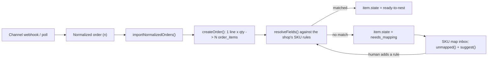

# Lesson 5.1 — Order import and the SKU map

## 1. In one sentence
A marketplace order (one line, "3× Gildan 5000 Black M") lands in InvAI and is
immediately split into 3 separate, independently trackable units — but only once the
system knows *which* design, blank, color and size that line's SKU actually means.

## 2. Why it exists
Without this step, InvAI would just be a list of marketplace line items — it couldn't
tell a presser which blank to grab, or a floor scan which design belongs on a sheet.
Two things have to happen, in order, before any other flow in this module can run:
1. **Explode quantity into units.** Module 04 already told you the rule — one order
   item = one physical unit. This lesson shows you where that explosion actually
   happens in code.
2. **Resolve the SKU.** A marketplace SKU is just a string the *shop* made up
   (`glossary.md`: SKU). InvAI has no idea what `"GL5000-BLK-M-DESIGN12"` means until a
   mapping rule tells it. Until that happens, the unit can't be nested onto a gang
   sheet (module 5.2) or matched on the floor (also 5.2) — so an unmapped SKU has to be
   a visible, blocking state, not a silent skip.

## 3. How it works

### Importing an order: quantity becomes units
`invai-backend/src/modules/orders/import.ts:83` — `importNormalizedOrders` is the entry
point every channel adapter calls once it's turned a marketplace payload into InvAI's
own shape (a "normalized order," `n` in the code below). It doesn't matter whether `n`
came from a webhook or a poll — by the time it reaches here, the channel-specific
format is already gone.

The explosion happens in `createOrder()`, `orders/import.ts:259-266`:
```ts
const itemRows = await tx.insert(orderItems).values(
  n.items.flatMap((line, li) =>
    Array.from({ length: line.quantity }, (_, u) => ({
      companyId: ctx.companyId,
      orderId: order.id,
      lineNo: li + 1,
      unitNo: u + 1,
      unitsInLine: line.quantity,
      channelLineId: line.channelLineId,
      channelSku: line.channelSku.trim(),
      ...
```
Read that `flatMap` closely: for every channel line (`li`), it builds an array of
length `line.quantity` and maps each slot to its own row. A quantity-3 line becomes 3
rows, each remembering `lineNo` (which channel line it came from) and `unitNo` (which
copy within that line it is) — so you can always reconstruct "these 3 units were one
order line" without ever treating them as one row.

One line up, `orders/import.ts:221` computes the order-level total the same way, just
summed instead of exploded: `const units = n.items.reduce((s, i) => s + i.quantity, 0)`
— stored as the order's `itemCount` for dashboard counts.

**Re-imports don't re-explode from scratch.** A webhook can redeliver, or a poll can
see an order again after the buyer edited it. `orders/import.ts:512-534` diffs the new
quantity against existing units for that channel line; `:597` only adds the *delta*
(`for (let u = 1; u <= line.quantity; u++) toAdd.push(newUnit(...))` guarded to the
missing count, not the whole line), and `:666-684` cancels or adds units when a line's
quantity itself changes on a re-import. The point: importing is idempotent at the unit
level, not just the order level — a redelivered webhook can't accidentally double your
unit count.

### Resolving a SKU
`invai-backend/src/modules/channels/sku.ts` is where a raw `channelSku` string turns
into something InvAI can act on:
- `:186 loadCatalogIndex()` loads the shop's active designs and blank variants once per
  resolution pass, so individual lookups are in-memory.
- `:220 resolveFields()` takes a line's *captured template fields* (design code, style,
  color, size — pulled out of the SKU string by a per-shop pattern) and turns them into
  a `Resolution`: either `{ ok: true, designId, blankVariantId }` or `{ ok: false,
  error }`.
- `:279 buildMatcher()` / `:335 loadMatcher()` apply the shop's own ranked rules —
  regex-like patterns compiled by `compileTemplate`/`compilePattern` (`:47-146`) —
  against the raw `channelSku` to produce those captured fields in the first place.
  Shops encode SKUs differently (`"DESIGN12-GL5000-BLK-M"` vs
  `"GL5000_M_BLK_D12"`), so the pattern is configured per shop, not hardcoded.

**What happens when a SKU doesn't resolve.** The order item's `state` becomes
`"needs_mapping"` instead of moving forward. That's not a dead end — it's the queue a
human works from:
- `sku.ts:600-680 unmapped()` groups unmapped items by channel/connection, with counts,
  the earliest ship-by date among them, and sample titles — this is the data behind
  the "SKU map inbox" screen an office user opens to fix things.
- `sku.ts:732 suggest()` looks at a batch of unmapped SKUs and proposes a new rule,
  reporting `wouldMatchCount` — "if you add this rule, it resolves N more items" —
  before anyone commits to it.



## 4. In our code
- `invai-backend/src/modules/orders/import.ts:83` — `importNormalizedOrders`, the
  channel-agnostic entry point.
- `invai-backend/src/modules/orders/import.ts:259-266` — the `flatMap`/`Array.from`
  that explodes one channel line's quantity into that many `order_items` rows.
- `invai-backend/src/modules/orders/import.ts:221` — the order-level unit count, summed
  (not exploded) for `itemCount`.
- `invai-backend/src/modules/orders/import.ts:512-534, 597, 666-684` — re-import diffing:
  only the delta is added or cancelled on a redelivered/edited order.
- `invai-backend/src/modules/channels/sku.ts:186, 220, 279, 335` — catalog index, field
  resolution, and the matcher built from per-shop SKU patterns.
- `invai-backend/src/modules/channels/sku.ts:600-680, 732` — the unmapped-SKU inbox
  query and the rule-suggestion helper.

## 5. What it uses
- **Postgres via drizzle** (`tx.insert(orderItems).values(...)`) — the explosion is
  just a bulk insert; no special library does this, it's the `flatMap` that does the
  conceptual work.
- **Per-shop configured patterns**, not a hardcoded SKU format — because every shop's
  SKU-encoding convention is different (module 01's "the DTF business" lesson covers
  why: shops glue design+style+color+size into one string their own way).
- The channel adapters that *produce* the normalized order this lesson starts from are
  covered in module 06 (reliability: mocks vs real providers) and module 07 isn't
  relevant here — SKU mapping itself has no AI in it, it's deterministic pattern
  matching, which matters: a shop should be able to predict exactly why a SKU did or
  didn't match.

## 6. Try it yourself
1. Sign in to the web dashboard as `office@desertbloom.test` / `demo1234!` and open
   whatever screen lists unmapped SKUs (the seed data includes some ready-to-map
   examples). Read one unmapped SKU's raw string and guess what design/style/color/size
   it's probably encoding, before you check the suggested rule.
2. In `invai-backend`, run
   `grep -n "needs_mapping" src/modules/channels/sku.ts src/db/schema/orders.ts | head`
   to see every place that state is read or written — a quick way to confirm you've
   found all its readers before assuming you understand its lifecycle.
3. Read `orders/import.ts:259-266` yourself and change the mental model to numbers:
   if a line has `quantity: 1`, what does `Array.from({ length: 1 }, ...)` produce?
   (One row — the explosion logic doesn't special-case quantity 1, which is exactly
   why it's trustworthy: there's no separate code path for the common case to diverge
   from the edge case.)

## 7. Common mistakes
- Assuming "the order" is the unit of work anywhere past import. It isn't — from this
  point on, almost everything in modules 5.2 and 5.3 operates on individual
  `order_items`, not orders. If you're writing or reading code that expects "the
  order's state," check whether it should really be asking about one item's state.
- Treating a re-import as safe to redo from scratch ("just delete and recreate the
  items"). The diffing logic (`:512-534`, `:597`, `:666-684`) exists specifically
  because a naive redo would lose any production progress already recorded against
  the existing unit rows (nested, scanned, pressed) — those rows have to survive a
  re-import; only the *delta* should change.
- Expecting SKU resolution to "just work" with AI or fuzzy matching. It's deliberately
  rule-based and per-shop configured (`buildMatcher`/`compileTemplate`) — a shop can
  look at a rule and know exactly why a SKU did or didn't match, which matters more
  here than coverage.

## 8. Check yourself
<details>
<summary>1. A channel line has quantity 3. The order gets re-imported later and the
buyer changed the quantity to 5. What does InvAI do to the existing 3 `order_items`
rows?</summary>

It keeps them and adds 2 more (the delta) — it does not delete and recreate all 5. See
`orders/import.ts:597` (adds only the missing count) and `:666-684` (handles a line's
quantity changing on re-import).
</details>

<details>
<summary>2. What state does an `order_item` enter when its channel SKU doesn't match
any of the shop's mapping rules, and what screen reads that state?</summary>

`"needs_mapping"`. The SKU map inbox, backed by `sku.ts:600-680 unmapped()`.
</details>

<details>
<summary>3. Why is the SKU-matching rule per-shop-configured instead of one global
pattern InvAI maintains?</summary>

Because every shop encodes design/style/color/size into its SKU string differently —
there's no single format to hardcode against. See `buildMatcher`/`compileTemplate` at
`sku.ts:279, 47-146`.
</details>

## 9. Words to know
- **Normalized order** — a marketplace order after a channel adapter has translated it
  out of that marketplace's own format, into the one shape every downstream import
  function (like `importNormalizedOrders`) understands.
- **SKU mapping rule** — a per-shop configured pattern that extracts design/style/color/
  size fields out of a raw channel SKU string.
- **Needs-mapping state** — the `order_item.state` value meaning "this unit's SKU
  didn't resolve yet"; it blocks the item from nesting until a human (or a newly added
  rule) resolves it.
- **SKU map inbox** — the office-facing screen/query (`sku.ts:600-680`) that surfaces
  every unmapped SKU, grouped by channel, with counts and sample titles.
