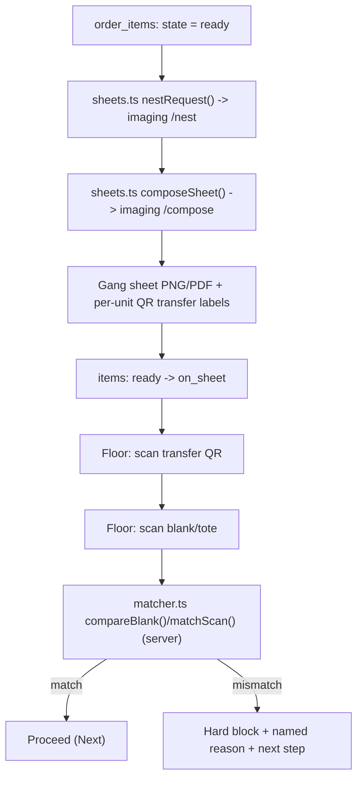

# Lesson 5.2 — Building a gang sheet, and scanning it on the floor

## 1. In one sentence
Once enough units are ready, InvAI nests their designs onto one big film sheet, prints
a scannable QR label under each one, and the production floor uses that same QR code
to block a presser from pairing a design with the wrong blank shirt.

## 2. Why it exists
A DTF shop doesn't press one shirt at a time — it prints a whole sheet of designs onto
film, then presses each design onto its matching blank. Two problems only a system can
solve well:
1. **Fit as many designs as possible onto one sheet** without wasting film — this is a
   packing problem (module 01's "DTF business" lesson: gang sheets save film and press
   time). A human laying this out by eye leaves money on the table.
2. **Never let a presser put a design on the wrong shirt.** With dozens of designs on
   one sheet and a stack of blanks nearby, a mix-up is easy and expensive — the shirt
   is ruined and the design has to be reprinted. The fix is a hard, physical check: a
   QR code that encodes exactly which unit a cut-out transfer belongs to, scanned
   against the blank before pressing.

## 3. How it works

### From ready items to a nested, composed sheet
`invai-backend/src/modules/production/sheets.ts:50-56` states the whole flow in one
code comment, worth quoting directly: "Gang sheets: pick eligible `ready` items (rush
first, by ship-by), nest them with imaging `/nest` to the vendor's spec, compose each
sheet with `/compose`, then move the items ready -> on_sheet. A sheet's transfers are
the QR-coded copies the floor scans later."

Walking that in code:
1. **Build the nest request.** `sheets.ts:267 nestRequest()` turns a batch of eligible
   items (already filtered to `state: "ready"`, prioritized rush-first and by ship-by
   date) into the shape `invai-imaging`'s `/nest` endpoint expects, following "the
   vendor's spec" (the vendor's required sheet width, gap and margin — module 04
   covers why sizes are always plain inches, never rounded).
2. **Ask imaging to nest.** `sheets.ts:317` (and again at `:732`, `:841` for the batch
   job and regenerate paths) calls `imaging.nest(nestRequest(...))` — an HTTP call to
   the Python service, not a library import; `invai-imaging` is a separate repo and
   process (module 02).
3. **Compose the actual sheet image.** `sheets.ts:548 composeSheet()` calls
   `imaging.compose({...})` at `:579` — this is the step that actually draws the final
   PNG/PDF, not just computes a layout.
4. **Move items from `ready` to `on_sheet`.** Once nesting and composing succeed, each
   item's state advances — it's no longer waiting to be scheduled, it's physically on
   a sheet about to be printed.
5. **The job worker body and a re-nest path.** `sheets.ts:663 runBuildSheets()` is what
   actually runs as a background job (module 06 covers why this is a job, not an inline
   request — it's genuinely heavy work). `sheets.ts:802 runRegenerateSheet()` handles
   the case where a sheet needs to be rebuilt after a scrap or cancellation — the
   nesting and composing calls are the same calls, just re-run against a changed item
   set.

### The nesting algorithm and the QR label, inside invai-imaging
On the Python side:
- `invai-imaging/app/main.py:314 @app.post("/nest")` and `:396 @app.post("/compose")`
  are the two FastAPI routes `sheets.ts` calls over HTTP.
- `invai-imaging/app/nesting.py:1-11`'s own docstring explains the interesting part:
  it's a MaxRects-style packer (the `rectpack` library), but with a custom placement
  rule, because "the order label strip always sits *under* the placed design, so a
  rotated design of w×h occupies (h, w+label), not (h+label, w)." In plain words: the
  packer can't just treat a design as a bare rectangle — it has to reserve space for
  the label strip every single placement needs, and that reserved space moves
  depending on whether the design got rotated to fit better.
- `invai-imaging/app/compose.py:1-20`'s docstring: "Under each design (inside the label
  strip that nesting reserved) we print a QR code with the [order/item/size/color/
  design text]." `label_text()` (`:80-81`) builds that encoded text from the order
  number, item number, size, color and design; `qr_min_side_in` and `QR_MIN_DPI = 300`
  (`:39`) exist for one reason: a QR code printed too small or at too low a resolution
  simply won't scan on the floor, and a sheet that doesn't scan is useless no matter
  how well it nested.
- A *separate* endpoint, `main.py:509 /labels/qr`, generates bin/inventory labels
  (`production.bins.labels`) — don't confuse this with the per-transfer QR label above;
  they're different labels for different physical things (a storage bin vs. one
  printed design).

### Scanning it on the floor
`invai-floor` runs the tablet screens a presser, QC and packer use — real files:
`invai-floor/src/stations/PickStation.tsx`, `PressStation.tsx`, `QcStation.tsx`,
`PackStation.tsx`.

The interesting logic is the **two-scan check**, a pure state machine in
`invai-floor/src/scan/pressFlow.ts`. Its own doc comment: "The press station's two-scan
check as a pure state machine: transfer QR -> blank/tote label -> server verdict ->
Next." Reading the `pressReducer` (`:38` on) closely:
- A wrong-*kind* scan is rejected **locally, before the network call**: scanning a
  blank or bin code while awaiting the first (transfer) scan just re-prompts
  `"scan_transfer_first"` (`:58-59`) — the tablet doesn't even ask the server about an
  obviously wrong scan.
- Once a transfer is scanned and a blank/tote is scanned second, the state moves to
  `"checking"` and the *server* decides the verdict — that's where the real match logic
  lives (next section).
- If the verdict comes back blocked (`state.view.tone !== "ok"`), the reducer doesn't
  advance — it stays put and expects the presser to scan a different (correct) blank
  against the *same* transfer (`:67-68`), rather than silently moving on.

The actual match/block decision is server-side,
`invai-backend/src/modules/production/matcher.ts`:
- `:95 compareBlank()` is the real comparison ladder: same `variantId`? Pass. Different
  style or brand? `"wrong_style"`. Same style but different color? `"wrong_color"`.
  Same color but different size? `"wrong_size"`. This ladder matters because the
  *message* a presser sees should name the actual mistake ("wrong size" vs. a generic
  "mismatch") — see module 09's plain-language-copy rule for why specificity here isn't
  cosmetic, it's what lets a presser fix the problem without asking anyone.
- `:106 checkBlank()` / `:151 matchScan()` wrap that into a full `MismatchReason` set
  (`wrong_style`/`wrong_color`/`wrong_size`/`wrong_design`/`wrong_order`/
  `blank_required`) plus a `nextAction`, which is what makes a mismatch a hard block
  with a next step, not just a red X.

### Idempotent, offline-safe scan submission
A tablet on a busy shop floor loses wifi. `invai-floor/src/outbox/db.ts:1,92` defines
`FloorDB`, a Dexie (IndexedDB wrapper) database that queues scan commands locally.
`invai-floor/src/outbox/outbox.ts`:
- `:47 commandId()` gives every queued command a stable id — for a scan, that's the
  scan's own `idempotencyKey` (not a random id), which is exactly how a replay can be
  recognized as "the same scan" rather than a new one.
- `:67 enqueue()`'s own comment (`:65-66`): "online send and an offline replay go
  through exactly the same path" — there's no separate "offline mode" code branch to
  drift out of sync with the online one.
- `:126 flushOutbox()`'s comment: "Idempotency is the server's job: a scan replayed
  with the same `clientScanId` returns its [original verdict]" — the tablet doesn't
  have to be clever about not double-submitting; it can submit the same thing twice and
  trust the server to answer the same way both times (module 06 covers idempotency in
  depth).
- `:226` parks a scan the server *blocked* on replay somewhere a lead can see it — a
  scan that comes back blocked after being queued offline doesn't just vanish.

## 4. In our code
- `invai-backend/src/modules/production/sheets.ts:50-56` — the doc comment stating the
  whole ready→nest→compose→on_sheet flow.
- `invai-backend/src/modules/production/sheets.ts:267, 317, 548, 579, 663, 802` —
  `nestRequest`, the `imaging.nest`/`imaging.compose` calls, the batch job body, and the
  regenerate-after-scrap path.
- `invai-imaging/app/main.py:314, 396, 509` — the `/nest`, `/compose` and `/labels/qr`
  FastAPI routes.
- `invai-imaging/app/nesting.py:1-11` — the MaxRects-with-label-reservation packing
  docstring.
- `invai-imaging/app/compose.py:1-20, 39, 80-81` — the QR label text and minimum
  scannable size/DPI.
- `invai-floor/src/scan/pressFlow.ts:1-11, 38-80` — the two-scan state machine.
- `invai-backend/src/modules/production/matcher.ts:95, 106, 151` — `compareBlank`,
  `checkBlank`, `matchScan`.
- `invai-floor/src/outbox/db.ts:1, 92`; `invai-floor/src/outbox/outbox.ts:47, 67, 126,
  226` — the offline Dexie outbox and its idempotent replay.

## 5. What it uses
- **pyvips + rectpack (Python)** — the actual pixel compositing and rectangle-packing
  libraries behind `/nest` and `/compose`; module 03 covers why pyvips over
  Pillow/ImageMagick for this workload.
- **QR codes at a minimum DPI** — a deliberate physical constraint (`QR_MIN_DPI = 300`),
  not a visual choice: the whole point of the label is that it has to scan reliably on
  a shop floor, under whatever lighting and however folded the film is.
- **Dexie (IndexedDB)** — the browser-side database giving the floor tablet an offline
  queue; module 06 covers the general idempotency pattern this is one instance of.
- A plain state machine (no library) for `pressReducer` — deliberately "pure" (its own
  comment says so) so it can be unit-tested with no server, no network and no tablet.

## 6. Try it yourself
1. Sign in to `invai-floor` as `presser@desertbloom.test`, PIN from the 1111–1188 range
   (`CLAUDE.md`), and scan through one press-station flow with the seed data — watch
   what happens if you intentionally scan a transfer, then scan a *different* blank
   than the one it expects to see which `MismatchReason` message you get.
2. Read `invai-imaging/app/nesting.py`'s docstring (`:1-11`) and explain in your own
   words, out loud, why a rotated design's footprint isn't simply its height and width
   swapped — what else moves with it.
3. Run `grep -n "idempotencyKey\|clientScanId" invai-backend/src/modules/production/*.ts
   | head -20` to see every place the backend treats a scan's identity as "this exact
   scan," not "a new event" — this is what makes the offline replay in
   `outbox.ts:126` safe.

## 7. Common mistakes
- Thinking of a "mismatch" as one generic error state. It isn't — `compareBlank()`'s
  ladder (`matcher.ts:95`) deliberately distinguishes wrong style, wrong color and
  wrong size, because the *fix* is different for each, and a presser standing at a
  station needs the fix, not a diagnosis.
- Writing an "offline mode" branch that behaves differently from the online path. The
  outbox's own design explicitly rejects this (`outbox.ts:65-66`): online and offline
  sends go through the exact same enqueue → flush path, so there's only one code path
  to trust.
- Assuming the bin/inventory QR label (`main.py:509 /labels/qr`) and the per-transfer
  QR label (`compose.py`) are the same thing or interchangeable — they encode
  different information for different physical objects.

## 8. Check yourself

1. Why can't the gang-sheet nesting algorithm treat a design as a plain w×h
rectangle?

Because the per-unit QR label strip sits under the design, and that strip's position
relative to the design's bounding box changes depending on whether the design is
rotated to fit — so a rotated design's packed footprint is `(h, w+label)`, not simply
`w` and `h` swapped.

2. A presser scans a transfer QR, then scans a blank of the right style and
color but the wrong size. What does the server return, and what does the tablet do
with that answer?

`compareBlank()` returns `"wrong_size"` (style and color matched, size didn't). The
tablet's `pressReducer` stays in a blocked state and expects the presser to scan a
*different* blank against the *same* transfer — it doesn't silently advance.

3. A presser's tablet loses wifi mid-scan, and the scan gets queued and
replayed later once connectivity returns. How does InvAI avoid counting that scan
twice?

The replay reuses the scan's own stable `idempotencyKey`/`clientScanId` (not a new
random id); the server recognizes a repeat and returns the same original verdict
instead of processing it as a second event.

## 9. Words to know
- **Nesting** — packing multiple designs onto one gang sheet as efficiently as
  possible, reserving space for each design's QR label strip.
- **Compose** — the step that renders the actual sheet image (PNG/PDF) from a nest
  plan, as opposed to just computing the layout.
- **Transfer** — the physical, cut piece of printed film for one unit, carrying its own
  QR code; what the floor scans at press time.
- **Two-scan check** — the press station's pattern of scanning the transfer first,
  then the blank/tote, before the server renders a match/mismatch verdict.
- **Mismatch reason** — a specific, named reason a scan was blocked (wrong style,
  color, size, design or order), chosen so the on-screen message tells the presser
  exactly what to fix.
- **Dexie** — a JavaScript wrapper around the browser's IndexedDB, used for the floor
  app's offline scan queue.
- **Idempotency key / `clientScanId`** — a stable identifier on a scan command, so a
  replayed (or offline-queued) submission is recognized as the same scan rather than a
  new one.
