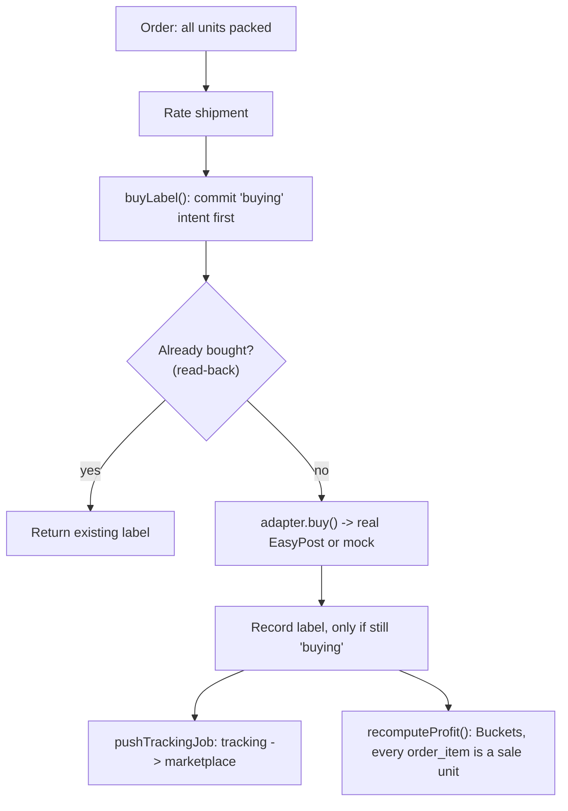

# Lesson 5.3 — Buying a label, and counting the real profit

## 1. In one sentence
Once an order is packed, InvAI buys a real (or mock) shipping label exactly once no
matter how many times the buy is retried, pushes tracking back to the marketplace, and
then rolls every real cost — blanks, transfers, labels, fees, labor — into one honest
profit number per order.

## 2. Why it exists
Two different risks, two different fixes:
1. **Buying a label costs real money, and EasyPost's API documents no idempotency on
   its `/buy` endpoint** (`invai-backend/src/integrations/carriers/types.ts:90-91`). If
   a network blip makes InvAI retry a buy call that actually succeeded the first time,
   a careless implementation would buy — and charge the shop for — two labels. The code
   has to be more careful than "just call buy again."
2. **"Profit" is easy to get quietly wrong.** A shop's real margin depends on every
   cost bucket being counted the same way, every time, including edge cases like a
   reprinted shirt. InvAI actually shipped a bug here — covered below — where one wrong
   assumption about reprints made real orders look like losses when they weren't.

## 3. How it works

### Mock vs. real carrier, decided once per request
`invai-backend/src/integrations/carriers/index.ts:13-18`, with its own doc comment:
"EasyPost when `EASYPOST_API_KEY` is set, otherwise the deterministic mock carrier. A
sample workspace (`tenancy.demo`) always gets the mock: it can never buy a real label."
```ts
export async function carrierAdapter(scope: CompanyScope): Promise<CarrierAdapter> {
  if (env.mocks.carrier || !easypostCarrier) return mockCarrier;
  return (await isSampleWorkspace(scope.companyId)) ? mockCarrier : easypostCarrier;
}
```
Notice the second check: even with a real API key configured, the demo/sample tenant
is *forced* to mock — a safety net so a demo workspace can never spend real money, no
matter what env vars are set. Module 06 covers the general mock-provider pattern; this
is one of its more careful instances, because the cost of getting it wrong is a real
dollar charge.

### Buying a label without double-charging
`invai-backend/src/modules/shipping/service.ts:781 buyLabel()`, read closely:
- `:801` — `const resume = s.status === "buying"`. If the shipment is already mid-buy
  (a previous attempt got far enough to set that status but didn't finish), this call
  is treated as *resuming*, not starting over.
- Before ever calling the carrier, the function commits an **intent**: it sets
  `status: "buying"` and records `selectedRateId`/`buyAttemptedAt` — this happens
  first, inside its own transaction, so "we're about to buy this" is durably recorded
  before any money moves.
- `:898` — `const label = found ?? await adapter.buy(plan.req)`. Before calling
  `adapter.buy`, it checks whether a label was already bought (`found`) — a **read-back
  before retry**, so a retried buy call first asks "did this already happen?" instead
  of assuming it didn't.
- `:926` — the bought label is only recorded if the shipment is *still* in `"buying"`
  status — guarding against a race where something else changed the shipment's state
  while the carrier call was in flight.
- A resumed buy with a different `rateId` than the one already in flight is rejected
  with a conflict error, not silently retried against a different rate — you can't
  accidentally finish someone else's in-progress purchase with your own rate choice.

This whole shape — commit the intent first, call the external side effect outside the
"did I already do this" check, read back before retrying — is the general
`idempotent-side-effect` pattern module 06 names explicitly; label buying is its
highest-stakes real example in this codebase.

**Recovering stuck intents.** Sometimes a buy genuinely gets interrupted mid-flight (a
crash, a timeout). `invai-backend/src/modules/shipping/jobs.ts:537 findStuckIntents()`,
`:622 retryStuckIntent()`, and sweep jobs at `:688`/`:699` find shipments stuck in
`"buying"`/`"voiding"` past a cutoff and resolve them — rather than leaving a shipment
stuck forever or trusting a human to notice.

**Tracking push.** Once a label exists, `shipping/jobs.ts:44 pushTrackingJob` and `:91
pushReleasedJob` push the tracking number back to the marketplace — this, too, is a
job (module 06), because an external API call shouldn't block the request that
triggered it.

### Counting the real profit
The math itself is deliberately pure — no database calls —
`invai-backend/src/modules/finance/profit.ts:1-19`, with its own doc comment: "Pure
profit math (no DB). Every amount is integer cents; splits use largest-remainder
allocation so the parts always add up to the whole." The `Buckets` type lists exactly
what gets counted: `revenue, channelFees, blankCost, transferCost, labelCost,
packagingCost, laborCost, adsCost, refunds, net, marginPct`. A few names worth noting
that connect to earlier lessons:
- `transferCost` — the cost of every *transfer* printed for an item (lesson 5.2), which
  matters directly for the reprint story below.
- `channelFees` — the marketplace's own cut, looked up per channel
  (`:111/:123` fee tables, `:135 orderFees()`), because Etsy, Amazon, Shopify, TikTok
  Shop and Walmart all charge differently (module 01).
- `:90 allocate()` — the largest-remainder split mentioned in the doc comment: when a
  cost has to be divided across several units, the split is done so the parts always
  sum exactly to the whole (no cent silently lost or invented to rounding).
- `:198 transferCost()`, `:218 laborCost()` — the actual per-item cost functions.
- The database-facing side, `invai-backend/src/modules/finance/service.ts:374
  recomputeProfit()`, is what calls this pure math against real order data and persists
  the result.

### The reprint bug — a real lesson in "what counts as a sale"
Three different columns share the name `is_reprint`: `order_items.is_reprint`,
`profit_lines.is_reprint` (copied from the item by `recomputeProfit`), and
`transfers.is_reprint` (per physical transfer printed). The only writer of the *item*
flag is `openReprint` (`invai-backend/src/modules/production/floor.ts:642`) — and it
flips the flag on the *same* item row. No code anywhere ever creates a second, sibling
"reprint item" row.

But — as `invai-docs/decisions/0020-is-reprint-means-re-pressed.md` records — finance,
refunds, re-import, analytics, market and even the AI analyst had all been filtering
`isReprint` out, treating it as "an extra, non-sale unit" that shouldn't count. That
model of what the flag meant never actually existed in the data. The real effect: **44
seed orders showed $0 revenue and a false loss**, purely because their one real,
shipped, sold unit happened to have been re-pressed once and got filtered out of
revenue. Two more side effects: re-importing an unshipped order whose only unit had
been reprinted silently added a *second* unit (`orders/import.ts:533,595` — you saw
this file in lesson 5.1), and a channel line-cancel could skip the reprinted unit
entirely (`import.ts:872`), letting it ship even though it was supposed to be
cancelled.

The fix, decision 0020: `isReprint` means "re-pressed at least once" and is
**informational only** — it never decides whether a unit is a sale. A sale unit is any
non-cancelled `order_item`, full stop. The real *cost* of a reprint was never missing —
it's already captured through `transferCost` (every transfer printed for that item,
reprint or not, gets summed) and blank scrap. The bug was never in the cost math; it
was in treating a flag about printing history as if it were a flag about revenue
eligibility.



## 4. In our code
- `invai-backend/src/integrations/carriers/index.ts:13-18` — the mock/real carrier
  switch, with the demo-tenant safety net.
- `invai-backend/src/integrations/carriers/types.ts:90-91` — the doc comment stating
  EasyPost's lack of buy-idempotency, and why.
- `invai-backend/src/modules/shipping/service.ts:781, 801, 844 (region), 898, 926` —
  `buyLabel()`: resume detection, committed intent, read-back, guarded record.
- `invai-backend/src/modules/shipping/jobs.ts:44, 91, 537, 622, 688, 699` — tracking
  push jobs and stuck-intent recovery.
- `invai-backend/src/modules/finance/profit.ts:1-19, 90, 111, 123, 135, 198, 218` — the
  pure `Buckets` math, allocation, fee tables, transfer/labor cost.
- `invai-backend/src/modules/finance/service.ts:374` — `recomputeProfit()`, the
  DB-facing caller of the pure math.
- `invai-docs/decisions/0020-is-reprint-means-re-pressed.md` — the full reprint-bug
  story and the accepted fix.
- `invai-docs/metrics/definitions/reprint_cost.md`,
  `invai-docs/metrics/sql/reprint_cost.sql` — the metric that correctly measures reprint
  *cost* without miscounting sales.

## 5. What it uses
- **EasyPost (real) / a deterministic mock** — the only outward label-buying
  integration; module 03 covers the carrier-adapter interface pattern in general.
- **BullMQ jobs** (`shipping/jobs.ts`) — tracking pushes and stuck-intent sweeps both
  run as background jobs, not inline with the request that triggered them (module 06).
- **Integer cents everywhere** (`profit.ts`'s own comment) — module 04 covers why money
  is never a float in this codebase.
- **`@invai/contracts`'s `CHANNEL_RULES`** — per-channel fee rules imported directly
  into `profit.ts`, so the fee math and the contract's channel definitions can't drift
  apart silently.

## 6. Try it yourself
1. Read `invai-backend/src/modules/shipping/service.ts` around `buyLabel()` (`:781` on)
   and find the exact line that commits the `"buying"` status *before* `adapter.buy` is
   ever called — then find the line that reads an existing label back before buying
   again. Convince yourself these two lines, in this order, are what makes a retried
   buy call safe.
2. Read `invai-docs/decisions/0020-is-reprint-means-re-pressed.md` in full (it's short)
   and then grep for `isReprint` across `invai-backend/src/modules/finance` — see if
   you can identify what a "filter out reprints" line of code used to look like, based
   on the decision's description of the bug.
3. Run `grep -n "allocate\|largest-remainder" invai-backend/src/modules/finance/profit.ts`
   and read `allocate()` — pick a cost amount and a unit count that doesn't divide
   evenly (say, 100 cents across 3 units) and work out by hand what the three resulting
   amounts should be, so they still sum to 100.

## 7. Common mistakes
- Writing a retry for any external paid action as "just call it again." EasyPost's own
  API gives no idempotency guarantee on `/buy` — the safety has to come from InvAI's
  own commit-intent-then-read-back pattern, not from the provider.
- Assuming a boolean flag's *name* tells you what it's safe to filter on. `isReprint`
  sounds like "doesn't count," but the decision that fixed this bug is explicit: a flag
  about printing history is not automatically a flag about sale eligibility — check
  what a flag's writer actually models before filtering on it elsewhere.
- Treating profit math as something you can round as you go. `profit.ts`'s own
  comment insists on integer cents and largest-remainder allocation specifically so a
  rounding shortcut never makes bucket totals fail to sum to the real total.

## 8. Check yourself
<details>
<summary>1. `buyLabel()` is called twice for the same shipment and rate because the
first call's response never reached the caller (but the carrier did receive and
process it). What stops InvAI from buying two labels?</summary>

The second call sees the shipment already in `"buying"` status with the same
`selectedRateId` (a resume, not a fresh buy), and before calling the carrier again it
reads back for an existing label — finding one, it returns that instead of calling
`adapter.buy` a second time.
</details>

<details>
<summary>2. What did the `isReprint` bug actually cause, for which orders, and what was
the one-line fix in meaning (not code)?</summary>

Orders whose only unit had been re-pressed once showed $0 revenue and a false loss (44
seed orders), because several readers filtered `isReprint = true` items out as
non-sales. The fix: `isReprint` means "re-pressed," informational only; a sale unit is
any non-cancelled order item, regardless of reprint history.
</details>

<details>
<summary>3. Why is `profit.ts`'s math written with no database calls at all?</summary>

So it's pure, deterministic math that can be unit-tested directly against known inputs
and outputs, with the database-facing code (`recomputeProfit()`) kept as a thin,
separately testable layer around it.
</details>

## 9. Words to know
- **Idempotent side effect** — an outward action (like buying a label) made safe to
  retry by committing an intent before the call, and reading back for an existing
  result before retrying — covered in depth in module 06.
- **Carrier adapter** — the interface a real provider (EasyPost) and its mock both
  implement, so the rest of the codebase calls one shape regardless of which is active.
- **Buckets (profit)** — the named cost/revenue categories (`revenue`, `blankCost`,
  `transferCost`, `labelCost`, …) every order's profit is broken into.
- **Largest-remainder allocation** — a way to split one amount across several parts so
  the parts always sum exactly back to the original, with no cent lost or invented to
  rounding.
- **Stuck intent** — a shipment left in `"buying"`/`"voiding"` status longer than
  expected, usually from an interrupted buy call; recovered by a sweep job rather than
  left to a human to notice.
