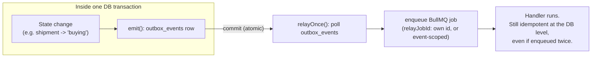

# Lesson 6.1 — Idempotency and the outbox

## 1. In one sentence
InvAI makes sure a state change and the event that announces it can never disagree
(the **transactional outbox**), and makes sure anything that costs money or can't be
undone — a webhook, a label buy, a scan, a tracking push — has the same effect whether
it runs once or five times (**idempotency**).

## 2. Why it exists
Two different failure shapes, two different fixes:
1. **"Did my event actually fire?"** A naive design writes a database row, then
   separately calls `sendEvent()`. If the process crashes between those two steps, the
   row exists but nobody downstream ever hears about it — or the event fires and the
   transaction then rolls back, so downstream reacts to something that never happened.
   Without a fix, "a shipment got labeled" and "finance recomputed its profit" can
   silently drift out of sync forever.
2. **"What happens if this runs twice?"** Networks retry. Workers crash mid-job.
   Marketplaces redeliver webhooks they're not sure you received. Browsers resend a
   request the user double-clicked. Any of InvAI's outward side effects — buying a
   real shipping label, charging a company's AI credits, pushing a tracking number to
   Etsy — would be genuinely wrong to do twice. "Just retry it" is not safe by default;
   it has to be made safe on purpose.

## 3. How it works

### The outbox: write the event in the same transaction as the change
`invai-backend/src/lib/outbox.ts:1-13`, from its own doc comment:
> Transactional outbox. `emit()` inserts the event in the same transaction as the state
> change; the relay (`src/worker/outbox-relay.ts`) moves committed rows into BullMQ
> jobs. An event is never lost on a crash and never fires for a rolled-back change.

The trick is really that simple: `emit()` (`outbox.ts:15`) just does an `INSERT` into
an `outbox_events` table, using the *same* database transaction (`Tx`) that the calling
code is already using to make its state change. Postgres guarantees that either both
writes commit or neither does — so "the shipment is labeled" and "an outbox row says
the shipment was labeled" can never disagree. `emit()` validates the payload against
the contract's `Events` schema when the event name is known (`outbox.ts:31-33`), so a
typo in a payload shape fails loudly at write time, not months later when something
tries to read it.

A separate process, the **relay** (`invai-backend/src/worker/outbox-relay.ts:52
relayOnce()`), polls every 500ms (`POLL_MS`) for undispatched rows and turns each one
into one or more BullMQ jobs — this is the only place events become jobs. It runs as
`withSystem` (no RLS) because one relay sees events from every tenant at once, and uses
`FOR UPDATE SKIP LOCKED` (`:66`) so more than one relay instance can run side by side
without two of them grabbing the same row.

### Why the relay needs its own idempotency
Here's the subtlety worth sitting with: the relay enqueues a BullMQ job for an event,
then marks that event dispatched — but what if it crashes *between* those two steps?
The event would get picked up again next poll and enqueued a *second* time. That's
exactly the kind of double-run the outbox pattern exists to prevent against — so the
relay needs its own idempotency key for the job it's creating:

`outbox-relay.ts:30 relayJobId()`, whose doc comment lays it out precisely: a job that
defines its own `jobId` keeps it, "so two events mapping to the same input ... collapse
into one pending job instead of one per event." But a finished job's id eventually
ages out of Redis (BullMQ's `removeOnComplete`/`removeOnFail`), and silently dropping a
re-add under an id that's gone would mean a legitimately *new* event for the same
entity never runs — so `relayJobId` falls back to an event-scoped id
(`${eventId}:${job.name}`) whenever the job's own id already belongs to a
finished job. Either way, "handlers stay idempotent in the database either way" — the
comment's own words — meaning the job-id trick is a *courtesy* against duplicate
enqueues, not the actual safety net. The real safety net is inside the handler.

### Idempotency at the outward edge: webhooks
A marketplace redelivering a webhook is normal, expected behavior, not a bug — Shopify
and Etsy both say so in their docs, and they both send a unique delivery id with every
webhook (`invai-backend/src/api/webhooks.ts:27`: "Shopify dedupes on
X-Shopify-Webhook-Id, Etsy on `webhook-id`"). `invai-docs/decisions/0009` records the
actual dedupe design: a `webhook_deliveries` table unique on `(channel, delivery id)`,
with a migration that **revokes insert/update/delete from everything except system
code**, so no tenant's own data can forge or block another tenant's delivery record.
A redelivery of an id already recorded is simply acknowledged and does nothing.

### Idempotency at the outward edge: a paid, non-retriable call
Lesson 5.3 already walked through InvAI's highest-stakes example of this —
`shipping/service.ts:781 buyLabel()` — in detail, because EasyPost's own API documents
no idempotency guarantee on its `/buy` endpoint. The shape generalizes to every outward
side effect in this codebase, and it's worth having the shape itself named, because
you'll see it again and again:

1. **Commit the intent first.** Write "we're about to do this" to the database, in its
   own transaction, *before* calling anything external.
2. **Call the external thing outside that transaction.** A database transaction should
   never be left open while waiting on a network call to a third party.
3. **Read back before retrying.** Before calling the external API again, check whether
   the effect already happened.
4. **Guard the write-back.** Only record the result if the entity is still in the state
   you expect — something else may have changed it while you were waiting.

## 4. In our code
- `invai-backend/src/lib/outbox.ts:1-13, 15-39` — `emit()` and its doc comment: the
  whole transactional-outbox idea in a few lines.
- `invai-backend/src/worker/outbox-relay.ts:17-19, 30-47, 52-66` — `MAX_ATTEMPTS`/
  `OUTBOX_RETENTION_DAYS` constants, `relayJobId()`, and `relayOnce()`'s `withSystem` +
  `FOR UPDATE SKIP LOCKED` polling loop.
- `invai-backend/src/api/webhooks.ts:27` — the comment naming each marketplace's
  delivery-id header, and the dedupe table it writes to.
- `invai-docs/decisions/0009-webhook-deliveries-table.md` — the full reasoning for a
  tenant table with system-only writes, and its accepted trade-off (a true double-run
  is possible only if a completed BullMQ job aged out of Redis before a legitimate
  retry lands — judged low risk).
- `invai-backend/src/modules/shipping/service.ts:781, 801, 898, 926` — `buyLabel()`,
  the fullest real example of commit-intent / call-outside-tx / read-back / guarded
  write (walked through in lesson 5.3).
- `.claude/skills/idempotent-side-effect` and `.claude/skills/idempotent-job` — the two
  playbooks this lesson's pattern comes from; every engineer role reads these before
  touching a webhook, a paid API call, a scan, or a job handler.

## 5. What it uses
- **Postgres transactions** — the entire outbox guarantee rests on one database
  transaction either fully committing or fully rolling back; no other mechanism is
  needed to keep the event and the change in sync.
- **BullMQ + Valkey** — the queue the relay turns outbox rows into jobs on; lesson 6.2
  covers jobs and retries in their own right.
- **`FOR UPDATE SKIP LOCKED`** — a Postgres row-locking clause that lets several workers
  pull from the same queue-like table without two of them grabbing the same row or
  blocking each other.
- **A unique database constraint** (`(channel, delivery_id)` on `webhook_deliveries`) —
  the actual mechanism that makes a redelivered webhook a no-op, enforced by the
  database itself, not by application logic that could have a bug.

## 6. Try it yourself
1. Read `invai-backend/src/lib/outbox.ts` end to end — it's under 50 lines. Find the
   exact point where `emit()`'s caller (anywhere in `src/modules/*/service.ts`, search
   `grep -rn "emit(tx" invai-backend/src/modules`) is still inside the same `tx` that
   changed a row. Convince yourself a rollback of that `tx` also undoes the `emit()`.
2. Trigger a duplicate webhook delivery safely: find a recent delivery id in your local
   `webhook_deliveries` table (`psql` as the owner role, `select channel, delivery_id
   from webhook_deliveries order by created_at desc limit 5`), then look at
   `invai-backend/src/api/webhooks.ts` for where that id is checked before any
   processing happens. No need to actually resend anything — tracing the check by eye
   is the point.
3. Run `grep -n "relayJobId\|eventScoped" invai-backend/src/worker/outbox-relay.ts` and
   work out, from the comment at `:30`, what id a *second* dispatch of the exact same
   outbox row would produce for a job that defines its own `jobId` vs. one that
   doesn't.

## 7. Common mistakes
- Treating "retry the call" as the whole fix for a flaky outward request. EasyPost's
  `/buy` endpoint gives no idempotency promise at all — if InvAI's own code didn't
  commit an intent and read back before retrying, a flaky network would eventually
  double-charge a real shop (lesson 5.3's worked example).
- Writing the DB row and firing the event as two separate steps "because it's simpler."
  That's exactly the gap the outbox closes — a crash or a later rollback between the
  two steps is not a rare edge case in a system that runs thousands of requests a day.
- Assuming a job's own `jobId` is *the* idempotency guarantee. It's a courtesy that
  avoids redundant enqueues; `relayJobId`'s own comment is explicit that "handlers stay
  idempotent in the database either way" — the handler itself still has to be safe to
  run twice, because a finished job's id ages out of Redis eventually.

## 8. Check yourself

1. A request handler updates an order's status and then calls `emit()` inside
the same `withTenant` transaction. The transaction later rolls back because a later
statement in the same handler throws. What happens to the outbox event?

Nothing — it's never committed, because it was inserted in the same transaction as the
status update. The whole point of the outbox is that the event and the change share one
atomic commit; a rollback undoes both or neither.

2. Why does `webhook_deliveries` have `company_id` and RLS instead of just
being a plain global table keyed on `(channel, delivery_id)`?

Decision 0009: once a delivery is routed to a shop, it's that shop's tenant data, and
`rls-coverage.test.ts` fails any table that has neither `company_id` nor RLS. Insert/
update/delete are revoked from the app role entirely (system-only writes), so no
tenant can forge or block another tenant's delivery record even though the table
itself is tenant-scoped for reads.

3. The outbox relay crashes after enqueueing a BullMQ job for an event but
before marking that event dispatched. What stops the event from being processed
twice?

Two layers: `relayJobId()` tries to reuse the job's own idempotency key so the same
input collapses into one pending job, and — more importantly — the job handler itself
is written to be safe to run twice at the database level (the `idempotent-job`
pattern), so even if the relay's retry does cause a second enqueue, the second run has
no extra effect.

## 9. Words to know
- **Transactional outbox** — writing an event row in the same database transaction as
  the state change it describes, so they can never disagree.
- **Idempotency** — a property of an operation: running it once has the same effect as
  running it any number of times.
- **Idempotency key** — a value used to recognize "this is the same attempt as before,"
  so a retried call can be matched against one already recorded.
- **`FOR UPDATE SKIP LOCKED`** — a Postgres clause letting several workers safely share
  one queue-like table, each grabbing different rows without waiting on each other.
- **Relay** — InvAI's name for the background loop that turns committed outbox rows
  into BullMQ jobs (`src/worker/outbox-relay.ts`).
- **Commit the intent** — writing "I'm about to do this" to the database *before*
  calling an external, hard-to-undo API, so a crash mid-call leaves evidence instead of
  silence.
- **Read-back before retry** — checking whether an external effect already happened
  before asking the provider to do it again.
