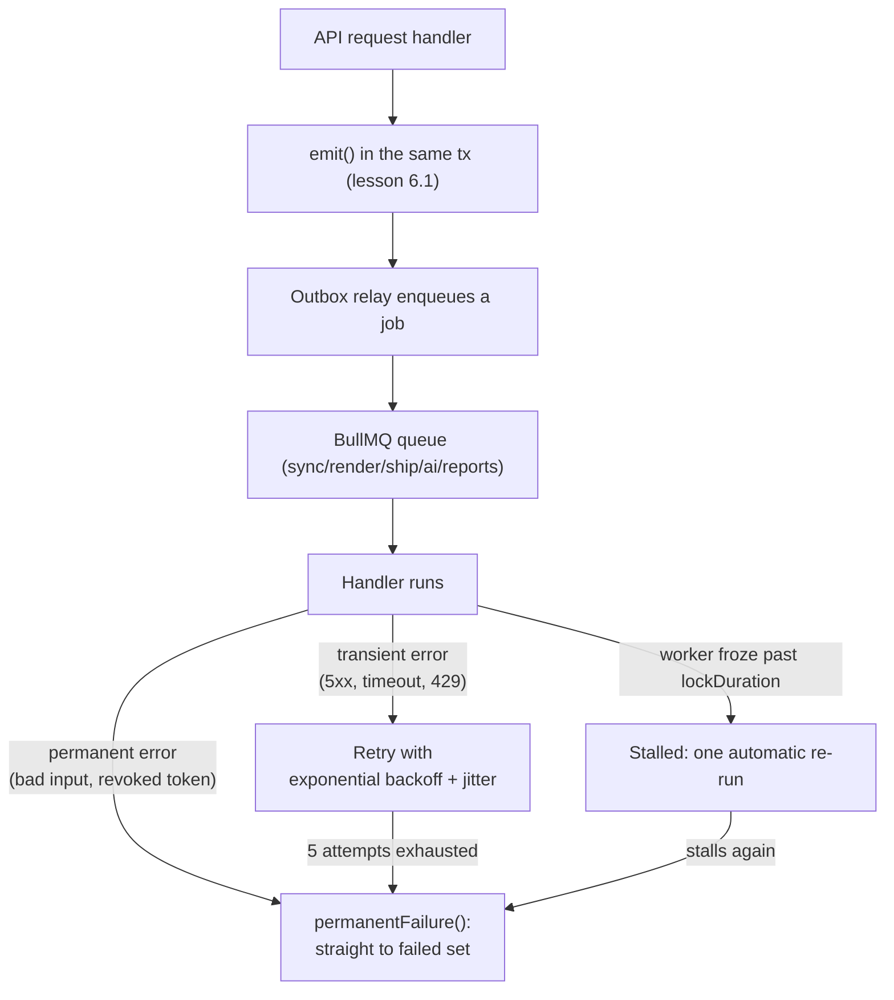

# Lesson 6.2 — Jobs, retries, and rate limits

## 1. In one sentence
Heavy or outward work runs as a **BullMQ job** on a background **worker** process,
every job retries with randomized backoff so failures don't pile up in lockstep, and
every tenant and every sensitive action (sign-ins, API calls, AI calls) is held to a
**rate limit** so one shop or one bad actor can't starve everyone else.

## 2. Why it exists
Three different problems, one queue-based answer to most of them:
1. **A request shouldn't wait on slow or unreliable work.** Nesting a gang sheet,
   pushing tracking to a marketplace, or calling an AI model can take seconds. If the
   HTTP request handling those stayed open the whole time, a flaky network or a slow
   provider would make the *whole API* feel broken, not just that one feature.
2. **Things fail, and they should fail safely.** A provider has a bad five minutes. A
   worker process crashes mid-job. Retrying blindly and immediately would hammer an
   already-struggling provider right when it's weakest, and many failed jobs retrying
   at the exact same delay would all hit it again at the exact same moment.
3. **One tenant's usage shouldn't degrade another's.** Without limits, one shop
   importing a huge CSV, or one compromised script hammering an endpoint, could use up
   resources shared by every other shop on the platform.

## 3. How it works

### Five named queues, one job registry
`invai-backend/src/lib/queues.ts:20-28` defines five queues — `sync`, `render`,
`ship`, `ai`, `reports` — each with its own concurrency (`QUEUE_CONCURRENCY`, `:23-28`:
`render` gets only 2 workers at once, since nesting and compose are CPU-heavy; `sync`
gets 10, since marketplace syncs are mostly waiting on a network). A module declares
its own jobs with `defineJob()` (`:154` onward), which the file's own comment shows the
shape of:
```ts
export const recomputeProfit = defineJob({
  queue: "reports",
  name: "finance.recomputeProfit",
  input: z.object({ companyId: Id, orderId: Id }),
  jobId: (i) => `recompute-profit:${i.orderId}`,     // idempotency key (optional)
  handler: async (input, job) => { ... },
});
onEvent("shipment.labeled", recomputeProfit, (e) => ({ companyId: e.companyId, orderId: e.payload.orderId }));
```
`onEvent` is how a job subscribes to an outbox event name (lesson 6.1) — the relay
reads this registry to know what to enqueue when a `shipment.labeled` event is
dispatched. `worker/index.ts` imports every module's `jobs.ts` file so this registry
is complete before the worker starts.

### Retrying without a thundering herd
`queues.ts:60-77`: every job type retries with **jitter** — the file's own comment:
"Share of each retry delay that is randomized ... so jobs that failed together (a
provider blip) don't retry in lockstep." `BACKOFF_JITTER = 0.5` means a nominal delay
of `D` actually lands anywhere in `[D * 0.5, D]` — concretely, if fifty jobs all fail
at once because EasyPost is briefly down, they don't all retry at the same instant two
seconds later and hit EasyPost with the exact same spike again. `DEFAULT_JOB_OPTIONS`
(`:80-85`) sets 5 attempts with exponential backoff starting at 2 seconds as the
baseline every job gets unless it overrides it.

### Two kinds of failure, told apart on purpose
`queues.ts:170-185 permanentFailure()`, read closely — this is one of the more
important small functions in the codebase:
> Stop retrying: BullMQ fails the job at once (one attempt, not five) ... Throw it for
> failures a retry can't fix: Zod-invalid input, a provider's 4xx validation answer, a
> missing entity, revoked OAuth, a plan limit. ... Transient failures (5xx, timeouts,
> 429, imaging down) throw a normal Error and retry with backoff.

The distinction matters because retrying a *permanent* failure five times (with
backoff, taking minutes) is pure wasted time — the input was never going to become
valid by waiting. `isPermanentHttpStatus()` (`:187`) codifies which HTTP statuses count
as "a retry can't fix this": a 4xx response generally is, except 408 (timeout), 409
(conflict), 425 and 429 (rate limit) — those four *are* worth retrying, because they
describe a timing problem, not a bad request.

### Stalled jobs: when a worker goes quiet mid-job
`queues.ts:30-52 WORKER_STALL_SETTINGS`, with a comment worth reading in full for how
carefully it's tuned. A job "stalls" only when its worker died or blocked the event
loop for longer than `lockDuration` — the lock itself is renewed every half of
`lockDuration` while the handler is actually running, so a legitimately slow 2-minute
gang-sheet compose never looks stalled. Each queue's `lockDuration` is set to "the
longest *synchronous* stretch a handler can hold the event loop... with room to
spare." `maxStalledCount: 1` everywhere means a stalled job gets exactly one more
chance before it's moved to the failed set — "a job that freezes two workers in a row
is a bug, not a blip," as the comment puts it — where `/internal/dlq` can list and
redrive it by hand. This only works safely because, per the same comment, "every
handler is idempotent at the DB level" (lesson 6.1) — a stalled job's one automatic
re-run is safe exactly because nothing about this codebase's jobs assumes "ran once."

### Running a job the way the worker would, in a test
`queues.ts:146-159 runJobInline()` is the test-facing side of all this: it validates
input through the job's own Zod schema and calls the handler directly, with an
`attempt`/`attempts` option that lets a test "play a retry" — simulating that this is,
say, attempt 3 of 5, without actually waiting through four real backoff delays. This is
the mechanism the `idempotent-job` skill's "run-twice test" rule points at: call the
handler, then call it again with the same input, and assert the database ends up in
the same state either way.

### Rate limits: per-company token buckets, and per-key failure counters
Two different mechanisms live in `invai-backend/src/lib/ratelimit.ts`, for two
different jobs:
- **Fixed-window failure counters** (`:20-64`) back brute-force lockouts — floor PIN
  attempts, for instance. `lockedFor()`, `recordFailure()`, `revokeUntil()` each wrap
  a Redis call in a 500ms timeout and, on any Redis trouble, **fail open**: the file's
  own header comment is explicit that "a stuck Redis must not freeze the floor." A
  presser locked out of a scanner because Redis hiccuped would be a worse outcome than
  temporarily allowing a few extra PIN attempts.
- **Token buckets per `company_id`** (`:72-100` onward), for ordinary API traffic. The
  comment at `:75-78` explains the key design choice directly: buckets are keyed by
  `company_id`, *not* by IP — "one office sharing a NAT and one abusive script both
  trip the same limit whichever IP they use." Four buckets — `auth`, `reads`,
  `writes`, `ai` — mean a slow batch of writes can't starve a read, and AI calls (the
  most expensive per request) get the smallest budget of the four
  (`RATE_BUCKET_LIMITS`, `ai: perMinute(20)` vs. `reads: perMinute(300)`). A fifth
  bucket, `links`, is for the public, session-less `/l/:token` email-link routes
  (decision 0016) and is deliberately keyed by IP instead, since there's no company
  session to key on there.

Both mechanisms share the same fail-open convention on Redis trouble — a rate limiter
that goes down should never be the reason a whole platform stops responding.



## 4. In our code
- `invai-backend/src/lib/queues.ts:20-28` — the five queues and their concurrency.
- `invai-backend/src/lib/queues.ts:60-85` — `BACKOFF_JITTER`, `DEFAULT_BACKOFF`,
  `withJitter()`, `DEFAULT_JOB_OPTIONS`.
- `invai-backend/src/lib/queues.ts:30-52` — `WORKER_STALL_SETTINGS` and its full
  reasoning comment.
- `invai-backend/src/lib/queues.ts:146-159` — `runJobInline()`, the run-twice test
  helper.
- `invai-backend/src/lib/queues.ts:170-190` — `permanentFailure()` and
  `isPermanentHttpStatus()`.
- `invai-backend/src/lib/ratelimit.ts:1-64` — fixed-window failure counters, fail-open
  on Redis trouble.
- `invai-backend/src/lib/ratelimit.ts:72-100` — per-company token buckets, the
  `company_id`-not-IP reasoning, and the four (plus `links`) bucket limits.
- `invai-backend/src/modules/shipping/jobs.ts:44-65 pushTrackingJob` — a real
  `defineJob` with its own `jobId` built from `shipmentId` and `attempt`, and a
  deliberate "held' is not retried" comment distinguishing one outcome from the ones
  that should retry.
- `.claude/skills/idempotent-job` — the playbook naming the run-twice test and the
  `onFinalFailure` convention for marking an entity failed when BullMQ gives up.

## 5. What it uses
- **BullMQ** (Redis-backed) — the job queue library; `defineJob`/`onEvent` are InvAI's
  own thin wrapper around it, not raw BullMQ calls scattered through the codebase.
- **Valkey/Redis** — backs both the queues and the rate-limit counters; a Redis outage
  degrades jobs (they queue up, nothing is lost — BullMQ persists to Redis) and
  degrades rate limiting (fails open) differently on purpose.
- **Zod** — every job's `input` is a Zod schema, so a job enqueued with the wrong shape
  fails validation immediately rather than crashing a handler partway through.
- **`UnrecoverableError`** (BullMQ) — the exception `permanentFailure()` throws under
  the hood, which tells BullMQ "don't retry this at all," not just "retry it, but
  differently."

## 6. Try it yourself
1. Read the `WORKER_STALL_SETTINGS` comment in full
   (`invai-backend/src/lib/queues.ts:30-52`) and work out, for the `render` queue
   (`lockDuration: 120_000`), how often its lock gets renewed while a handler runs, and
   roughly how long a worker would have to freeze before BullMQ considers the job
   stalled.
2. `grep -n "permanentFailure(" invai-backend/src/modules -r` and pick two call sites.
   For each, read the surrounding code and decide: is this failure something a retry
   could plausibly fix, or not? Check your answer against the comment at
   `queues.ts:170-176`.
3. Read `invai-backend/src/lib/ratelimit.ts:166-171 checkRateLimit()` and
   `RATE_BUCKET_LIMITS`. If a shop's office staff were hammering `reads` at 310
   requests in one minute (over the 300 cap), would the very first of those requests
   be rejected, or only once the burst capacity is used up? (Hint: re-read `perMinute()`
   — capacity is a *burst* allowance, refilled continuously.)

## 7. Common mistakes
- Retrying a permanent failure as if it were transient — wasting up to five attempts'
  worth of backoff time (minutes) on an input that will never succeed, and hiding a
  real bug (bad data, a revoked token) behind what looks like a flaky-network retry
  loop.
- Forgetting that two test runs sharing one Redis database collide. Wave 22's lesson
  (`team/lessons.md`, 2026-09-29): "The test env redirects Postgres to `invai_test` but
  leaves `REDIS_URL` on DB 0, shared with any running dev worker" — BullMQ tests failed
  intermittently for two whole waves before this was root-caused instead of being
  dismissed as a flake. The fix: every backend suite run gets its own Redis DB number.
- Assuming a rate limiter should fail *closed* (block everyone) when Redis is down.
  `ratelimit.ts`'s own convention is the opposite, and deliberately so: a stuck Redis
  blocking every floor PIN login or every API request would turn an infrastructure
  hiccup into a platform-wide outage.

## 8. Check yourself
<details>
<summary>1. A job handler throws a plain `new Error("ECONNRESET")` after calling a
flaky third-party API. What does BullMQ do, and how is that different from throwing
`permanentFailure("bad address")`?</summary>

A plain `Error` is treated as transient: BullMQ retries it up to the job's configured
attempts (5 by default), with exponential backoff and jitter between tries.
`permanentFailure()` throws `UnrecoverableError`, which fails the job immediately,
with no retries at all — because no amount of waiting will make a bad address valid.
</details>

<details>
<summary>2. Why are InvAI's per-company rate-limit buckets keyed by `company_id`
rather than by IP address?</summary>

Because IP doesn't reliably identify a tenant: an office sharing a NAT would share one
IP's limit across several different shops, and a single bad actor could rotate IPs to
dodge a limit entirely. Keying by `company_id` ties the limit to the actual tenant,
whichever IP the traffic comes from.
</details>

<details>
<summary>3. Why does `WORKER_STALL_SETTINGS` renew a job's lock every half of
`lockDuration` while the handler runs, instead of just setting a long `lockDuration`
and leaving it alone?</summary>

Because a lock that's only ever set once and never renewed would force a choice
between "long enough that slow-but-healthy jobs never falsely stall" and "short
enough that a truly frozen worker's job gets noticed quickly" — you can't have both
with one static number. Renewing the lock while the handler is alive and making
progress means `lockDuration` only has to cover the *longest single synchronous
stretch*, not the job's total runtime, so a genuinely dead worker is still detected
promptly.
</details>

## 9. Words to know
- **BullMQ** — the Redis-backed job queue library backing every background job
  (recap from module 03; this lesson is where its retry and stall behavior matters).
- **Backoff** — the growing delay between retry attempts after a failure.
- **Jitter** — randomizing a retry delay within a range, so many jobs that failed
  together don't all retry at the exact same instant.
- **Stalled job** — a job whose worker appears to have died or frozen (its lock
  expired without being renewed), which BullMQ puts back in the queue to run again.
- **Dead-letter queue (DLQ)** — where a job lands after it's given up on for good
  (permanent failure, or stalling past `maxStalledCount`); InvAI's is listable and
  redrivable at `/internal/dlq`.
- **Fail open / fail closed** — what a safety check does when it itself can't be
  evaluated (e.g. Redis is down). "Fail open" lets the request through anyway; "fail
  closed" blocks it. InvAI's rate limiters fail open on purpose.
- **Token bucket** — a rate-limiting scheme with a burst capacity that refills
  continuously over time, rather than a hard reset at a fixed clock boundary.
