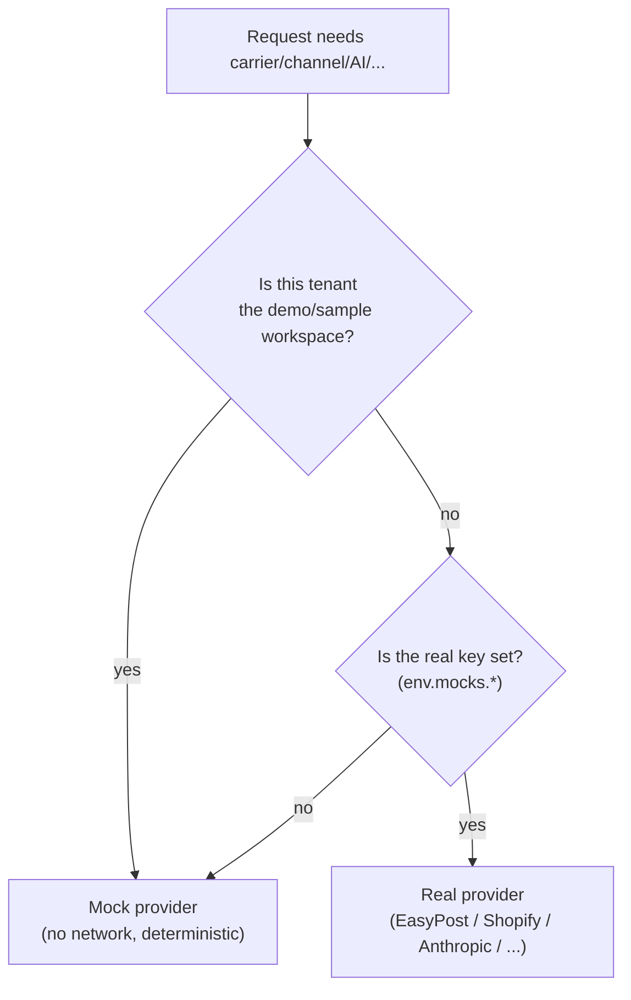

# Lesson 6.3 — Mocks vs. real providers

## 1. In one sentence
Every outward integration in InvAI — carriers, marketplaces, suppliers, billing, AI,
market-signal sources — has a **mock provider** that's picked automatically whenever
the real one's API key is missing, so the whole platform runs end to end with zero
real credentials, and a **demo/sample workspace** is forced onto the mock even when a
real key *is* configured, so a demo can never spend real money or send real data out.

## 2. Why it exists
Building and testing InvAI against nine-plus real providers (EasyPost, Shopify, Etsy,
Amazon, TikTok Shop, Walmart, S&S Activewear, Stripe, Anthropic, OpenAI, Census...)
would mean every developer, every CI run, and every demo needs real accounts and real
keys for all of them, and every test run would risk real side effects: a real label
bought, a real AI dollar spent, a real webhook sent to a marketplace that doesn't
actually have this test order. Instead, InvAI's rule (`CLAUDE.md`): "No real API keys
exist. Every integration has a mock provider, chosen automatically when its key is
missing... Never remove a mock." That last part matters as much as the first: once a
real pilot shop is live and using real keys, the mock still has to exist and still has
to work, because demo workspaces, local development and CI all keep depending on it
forever.

## 3. How it works

### One flag per integration, computed once
`invai-backend/src/env.ts:331-344 env.mocks`, read in full, is the actual source of
truth for "is this integration mocked right now":
```ts
mocks: {
  ai: isTest || (!raw.ANTHROPIC_API_KEY && !raw.OPENAI_API_KEY),
  carrier: !raw.EASYPOST_API_KEY,
  shopify: !raw.SHOPIFY_API_KEY || !raw.SHOPIFY_API_SECRET,
  supplier: !raw.SS_ACTIVEWEAR_ACCOUNT || !raw.SS_ACTIVEWEAR_API_KEY,
  billing: !raw.STRIPE_SECRET_KEY,
  mail: !raw.SMTP_URL,
  census: !raw.CENSUS_API_KEY,
  googleTrends: !raw.GOOGLE_TRENDS_API_KEY,
  pinterest: !raw.PINTEREST_API_KEY,
  jungleScout: !raw.JUNGLE_SCOUT_API_KEY,
},
```
Every one of these is a simple "is the real key present?" check — there's no separate
"mock mode" setting to remember to flip; the platform just notices what credentials
exist. Each integration's own `index.ts` (carriers, channels, billing, ...) reads its
flag and picks an adapter, always behind the same shared interface — `CarrierAdapter`,
`ChannelAdapter`, `BillingProvider` — so calling code never branches on "mock or real"
itself; it just calls `.buy()`, `.createCheckout()`, `.syncOrders()` and gets an answer
either way.

### The demo-tenant override — a second, independent safety net
Every one of the mock switches above has a second check layered on top, and it's worth
noticing the same three integrations all do this the same way:
- Carriers: `invai-backend/src/integrations/carriers/index.ts:13-18` — even with
  `EASYPOST_API_KEY` set, `isSampleWorkspace(scope.companyId)` forces the mock.
- Channels: `invai-backend/src/integrations/channels/index.ts:20, 28-29` — "A sample
  workspace (`tenancy.demo`) always gets the mock, whatever its connection's stored
  [provider setting]."
- AI: `invai-backend/src/ai/gateway.ts:46-54 aiProvider()` — "A sample workspace ...
  never reaches the real model, even when an AI key is set: it always gets the mock
  provider, so it can never spend the platform's key."

This is deliberately *not* the same flag as `env.mocks.*`. `env.mocks.*` asks "does a
key exist anywhere in this environment?" — a yes/no for the whole process.
`isSampleWorkspace()` asks "is *this specific tenant* the demo/sample one?" — a
per-request check. A production deployment with a real `EASYPOST_API_KEY` configured
(so `env.mocks.carrier` is `false` platform-wide) still forces every demo-tenant
request onto the mock carrier, because the per-tenant check runs independently of the
global flag. Two different questions, checked separately, so a bug in one doesn't
remove the other's protection.

### What a good mock actually promises
Reading `invai-backend/src/integrations/billing/mock.ts:1-7`'s own comment is the
clearest statement of what "mock" means in this codebase: "Mock Stripe: no network,
deterministic local URLs back to the web billing page... signed test webhooks still
work." Three properties worth naming explicitly, because they're what separates a
*useful* mock from a stub that merely avoids crashing:
1. **No network call at all** — not "calls a sandbox," but genuinely nothing goes out.
2. **Deterministic** — same input, same output, every time, so tests and demos are
   repeatable.
3. **Shape-compatible all the way through** — a mock checkout still produces something
   a signed webhook handler can process, so the *whole* flow (not just the first step)
   can be exercised locally with no real provider at all.

The trademark judge mock (lesson 7.3 covers this in AI terms) follows the identical
idea: `evals/trademark_judge/run.ts`'s own comment calls it out plainly — "the mock
provider always answers 'possible' for every candidate — a deliberate, documented
placeholder, not a model under test." A mock doesn't have to be *smart*; it has to be
honest about what it is, and consistent enough that the rest of the system built on top
of it can be tested for real.



## 4. In our code
- `invai-backend/src/env.ts:331-344` — `env.mocks`, every integration's mock flag in
  one place.
- `invai-backend/src/integrations/carriers/index.ts:13-18` — the carrier switch and
  the demo-tenant override, same lesson 5.3 walked through for label buying.
- `invai-backend/src/integrations/channels/index.ts:16-29` — the channel-adapter
  switch, with its own doc comment stating the demo-tenant rule.
- `invai-backend/src/ai/gateway.ts:46-54 aiProvider()` — the AI provider switch
  (lesson 7.1 covers this in full, including decision 0021's Anthropic → OpenAI →
  mock order).
- `invai-backend/src/integrations/billing/mock.ts:1-20` — a concrete mock provider,
  with the three properties (no network, deterministic, shape-compatible) visible in
  code.
- `invai-backend/evals/trademark_judge/run.ts` (header comment) — the AI-side version
  of "a mock is an honest placeholder, not a model under test."
- `invai-backend/src/modules/tenancy/demo-flag.ts` — `isSampleWorkspace()`, the
  per-tenant check every one of these mock switches layers on top of `env.mocks.*`.

## 5. What it uses
- **A shared adapter interface per integration** (`CarrierAdapter`, `ChannelAdapter`,
  `BillingProvider`, `AiProvider`) — the actual mechanism that lets calling code stay
  identical whichever provider answers; module 03 covers why InvAI designs integration
  boundaries this way in general.
- **Environment variables as the switch** — no separate config file or admin toggle;
  the presence or absence of a key *is* the switch, checked once at startup in
  `env.ts` and never re-checked per call.
- **A tenant flag (`tenancy.demo`)** — the per-request half of the safety net, read
  through `isSampleWorkspace()`, independent of what keys the environment has.

## 6. Try it yourself
1. Run `grep -n "mocks\." invai-backend/src/env.ts` and count how many integrations
   are listed. For two of them, find the corresponding `index.ts` (or equivalent) under
   `invai-backend/src/integrations/` and confirm each reads its own flag, not a
   different one.
2. Read `invai-backend/src/integrations/billing/mock.ts` in full (it's short) and find
   the line that builds a fake checkout session id (`cs_mock_...`). Compare it with
   how a real Stripe checkout session id looks (the adapter's real counterpart, same
   folder) — notice the mock's id is still a *plausible-looking* string, which matters
   for any code downstream that parses or logs it.
3. Start the local stack (`cd invai-infra && pnpm dev:all`) with no `EASYPOST_API_KEY`
   or `ANTHROPIC_API_KEY`/`OPENAI_API_KEY` set (the default local setup), sign in as
   `owner@desertbloom.test`, and buy a label or run an AI listing draft through the UI.
   Nothing about the experience should look broken — that's the whole point of a mock.

## 7. Common mistakes
- Removing a mock once a real key exists "because we don't need it anymore." The
  CLAUDE.md rule is explicit — "Never remove a mock" — because demo workspaces, local
  development without that particular key, and CI all keep depending on it for the
  life of the project, long after a real pilot shop goes live.
- Checking only `env.mocks.*` and forgetting the per-tenant override, or vice versa.
  They answer different questions (environment-wide vs. this-specific-tenant) and a
  new integration needs both checks, independently, the way carriers/channels/AI all
  do — one check alone leaves a gap the other was specifically there to close.
- Writing a mock that's "close enough" rather than shape-compatible end to end. A mock
  checkout that can't produce a webhook the real handler can process doesn't actually
  let you test the whole flow locally — it just moves the untested gap one step later.

## 8. Check yourself
<details>
<summary>1. A production environment has a real `EASYPOST_API_KEY` configured. Why
would a request from the demo/sample tenant still use the mock carrier?</summary>

Because the carrier adapter checks two independent things: `env.mocks.carrier` (is a
real key configured platform-wide?) and `isSampleWorkspace(companyId)` (is *this*
tenant the demo one?). The key being present only answers the first question; the
demo-tenant check runs regardless and forces the mock for that one tenant no matter
what keys exist.
</details>

<details>
<summary>2. What three properties does a well-built mock provider in this codebase
have, based on the billing mock's own comment?</summary>

No network call at all, deterministic output for the same input, and shape
compatibility all the way through the flow (a mock checkout still produces something a
real webhook handler can correctly process) — not just "doesn't crash."
</details>

<details>
<summary>3. Why is each integration's mock flag (`env.mocks.ai`, `env.mocks.carrier`,
...) computed once in `env.ts` from whether a key exists, rather than as an explicit
`USE_MOCK_CARRIER=true` setting someone has to remember to set?</summary>

So there's nothing extra to configure or forget: the same missing-key state that would
otherwise make the integration simply fail is what automatically and silently switches
it to the mock. A developer or CI run with no keys at all gets a fully working platform
with zero setup, and a real key, once added, switches the integration back to real with
no code change.
</details>

## 9. Words to know
- **Mock provider** — recapped from the glossary: a deterministic stand-in for a real
  external integration, auto-selected when its key is missing, shape-compatible enough
  that the whole flow built on top of it can be exercised for real.
- **Adapter** — the shared interface an integration's real and mock implementations
  both satisfy (e.g. `CarrierAdapter`), so calling code never branches on which one it
  got.
- **Sample / demo workspace** — a tenant flagged (`tenancy.demo`) as a demo, forced
  onto every mock provider regardless of what real keys the environment has, so it can
  never spend real money or leak real data.
- **`ALLOW_MOCKS`** — a production-only escape hatch (seen in `env.ts`) letting a
  demo/staging deployment boot on mock providers even in a "production" environment;
  normal production refuses to boot with any required real key missing unless this is
  explicitly set.
