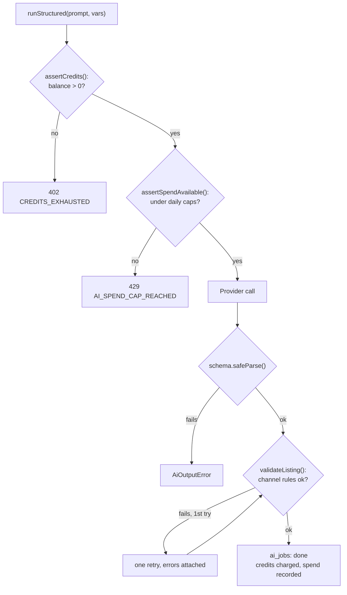

# Lesson 7.2 — Prompts, validators, and keeping AI spend in check

## 1. In one sentence
Every AI prompt is a versioned, stable object with a Zod output schema; the model's
answer is checked against that schema *and then* against InvAI's own deterministic
business rules (Etsy's title length, Amazon's bullet count...); and every call is
metered twice over — a per-shop credit ledger and a daily spend-cap "breaker" — so a
runaway loop or a leaked key can't produce an unbounded bill.

## 2. Why it exists
A model's raw answer is just text generation — fluent, often correct, but not provably
correct. Three different kinds of "not correct" need three different defenses: the
model might return something that isn't even valid JSON (a schema check catches this);
it might return valid JSON that still breaks a hard platform rule, like a 200-character
Etsy title when Etsy's real limit is 140 (a second, deterministic check catches this,
because asking the model to "please remember the character limit" isn't a guarantee);
and even a perfectly well-formed answer still costs real money per call, so without a
hard ceiling, a bug that calls the model in a loop — or someone else's stolen API key —
could run up an unbounded bill before anyone notices.

## 3. How it works

### Prompts are versioned, cacheable objects, not inline strings
`invai-backend/src/ai/prompts/index.ts:7-10 PromptDef`:
```ts
export type PromptDef<V, O> = {
  id: string;
  version: number;
  route: AiRoute;
  system: string;
  user: (vars: V) => string;
  schema: z.ZodType<O>;
};
```
The header comment explains the two parts' different jobs: "Each prompt has a stable
`system` prefix (cached with `cache_control`: channel rules, style guide) and a `user`
renderer for the varying part, which always goes last." Putting the stable, reusable
instructions first and the request-specific content last is exactly what makes prompt
caching work (both Anthropic and OpenAI price a cached prefix far cheaper than a fresh
one — see `tokensToCostCents` below). `version` exists so `ai_jobs` can record exactly
which wording of a prompt produced a given answer (`promptId@version`) — if a prompt's
text changes and quality shifts, there's a paper trail connecting the two.

### Per-route model and effort, in one table
`invai-backend/src/ai/models.ts:27-39 ROUTES` is the single place every Claude route's
model and "thinking effort" live — `trademark_judge` runs at `effort: "low"` (a
narrower judgment call, each one cheap), `assistant` at `"high"` (the hardest, most
open-ended task), and the bulk `market_niche` route runs on `HAIKU_MODEL` with no
effort at all, because it's "one-label niche classification run by the nightly
mapper," not something that needs deep reasoning per call. `OPENAI_ROUTES`
(`:62-70`) mirrors this one-to-one for the OpenAI provider — same five routes, OpenAI's
own model ids, effort translated directly (`"low"→"low"`, Haiku's `null` effort →
Luna's `"none"`). Changing a route's model or effort, per the file's own comment, is "a
one-line change here, after an eval shows equal quality" — lesson 7.3 covers exactly
what that eval check looks like.

### Two layers of checking the model's answer
1. **Schema-valid** — every provider parses the raw answer with `prompt.schema`
   (lesson 7.1); an answer that isn't shaped right never leaves the provider layer.
2. **Rule-valid** — schema-valid doesn't mean *platform-rule*-valid. A listing title
   can be a perfectly well-formed string and still be 200 characters when Etsy's real
   limit is 140. `invai-backend/src/ai/validators/listing.ts` is where InvAI's own
   deterministic rules live, read straight from the contract's `CHANNEL_RULES`
   (shared with web and backend, so there's exactly one place a channel's limits are
   defined) — title/description/tag/bullet limits per channel, Etsy's own banned
   characters (`ETSY_TITLE_BAD`), even Etsy's style guidance against spammy ALL-CAPS
   words and repeated phrases, each with a citation to Etsy's own Seller Handbook page
   and a Wayback-machine snapshot date, because "Etsy's guidance says X" is a claim
   worth being able to prove later.

`invai-backend/src/modules/ai/service.ts:447` describes what happens when the rule
check fails: "when rules are broken, exactly one retry with the errors attached." The
code at `:479-490` shows this concretely — `validateListing()` runs, and if it finds
violations, the *specific validation errors* are fed back into a second call to the
same prompt, so the model gets a concrete "here's what was wrong" instead of being
asked to guess again from scratch. One retry, not an unbounded loop — if the second
attempt still breaks a rule, that's surfaced rather than retried forever.

### Cost: a per-shop ledger, and a daily "breaker" on top
Two different limits answer two different questions:
- **"How many AI credits does this shop have left this month?"** —
  `invai-backend/src/ai/credits.ts creditBalance()` combines the shop's plan allowance
  with any purchased credit packs, minus usage already recorded, and `assertCredits()`
  throws `CREDITS_EXHAUSTED` (HTTP 402) before a call is even attempted once a shop's
  balance hits zero. This is the *primary*, per-tenant limit — a shop simply can't use
  more AI than its plan allows.
- **"Is total spend, across everyone, or for one shop today, higher than it should
  ever be?"** — `invai-backend/src/ai/breaker.ts`, whose header comment calls this
  out directly as "the backstop against a runaway loop or a leaked key," distinct from
  the credit ledger above it. Two Valkey counters per day — one platform-wide, one per
  tenant — are checked with `assertSpendAvailable()` before every *real* (non-mock)
  call, and bumped by `recordSpend()` after. Hitting either cap throws
  `AI_SPEND_CAP_REACHED` and raises a critical alert the first time that happens each
  day. Crucially, the comment notes this check **fails open** on a Valkey outage —
  logged, with a critical `ai_breaker_fail_open` alert — "the credit check has already
  run... anyway" — meaning the breaker is a belt-and-suspenders layer on top of the
  credit check, not the only thing standing between a bug and an open-ended bill.

Pricing itself lives in one table, `models.ts:126 MODEL_PRICES` — the comment at `:117`
is blunt about why: "No model price is hard-coded outside this table:
`tokensToCostCents` below only reads from it." One place to update when a provider's
list price changes, and one place that can be checked against an eval's cost-per-call
numbers (lesson 7.3).



## 4. In our code
- `invai-backend/src/ai/prompts/index.ts:1-17` — `PromptDef`'s header comment and
  shape.
- `invai-backend/src/ai/models.ts:1-4, 27-39, 62-70, 126` — the module's own comment,
  `ROUTES`, `OPENAI_ROUTES`, `MODEL_PRICES`.
- `invai-backend/src/ai/validators/listing.ts:1-11, 31-39` — the header comment and
  Etsy's cited style rules.
- `invai-backend/src/modules/ai/service.ts:447, 479-490` — the one-retry-with-errors
  loop around `validateListing()`.
- `invai-backend/src/ai/credits.ts:16-45` — `creditBalance()`, `assertCredits()`,
  `creditsExhausted()`.
- `invai-backend/src/ai/breaker.ts:1-20` (header comment), `:63-90`
  (`assertSpendAvailable()`), `:93-107` (fail-open alerting) — the daily spend breaker.

## 5. What it uses
- **Zod** — the schema every prompt declares its output as, and the mechanism
  `validateListing` ultimately feeds its errors back through (the retry's `vars`
  include the validation errors as plain structured data, not free text).
- **`@invai/contracts`'s `CHANNEL_RULES`** — the single source of per-channel limits
  the listing validator checks against, shared with whatever UI shows those same
  limits to a shop.
- **Valkey (MGET/INCRBY)** — backs both the daily spend breaker's counters and (via
  `lib/queues.ts`'s `redis` client) the same connection used for jobs and rate limits.
- **`ai_jobs` / `ai_credit_ledger` tables** — the durable record every call writes to,
  which is what a shop's own credit balance and InvAI's own cost reporting are
  computed from.

## 6. Try it yourself
1. `grep -n "effort:" invai-backend/src/ai/models.ts` and compare `trademark_judge`'s
   effort with `assistant`'s. Given what each route actually does (judging one
   candidate match vs. holding an open-ended conversation with tools), does the
   difference make sense to you?
2. Read `invai-backend/src/ai/validators/listing.ts`'s `allCapsWords()` and
   `ETSY_ALL_CAPS_MAX` (around `:31-47`). Work out by hand whether the title "InvAI DTF
   Gang Sheet BUILDER for XL Shirts" would trip the all-caps check, and why (which
   words count, and which are exempted).
3. Run `cd invai-backend && pnpm vitest run src/ai/breaker.test.ts --reporter=dot` and
   read the test names — find the one that proves the breaker fails open when Valkey
   is unreachable, and the one that proves it still raises an alert when it does.

## 7. Common mistakes
- Trusting schema-valid output as "correct" output. A model can return a perfectly
  well-formed `ListingCopy` object that still violates Etsy's actual title length —
  the schema only proves the *shape* is right, never the platform rule.
- Retrying a failed validation in an unbounded loop "until it passes." The actual
  pattern here is exactly one retry with the specific errors attached — if the model
  still can't satisfy the rule on a second, better-informed try, that's a real failure
  to surface, not something to keep hammering at (which would also just keep spending
  money).
- Treating the per-tenant credit ledger and the daily spend breaker as redundant.
  They're deliberately two separate mechanisms answering two separate questions — "is
  this shop within its plan" vs. "is something going wrong platform-wide, like a leaked
  key" — and the breaker's own comment calls out explicitly that it exists *in
  addition to*, not instead of, the credit check.

## 8. Check yourself
<details>
<summary>1. A listing-copy call returns a `ListingCopy` object that parses cleanly
against its Zod schema, but the title is 180 characters on a channel whose limit is
140. What happens?</summary>

The schema check passes (the shape is right), but `validateListing()` catches the
length violation as a rule failure. The gateway/service retries exactly once, passing
the specific validation errors back into the prompt, and re-validates the second
answer. It does not retry a second time even if the new answer still fails.
</details>

<details>
<summary>2. Why does the AI spend breaker check "fail open" (allow the call) when
Valkey doesn't answer in time, rather than blocking the call?</summary>

Because the per-tenant credit check (`credits.ts`) has already run by that point and
is the primary limit; the breaker is explicitly a backstop, not the only safety net.
Blocking every AI call platform-wide because of a Valkey blip would be a worse outcome
than letting calls through (still logged and alerted) while a genuinely separate
system is down.
</details>

<details>
<summary>3. Why does `MODEL_PRICES` live in exactly one table instead of each route
computing its own cost inline?</summary>

So there is one place to update when a provider changes its list price, and one place
whose numbers can be checked against reality (an eval's real cost-per-call, or a
monthly cost review) — scattering price math across every route would make a stale
price easy to miss in some of them and not others.
</details>

## 9. Words to know
- **Prompt (in this codebase)** — a versioned `PromptDef` object: a stable `system`
  prefix, a `user` renderer for the varying part, and a Zod output schema, not just an
  inline string.
- **Prompt caching** — a provider pricing a reused, identical prefix of a prompt far
  cheaper than fresh tokens; InvAI's prompts are structured (stable text first,
  variable content last) specifically to take advantage of this.
- **Validator (AI)** — deterministic code that checks a model's already schema-valid
  answer against InvAI's own hard business rules (channel limits, banned characters),
  separate from and in addition to the schema check.
- **Credit ledger** — the per-shop, per-billing-period record of AI usage against a
  plan's allowance; the primary limit on how much AI a shop can use.
- **Spend breaker** — the platform-wide and per-tenant daily dollar caps that sit on
  top of the credit ledger as a backstop against a runaway loop or a leaked key.
- **Reasoning effort** — a per-call setting (`low`/`medium`/`high`, or none) that
  trades more "thinking" for quality against more tokens (and cost) per call.
