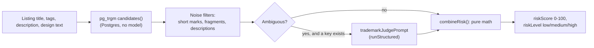

# Lesson 7.3 — The trademark check, the assistant, and proving quality with evals

## 1. In one sentence
The trademark-risk check combines fast, deterministic text matching with an optional
AI judgment call on the ambiguous cases; the shop assistant is an AI model given a set
of read-only tools over a shop's own real data; and neither one's quality is trusted
on faith — both are measured by an **eval set**, a fixed list of known-answer cases run
through the real gateway, with the current numbers frozen in `evals/baseline.json`.

## 2. Why it exists
"The AI said it's fine" is not a defensible standard for a feature that's explicitly
*not* legal advice but still has to meaningfully protect a shop from publishing a
listing that infringes a real trademark. The trademark check's answer has to be mostly
explainable — most matches don't need a model's judgment at all, they're just text
similarity against a known list of marks. And whenever a prompt, model, or route
configuration changes — including adding a whole second provider (lesson 7.1) — there
has to be a way to know, with actual numbers, whether quality held, improved, or
quietly got worse, instead of just trusting that nothing broke.

## 3. How it works

### Trademark risk: mostly deterministic, judgment only where it's ambiguous
`invai-backend/src/modules/ai/trademark.ts:16-18`, the module's own header comment:
"pg_trgm word similarity + whole-word matching of the title, tags, description and
design text against the global class-25 `trademark_marks` index. Claude judges the
ambiguous hits only when an API key is configured. A risk score, not legal advice."
Three layers, in order:
1. **Find candidates** (`candidates()`, `:72-82`) — a Postgres query using `pg_trgm`'s
   `word_similarity()` plus a plain whole-word `LIKE` check against a reference table
   of known marks, limited to class 25 (clothing) marks, returning up to 25 hits.
2. **Score each match, with care about noise** (`checkTrademarks()`, `:94-120`) — a
   match only counts if it's an exact whole-word hit, *or* it clears real thresholds:
   the comment at `:106-108` spells out the specific noise this guards against —
   "Very short marks ('lee', 'vans') only count as whole words; fuzzy hits need
   substance... no short or fragment-y marks... and never from long prose
   (descriptions), where trigram noise is high." A five-letter mark fuzzy-matching
   inside a paragraph of marketing copy is exactly the kind of false positive this is
   built to reject.
3. **Combine match risks into one score** (`combineRisk()`, `:56-64`) — pure math, no
   DB or model call: `1 - product of (1 - risk_i)` across every match, so several
   weak matches can still add up to a meaningful combined risk, the same way
   independent probabilities compound.

Only the genuinely ambiguous matches — not the loud, obvious ones, and not everything
— go to Claude (or OpenAI) for a judgment of `conflict` / `possible` / `unrelated`,
through `trademarkJudgePrompt` (lesson 7.2's `runStructured`). `matchRisk()`
(`:40-48`) folds that judgment back into the score: a `"conflict"` judgment floors the
risk at 0.9 regardless of how fuzzy the text match was; `"unrelated"` cuts it by 90%.

### The assistant: a model with read-only tools, scoped to one shop
The chat assistant doesn't get free-form access to a shop's database — it gets a list
of named, typed tools, each one a narrow, read-only function.
`invai-backend/src/modules/ai/assistant-tools.ts:107-135 assistantTools()` shows the
shape every tool takes:
```ts
t(
  "get_profit",
  "True profit (revenue minus channel fees, blanks, transfers, labels, packaging, " +
    "labor, ads and refunds) for a period, grouped by order, design, blank, channel or day...",
  Range.extend({ dimension: z.enum([...]), channel: z.enum(CHANNELS).optional() }),
  async (i) => { /* withTenant(ctx.companyId, ...) */ },
)
```
Three things worth noticing: the tool's *description* is itself written carefully
enough to tell the model exactly what the number means (lesson 5.3's `Buckets`
vocabulary, almost verbatim) — a vague description produces a model that uses the
tool wrong. The tool's own `run()` opens `withTenant(ctx.companyId, ...)` — every tool
is scoped to the one shop the assistant is answering for, by construction, not by the
model being asked nicely to stay in scope. And the `t()` helper (`:108-115`) wraps
every tool's handler with a shared range-validation guard before it ever runs — a
structural check applied once, instead of each tool remembering to validate its own
date range.

Lesson 7.1 already covered how a tool's *result* gets isolated once it comes back
(`isolateToolResults()`, wrapped as untrusted data). One more market-specific
protection lives in the tool output type itself:
`invai-backend/src/ai/providers/types.ts:30-33 ToolOutput.forbiddenTerms` — "Terms the
answer must not repeat (a trademark-screened niche the user named). Read by the
gateway's answer check and stripped before the result reaches the model or the web." A
market tool that found a trademark-risky niche term can mark it `forbiddenTerms`, and
the gateway enforces that the assistant's *own answer* never repeats it back —
protection that doesn't depend on the model choosing to comply.

### Evals: a fixed set of known-answer cases, run through the real gateway
`invai-backend/evals/run.ts`'s own comment is the clearest description of what this
actually is: "One eval set per AI route, run through the real gateway... against a
throwaway tenant." Every route — `listing_copy`, `trademark_judge`, `assistant`,
`personalization_check`, `digest_narrative` — has its own `cases.jsonl` file, one case
per line, each with `vars` (the input) and `expect` (what a correct answer looks
like). A trademark case, for example:
```json
{"id":"tm-001","tags":["known_mark"],"vars":{"text":"Just Do It vintage tee...",
 "candidates":[{"mark":"JUST DO IT","owner":"Nike","kind":"slogan",...}]},
 "expect":{"judgement":["conflict","possible"]}}
```
Two different things get checked, and the comment in `trademark_judge/run.ts` is
explicit about the difference: **plumbing** (did the call produce a schema-valid
answer, with the right number of judgments, with the mark string unchanged?) is
checkable even against the mock, because the mock always exists and always answers in
a fixed way. **Quality** (did it actually get the judgment right?) is a real signal
*only* when a real key is configured — the mock "always answers 'possible' for every
candidate — a deliberate, documented placeholder, not a model under test." Running
`pnpm evals` with no key configured (every CI run, by default) checks the plumbing
every time; running it with a key checks quality.

`evals/lib/mode.ts evalMode()` mirrors the gateway's own provider order exactly
(decision 0021: Anthropic, else OpenAI, else mock) — so an eval run always tells you
which provider actually produced the numbers you're looking at, something decision
0021 leans on directly: "Before a real shop uses OpenAI, the owner runs `pnpm evals`
in openai mode and the ai-engineer compares it with the Claude baseline" against
named gates (from the `model-upgrade` skill): "no drop on risk tags (known marks,
evasions, injection, PII refusal); overall within 2 points or better" — a concrete,
checkable bar, not a feeling that the new provider "seems fine."

`evals/baseline.json` is the frozen record of the *last* measured run — generated with
`pnpm evals --json <path>`, and compared against on the next run so a quality
regression shows up as a number going down, not as a vibe.



## 4. In our code
- `invai-backend/src/modules/ai/trademark.ts:16-18, 40-48, 56-64, 72-82, 94-120` —
  the full deterministic-plus-judgment pipeline.
- `invai-backend/src/modules/ai/assistant-tools.ts:107-135` — `assistantTools()`,
  the `t()` wrapper, a real tool (`get_profit`) end to end.
- `invai-backend/src/ai/providers/types.ts:15-33` — `AssistantTool`, `ToolOutput`,
  `forbiddenTerms`.
- `invai-backend/evals/run.ts` (header comment), `invai-backend/evals/lib/mode.ts` —
  the harness entry point and the provider-order mirror.
- `invai-backend/evals/trademark_judge/run.ts:1-21` (header comment),
  `invai-backend/evals/trademark_judge/cases.jsonl` — a concrete eval set.
- `invai-backend/evals/baseline.json` — the frozen last-measured numbers.
- `.claude/skills/model-upgrade` (steps 3, 5-6) — the hypothesis/compare/gate
  procedure any model or route change goes through.
- `invai-docs/decisions/0021-openai-provider.md` ("Quality is unproven") — the exact
  gate OpenAI has to clear before a real shop can use it.

## 5. What it uses
- **pg_trgm** (Postgres extension) — trigram-based fuzzy text similarity, the
  mechanism `word_similarity()` runs on; module 03/04 cover Postgres extensions in
  general.
- **A reference table of known marks** (`trademark_marks`, class 25 only) — the data
  the deterministic layer matches against before any model is ever called.
- **JSONL eval case files** — a simple, diffable, one-case-per-line format, easy to
  add a new known-tricky case to without touching any code.
- **Zod** — the same schema mechanism from lesson 7.2 governs the assistant tools'
  own input (`z.ZodObject` per tool) as well as every prompt's output.

## 6. Try it yourself
1. Read `invai-backend/src/modules/ai/trademark.ts`'s `candidates()` SQL (around
   `:72-82`) and find the `kind <> 'generic'` and `status = 'live'` filters. What do
   you think each one is protecting against? (Hint: a generic term like "shirt" would
   otherwise fuzzy-match almost everything.)
2. `grep -n '"id":' invai-backend/evals/trademark_judge/cases.jsonl` and pick one case
   tagged something other than `known_mark` (if there is one) — read its `vars` and
   `expect` and decide for yourself whether the expected judgement makes sense given
   the text.
3. Run the plumbing check locally with no AI key configured:
   `cd invai-backend && pnpm evals trademark_judge` — confirm every case reports
   `plumbingPass` while `qualityPass` stays `null` (the mock mode the output describes
   in lesson 6.3).

## 7. Common mistakes
- Trusting an AI judgment alone for trademark risk, with no deterministic layer first.
  The actual design filters *before* any model call — most matches are resolved by
  text similarity and whole-word rules, and the model is reserved for the genuinely
  ambiguous remainder, which both controls cost and keeps the obvious cases fast and
  explainable.
- Giving the assistant a broad "query the database" tool instead of narrow, named,
  read-only tools. Every real tool here is scoped by `withTenant` at the handler level
  and described precisely enough that the model can't misuse it by accident — a
  general-purpose query tool would need to re-derive all of that safety per call
  instead of having it built in once.
- Reading "the mock always passes the eval" as evidence of quality. The trademark
  mock's own comment calls this out directly: it's a documented placeholder that
  proves the plumbing, not the model's judgment — only a run with a real key measures
  quality at all.

## 8. Check yourself
<details>
<summary>1. A listing's description contains the word "vans" inside a long paragraph
of marketing copy, fuzzy-matching a registered mark at 70% similarity. Does this
produce a trademark match?</summary>

No. The noise filter explicitly excludes short marks like "vans" from fuzzy matching
(they only count as an exact whole-word hit) and separately excludes the
`description` source from fuzzy matching altogether, specifically because trigram
noise is high in long prose.
</details>

<details>
<summary>2. Why does every assistant tool's `run()` open its own `withTenant(ctx.companyId,
...)` transaction, rather than the assistant itself being handed one shared,
pre-scoped database connection?</summary>

So tenant scoping is enforced structurally at the one place every tool's logic
actually touches the database, by construction, rather than depending on the model (or
a future tool author) to remember to scope a shared connection correctly every time.
</details>

<details>
<summary>3. The ai-engineer wants to switch the `assistant` route from Claude Opus to
a cheaper model. What has to happen before that ships, per the `model-upgrade`
skill?</summary>

Run the route's eval set on both the old and new model, compare pass rate, recall on
risk tags, injection pass rate, cost and latency, and check the result against the
named gates (no drop on risk tags, injection pass rate stays 100%, overall within 2
points) — a failed gate means no change, recorded either way.
</details>

## 9. Words to know
- **Eval (evaluation set)** — a fixed list of known-answer cases (`cases.jsonl`), run
  through the real gateway, used to measure an AI route's quality with actual numbers
  instead of a feeling.
- **Plumbing vs. quality (eval sense)** — plumbing is "did the system wire this
  correctly" (schema-valid, right cardinality), checkable even against the mock;
  quality is "did the model get the right answer," checkable only with a real
  provider.
- **Baseline** — the frozen last-measured eval result (`evals/baseline.json`),
  compared against to catch a quality regression.
- **pg_trgm** — a Postgres extension providing trigram-based fuzzy text similarity,
  used here to find candidate trademark matches before any AI call.
- **Tool (assistant)** — a named, typed, read-only function the chat assistant can
  call, each scoped to one tenant and described precisely enough to use correctly.
