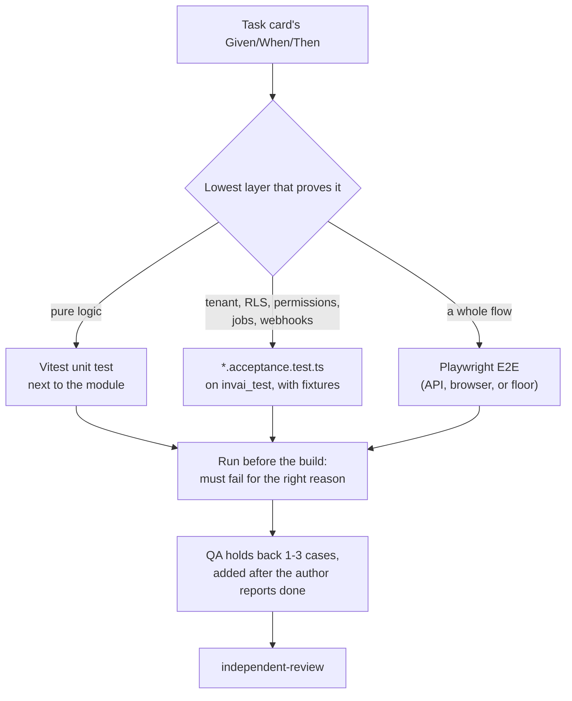

# Lesson 8.1 — Tests in layers

## 1. In one sentence
InvAI picks the *lowest* test layer that can actually prove a given behavior — plain
unit tests for pure logic, tenant-scoped service tests for anything touching the
database or permissions, and end-to-end (E2E) Playwright tests only for whole flows —
so most tests stay fast and cheap, and the few that have to be slow and real are the
ones that genuinely need to be.

## 2. Why it exists
Every behavior *could* be tested with a full browser-driven E2E run, hitting the real
API, real database, real everything. That would also be an extremely slow, extremely
flaky way to find out that a money-splitting function rounds wrong — a pure function
bug doesn't need a browser to prove. The opposite mistake is just as real: a unit test
that mocks the database can prove a function's logic is right while missing that the
*wiring* around it — RLS, a permission check, a webhook's actual HTTP shape — is
broken. The fix isn't "test more" or "test less," it's matching each behavior to the
layer that actually exercises the thing that could go wrong.

## 3. How it works

### The layer table, and what each layer is actually for
The `acceptance-tests-first` playbook states the rule InvAI's whole test suite is
organized around:

| Behavior | Layer | Where |
|---|---|---|
| pure logic: state machines, money, ship-by, matchers, SKU rules | Vitest unit | next to the module, `*.test.ts` |
| service under a tenant, RLS, permissions, jobs, webhooks, S3 | Vitest on `invai_test` | `src/modules/<area>/<slug>.acceptance.test.ts`, using `src/test/fixtures.ts` |
| a whole API flow across modules | Playwright API | `invai-web/e2e/` |
| a screen flow | Playwright browser | `invai-web/e2e/` |
| a floor flow (scan, PIN, block) | Playwright tablet | `invai-floor/e2e/` |
| nesting, rendering, file checks | pytest | `invai-imaging/tests/` |

Each row answers "what's actually being proven here." A **unit test** proves a pure
function returns the right output for a given input — `profit.ts`'s `allocate()`
(lesson 5.3) is exactly this kind: no database, no tenant, just "does this math work."
A **tenant-scoped acceptance test** proves something a unit test structurally *can't*:
that a real request, as a real role, inside a real `withTenant` transaction, with real
RLS turned on, behaves correctly — including the refused cases (another tenant's id,
a role without the permission). An **E2E test** proves the layers actually connect:
that the browser's request really reaches the backend, really hits the database,
really comes back and renders.

### Why acceptance tests exist as their own file, not inside the implementer's tests
`invai-backend/src/test/fixtures.ts` is the shared toolkit every tenant-scoped test
builds on: `createCompany()`, `createUser()`, `createLocation()`, `createStation()`,
`createConnection()`, `createOrder()`, and `tenantContext()` to get a scoped context
for a given role. The `acceptance-tests-first` playbook's rule is specific about who
writes what: acceptance-test files (`e2e/**`, every `*.acceptance.test.ts`) are
**QA-owned and read-only for the implementer**, even when the file sits inside a
module folder the implementer otherwise owns. The reasoning is direct: tests written
*from the spec*, before the implementation exists, catch things a test written *after*
the code (and shaped to match whatever the code already does) cannot. An implementer
who disagrees with an acceptance test reports it — they don't edit it themselves.

### Writing a criterion as a test, not just "more tests"
Every card's Given/When/Then acceptance criteria becomes one `describe`, one
`it`/`test` per criterion, named after the criterion itself — `"AC2: replaying QC pass
with the same clientScanId writes no transition"` is the playbook's own example. That
naming matters later: when a reviewer re-runs the suite, a failing test's name alone
says which specific acceptance criterion broke, not just "something in this module."

Every acceptance test, per the same playbook, always includes a specific checklist,
not left to each author's judgment: the happy path on realistic seed-shaped data; the
refused cases (another tenant's id → `NOT_FOUND`, a role without the permission →
`FORBIDDEN`); replay of the same webhook/scan/job/label request twice, checking for
exactly one effect (lesson 6.1's idempotency, proven at the test layer); the specific
states the criterion names (cancelled, on-hold, needs-mapping, a reprint); and money
in integer cents / sizes in unrounded inches in every assertion (module 04's
conventions, enforced by the tests that check them, not just by habit).

### Red first — a test that fails for the right reason
`acceptance-tests-first` step 6 is blunt about what counts as proof a test is doing
its job: run the new tests *before* the feature is built, and each one must fail "on a
missing behavior (for example `NOT_IMPLEMENTED`, wrong state, missing row), not on a
typo, an import error or a missing fixture." A test that already passes on the old
code "is either a wrong test or an already-met criterion" — either way, that's worth
knowing *before* a wave's work starts, not discovered afterward. The suite is marked
to stay honest in the meantime too: `it.fails(...)` / `test.fail(...)`, with a comment
like `// T-<n>-<k>: remove .fails when the card lands` — never `.skip`, because a
skipped test hides silently where a failing-expected test flips green (visibly) the
moment the real behavior lands, which is itself the signal to remove the marker.

### Held-back cases — proof the implementer didn't just pass the tests they could see
One detail worth sitting with: QA deliberately keeps 1–3 extra test cases *out of* what
the implementer sees — "the edge cases most likely to be missed: a second tenant, an
off-by-one on a boundary, a replay after a crash, Spanish text overflow, a mock
provider error" — stored outside the repo entirely, in QA's own agent memory, and only
added to the suite *after* the author reports the card done. This is specifically
designed to catch a different failure mode than "the implementer wrote buggy code": it
catches an implementer who wrote code that satisfies exactly the visible tests and
nothing more — a real risk whenever an agent (or a person) can see the whole test
suite ahead of time.

## 4. In our code
- `invai-docs/team/skills/acceptance-tests-first/SKILL.md` — the full layer table,
  the held-back-cases rule, the red-first rule.
- `invai-backend/src/test/fixtures.ts:36-100, 162` — `truncateAll`, `createCompany`,
  `createUser`, `createLocation`, `createStation`, `createConnection`, `createOrder`,
  `tenantContext`, the shared toolkit every acceptance test is built from.
- `invai-backend/src/modules/finance/profit.ts` — lesson 5.3's example of pure logic
  worth a plain unit test, no database involved.
- `invai-backend/src/modules/ai/market.acceptance.test.ts`,
  `publish.acceptance.test.ts` — real `*.acceptance.test.ts` files, named by what
  they prove, in a module the ai-engineer otherwise owns.
- `invai-web/e2e/api-golden-path.spec.ts:55-454` — thirteen numbered, named tests,
  each one a step of the golden path, each name describing the behavior it proves
  (lesson 8.2 covers this file as the E2E layer in full).

## 5. What it uses
- **Vitest** — the test runner for every TypeScript repo's unit and acceptance
  layers; module 03 covers why this over alternatives in general.
- **`invai_test`** — a real, separate Postgres database (not a mock) that acceptance
  tests run against, with RLS genuinely turned on, so a permission or tenancy bug
  shows up the same way it would in production.
- **Playwright** — the E2E layer across `invai-web` and `invai-floor`; lesson 8.2
  covers it directly.
- **`it.fails`/`test.fail`** (Vitest/Playwright) — the "expected to fail for now"
  marker that keeps a red-first test visible in the suite without blocking CI
  prematurely.

## 6. Try it yourself
1. Open any two files: `invai-backend/src/modules/finance/profit.ts` (a `.test.ts`
   sits next to it) and `invai-backend/src/modules/ai/market.acceptance.test.ts`.
   Without reading either file's contents in depth, guess from their names and paths
   alone which one needs a real database to run, and why — then check your guess
   against the acceptance-tests-first layer table.
2. `grep -n "createOrder\|tenantContext" invai-backend/src/modules/ai/market.acceptance.test.ts
   | head -5` and see how a test actually sets up a realistic tenant before it starts
   asserting anything.
3. Pick one test name from `invai-web/e2e/api-golden-path.spec.ts` (e.g. `"3. an
   unmapped SKU is mapped with a saved rule and becomes ready"`) and read just that
   one `test(...)` block. Identify which parts of it are "happy path" and which (if
   any) check a refused or edge case.

## 7. Common mistakes
- Writing a unit test for something that needs RLS or permissions to be meaningfully
  tested. A mocked database can make a permission-check function return `true` or
  `false` on command — it can't tell you whether the real RLS policy actually blocks a
  cross-tenant query. That's what the acceptance-test layer, against a real database,
  is specifically for.
- Writing a new acceptance test directly inside the file the implementer owns, instead
  of its own `*.acceptance.test.ts`. The ownership split (QA-owned, implementer
  read-only) exists specifically so an implementer can't quietly soften a test they
  disagree with — they have to raise it instead.
- Treating a test that already passes before the feature is built as a win. The
  `acceptance-tests-first` rule calls this out directly: it almost always means the
  test isn't actually exercising the new behavior, or the criterion was already met —
  either way, worth knowing before building starts, not after.

## 8. Check yourself

1. A card's acceptance criterion is "a presser at shop B scanning shop A's
transfer id gets NOT_FOUND, not the transfer's data." Which test layer proves this,
and why can't a unit test prove it?

The tenant-scoped acceptance test layer (`*.acceptance.test.ts` on `invai_test`),
because this is specifically an RLS/tenancy behavior — it depends on a real database
with real RLS policies enforcing the boundary between two real tenants. A unit test
with a mocked database has no RLS to test against; it could only assert that some
function returns `NOT_FOUND` given inputs the test itself chose, which proves nothing
about whether the real database boundary holds.

2. Why are 1–3 test cases deliberately held back from the implementer and
added only after they report the card done?

To catch a different failure mode than "the code has a bug": an implementer (human or
agent) who can see every test in advance might write code that satisfies exactly those
visible cases and nothing more. Held-back cases specifically target the edge cases most
likely to be missed, so they're a check on *coverage*, not just correctness against a
known set.

3. A new acceptance test is written and it passes immediately, before any
new code is written for the card. What does the acceptance-tests-first playbook say
this means?

Either the test is wrong (not actually testing the new behavior) or the criterion was
already met by existing code — either way, QA is supposed to say which, rather than
treat an immediately-green test as proof the work is already done.

## 9. Words to know
- **Unit test** — a test of a pure function's logic in isolation, no database, no
  network, no tenant context.
- **Acceptance test (InvAI sense)** — a Vitest test against a real `invai_test`
  database, through real tenant fixtures, proving one specific Given/When/Then
  criterion from a task card.
- **E2E (end-to-end) test** — a Playwright test driving a real flow across the whole
  stack (browser or API client → backend → database), proving the layers actually
  connect, not just that each one works alone.
- **Red first** — writing a test before the behavior exists and confirming it fails
  for the right reason, so passing later is actual proof the behavior was built.
- **Held-back case** — a test case QA keeps out of the implementer's view until after
  they report a card done, specifically to check coverage beyond what was visible.
- **Fixture** — a reusable helper (`createCompany`, `createOrder`, ...) that builds a
  realistic starting state for a test without each test reinventing that setup.
