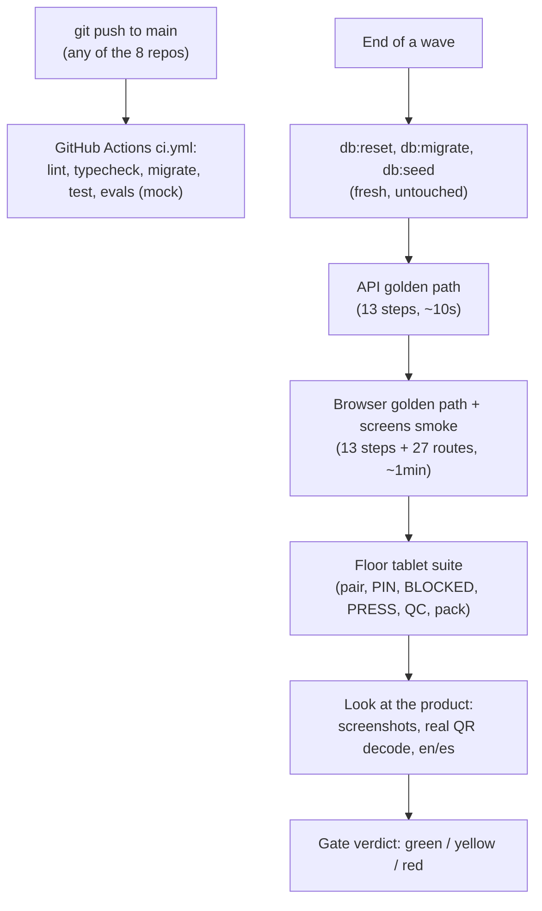

# Lesson 8.2 — E2E, the integration gate, and CI

## 1. In one sentence
The **golden path** (order import → SKU map → gang sheet → floor → label → profit →
AI) is proven end to end with Playwright on a freshly seeded database at least once
per wave (the **integration gate**), GitHub Actions runs the same repo's own
typecheck/lint/test/build on every push automatically, and neither one is trusted
on a used or stale database — a result only counts as evidence if it ran on a fresh
reset and seed.

## 2. Why it exists
Unit and acceptance tests (lesson 8.1) each prove one layer or one module works
correctly in isolation. None of them prove that the *whole chain* — a browser request,
through the real backend, into a real database, out through a real job queue, back
onto a real screen — actually connects the way it's supposed to. Wave 7's gate found
exactly this kind of bug twice (the vendor portal inbox, and an Etsy AI draft that
failed validation) — things no single module's own tests would have caught, because
each module, alone, was fine. The integration gate exists specifically to catch "fine
alone, broken together." CI exists for a narrower, faster-feedback version of the same
idea: every push to any of the 8 repos' `main` should be checked automatically, not
just at the end of a wave.

## 3. How it works

### The golden path, specifically: 13 named steps
`invai-web/e2e/api-golden-path.spec.ts` and `golden-path.spec.ts` each run the exact
same sequence of 13 numbered tests, one for every step of the real user journey
(module 01's business flow, made executable): sign in, import a CSV, map a SKU, approve
a personalization proof, build a gang sheet, send it to a vendor, receive it back,
pick/press/QC/pack on the floor, buy a label and push tracking, compute profit, draft
AI listing copy and flag a trademark risk, ask the assistant a question, and confirm
tenant isolation. Reading the test names straight off the file (`:55-454`) is itself a
map of the whole product:
```
1. owner signs in and Today shows real numbers
...
8. floor: PIN login, wrong size is BLOCKED, right blank presses, QC pass, pack
...
11. AI listing draft (mock) validates for Etsy and is approved; trademark check flags Nike
...
13. tenant isolation: a new company sees none of Desert Bloom's data
```
There are two versions of this same sequence on purpose: an **API** version
(`E2E_API=1 pnpm e2e e2e/api-golden-path.spec.ts`) that drives the backend directly —
fast (about 10 seconds), and needs an *untouched* seed, since it's the first thing to
run — and a **browser** version (`golden-path.spec.ts`, inside the plain `pnpm e2e`
run) that drives the same 13 steps through real screens, "tolerates steps already
done and checks them through the API" (the `run-golden-path` playbook's own words), so
it can run right after the API version without needing its own fresh database. A
third suite, `screens.smoke.spec.ts`, separately loads every route (27, plus detail
pages and the vendor portal) and fails on any console error or failed network
request — a different kind of check than the golden path: not "does the flow work,"
but "does every screen at least load clean."

### "A result on a used database is not gate evidence"
This rule from `run-golden-path` is worth sitting with, because it's easy to treat as
pedantic and it isn't. A gang sheet's film utilization, a profit number, a trademark
score — all of these depend on what orders, designs and transfers already exist in
the database. Running the suite twice without reseeding means the second run is
testing against data the *first* run already mutated — not a clean, known starting
state. The playbook's own remediation for a suspicious failure makes this concrete:
"If the browser suite fails on a step the API suite already did, reseed and run `pnpm
e2e` alone before calling it a product bug" — in other words, rule out a stale-database
artifact before concluding there's a real defect.

### Look at the product, not just the assertions
`run-golden-path` step 9 is explicit that passing tests alone aren't the finish line:
"Spot-check Today, an order drawer, a gang sheet... the label PDF and profit, in
English and Spanish. Wrong numbers, broken images, `##` order numbers or untranslated
strings are failures even when tests pass." A test can assert "the response has
status 200" while the actual rendered page shows a broken image or an untranslated
string — this step exists because a passing assertion and a *correct product* are not
automatically the same thing.

### A real gate, with a real finding: wave 9
`invai-docs/waves/9/gate.md` is worth reading as a model of what a thorough gate
actually produces. Every repo's own `typecheck && lint && test (&& build)` ran clean
(backend 645/645, imaging 102/102, web 78/78, floor 86/86 — "all six clean on the
first try, no retries"); the seed was run four times total across the gate (once
before each suite, plus a final closing reseed), each one logged with its exact row
counts; and all three E2E suites passed 13/13, 15/15 and 3/3. But the gate didn't stop
at green tests — a set of manual "smoke checks" went further: decoding every QR code
in a rendered gang-sheet PNG with an actual QR-reading library (`zxingcpp`) to prove
the header and transfer QR codes *really* decode to the right ids, not just that the
compose call returned 200. That check found a real bug no automated test had caught:
the header QR silently went blank on a realistic multi-order sheet — "Finding A,"
root-caused and handed to imaging's owner, not fixed by QA itself (QA's rule: find and
root-cause, never fix product code).

### CI: the same checks, automatically, on every push
Each repo's own `.github/workflows/ci.yml` runs on every push to `main` (plus pull
requests and manual dispatch). `invai-backend/.github/workflows/ci.yml` spins up real
Postgres (pgvector) and Valkey service containers, pulls the sibling `invai-contracts`
repo via a read-only deploy key (since this isn't a monorepo — module 02), then runs
`pnpm lint`, `pnpm typecheck`, migrates the freshly created database, runs the full
test suite, and runs `pnpm evals` — with a comment explaining exactly what that last
step proves in CI specifically: "No `ANTHROPIC_API_KEY` here, so `env.mocks.ai` is
true and this runs against the mock provider (plumbing check only)" — lesson 7.3's
plumbing-vs-quality distinction, visible directly in the CI config. Every third-party
container image is pinned by a specific digest (`@sha256:...`), not a mutable tag like
`latest` or even a version tag, and every GitHub Action is pinned by commit SHA rather
than a tag — both guard against the exact same risk: a tag can be silently
repointed at different content after the fact; a digest or a commit SHA cannot.

### The Stop hook: a safety net against reporting work as done without checking it
One more mechanism closes the loop between "I made a change" and "I verified it."
`invai-docs/team/hooks/verify-gate.py` runs when an agent tries to finish its turn: if
that agent edited a code repo since its last successful typecheck/lint/test (and
build, where applicable) *and* hasn't already been blocked for this exact set of
edits, it blocks the stop once and prints the exact commands to run. The hook's own
docstring states its philosophy plainly: "Fails open: a crash or unreadable input
allows the stop. A broken gate must never trap every agent" — a verification gate is
only worth having if a bug *in the gate itself* can't become a worse problem than the
one it's checking for.



## 4. In our code
- `invai-web/e2e/api-golden-path.spec.ts:55-454` — all 13 named golden-path steps.
- `invai-web/e2e/golden-path.spec.ts`, `invai-web/e2e/screens.smoke.spec.ts` — the
  browser and smoke suites.
- `invai-floor/e2e/floor.spec.ts`, `offline.spec.ts`, `press.spec.ts` — the floor
  tablet E2E suite.
- `invai-docs/team/skills/run-golden-path/SKILL.md` — the full procedure: setup,
  seeding, the three suites, the "look at the product" step, cleanup rules.
- `invai-docs/waves/9/gate.md` — a complete real gate report, including a genuine
  escaped bug (the header QR finding) caught by a manual check beyond the automated
  suites.
- `invai-backend/.github/workflows/ci.yml` — the full CI job: service containers
  pinned by digest, the sibling-repo checkout, lint/typecheck/migrate/test/evals.
- `invai-docs/team/hooks/verify-gate.py` — the Stop-hook verification gate and its
  fail-open rule.

## 5. What it uses
- **Playwright** — the E2E framework for both `invai-web` and `invai-floor`; module 03
  covers why this tool over alternatives.
- **GitHub Actions** — CI, with Postgres and Valkey as real service containers rather
  than mocked infrastructure, so CI tests against the same kind of database and queue
  the real app runs on.
- **Pinned image digests and commit SHAs** — the mechanism that keeps a CI run's
  inputs from silently changing out from under it over time.
- **A real seed** (`invai-backend/db:seed`) — realistic Desert Bloom Tees data (lesson
  from `team/lessons.md`: unrealistic seed sizes once made gang sheets look 51.7%
  efficient instead of the real 86–91%), the shared known starting state every gate
  run is measured from.

## 6. Try it yourself
1. Read `invai-web/e2e/api-golden-path.spec.ts`'s test names alone (search `grep -n
   "^test(" invai-web/e2e/api-golden-path.spec.ts`), without reading the bodies. Write
   down, in your own words, what business flow each of the 13 steps proves —
   then compare your list to module 05's three core-flow lessons.
2. Read `invai-docs/waves/9/gate.md`'s "Finding A" section in full (search for
   "Finding A" in the file). Notice that it was found by a manual QR-decode check, not
   by any automated assertion — what does that tell you about the limits of "the tests
   passed"?
3. Open `invai-backend/.github/workflows/ci.yml` and find the comment explaining why
   `pnpm evals` in CI is "a plumbing check only." Connect it back to lesson 7.3's
   plumbing-vs-quality distinction.

## 7. Common mistakes
- Running the E2E suite on a database that's already been touched by a previous run
  or by manual testing, and trusting the result either way. `run-golden-path`'s rule
  is unambiguous: that's not gate evidence, full stop, because a mutated starting
  state can make a flow look broken (or, just as badly, look fine when it isn't).
- Treating a green test suite as the whole verification. Wave 9's own gate found a
  real, reproducible bug (the header QR) that every automated assertion missed,
  specifically because the manual check decoded the actual image bytes instead of
  trusting a 200 status code.
- Adding a retry, a sleep, or a `.skip` to make a flaky E2E test pass. `run-golden-path`
  forbids this directly — a flaky test gets reported as flaky and quarantined with an
  owner and a 14-day fix deadline, not silently patched into passing.

## 8. Check yourself
<details>
<summary>1. The browser golden path (`golden-path.spec.ts`) fails on step 6, but the
API golden path already passed step 6 moments earlier on the same database. What
should you do before concluding there's a real bug?</summary>

Reseed the database and run `pnpm e2e` (the browser suite) alone, fresh. The playbook
specifically warns that a browser-suite failure on a step the API suite already
completed successfully might be a stale-database artifact rather than a genuine
defect, and that has to be ruled out first.
</details>

<details>
<summary>2. Why does `ci.yml` pin its Postgres and Valkey service container images by
a `@sha256:...` digest instead of a tag like `pg17` or `8`?</summary>

A tag can be silently repointed to different image content later (even by the same
publisher, intentionally or not), which would make CI's "known good" environment
change out from under it with no corresponding code change. A digest pins the exact
bytes, so the same CI config always runs against the exact same image.
</details>

<details>
<summary>3. What does it mean that `pnpm evals` in CI is described as "a plumbing
check only"?</summary>

CI has no `ANTHROPIC_API_KEY` or `OPENAI_API_KEY` configured, so `env.mocks.ai` is
true and every AI call in the eval run goes to the deterministic mock provider. That
proves the eval harness, the gateway wiring, and schema validation all work correctly
— but it cannot measure actual model quality, since the mock's answers are fixed
regardless of the input.
</details>

## 9. Words to know
- **Golden path** — recapped from the glossary: the one critical order → gang sheet →
  press → ship → profit sequence proven end to end by a 13-step named test suite.
- **Integration gate** — the wave-end checkpoint where every repo's own checks plus
  the full E2E suites run together, on a fresh seed, before anything is pushed.
- **CI (continuous integration)** — automated checks (lint, typecheck, test, build)
  that run on every push, independent of and faster than a full integration gate.
- **Smoke test** — a shallow check that something basic works (a screen loads with no
  console errors), as opposed to a deep check of correct behavior.
- **Pinning by digest/SHA** — referencing an exact, immutable version of an image or
  action, instead of a mutable tag that could later point at different content.
- **Fail open (hook sense)** — a safety check (like the Stop-hook verification gate)
  that lets things through rather than blocking everyone when the check itself breaks.
