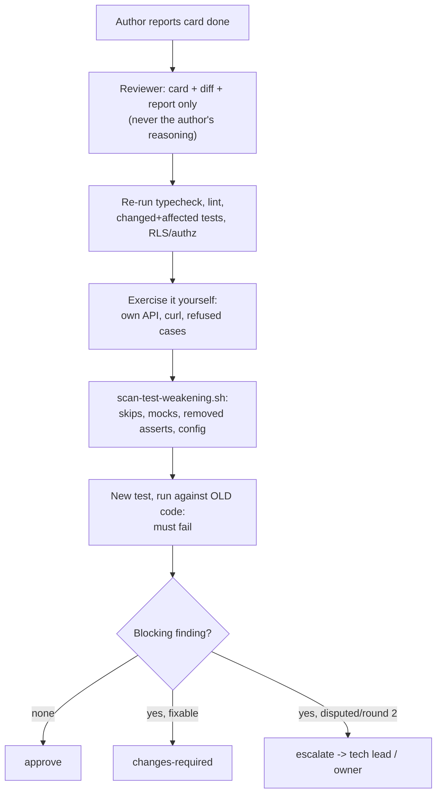

# Lesson 8.3 — Independent review, and catching a weakened test

## 1. In one sentence
Nothing reaches `main` until a *different* agent, with fresh context and read-only on
code, re-runs the actual checks, exercises the behavior itself, and specifically
scans the diff for signs that a test was quietly weakened to make the code pass rather
than the code being fixed to make the test pass.

## 2. Why it exists
"I wrote the code and I also wrote (or passed) the test for it" is a weak form of
proof — not because people or agents lie, but because the same blind spot that
produced a bug can just as easily produce a test that doesn't catch it. A test
suite's real value comes from someone *other* than the author believing it's actually
checking what it claims to check. And there's a specific, sneaky failure mode worth
naming on its own: a test can be made to pass not by fixing the behavior it checks,
but by quietly loosening the test itself — skipping it, mocking around the exact thing
it was supposed to exercise, deleting the one assertion that was failing, or replacing
a real check with a looser one (`expect.anything()` instead of a real value). A green
suite after that kind of change tells you nothing about whether the underlying problem
was actually fixed.

## 3. How it works

### What a reviewer is given, and what it's explicitly not given
`independent-review`'s "Inputs" section is narrow by design: the task card, the diff in
each touched repo, and the author's own report — "Never the author's chat, reasoning
or plan. If you were spawned with the author's context, stop and ask... for a fresh
reviewer." This isn't bureaucracy for its own sake: a reviewer who inherited the
author's reasoning would tend to see the code the way the author already explained it,
rather than forming an independent judgment from the card and the diff alone. For
high-risk changes (tenancy, PII, auth, payments, webhooks, files), the reviewer is
even required to be a different model than the author used — a deliberate attempt at
genuinely independent judgment, not just a different name on the same kind of
reasoning.

### Re-run it yourself; don't trust the report
Step 5 is blunt: "Don't trust the report's output." Typecheck and lint, the specific
tests the diff touches, and (for backend) the RLS and authz suites always run again,
by the reviewer, from scratch — `pnpm vitest run --reporter=dot <paths>`, not a copy
of numbers from someone else's terminal. **Decision 0019** narrowed exactly how much
gets re-run, and the reasoning is worth knowing: across waves 20–25, cards averaged
about 3 reviews each and every reviewer was re-running each repo's *entire* suite
(about 5 minutes for the backend alone) — then the integration gate ran everything
again anyway. The fix wasn't "stop re-running tests," it was "re-run the tests that
could actually have changed, and let the once-per-wave gate (lesson 8.2) cover the
full suite and E2E." A reviewer still always re-runs the changed/affected tests and the
RLS/authz suites — those never get skipped — but a full-suite run is now reserved for
when shared code (`src/lib`, `src/db`, `src/api`, the worker) changed, or when the
author's own report already showed a full-suite failure.

### Exercise the behavior yourself, including the refused cases
Step 6 goes past re-running automated tests: start your own API on your own port, sign
in as the role the card describes, and hit each acceptance criterion with curl or the
browser directly. And always try the cases a passing test suite can still miss if it
was written narrowly: a role *without* the needed permission (expecting `FORBIDDEN`),
and another tenant's id (expecting `NOT_FOUND` — specifically **not** `FORBIDDEN`,
because returning `FORBIDDEN` for a cross-tenant id can itself leak that the resource
exists at all). For a job or webhook, send the exact same input twice and check that
only one effect happened — lesson 6.1's idempotency, proven by hand, not just read
about in the diff.

### Scanning for a weakened test
This is the step worth understanding in detail, because it's specific and mechanical,
not just "read the diff carefully." `.claude/skills/independent-review/
scan-test-weakening.sh <repo> origin/main` runs five separate checks over the diff,
and each one targets a specific way a test can be quietly defanged:
1. **Deleted or renamed test files** — the bluntest version: the check that was failing
   simply isn't there anymore.
2. **Skips, focus, mocks, sleeps and ignores added in test code** — a long pattern
   list covering `.skip`/`.only`/`.todo`/`.fixme`, `vi.mock`/`vi.spyOn` of the thing
   under test, `waitForTimeout`, `@ts-ignore`/`@ts-expect-error`, loosened matchers
   like `expect.anything()` or `.toBeTruthy()` in place of checking a real value, and
   `toMatchSnapshot`/`toHaveScreenshot` (a snapshot update can silently bless a
   regression as "the new normal" instead of catching it).
3. **Assertion lines removed vs. added** — literally counting `expect(`/`assert`/
   `toThrow`/`toEqual`/`toBe`/`rejects.` lines removed against lines added; any
   removal at all triggers "read every removed assertion below and say where its
   behavior is still checked" — the point isn't that removing an assertion is
   automatically wrong, it's that it's never *silently* fine.
4. **Snapshot and screenshot baselines changed** — flagged separately from the pattern
   scan above, because a changed `.snap` file or `__snapshots__/` entry needs its own
   look: is the new baseline actually correct, or does it capture a regression?
5. **Test, lint or CI config loosened** — `exclude`, `retries`, `continue-on-error`,
   `passWithNoTests`, a linter rule turned from `"error"` to `"warn"` or `"off"` —
   config changes that make the *gate itself* less strict, which can be far more
   consequential than a single weakened test, since it affects everything that runs
   through it afterward.
6. **Test-only branches added to production code** (a related, separate check) —
   `if (process.env.NODE_ENV === "test")` or similar inside non-test files, which can
   mean a test is passing against a special code path that only exists for the test,
   not against the real behavior.

The script's own header is honest about its limits: "every hit needs a human look; a
clean run is not proof." It's a finder of *candidates*, not a verdict — the reviewer
still has to read each hit and judge whether it's actually a problem.

### "Does the new test fail without the change?"
Step 8 is the single most direct proof a test is actually testing something: take the
new or changed test, run it against the code *before* this card's change (checked out
into a scratch directory, `git archive origin/main`), and confirm it fails. "A test
that passes on the old code proves nothing: blocking if it is the only evidence for a
criterion." This is the acceptance-tests-first "red first" rule (lesson 8.1), checked
independently by someone who didn't write the test — if the author's new test was
secretly already passing before their fix, the fix (or the test) isn't doing what it
claims.

### The verdict, and what makes it blocking
Review decisions are deliberately narrow: `approve`, `changes-required`, or
`escalate`. And blocking findings are an explicit, closed list — "correctness, an
unmet acceptance criterion, security, tenancy, idempotency, ownership, scope, or a
**weakened test**." Everything else is a note, not a blocker. Each blocking finding
has to be written as a concrete scenario, not an abstract worry — the independent-
review playbook's own example: "a presser at shop B scans shop A's transfer id and
gets PRESS instead of BLOCKED," not "there might be a tenancy issue here."

## 4. In our code
- `invai-docs/team/skills/independent-review/SKILL.md` — the full procedure: inputs,
  re-run rules, exercising behavior, the weakened-test scan, the fail-without-change
  check, the verdict rules.
- `invai-docs/team/skills/independent-review/scan-test-weakening.sh` — every pattern
  it checks for, in five distinct sections plus the test-only-branch check.
- `invai-docs/decisions/0019-lighter-review.md` — why full-suite re-runs moved from
  every review to once per wave, and the watch condition (gate failure rate) that
  would reverse it.
- `invai-docs/team/lessons.md` (2026-09-24, row 11) — "Security fixes for B1/B2
  shipped with no independent review... The reviewer fixed its own findings" → the
  rule that verifiers prove issues and owners fix them, never the same role doing
  both.
- `invai-docs/waves/<n>/reviews/` — where every reviewing role's verdict file actually
  lives, one file per review round.

## 5. What it uses
- **`git diff`/`git archive`** — the actual mechanism behind every check in this
  lesson: the weakening scan, the ownership check (diff stat against owned globs), and
  the fail-without-change proof all work by diffing or archiving a specific commit
  range, not by reading the author's description of what changed.
- **A separate verdict file per review round** — `invai-docs/waves/<n>/reviews/
  T-<n>-<k>-<role>-r<round>.md` — kept distinct from both the card and the author's
  report, so the evidence trail survives even if a second round finds new issues.

## 6. Try it yourself
1. Read `scan-test-weakening.sh`'s "Skips, focus, mocks, sleeps and ignores" pattern
   (the `weak=` regex, around line 25). Pick three of the patterns in it
   (`vi.mock\(`, `toMatchSnapshot`, `@ts-expect-error`) and, for each, write one
   sentence explaining the specific way it could hide a real regression.
2. `grep -n "approve\|changes-required\|escalate" invai-docs/team/skills/independent-review/SKILL.md`
   and read the exact conditions for each verdict. Notice that `escalate` isn't "I'm
   not sure" — it's a specific, named set of conditions (round 2 still blocking,
   disagreement on scope/risk, a fix that would weaken a control).
3. Pick any file in `invai-docs/waves/*/reviews/` (if one exists in this workspace) and
   read its "Evidence I re-ran" section — see whether it names actual commands and
   their last lines, or just states a conclusion.

## 7. Common mistakes
- Treating a clean `scan-test-weakening.sh` run as proof nothing was weakened. The
  script's own header says the opposite: "every hit needs a human look; a clean run
  is not proof" — it's a heuristic finder, not a verdict, and a sufficiently careful
  weakening could still slip past a fixed pattern list.
- Approving because the diff's tests pass, without running the new test against the
  *old* code first. A test that was already passing before the fix proves the fix
  didn't change what the test checks — which means either the test is wrong, or the
  "fix" didn't actually fix anything the test would notice.
- Assuming a removed assertion is automatically a red flag, or automatically fine.
  The scan script's own behavior is "read every removed assertion below and say where
  its behavior is still checked" — the question is never just "was something removed,"
  it's "is the thing it checked still checked somewhere."

## 8. Check yourself

1. A reviewer notices that a diff changed `vitest.config.ts` to add
`"my-flaky-test.test.ts"` to an `exclude` list. Is this automatically a blocking
finding, and why would a reviewer care about a config file at all?

It's a strong candidate for a blocking finding, and config changes get their own
dedicated scan section precisely because they're higher-leverage than a single test
change — excluding a test from the config means it silently never runs again at all,
for anyone, which is a much bigger change in coverage than skipping one `it()` block
visibly in the test file itself.

2. Why does `independent-review` require a reviewer to never have been
spawned with the author's own reasoning or chat context?

Because a reviewer who inherited the author's framing of the problem would tend to
evaluate the code the way the author already explained it, rather than forming an
independent judgment purely from the card's criteria and the diff — the whole value
of a second, fresh set of eyes depends on it genuinely being independent.

3. Decision 0019 moved full-suite re-runs from every review to once per wave
(at the integration gate). What specific signal would mean this decision should be
reversed?

A rising gate failure rate — the decision names the watch condition explicitly: "If the
gate failure rate rises above one in three waves, restore full suites in review." The
lighter-review approach trades some earlier detection for speed, and that trade is
only kept as long as the gate isn't catching problems review would have caught too
often.

## 9. Words to know
- **Independent review** — a different agent, with only the card/diff/report as input
  (never the author's reasoning), re-running checks and exercising behavior before a
  card can be pushed.
- **Co-reviewer** — an additional reviewer required only for a card's specific risk
  flags (contract change, migration, tenancy/PII/auth, prompts, new UI), on top of the
  primary reviewer who covers everything else.
- **Weakened test** — a test changed so it no longer actually checks the behavior it
  claims to, without an equal or stronger check added elsewhere (a skip, a loosened
  assertion, a mock of the thing under test, a relaxed config).
- **Verdict** — a review's final decision: `approve`, `changes-required`, or
  `escalate`, each with specific, named conditions rather than a vague impression.
- **Fail-without-change check** — running a new or changed test against the code
  *before* the fix, to prove it would have caught the problem the fix addresses.
