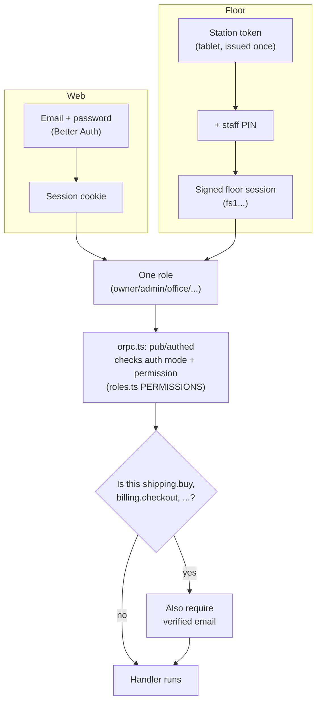

# Lesson 9.1 — Auth: two logins, one permission check

## 1. In one sentence
InvAI has two completely different ways to prove who you are — a web session for people
at a desk, and a station-token-plus-PIN pair for a tablet on the floor — but both end up
producing the same thing: one **role** (`owner`, `admin`, `office`, `designer`, `presser`,
`packer`, `receiver`, or `vendor`), checked against one shared permission list before any
procedure runs.

## 2. Why it exists
A DTF shop's owner signs in with an email and password, at a desk, rarely. A presser signs
in on a shared tablet, standing up, dozens of times a shift, often with gloved or wet
hands. Those are different enough problems (session length, what happens if a tablet is
lost, how fast login has to be) that they need different mechanisms — but the rest of the
system (every procedure, every permission check) can't afford to know which one a given
caller used. Without a single shared permission model, every module would have to
separately get tenancy and role checks right, and the two login paths would drift apart
(lesson in `invai-docs/security/v1-review.md` finding S-07: a floor session kept a
deactivated presser's old role for up to 12 hours because nothing re-checked it).

## 3. How it works

### Web: Better Auth, with the dangerous bits turned off
`invai-backend/src/auth.ts:1-61` wires up **Better Auth** (module 3's library for session
cookies) with its `organization` and `twoFactor` plugins. Better Auth ships a full set of
organization-management endpoints (invite, change a member's role, remove a member, delete
the org) that it expects *you* to call directly from the client. InvAI doesn't: every one
of those actions goes through its own oRPC procedure (`team.invite`, `team.changeRole`, ...)
that re-checks permissions and business rules Better Auth doesn't know about (keep at
least one owner, match a role to the org's type). So `src/auth.ts:214` sets
`disabledPaths: DISABLED_AUTH_PATHS` — Better Auth's own organization HTTP routes are
switched off at the framework level, not just "unused." The web app only ever calls
`create`, `list`, `set-active` and `accept-invitation`.

This fixed a real, shipped bug (**S-01**, High): before `disabledPaths` existed, Better
Auth's raw `organization/update-member-role` endpoint was reachable directly, and it
didn't know about InvAI's "only an owner can grant owner" rule — any admin could promote
themselves. The fix isn't "add a check to that endpoint," it's "that endpoint doesn't
exist as far as the outside world is concerned." `authRoles` (`src/auth.ts:52-61`) then
defines Better Auth's own access-control roles (`owner`, `admin`, and a shared `staff` role
for everyone else) purely so Better Auth's internal plumbing is happy — the roles that
actually matter for permissions are InvAI's own, defined once in `@invai/contracts`.

### Floor: a station token plus a PIN, not a password
A tablet in the pressing area can't ask every presser to type an email and password every
time they pick up a scanner. `invai-backend/src/modules/tenancy/floor-auth.ts:17-24`
documents the two-factor design:
1. **A station token** (`st1.<companyId>.<random>`) — issued once by an owner/admin to one
   physical tablet, stored as only its SHA-256 hash (`issueStationToken`,
   `floor-auth.ts:65-80`; see lesson 9.2 for why hashing beats storing the secret). The
   company id rides inside the token string itself, so looking it up doesn't need a
   cross-tenant query — `parseStationToken` (`floor-auth.ts:57-62`) reads it straight out,
   under RLS.
2. **A 4–6 digit PIN**, per staff member, HMAC-hashed with a server secret (never stored
   or compared in plaintext).

Token plus the right PIN produces a signed **floor session** (`fs1.<payload>.<sig>`,
`FloorSessionPayload` at `floor-auth.ts:35-46`) good for `FLOOR_SESSION_TTL_HOURS`, carrying
a random nonce so that logging out revokes exactly *that* session and not every session
ever issued from that station.

### One permission list, checked the same way for both
Whichever login path produced a session, every procedure call passes through the same
gate. `invai-contracts/src/roles.ts:7-30` is the single source of truth for which roles
exist (`ROLES`), which ones belong to a shop (`SHOP_ROLES`) versus the one role a vendor
organization ever has, and which ones log in on a tablet with a PIN (`FLOOR_ROLES`:
`presser`, `packer`, `receiver`). Every contract procedure declares one required
`permission` and an `auth` mode (`"user"`, `"floor"`, `"station"`, or `"public"`) as
*metadata on the procedure itself*, not buried in a handler's body — `invai-backend/src/
api/orpc.ts:20-33` builds two base clients from that metadata: `pub` (runs the auth-mode
and permission guard alone) and `authed` (same, plus it guarantees `context.tenant` is
populated). A module router like `designsRouter` is then built purely by filling in
handlers against `authed.designs.*`; the permission check already happened before the
handler's own code runs.

`invai-backend/src/api/authz.test.ts` is the proof this is exhaustively true, not just
usually true: it walks every single procedure in the contract (170+) through the real
router and checks that an anonymous caller gets `UNAUTHORIZED` (except `floor.login` and
`floor.staff`, which have to be reachable by definition), a user without the matching
permission gets `FORBIDDEN`, a floor session can't reach any `auth: "user"` procedure, a
bare station token (no PIN yet) reaches nothing, and the vendor role reaches only the
vendor portal's own narrow slice.

### A third gate for money: email verification
Permission alone isn't the whole story for anything that spends money. `src/auth.ts:175`
deliberately leaves `requireEmailVerification: false` — an unverified person can still sign
in and use the product, by design (comment: "unverified users can sign in; only paid
actions need a verified email"). But `EMAIL_VERIFIED_PROCEDURES`
(`invai-backend/src/api/orpc.ts:38-45`) names exactly four procedures — `shipping.buy`,
`shipping.batchBuy`, `billing.checkout`, `billing.portal` — that get an extra check on top
of the permission check, for both web and floor sessions. Connecting a marketplace channel
is deliberately *not* on that list: it's a new shop's very first step, and it spends
nothing.

## 4. In our code
- `invai-backend/src/auth.ts:1-61,175,195-214,225,333,378` — Better Auth config: disabled
  organization endpoints, email verification policy, rate limits, two-factor plugin.
- `invai-backend/src/modules/tenancy/floor-auth.ts:17-80` — the station-token-plus-PIN
  design, `parseStationToken`, `issueStationToken`, the `FloorSessionPayload` shape.
- `invai-contracts/src/roles.ts:1-40` — `ROLES`, `SHOP_ROLES`, `FLOOR_ROLES`, `PERMISSIONS`.
- `invai-backend/src/api/orpc.ts:20-45` — `pub`/`authed`, `EMAIL_VERIFIED_PROCEDURES`.
- `invai-backend/src/api/authz.test.ts` — the test that walks every procedure through the
  real router and checks the guard holds for every role and auth mode.
- `invai-docs/security/v1-review.md` S-01 to S-03, S-06, S-07 — the specific authorization
  bugs this design fixed, each with the exact file and the test that proves it.

## 5. What it uses
- **Better Auth** — handles web session cookies, password hashing (scrypt), two-factor
  (TOTP + backup codes), and rate limiting on sign-in, with its own organization feature
  turned off wherever InvAI's rules disagree with it.
- **HMAC-SHA256** (`invai-backend/src/lib/crypto.ts`) — floor PINs are hashed with a server
  secret, never stored or compared as plaintext (lesson 9.2 covers the crypto module in
  full).
- **oRPC metadata** — `auth` mode and `permission` live on the contract procedure, read by
  one shared middleware, instead of being re-implemented per handler.

## 6. Try it yourself
1. `grep -n "EMAIL_VERIFIED_PROCEDURES" invai-backend/src/api/orpc.ts` and read the four
   procedures listed. Notice `channels.connect` is not one of them — write one sentence on
   why that's the right call given what the procedure actually does.
2. Sign in to the running app as `presser@desertbloom.test` (seed PIN) on the floor app,
   then try to open any `/settings/*` page meant for an owner. Confirm you're blocked, and
   read the error — it should say what happened in plain language, not a raw permission
   code (`write-plain-language-copy`'s rule).
3. `grep -n "UNAUTHORIZED\|FORBIDDEN" invai-backend/src/api/authz.test.ts | head -20` and
   pick two test names. For each, say in one sentence which part of the auth system (web
   session, floor session, or station token alone) it's proving can't reach something it
   shouldn't.

## 7. Common mistakes
- Assuming a floor session's role stays correct for its whole 12-hour lifetime. Finding
  **S-07** in `v1-review.md` is exactly this bug: the original floor context cached the
  role at login time, so a demotion or deactivation mid-shift had no effect until the
  token expired. The fix makes the floor context read the *live* membership on every
  request.
- Writing a new procedure's permission check inside its handler "just this once." The
  whole point of metadata-on-the-procedure plus `authz.test.ts` walking every procedure is
  that a check can't be forgotten *and silently not fail any test* — a handler-level check
  isn't covered by that walk.
- Treating "no password required" (floor) as "no auth." A station token without the right
  PIN reaches nothing (`authz.test.ts`'s bare-station-token case) — it's a second factor,
  not a bypass.

## 8. Check yourself

1. Why does the company id live inside the station token string itself
(`st1.<companyId>.<random>`), rather than being looked up from a token table first?

So the lookup can run under RLS without a cross-tenant query: the system already knows
which company's row to scope the query to before it ever touches the database, instead of
needing a privileged, unscoped lookup just to find out.

2. Better Auth ships ready-to-use organization endpoints for inviting, promoting
and removing members. Why does InvAI disable them instead of just not calling them from
the web app?

Because "not called from the web app" doesn't mean "unreachable" — the endpoint still
exists and will answer any HTTP request that reaches it, bypassing every one of InvAI's
own rules (last-owner protection, role-fits-org-type, audited role changes). `disabledPaths`
removes the endpoint itself, which is exactly what finding S-01 required.

3. `requireEmailVerification` is `false`, but four specific procedures still check
for a verified email. What's the reasoning behind allowing sign-in without verification but
blocking only those four?

Signing in and exploring the product costs nothing and shouldn't be gated behind an email
round-trip a new shop might not complete right away; but actually spending money (buying a
label, running a Stripe checkout) is exactly the kind of action where knowing the account
belongs to a real, reachable email matters, so that's where the extra check is worth the
friction.

## 9. Words to know
- **Station token** — a long random secret (`st1.<companyId>.<random>`) issued once to one
  physical tablet, stored only as its SHA-256 hash, proving "this is a known device for this
  shop."
- **Floor session** — the signed, time-limited token (`fs1.<payload>.<sig>`) issued after a
  station token *and* the right staff PIN are both presented.
- **`auth` mode** — a contract procedure's declared login requirement: `"user"` (web
  session), `"floor"` (floor session), `"station"` (bare station token only), or
  `"public"`.
- **`disabledPaths`** — a Better Auth config option that removes an HTTP route entirely,
  used here to turn off organization-management endpoints InvAI's own code replaces.
- **Email-verified procedure** — one of a small, explicit set of procedures (money-moving
  ones) that require a verified email on top of the normal permission check.
