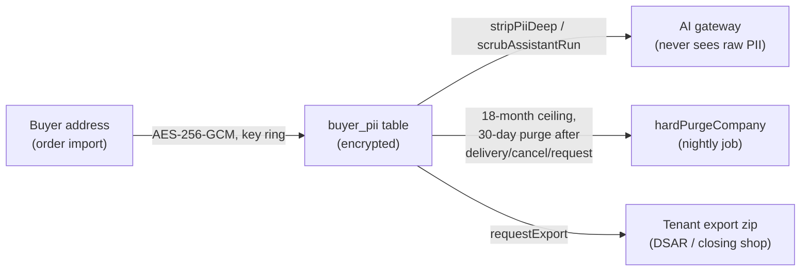

# Lesson 9.2 — PII: encrypted at rest, scrubbed before it reaches an AI, deleted on a clock

## 1. In one sentence
Buyer personal data (**PII** — personally identifiable information: a name, address,
email, phone) is encrypted in the database, stripped out before any text reaches an AI
model, and deleted automatically after a fixed retention window — three separate controls,
because each one fails differently and none of them alone is enough.

## 2. Why it exists
InvAI's whole job is importing orders that contain a buyer's name and shipping address,
and those addresses have to leave the database again — into a shipping label, a packing
slip, an AI-drafted listing's context. Every one of those exits is a place PII can leak if
nobody thought about it specifically. A platform that stores buyer data, loses it, or
leaks it into a place it shouldn't be (a log line, a model's training signal, a hashed
value an attacker can un-hash) doesn't just embarrass itself — Amazon's SP-API Data
Protection Policy conditions *access to Amazon seller data at all* on exactly this kind of
control being real and provable (`invai-docs/security/v1-review.md` §"Before applying for
Amazon SP-API restricted (PII) access").

## 3. How it works

### Encrypted at rest: a key ring, not one static key
`invai-backend/src/lib/crypto.ts:1-16` encrypts buyer PII and channel OAuth credentials
with **AES-256-GCM**, a symmetric cipher that also proves the ciphertext wasn't tampered
with (the "tag"). The ciphertext format is `<keyId>:<base64(iv(12) | tag(16) | data)>` —
every piece needed to decrypt travels with the data except the key itself. `FIELD_
ENCRYPTION_KEY` is actually a *list* of `keyId:base64key` pairs (`loadRing`,
`crypto.ts:21-36`): the **first** key encrypts new data, but **every** key in the list can
still decrypt old data. That's the whole mechanism for key rotation — add a new key to the
front of the list, and old ciphertext keeps working under its original key id until it's
lazily re-encrypted (`needsReencrypt()`), with no "stop the world and re-encrypt
everything" migration required.

Three other helpers in the same file matter for different reasons:
- `randomToken(32)` — 32 random bytes, base64url-encoded — is how station tokens and
  reset-password links are generated: long enough that guessing one isn't feasible.
- `sha256Hex` — a plain hash with *no* salt, and the file says exactly why that's safe
  here: "used to store station tokens (long random secrets need no salt)." A random
  32-byte secret has no dictionary to attack; salting matters for human-chosen secrets
  like passwords, which is why Better Auth uses scrypt for those instead (lesson 9.1).
- `hmacHex(secret, value)` — a *keyed* hash, using a server secret. This distinction
  actually caused a real bug (**S-38**, Medium): a later feature hashed an email's subject
  line with plain `sha256Hex` to avoid logging a shop's weekly profit number in the clear.
  But `sha256Hex` has no secret key, and the only unknowns in a subject like "Your week at
  Desert Bloom Tees: net profit $1,428.55 (+12%)" are a shop name and a bounded dollar
  figure — the security reviewer proved the whole subject could be brute-forced back out
  of its hash in under 3 seconds. The fix was switching to `hmacHex(env.BETTER_AUTH_SECRET,
  ...)` — the same pattern `safeEqual`-based comparisons use elsewhere — which makes the
  hash useless without the secret the attacker doesn't have.

### Scrubbed before any AI call
Everything that goes to an AI model passes through the gateway (module 7), and the gateway
is also where PII gets removed. `invai-backend/src/ai/gateway.ts:213` runs `stripPiiDeep`
on every structured prompt's variables before they're rendered into a prompt. But a
structured prompt isn't the only path to the model: the AI assistant (lesson 7.3) also
sends a user's free-text chat message and its history, and early on that path *wasn't*
scrubbed — only the structured calls were. `scrubAssistantRun()` (`gateway.ts:232`) closes
that gap specifically (originally finding **S-17**): the assistant's whole run, including
the user's own words, goes through PII stripping before it's logged or sent anywhere, not
just the tool outputs.

### Deleted on a clock, not "whenever someone remembers"
`invai-backend/src/modules/privacy/service.ts` is where the retention rules actually live,
as code and constants, not just as policy prose:
- `BUYER_PII_RETENTION_MONTHS = 18` (`:285`) and `buyerPiiCutoff()` (`:742`) — the general
  retention ceiling.
- `HARD_PURGE_DELAY_MS = 30 * 86400_000` (`:283`) — 30 days — the window after which a
  *deletion request* (a shop closing its account, or a privacy request) actually, physically
  removes the data, rather than just marking it inactive.
- `hardPurgeCompany()` (`:653`) and `overduePurges()` (`:724`) — the nightly job that finds
  everything past its deadline and actually deletes it.
- `requestExport()` (`:372`) and `runTenantExport()` (`:456`) — the other side of privacy
  requests: a shop (or a buyer, through a DSAR) can get *everything* InvAI holds about them
  as a zip, not just have it deleted.

This system had a real gap that's worth knowing about because it's a shape of bug that
recurs: the original purge job only deleted `buyer_pii` for orders that reached a
"delivered" event. An order on a CSV-only channel, a cancelled order, or one with lost
tracking never fires that event — so its PII would sit there *forever*, retention policy
on paper, nothing enforcing it in practice (**S-16**, Medium). The fix widened the purge to
also cover orders shipped-but-undelivered after 30 days and orders cancelled after 30 days,
plus a parallel sweep of the actual S3 objects (raw channel payloads, uploaded CSVs, label
PDFs) that the database-row purge alone never touched.

### What's still open, honestly
Not everything here is finished, and the course is more useful saying so than pretending
otherwise. As of the review in `v1-review.md`, **S-29** (Low, "accepted for v1; revisit
before the SP-API application") notes that `buyer_pii.city/state/zip`, `orders.buyer_note`
and a plain `buyerName` field are still unmasked for every role with `orders.read`, and
that Drizzle's own error-logging path (`logUnexpected`) can include raw query parameters —
a DB error at the wrong moment could log something it shouldn't. These are tracked, not
silently accepted; the "Before applying for Amazon SP-API restricted (PII) access"
checklist in that same file is the actual punch list.

## 4. In our code
- `invai-backend/src/lib/crypto.ts:1-16,21-36,85-110` — the AES-256-GCM key ring, and the
  `sha256Hex`/`hmacHex` distinction (and the bug it fixed, S-38).
- `invai-backend/src/ai/gateway.ts:213,232` — `stripPiiDeep` on every structured prompt,
  `scrubAssistantRun` on the assistant's free-text path.
- `invai-backend/src/modules/privacy/service.ts:283,285,372,456,653,724,742` — the
  retention constants, the export job, the purge job, and the overdue-purge finder.
- `invai-docs/security/v1-review.md` S-16, S-17, S-29, S-36, S-38 — the specific PII
  findings, with file:line evidence for each fix.
- `.claude/skills/privacy-request-handling/SKILL.md` (backed up in
  `invai-docs/team/skills/`) — the playbook for handling a real DSAR (data-subject access
  request) or a Shopify `customers/redact` webhook.

## 5. What it uses
- **AES-256-GCM** (Node's built-in `node:crypto`) — authenticated symmetric encryption,
  chosen over a plain cipher specifically so tampering with ciphertext is detectable, not
  just encryption.
- **HMAC-SHA256** — for anything that needs to be verified later without ever storing the
  original secret (PINs, the brute-force-resistant subject hash).
- **A nightly job** (module 6's job queue) — the purge and overdue-purge sweep run as
  background jobs, not as something a person has to remember to trigger.

## 6. Try it yourself
1. `grep -n "sha256Hex\|hmacHex" invai-backend/src/lib/crypto.ts` and, for each call site
   you can find elsewhere in the backend (`grep -rn "sha256Hex(\|hmacHex("
   invai-backend/src/modules`), decide which one *should* be used based on whether the
   input is a long random secret or something with real-world structure (an email
   subject, a password). This is exactly the judgment call S-38 got wrong once.
2. Read `BUYER_PII_RETENTION_MONTHS` and `HARD_PURGE_DELAY_MS` in `privacy/service.ts` and
   write, in plain English, the actual rule a shop owner should be told: "if you delete
   your account, your buyers' data is gone within ___ days; otherwise, it's gone ___
   months after an order is done."
3. Open `invai-docs/security/v1-review.md` and read finding **S-16** in full. Notice the
   difference between the bug ("only delivered orders got purged") and the fix (widened to
   shipped-30-days and cancelled-30-days, *plus* an S3 object sweep). Why does the fix need
   two parts, not just one?

## 7. Common mistakes
- Assuming "it's encrypted" means "it's handled." Encryption protects data at rest from
  someone who gets raw database access; it does nothing if the application itself hands
  decrypted PII to the wrong place (a log line, an unscrubbed AI prompt, an unmasked field
  returned to the wrong role). All three controls in this lesson exist because each one
  covers a different failure mode.
- Using an unkeyed hash (`sha256Hex`) on anything that isn't already a long random secret.
  If a human could plausibly guess or narrow down the input space (a dollar amount, a name,
  a short code), an unkeyed hash of it is reversible by brute force — S-38 is the concrete
  proof of exactly how fast.
- Treating a retention policy written in a doc as the same thing as a retention policy
  enforced in code. S-16 existed precisely because the *written* policy ("purge PII after
  delivery + 30 days") didn't match what the *job* actually queried for.

## 8. Check yourself

1. Why can every key in `FIELD_ENCRYPTION_KEY`'s list decrypt, but only the first
one encrypt new data?

That's the entire mechanism for key rotation without downtime: add a new key at the front
so all *new* writes use it, while old ciphertext — still tagged with its original key id —
keeps decrypting correctly under the key that actually encrypted it, until it's lazily
re-encrypted in the background.

2. The assistant's free-text chat messages needed their own PII-scrubbing fix
(`scrubAssistantRun`) even though structured AI prompts were already scrubbed. Why weren't
the structured-prompt protections (`stripPiiDeep` in the gateway) enough?

Because `stripPiiDeep` was only being called on the *variables* of a structured prompt —
the assistant's free-text user message and conversation history was a separate code path
that reached the model without ever passing through that same scrubbing step.

3. S-29 lists unmasked `buyerName`, `buyer_note`, and city/state/zip fields as a
known, open gap rather than something already fixed. What does it mean for a security
finding to stay "open" in this log, as opposed to being silently dropped once v1 shipped?

It means the gap is explicitly tracked with its severity, its reasoning for being accepted
for now ("accepted for v1; revisit before the SP-API application"), and a specific trigger
for when it has to be revisited — not forgotten, just consciously deferred with a reason
anyone can check later.

## 9. Words to know
- **PII (personally identifiable information)** — data that identifies a real person: a
  buyer's name, address, email or phone, in InvAI's case.
- **AES-256-GCM** — an authenticated encryption cipher: it both hides data and lets the
  decrypting side detect if the ciphertext was tampered with.
- **Key ring** — a list of encryption keys where one is "primary" (used for new
  encryption) and all are valid for decryption, enabling rotation without a mass
  re-encryption migration.
- **Unkeyed vs. keyed hash** — `sha256Hex` (no secret, safe only for long random inputs)
  versus `hmacHex` (uses a server secret, safe for anything, including guessable values).
- **DSAR (data-subject access request)** — a legal request (GDPR/CCPA) from a real person
  asking what data is held about them, or asking for it to be deleted or exported.
- **Retention window** — a fixed time limit after which data must be deleted, enforced by
  a scheduled job rather than left to manual cleanup.
