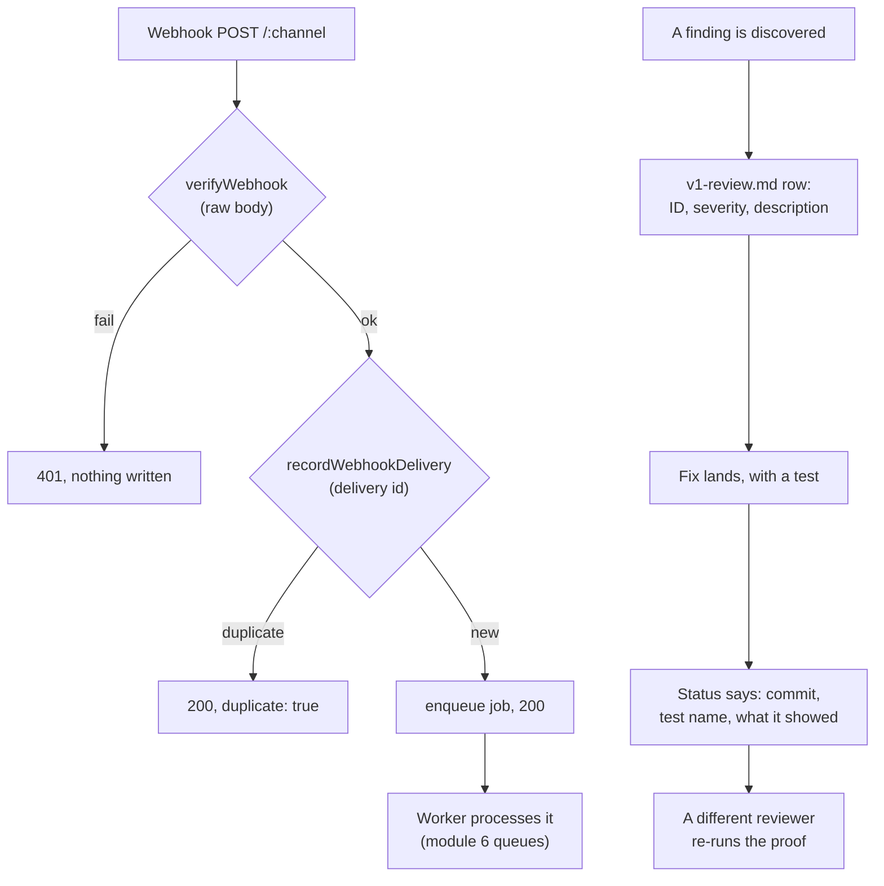

# Lesson 9.3 — Webhooks you can trust, and a findings log that proves a fix actually works

## 1. In one sentence
Every webhook is verified before anything is written, deduplicated so a retry can't
double-process it, and every security bug InvAI has ever found — fixed or still open —
lives in one running log with enough evidence that a different person could check the fix
without re-doing the whole investigation.

## 2. Why it exists
A webhook is a request your server didn't ask for, arriving whenever the sender feels like
sending it — including twice, including out of order, including from someone who isn't
actually Shopify at all but found your URL. If you trust the body of that request without
checking who really sent it, anyone can forge orders, trigger refunds, or (the real bug
below) steal another shop's buyer data just by guessing a URL pattern. And a security bug
that gets fixed with no record of *how* it was proven fixed is really just a claim — the
findings log exists so "fixed" means something a reviewer, or the owner, can actually
check later, not just trust.

## 3. How it works

### Verify, then dedupe, then enqueue — in that order
`invai-backend/src/api/webhooks.ts:21-32` documents the exact order every marketplace
webhook goes through, and the order matters:
1. **Verify the signature on the raw body** (`:75`, `verifyWebhook(channel, headers,
   body)`) — 401 and *nothing written* if it fails. Verifying on the raw text, not a
   parsed object, matters because some marketplaces sign the exact bytes sent; re-serializing
   a parsed JSON object can produce different bytes and silently break verification.
2. **Read the channel's own delivery id** (`:82-86`) — 400 if it's missing, never a
   made-up id. A made-up id would defeat deduplication entirely.
3. **Record the delivery id** (`recordWebhookDelivery`, `:109`) — if this specific delivery
   was already recorded, the handler answers `{ok: true, duplicate: true}` and stops
   (`:109-112`). This is the idempotency piece from module 6: a marketplace that resends a
   webhook (which they all do, on any ambiguous response) can never cause the same event to
   be processed twice.
4. **Enqueue and answer 200 fast** (`:104-124`) — the actual work happens in the worker, not
   inline in the request, so a slow downstream step can't make the marketplace think the
   webhook failed and resend it unnecessarily.

The comment in the file is blunt about what this buys: "Channels without webhooks never
verify, so they get 401." There's no code path where an unverified body reaches storage.

Stripe's billing webhook (`:44-66`) follows the identical shape on its own separate route —
verify `Stripe-Signature` on the raw body with a 5-minute tolerance, record the event id in
one transaction with the state change it describes (so a replay changes nothing), 500 with
nothing recorded on failure so Stripe retries. Shopify's **compliance** webhooks
(`customers/data_request`, `customers/redact`, `shop/redact`) skip the normal queue
entirely (`:87-103`) and are handled inline, before the 200 — because a redaction has to be
*done*, not just scheduled, before you tell Shopify "handled."

### The bug that made this lesson necessary: S-04
The single most serious finding in `invai-docs/security/v1-review.md` (**S-04**, High) is a
good case study in why "verify the signature" alone isn't the whole story. The original
`processWebhook` routed a Shopify webhook to **every** connection record whose
`external_shop_id` matched — including connections still in `pending` status, meaning
nobody had proven they actually owned that Shopify store yet. And `channels.connect`
created a `pending` row for *any* `*.myshopify.com` domain with no proof of ownership,
checked under RLS so it couldn't even see whether another company already had a
connection to that same domain. Put together: any shop could start a "connect" flow for a
competitor's real Shopify domain, receive that competitor's real order webhooks — buyer
names and addresses included — and never need to pass signature verification wrong,
because the webhook's signature was perfectly valid. It just wasn't meant for them.

The fix is worth reading closely because it's not one patch, it's several reinforcing
ones: a pending install keeps the shop domain only inside its *encrypted* credentials;
`external_shop_id` is only set once the real OAuth callback succeeds, with the callback's
state parameter compared in constant time against the pending record; webhooks now match
only `connected` rows, never `pending`; both `connect` and the callback refuse a store
that's already connected to a different company; and a database migration
(`0005_connected_shop_unique`) adds a unique partial index so the database itself can't
hold two `connected` rows for the same shop domain, even if application code somehow got
it wrong again. That last part — a database constraint, not just an application check — is
the same "defense in depth" idea as composite foreign keys in module 4: a bug in code
should not be the only thing standing between a tenant and someone else's data.

### The findings log: severity, status, and proof
`invai-docs/security/v1-review.md` is one table, one row per finding, with five columns:
**ID**, **Severity** (High = cross-tenant data or PII exposure or privilege escalation,
reachable through the API; Medium = the same harm needing a second condition; Low =
hardening), **Area**, **Description**, and **Status** — and status is where this log earns
its keep. It's never just "Fixed." Compare two real entries:
- **S-33** (an AI assistant tool with no cap on how large a date range it could query):
  "Fixed (invai-backend@97780c1, T-17-3 follow-up, 2026-09-26)... Verified by security-
  reviewer 2026-09-26: `assistant-tools.test.ts` 'S-33: range span cap' refuses a 100-year
  span on all 8 ranged tools... re-run 2026-09-26 against the installed suite, 43/43
  passing."
- **S-38** (the brute-forceable subject hash from lesson 9.2): the status doesn't just say
  "fixed," it includes the actual brute-force proof against the *old* code (recovered a
  real subject from its hash in 2.5 seconds) and a second proof that the *same* attack
  against the *new* code recovers nothing.

Every fixed row names a commit, a test, and what running that test actually showed — the
same "fail-without-change" discipline from module 8's independent review, applied to
security specifically. A row that says "Open" says so plainly, with the reason it's
accepted for now (S-29, lesson 9.2) or a backlog id tracking when it has to close (S-39).
The file even tracks counts at the bottom (`"6 High (all fixed)... 17 Medium (16 fixed...),
16 Low..."`) so the overall posture is checkable at a glance, not just buried in 48 rows of
prose.

## 4. In our code
- `invai-backend/src/api/webhooks.ts:21-32,44-66,68-125` — verify-then-dedupe-then-enqueue
  for every channel, Stripe's parallel route, and the inline-handled Shopify compliance
  topics.
- `invai-docs/security/v1-review.md` S-04 — the full channel-hijack finding and its
  multi-part fix, including the unique partial index migration
  (`0005_connected_shop_unique`).
- `invai-docs/security/v1-review.md` S-33, S-38 — two examples of a "Fixed" status backed
  by a named commit, a named test, and the actual numbers the test produced.
- `invai-docs/security/v1-review.md` §"What was verified" — the standing list of suites
  (RLS coverage, permission walk, tenancy security tests, crypto, injection/SSRF) that get
  re-run, not just referenced, as part of the review.
- `invai-backend/src/modules/channels/sync.ts` — `verifyWebhook`, `recordWebhookDelivery`,
  `webhookDeliveryId`, the functions `webhooks.ts` calls.

## 5. What it uses
- **HMAC verification on the raw request body** — every channel adapter implements its own
  `verifyWebhook`, because each marketplace signs its webhooks differently, but the calling
  code (`webhooks.ts`) never branches on which one it is.
- **A unique partial index** (Postgres) — `0005_connected_shop_unique` is a database-level
  guarantee that complements, rather than replaces, the application-level ownership check
  S-04 also added.
- **One markdown table as a tracked log** — deliberately not a ticketing system: it's
  diffable, grep-able, and lives next to the code it describes, in the same repo
  `security-reviewer` already works in.

## 6. Try it yourself
1. `grep -n "verify-before-enqueue\|verifyWebhook" invai-backend/src/api/webhooks.ts` and
   read the comment block at the top of the file (`:21-32`) end to end. Say in your own
   words why step order 1 (verify) has to come before step order 3 (record/dedupe), not
   after.
2. Open `invai-docs/security/v1-review.md` and read finding **S-04** in full, then its
   Status column. List the four separate changes the fix made (encrypted-only domain
   storage, OAuth-gated `external_shop_id`, connected-only webhook matching, the unique
   index) and, for each, name one specific way a single-layer fix (just the signature
   check, say) would have missed it.
3. Send the same webhook payload to a running local backend twice in a row (you can curl
   `/webhooks/shopify` with a fixture payload and a valid test signature, or trigger a
   resend from a mock provider) and confirm the second response comes back
   `{ok: true, duplicate: true}` rather than processing the order twice.

## 7. Common mistakes
- Checking a webhook's signature and assuming that's the whole access-control story. S-04
  is the clearest possible counter-example: the signature was always valid, because the
  attacker's shop really did control that webhook delivery — the missing check was *whose*
  data the webhook was allowed to be routed to, which signature verification alone can
  never answer.
- Writing a findings-log entry that just says "Fixed" with no commit, no test name, and no
  evidence of what the test actually showed when run. That's indistinguishable from "I
  believe this is fixed," which is exactly the gap an independent findings log is supposed
  to close.
- Verifying a webhook's signature against a *parsed* copy of the body instead of the exact
  raw bytes received. Re-serializing JSON can change byte-for-byte formatting (key order,
  whitespace) in ways that break a signature that was computed over the original bytes.

## 8. Check yourself

1. Why does `webhooks.ts` read the delivery id and record it for deduplication
*before* enqueueing the job, rather than letting the job itself check for duplicates once
it runs?

Because the webhook route answers the marketplace right away (fast 200), and if dedup
lived only inside the job, two near-simultaneous deliveries of the same webhook could both
get enqueued as separate jobs before either one's dedup check ran — recording the delivery
id at the HTTP layer, synchronously, closes that race.

2. S-04's fix includes a database migration adding a unique partial index, even
though the application code was also fixed to check ownership before connecting a
channel. Why add the database-level constraint if the application check already prevents
the bad case?

Because an application check is a promise the *current* code keeps — a future change, a
missed code path, or a bug in the check itself could reintroduce the hole, and a database
constraint fails the operation outright regardless of which application code path tried
it, the same defense-in-depth reasoning as composite foreign keys for tenancy.

3. The findings log marks some items "Open" rather than silently removing them
once v1 shipped. What's the value of keeping an unfixed, lower-severity finding visible in
the same document as the fixed ones?

It keeps the platform's real security posture checkable and honest — a reader (or the
owner, or a future compliance review) can see exactly what's still outstanding, why it was
judged acceptable for now, and what would need to happen before it has to close, instead of
a document that only ever shows good news.

## 9. Words to know
- **Webhook verification** — checking a cryptographic signature on the *raw* request body
  to prove a webhook really came from the marketplace it claims to be from.
- **Delivery id** — a unique identifier a marketplace attaches to one specific webhook
  send, used to detect and ignore a resend of the same event.
- **Unique partial index** — a Postgres index that enforces uniqueness only among rows
  matching a condition (here: only among `status = 'connected'` rows), letting multiple
  `pending` attempts exist while still blocking two real connections to the same store.
- **Findings log** — `invai-docs/security/v1-review.md`: one table of every known security
  issue, its severity, and a status that names the fix's commit and the test that proves
  it, kept current rather than archived once "done."
- **Compliance webhook** — a Shopify-specific webhook topic (`customers/redact`,
  `shop/redact`, ...) tied to a legal data-handling obligation, handled inline rather than
  queued because it has to be *done*, not just scheduled, before answering 200.
