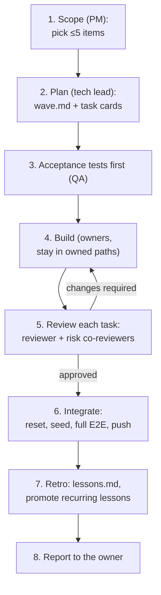

# Lesson 10.1 — The AI team: 20 roles, one wave at a time

## 1. In one sentence
InvAI isn't built by one AI agent doing everything — it's built by a team of 20 specialized
agent roles, each with its own owned files and its own playbooks, working in small batches
called **waves**, with every single piece of work reviewed by a different agent before it
reaches `main`.

## 2. Why it exists
One agent trying to plan, build, and review its own work has the same blind-spot problem a
single human developer has when they're also their own code reviewer — and it gets worse
at the speed and volume an AI team can produce code. `invai-docs/team/operating-system.md`
exists because the owner's nine non-negotiable rules (plan vs. build separation, owned
files, "nothing ships without review," decisions get written down, waves stay small,
scope lives in one file, tenancy and idempotency rules, heavy work goes to a queue) only
work if something enforces who is allowed to touch what, and in what order. The operating
system is that enforcement layer, written down once instead of re-explained in every
agent's prompt.

## 3. How it works

### Twenty roles, three groups
`invai-docs/team/operating-system.md`'s role table groups roles into **Plan** (tech-lead,
product-manager, product-designer), **Build** (architect, backend-foundation,
backend-engineer, integrations-engineer, ai-engineer, imaging-engineer, web-engineer,
floor-engineer), **Verify** (reviewer, qa-engineer, security-reviewer), **Run**
(platform-sre), and **Customers** (customer-success, docs-writer, compliance-officer,
data-analyst, growth-marketer — the last two dormant until specific triggers: data-analyst
starts when the first pilot goes live, growth-marketer four weeks before public launch).
Each role **owns** a specific set of paths — for example, `backend-foundation` owns the
backend's shared core (`src/{db,lib,api,worker,test}/**`, auth, env, migrations tooling,
the seed) but explicitly *not* `src/api/webhooks.ts`, which belongs to
`integrations-engineer` instead. A `backend-engineer` owns one named module
(`src/modules/<area>/**`) per task card, not the whole backend. This isn't bureaucracy for
its own sake: rule 2 ("every task has an owner, the files it owns, and a definition of
done") is unenforceable without a table saying precisely which files that owner is allowed
to touch, and precisely which files are someone else's — a role editing outside its owned
paths is exactly the failure mode `respect-ownership` exists to catch.

The **carve-outs** make the same point from the other direction: `.github/**` and
Dockerfiles belong to `platform-sre` even inside a repo another role mostly owns;
`**/security.test.ts` belongs to `security-reviewer` even though the module it tests
belongs to a `backend-engineer`; test fixtures (`src/test/**`) belong to
`backend-foundation`, so a QA role that needs a new fixture asks for it through a card
rather than editing it directly.

### A wave, start to finish
A **wave** is a batch of at most 5 task cards, run with 3–4 agents active at once, always
followed by an integration gate and a retro before the next wave starts (rule 5). The
eight steps in `operating-system.md` §"A wave, step by step":
1. **Scope (PM)** — pick at most 5 items from `product/scope.md` and the backlog. Bugs,
   security findings, incidents, and compliance deadlines are always in scope even without
   being pre-planned.
2. **Plan (tech lead)** — write `waves/<n>/wave.md` and one task card per item, agree
   cross-module function names up front, have the architect and PM review the plan. "The
   tech lead never approves its own plan."
3. **Acceptance tests first (QA)** — write the tests that prove each card's criteria
   *before* the build starts (module 8's "red first" rule, applied at the team level).
4. **Build (owners)** — each owner stays inside its paths, follows its playbooks, ends with
   `verify-and-report`.
5. **Review each task as it finishes** — the primary `reviewer` plus any co-reviewers the
   card's risk flags require (lesson 10.2 goes deep on this).
6. **Integrate (tech lead + QA)** — a fresh reset, migrate, seed, then every E2E suite
   (`run-golden-path`), then push to `main`.
7. **Retro (tech lead)** — record what slipped and new lessons in `team/lessons.md`. "A
   rule that recurs moves into a playbook, role file, or hook" (lesson 10.3's three
   incidents are the clearest examples of this ladder actually working).
8. **Report to the owner** — plain language: what works, the evidence, what went wrong,
   what needs the owner.

### Who reviews whom, and why it's not symmetric
The review table in `operating-system.md` is deliberately asymmetric: a `backend-engineer`
is reviewed by `reviewer`, with `architect` as a mandatory co-reviewer only if the card
changed the contract, and `security-reviewer` only if the card is flagged tenancy, PII,
auth, webhooks, files, or payments. But `architect` itself — the role that owns the
contract everyone else depends on — is reviewed by `reviewer` on a **different model**
from the one `architect` used, plus `backend-foundation` and a consumer engineer. The
tech-lead's own wave plan is reviewed by the product-manager, with the architect checking
its design — "the tech lead never approves its own plan" is written down explicitly
because it would be the single easiest rule to quietly skip under time pressure.

### Escalation: what an agent is never allowed to decide alone
`operating-system.md` lists exactly what always goes to the human owner through
`owner-inbox.md`: a production deploy, real cloud accounts or keys, anything sent outside
the team, legal or marketplace submissions, spending and pricing, real shop data outside
local, a High security finding or suspected PII incident (immediately, with Amazon's
24-hour notice clock stated), scope beyond the MVP, reopening a logged decision, two failed
review rounds, or any case where proceeding would mean weakening a control or a test.
"Routine technical choices inside a card are never escalated" — the point of naming the
always-escalate list explicitly is that everything *not* on it is a call an agent is
trusted to make and record, not something that needs to be asked about every time.

## 4. In our code
- `invai-docs/team/operating-system.md` — the whole system: the 9 owner rules, the 20-role
  table with owned paths and carve-outs, the 8-step wave process, the review table, the
  escalation list, the guard hook summary.
- `.claude/agents/*.md` (backed up in `invai-docs/team/agents/`) — one file per role,
  preloading its specific playbooks.
- `.claude/skills/*/SKILL.md` (backed up in `invai-docs/team/skills/`) — the shared and
  per-role playbooks every role follows (`task-intake`, `respect-ownership`,
  `read-before-change`, `verify-and-report`, and dozens of role-specific ones).
- `invai-docs/waves/<n>/wave.md` and `waves/<n>/T-<n>-<k>-*.md` — one real wave plan and
  its task cards, as the process actually produced them.
- `invai-docs/owner-inbox.md` — the live list of open questions sent to the owner, each
  with options, a recommendation, and a deadline.

## 5. What it uses
- **Task cards** (one file per unit of work) — named owner, owned paths, a reviewer,
  acceptance criteria, agreed interfaces, so a wave's scope is checkable, not just
  discussed.
- **A fresh tech lead per wave** — the tech lead role is deliberately *not* kept alive
  across waves (decision 0018, lesson 10.2); each wave starts a clean planning context.
- **Markdown files as the system of record** — waves, cards, reviews, decisions, and
  lessons are all plain files in `invai-docs/`, not a separate ticketing tool, so the
  same repo that holds the code holds the record of how it was built.

## 6. Try it yourself
1. `grep -n "^| " invai-docs/team/operating-system.md | head -25` to see the role table as
   raw markdown, then pick any two roles and write one sentence each on what would go
   wrong if they could edit each other's owned paths without a task card.
2. Open any real `invai-docs/waves/<n>/wave.md` you can find and compare it against the
   8-step process above — find the acceptance criteria for one of its cards, and the
   reviewer named for it.
3. Read the "Escalate to the owner" list in `operating-system.md` and, for three items on
   it, write one sentence on why an agent making that call *alone* (even correctly, even
   with good judgment) would still be the wrong process.

## 7. Common mistakes
- Treating "the tech lead plans" as "the tech lead can also just fix a bug it noticed
  while planning." Rule 1 is explicit: the tech lead does not write feature code. A
  planning role that also builds loses the separation that makes its own plan-review
  meaningful.
- Assuming a role's ownership table is a suggestion rather than an enforced boundary. The
  `respect-ownership` playbook and the review process exist precisely because the honor
  system alone isn't enough — a reviewer explicitly checks "ownership" as one of its
  blocking categories (module 8).
- Skipping the retro step under time pressure. Lesson 10.3's three real incidents all
  trace back to a lesson that *could* have been promoted into a hook or test earlier, but
  wasn't, until it recurred enough times to force the issue.

## 8. Check yourself

1. Why does a `backend-engineer`'s task card name one specific module
(`src/modules/<area>/**`) instead of just saying "the backend"?

Because "the backend" as an owned path would make every backend card's scope ambiguous and
overlapping with every other backend card running at the same time — naming the exact
module lets `respect-ownership` and reviewers check, mechanically, whether a diff stayed
inside what the card actually authorized.

2. The review table requires `architect` to be reviewed by `reviewer` using a
*different model* than `architect` itself used. Why does this matter more for `architect`
than for most other roles?

Because `architect` owns the one contract every other repo depends on — a blind spot in
its own reasoning would propagate into every consumer's code, so the review needs to be
genuinely independent judgment, not a second pass by reasoning shaped the same way.

3. "Routine technical choices inside a card are never escalated" — what's the risk
of making the escalation list too broad, as opposed to too narrow?

An escalation list that's too broad would route ordinary decisions to the owner constantly,
slowing the whole team down and training everyone to escalate reflexively instead of using
judgment — the named list exists so escalation stays reserved for the cases that actually
need a human: money, risk, scope, or a control being weakened.

## 9. Words to know
- **Wave** — a batch of at most 5 task cards run together (3–4 agents at once), followed by
  an integration gate and a retro before the next wave starts.
- **Task card** — a single unit of work: one named owner, owned file paths, a reviewer,
  and Given/When/Then acceptance criteria, filed under `invai-docs/waves/<n>/`.
- **Owned paths** — the specific files/folders a role is allowed to edit; checked by
  reviewers and the `respect-ownership` playbook, not (yet) by a hook.
- **Co-reviewer** — an additional reviewer required only when a card's risk flags call for
  it (contract change, migration, tenancy/PII/auth, prompts, new UI), on top of the primary
  reviewer.
- **Escalation (`owner-inbox.md`)** — the explicit, named list of decisions that always go
  to the human owner, with options, a recommendation, and a deadline.
