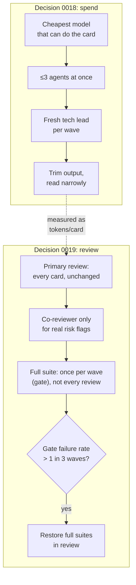

# Lesson 10.2 — Spending tokens like money: decisions 0018 and 0019

## 1. In one sentence
Running 20 AI agent roles costs real money and hits real usage limits, so two decisions —
0018 (the token budget) and 0019 (lighter review) — rewired how the team works, after a
night where the whole team got stopped repeatedly and the owner asked for "the most work
per token."

## 2. Why it exists
An AI agent team isn't free, and it isn't infinite. Every agent's context, every test run
whose output gets pasted back into a prompt, every full-suite re-run by every reviewer —
all of it is tokens, and tokens are a shared, exhaustible budget across the whole team at
once. The night of 2026-09-28 to 29 made this concrete rather than abstract: the session
usage limit stopped the entire team about every 4–5 hours, with additional 10-minute
stream stalls on top. `invai-docs/decisions/0018-token-budget.md` lists exactly what that
cost, beyond the pause itself: relaunched agents redid work they'd already finished (one
reviewer was launched three separate times for the same card); one tech-lead agent had
stayed alive across waves 20–25, so every single turn re-read a very long accumulated
context; as many as 6 agents ran at once against a stated cap of 3–4; and test/E2E output
was going into context completely untrimmed.

## 3. How it works

### Decision 0018: spend like it's money, because it is
The decision has five concrete rules, and each one maps to a specific waste the incident
exposed:
1. **Follow `CLAUDE.md`'s "Token budget" section** — trim command output, read narrowly
   (`grep -n` then targeted reads, not whole-file dumps), test in layers (foreground while
   building, one full run at the end), keep handoffs short, save progress after each
   milestone so a relaunch continues instead of redoing.
2. **Cheapest model that can do the card** — `sonnet` by default for builders and
   co-reviewers; `haiku` for mechanical work (copy sync, backlog updates, renames);
   `opus`/`fable` reserved for primary reviews, security, money and side-effect code,
   migrations, and planning. The decision also moved several role *defaults* to `sonnet`
   specifically because their work is "mostly writing or UI" — product-manager,
   product-designer, compliance-officer, customer-success, growth-marketer, data-analyst,
   web-engineer, floor-engineer — with an explicit fallback: "if sonnet UI cards fail
   review twice as often as before, move `web-engineer` and `floor-engineer` back to
   opus." That's a measured trade, not a blind cost cut.
3. **At most 3 agents at once, reviewers included** — tightening the existing cap, because
   6 had actually been running.
4. **A fresh tech lead starts for each wave** from `wave.md`, rather than one long-lived
   tech lead accumulating context across waves 20–25 indefinitely.
5. **The review rules don't change** — "an independent review of every card, with
   co-reviewers per risk flag" stays exactly as strict. Decision 0018 is about *how*
   agents spend tokens, not about *whether* review happens; that second question is what
   decision 0019 actually addresses.

The consequence section is honest about the trade-off: "some risk of lower quality on UI
and doc work," offset by the primary review staying on `opus`, with a stated reversal
condition rather than a hope.

### Decision 0019: review lighter, not less
`invai-docs/decisions/0019-lighter-review.md` targets a different waste: in waves 20–25,
cards averaged about 3 reviews each — roughly 75 review files for about 25 cards — and
*every single reviewer* re-ran each repo's entire test suite (about 5 minutes for the
backend alone), and then the integration gate ran the whole thing again anyway, on top of
every review's own run. Since 2026-09-28, only about a quarter of the lines the team wrote
were actually product code — the rest was review and process overhead. The owner's ask was
direct: more of the budget should go to development.

The fix is specific, not "review less carefully":
- **Every card still gets an independent primary review** — this doesn't move.
- **Co-reviewers only for real risk**, and the decision names exactly which risk maps to
  which co-reviewer: `architect` for contract changes, `backend-foundation` for migrations,
  `security-reviewer` for tenancy/PII/auth/webhooks/files/payments or platform-sre changes
  to secrets/IAM/network/CI permissions, `ai-engineer` for prompts, `product-designer` for
  new screens or components. QA's check moves from "every card" to "once, at the
  integration gate."
- **Full-suite re-runs move from every review to once per wave.** A reviewer still always
  re-runs typecheck, lint, the changed and affected tests, and the RLS/authz suites — those
  never get skipped — but the *entire* suite only runs again when shared code changed, or
  the gate at the end of the wave, which stays mandatory before any push.

The consequence section names the actual risk this trades for the speed: "regressions
outside a card's modules are caught at the gate rather than in review, so a gate failure
can mean a second round for one card" — and it states the exact watch condition that would
reverse the decision: **"If the gate failure rate rises above one in three waves, restore
full suites in review."** This is the pattern worth noticing across both decisions: neither
one is "cut corners and hope." Each states precisely what it's trading away, and precisely
the signal that would mean the trade stopped being worth it.

### The guard hook: a different kind of enforcement
Decisions 0018/0019 govern *how much* work agents do and *how carefully* it's reviewed.
A separate mechanism, the guard hook (`.claude/hooks/guard-bash.py`), enforces something
decisions alone can't: it mechanically *blocks* specific dangerous commands before they
run, regardless of what any agent intends — force-pushes, ref deletions, tag pushes,
remote or history rewrites, deploys (`sst`, `pnpm deploy:*`, `gh workflow run`), any `aws`
command, and secret/key/repo-setting changes. `operating-system.md` is explicit about why
this exists alongside written rules: "Owned paths for Write and Edit are not yet checked
by a hook (backlog B-47), so role files and reviews enforce them" — in other words, some
rules are enforced by a hook that can't be argued with or forgotten under pressure, and
some rules (for now) are enforced only by every agent actually following its playbook,
which is a weaker guarantee. The gap between those two categories is itself tracked as a
backlog item, not left implicit.

## 4. In our code
- `invai-docs/decisions/0018-token-budget.md` — the full incident context, the five
  rules, and the measured consequence ("tokens per card" reported in wave metrics).
- `invai-docs/decisions/0019-lighter-review.md` — the review-cost data (3 reviews/card,
  ~5 min/full-suite-run), the exact co-reviewer-by-risk-flag mapping, and the named
  reversal condition.
- `invai-docs/team/operating-system.md` §"Who reviews whom" — the review table as it
  stands *after* decision 0019's changes.
- `.claude/hooks/guard-bash.py` — the actual denylist (force-push, tags, deploys, `aws`,
  secrets) enforced mechanically rather than by agreement.
- `invai-docs/CLAUDE.md` §"Token budget" — the concrete per-agent practices decision 0018
  points every role back to (trim output, `2>&1 | tail -n 40`, `--reporter=dot`, read
  narrowly, short handoffs).

## 5. What it uses
- **Model tiering** — the same task routed to `haiku`, `sonnet`, or `opus` depending on
  how much judgment it actually needs, rather than one model for everything.
- **A stated reversal condition on every cost-saving change** — both decisions name the
  exact signal (review failure rate, gate failure rate) that would mean the trade stopped
  paying off, rather than treating the cut as permanent and unexamined.
- **Markdown decision records** (module 10.1's "decisions go in `invai-docs/decisions/`")
  — the mechanism that makes a trade-off like this checkable by anyone later, instead of
  a choice someone just remembers making.

## 6. Try it yourself
1. Read decision 0018's "Context" section and list the four specific wastes it names
   (relaunch rework, long-lived tech lead, over-cap concurrency, untrimmed output). For
   each, name the specific rule in the "Decision" section that addresses it.
2. `grep -n "co-reviewer\|risk flag" invai-docs/team/operating-system.md` and, for a
   hypothetical card that touches both a database migration and a new UI screen, list
   every role that would have to review it under decision 0019's rules.
3. Find the exact sentence in decision 0019 that states when the lighter-review approach
   should be reversed. Write one sentence on why a decision that states its own reversal
   condition is more trustworthy than one that doesn't.

## 7. Common mistakes
- Reading decision 0019 as "review got weaker." It didn't — the primary review and the
  RLS/authz/changed-test re-runs never moved. What moved is *which* full-suite runs are
  redundant (every reviewer re-running everything right before the gate re-runs everything
  again) versus which checks are cheap enough to always re-run.
- Treating model choice as "cheap vs. good" rather than "matched to the judgment the task
  needs." Decision 0018 explicitly ties the model tier to risk (security, money,
  side-effects, migrations, planning stay on `opus`/`fable`) rather than defaulting
  everything to the cheapest option.
- Assuming the guard hook and the written decisions cover the same ground. The hook blocks
  specific dangerous *commands*; the decisions govern *process* (who reviews what, which
  model, how many agents). A role could follow every written rule perfectly and still need
  the hook as a backstop against a single mistaken command.

## 8. Check yourself

1. Decision 0018 moved several roles' default model to `sonnet` specifically
because their work is "mostly writing or UI." Why wouldn't the same reasoning apply to,
say, `security-reviewer` or `architect`?

Because those roles' work is judgment-heavy in a way that's expensive to get wrong —
a missed tenancy bug or a bad contract decision propagates everywhere downstream of it —
while UI and doc work has a cheaper, more visible failure mode (a reviewer or the owner can
just look at the result), so the risk/cost trade-off comes out differently.

2. Why does decision 0019 keep "the RLS and authz suites" on the never-skip list
for every reviewer, even as it removes the full-suite-every-time rule?

Because tenancy and authorization bugs are exactly the category of regression that's both
high-severity and easy to silently reintroduce in an unrelated change — keeping those
specific suites mandatory on every review is a targeted exception that protects the
highest-risk area while still cutting the cost of re-running everything else.

3. What's the actual mechanism that would cause decision 0019 to be reversed, and
who decides when it fires?

The decision names the trigger explicitly — "if the gate failure rate rises above one in
three waves" — and it's measured, not a feeling: wave metrics already track gate
pass/fail, so the tech lead (who reports those metrics) is the one positioned to notice
the threshold crossing and restore full suites in review.

## 9. Words to know
- **Token budget** — the shared, exhaustible usage limit across the whole agent team,
  treated explicitly as a cost to be managed (decision 0018), not an afterthought.
- **Model tiering** — assigning `haiku`/`sonnet`/`opus` per task based on how much
  judgment it needs, rather than one model for every role.
- **Co-reviewer** — an additional reviewer required only by a card's specific risk flags,
  narrowed by decision 0019 to a named mapping (contract → architect, migration →
  backend-foundation, tenancy/PII/auth → security-reviewer, prompts → ai-engineer, UI →
  product-designer).
- **Integration gate** — the once-per-wave checkpoint where every repo's full suite and
  E2E tests run together, now the primary place a full-suite failure is caught (instead of
  in every individual review).
- **Guard hook** — `.claude/hooks/guard-bash.py`, a mechanical, unconditional block on a
  specific list of dangerous commands (force-push, tags, deploys, `aws`, secrets),
  distinct from and complementary to the written process rules.
