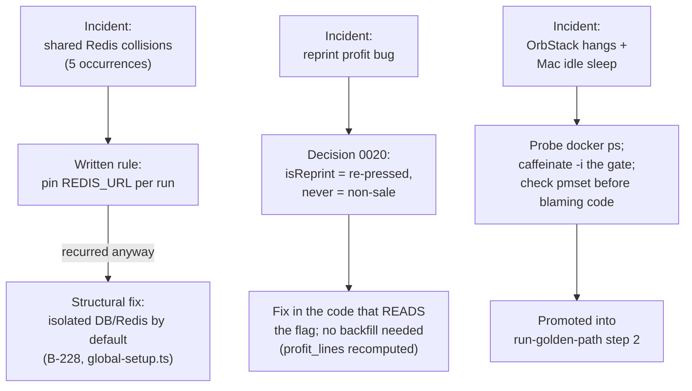

# Lesson 10.3 — Three real incidents, and how each one became a permanent fix

## 1. In one sentence
Three things actually went wrong while building InvAI — agents colliding on a shared Redis
database, a modeling bug that made every reprinted order look like a loss, and a container
runtime that silently hung and made a frozen laptop look like an AI stall — and each one is
worth studying because of *how* the team turned a one-time mistake into something that
can't easily happen again.

## 2. Why it exists
`invai-docs/team/lessons.md` is append-only and blameless by design: every row records
what happened, the root cause, the new rule, and — critically — *where that rule is now
enforced*. That last part is what separates a lesson from a complaint. A rule that only
exists as a sentence in a document gets forgotten under pressure; `operating-system.md`
calls this the **promotion ladder**: "a lesson that recurs moves into a playbook or role
file. If it can be checked mechanically, it becomes a test or a hook." All three incidents
below show that ladder actually working, including the uncomfortable parts — the shared-
Redis problem took *five separate incidents* before it got a structural fix instead of
another written reminder.

## 3. How it works

### Incident 1: the shared-Redis flakes — a rule that kept not being enough
This is the clearest example of why "write it down and tell everyone" is a weaker fix than
it feels like. The pattern repeated five times, each with a worse consequence than the last:
- **2026-09-29, wave 22**: BullMQ (job queue) tests had been failing intermittently in full
  backend runs since wave 20 and were being written off as flakes — random, unexplained
  failures nobody chased down. The actual cause: the test environment redirected Postgres
  to `invai_test`, but left `REDIS_URL` pointed at Redis DB 0, the same database any
  currently-running dev worker was also using. Two unrelated processes were reading and
  writing the same queue state. The fix proposed: every backend suite run sets its own
  Redis DB until the test environment does it by default — note the word "until," because
  the written rule alone was already understood to be a stopgap.
- **Same wave, a separate incident**: a relaunched agent found an earlier instance of
  itself — not actually dead, just thought stalled by the tech lead — still running. It
  committed, edited the report, and ran tests on the *same* test DB and Redis DB as the
  instance still alive, causing deadlocks and collisions. New rule: check `git log` and
  report file modification times before relaunching, and a relaunch uses new DB and Redis
  names with an `r2` suffix.
- **2026-09-29, T-23-9**: a scratch-DB reset wiped the shared dev Redis DB 0 queues anyway,
  because `db:reset` clears queues in the *default* `REDIS_URL` unless told otherwise.
- **2026-09-30, wave A2** — the third occurrence of parallel agents colliding on the shared
  `invai_test` database itself (not even Redis this time): one build run failed 8 files
  with foreign-key errors, the reviewer's run failed 3. The lesson entry says it plainly:
  "A written rule (pin your own DB) depends on every prompt and agent following it; the
  test setup itself shares one DB by default." The proposed fix changed category entirely —
  not another instruction, but making isolation **structural**: each test run creates its
  own DB and Redis DB unless one is explicitly set (tracked as backlog item B-228, in
  `invai-backend/src/test/global-setup.ts`).
- **2026-10-01, wave P5**: even after all of that, a scratch reset without a pinned
  `REDIS_URL` wiped the shared queues *again*, and a scratch seed without
  `SEED_OUTPUT_FILE` overwrote the shared seed output other agents were reading.

The honest takeaway isn't "the team is careless" — it's that a shared mutable resource
(one Redis instance, one test database) will keep producing this exact failure mode for as
long as fixing it depends on every agent remembering a written rule every single time. The
real fix was always going to be structural (isolate by default), and the lesson log shows
the team arriving at that conclusion only after enough repeated cost made the weaker fix's
limits undeniable.

### Incident 2: the reprint profit bug — a naming collision with real money attached
`invai-docs/decisions/0020-is-reprint-means-re-pressed.md` documents a bug with a precise,
almost funny root cause: three different database columns shared the name `is_reprint`
(`order_items.is_reprint`, `profit_lines.is_reprint`, `transfers.is_reprint`), and the
*only* code that ever wrote the item-level flag — `openReprint`
(`production/floor.ts:642`) — set it on the exact same item row when a unit failed QC and
had to be re-pressed. No code path ever created a separate "this is the reprint" row.
Production code read the flag correctly, as "this unit got re-pressed" (gang-sheet building
puts reprints first; a QC-fail replay checks it). But finance, refunds, re-import,
analytics, and the AI assistant all filtered `isReprint = true` **out**, treating it as "an
extra, non-sale unit" — a model of reprints that had simply never existed in the data. The
result: a reprinted order showed $0 revenue for that unit and a false loss, discovered
across 44 seed orders. Worse, re-importing an unshipped order whose only unit on a line had
been reprinted got treated as a brand-new line and added a *second* physical unit to ship —
a real, shippable mistake, not just a reporting one.

Decision 0020's fix is a one-line mental model, applied everywhere: **`isReprint` means
"re-pressed at least once." It is informational. It never decides whether a unit is a sale.
A sale unit is any non-cancelled order item.** The cost of a reprint already lives correctly
in the transfer cost (every transfer printed for that item is summed); the *count* of
reprints comes from the `reprints` table, not from filtering units out of revenue. The task
card that carried out the fix, `invai-docs/waves/P4/T-P4-1-reprint-revenue.md`, is worth
reading for what it reveals about fixing a bug like this safely: it's flagged with risk
tags `money` and `floor-correctness (never double-ship)`, assigned to `opus` (the most
careful model tier, per lesson 10.2), reviewed by a primary reviewer *plus* the architect as
mandatory co-reviewer specifically because the meaning of a shared field across modules was
the actual bug — exactly the kind of cross-module judgment call decision 0019 routes to
`architect`. No migration, no schema change, no backfill job were needed: because
`profit_lines` is recomputed per item rather than stored as a running total, correcting the
*code* that reads the flag automatically corrects every existing row the next time it's
recomputed.

### Incident 3: OrbStack hangs and the sleeping Mac — when "the AI is stuck" is actually "the laptop is stuck"
Two related but distinct infrastructure failures, both initially mistaken for something
else:
- **2026-09-28, wave 19, and again 2026-10-01, wave P4 (the third time in two days)**:
  several agents and the tech lead stalled for 600 seconds at a time, looking exactly like
  a model or usage-limit stall. The actual cause: OrbStack (the Docker-compatible container
  runtime this project runs on) had hung, so every Postgres and Valkey call blocked with no
  error message at all — just silence. By the third occurrence, it had frozen a QA run for
  8 minutes and stalled a web builder for roughly 3 hours with uncommitted edits sitting
  untouched. The fix moved from a reactive check ("when agents stall, run `docker ps`
  first") to a proactive one: when an agent's files and ports go quiet for 30 minutes,
  *probe* `docker ps` with a 15-second timeout, restart OrbStack if it's hung (`orb stop &&
  orb start`, then `docker compose up -d` in `invai-infra/local` — data volumes survive),
  and relaunch a bounded finisher on top of whatever work was left uncommitted. This is
  exactly the promotion ladder in action: the rule moved from the tech lead's resume
  checklist into `run-golden-path`'s own step 2, after recurring enough times to earn a
  permanent spot in a shared playbook.
- **2026-10-01, wave P6**: two gate runs failed outright — one test run took 142 seconds and
  another 681 seconds against a 30-second limit, and a `db:reset` deadlocked midway,
  leaving the dev database half-reset. The cause wasn't a code regression at all: `pmset -g
  log` showed the Mac had gone into idle sleep from 11:09 to 11:12 and again from 11:18 to
  11:29, stalling every open timer and database connection mid-run. The new rule has two
  parts, and both matter: run the gate under `caffeinate -i` (a macOS tool that prevents
  idle sleep for the duration of a command) so it can't recur, *and* — just as important —
  "before calling a timing failure a product bug, check `pmset -g log` for Sleep" first.
  That second half is really a lesson about diagnosis, not just prevention: a flaky-looking
  timing failure deserves a root cause before it gets written off as either "the test is
  flaky" or "the code has a bug," because sometimes the honest answer is "the machine went
  to sleep."

## 4. In our code
- `invai-docs/team/lessons.md` (2026-09-29 through 2026-10-01 rows) — every shared-Redis
  and shared-DB incident, in the exact words the team recorded them, each with its own
  rule and enforcement location.
- `invai-docs/decisions/0020-is-reprint-means-re-pressed.md` — the full reprint bug: the
  three colliding columns, the only writer (`production/floor.ts:642`), and the one-line
  fix rule.
- `invai-docs/waves/P4/T-P4-1-reprint-revenue.md` — the actual task card that fixed it,
  showing the risk flags, the `opus` model assignment, and the mandatory architect
  co-review.
- `invai-docs/team/lessons.md` (2026-09-28, 2026-10-01 rows) — the OrbStack-hang and
  Mac-sleep entries, each naming the exact command (`docker ps`, `orb stop && orb start`,
  `caffeinate -i`, `pmset -g log`) and where the rule now lives.
- `.claude/skills/run-golden-path/SKILL.md` step 2 — the promoted, permanent version of
  the OrbStack-hang check.

## 5. What it uses
- **`team/lessons.md`'s fixed columns** (date, source, what happened, cause, rule, where
  enforced) — a format that forces every entry to state not just what went wrong but
  where the fix actually lives, so "we learned a lesson" means something checkable.
- **The promotion ladder** — a lesson that recurs moves from a written reminder into a
  playbook, role file, test, or hook, in that order of increasing enforcement strength.
- **`caffeinate -i`** and **`pmset -g log`** (macOS tools) — a sleep-prevention wrapper and
  a sleep-history log, used together as both the fix and the diagnostic for the Mac-sleep
  incident.

## 6. Try it yourself
1. `grep -n -i "redis" invai-docs/team/lessons.md` and read the five rows in order, by
   date. For each one, write one sentence on whether its "new rule" was a written
   instruction or a structural/mechanical fix — and notice how the balance shifts as the
   same problem keeps recurring.
2. Read `invai-docs/decisions/0020-is-reprint-means-re-pressed.md`'s "Consequences"
   section and explain, in your own words, why fixing this bug needed *no* database
   migration and *no* backfill job, when the bug itself had been producing wrong numbers
   for a while.
3. `grep -n "orb stop\|caffeinate\|pmset" invai-docs/team/lessons.md .claude/skills/run-golden-path/SKILL.md 2>/dev/null` and trace one of these fixes from its first lessons.md row to wherever it ended up promoted into a permanent playbook step.

## 7. Common mistakes
- Calling something "just a flake" before root-causing it. The shared-Redis incident log
  literally opens with "BullMQ tests failed intermittently... and were treated as flakes" —
  the lesson explicitly promoted to a rule is "a 'flake' is root-caused before it is called
  one."
- Assuming a bug named after one field (`isReprint`) is contained to one module. The real
  fix touched finance, orders/re-import, analytics, market, and the AI assistant's own
  reads — because the same column, with the same wrong assumption baked into reader code,
  had been copied into every module that needed to know about reprints.
- Treating a hung container runtime or a sleeping laptop as a code problem first. Both
  OrbStack incidents and the Mac-sleep incident were initially indistinguishable from an AI
  usage-limit stall or a flaky test — the lesson in both cases is to check the actual
  infrastructure (`docker ps`, `pmset -g log`) before assuming the code is at fault.

## 8. Check yourself

1. Why did the shared-Redis problem need five separate incidents before it got a
structural fix, instead of being fixed the first time a written rule was proposed?

Because a written rule ("pin your own `REDIS_URL`") only works if every agent, every time,
remembers and applies it correctly across every command that touches Redis — and that
depends on a level of consistency that's hard to guarantee across many different agents and
situations, which is exactly why the team eventually concluded the fix had to be structural
(isolated by default) rather than another instruction.

2. The reprint bug fix needed no backfill job for existing wrong data. What
property of `profit_lines` made that true?

`profit_lines` rows are recomputed (upserted) per item rather than stored as a permanently
fixed historical record, so correcting the code that computes them automatically corrects
every row the next time the normal recompute jobs (nightly, or an explicit
`finance.recompute` call) run — there was never a separate "fix the old rows" step needed.

3. The Mac-sleep lesson's fix has two parts: wrap the gate in `caffeinate -i`,
*and* check `pmset -g log` before calling a timing failure a bug. Why is the second part
just as important as the first?

Because the first part only prevents this *specific* cause of a timing failure going
forward — it doesn't help diagnose a *different* timing failure in the future, or avoid
wrongly blaming the code (or calling it a flake) the next time something unrelated causes a
test to run slow; checking the actual system log first is a general diagnostic habit, not
just a one-time fix.

## 9. Words to know
- **Promotion ladder** — the path a recurring lesson takes from a written reminder, to a
  playbook or role-file rule, to a mechanically enforced test or hook, as it keeps
  recurring.
- **Structural fix** — a fix that makes the correct behavior the *default*, so it can't be
  skipped by forgetting a step, as opposed to a written rule that depends on being
  remembered every time.
- **`caffeinate -i`** — a macOS command that prevents the machine from idle-sleeping for as
  long as the wrapped command runs.
- **Root-causing a flake** — finding the actual, specific cause of an intermittent failure
  before writing it off as random, since an unexplained "flake" is often a real, repeatable
  bug (a shared Redis DB, a sleeping laptop) hiding behind a misleading label.
