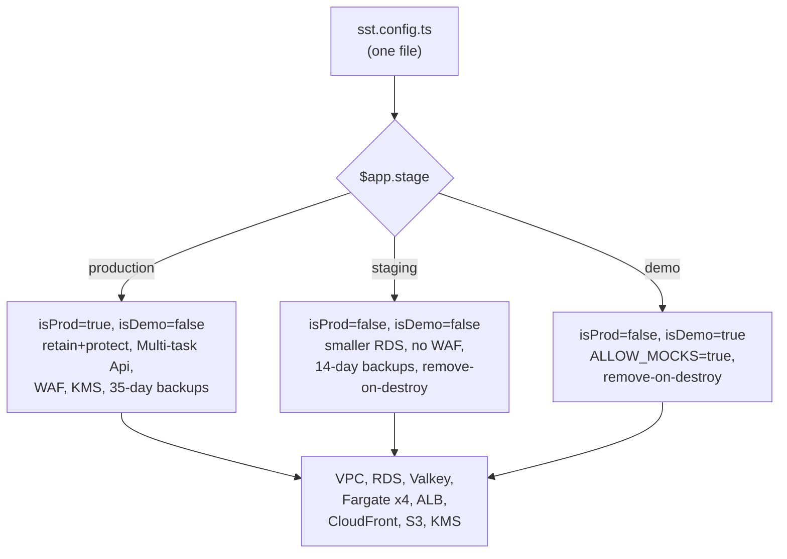

# Lesson 11.1 — Three stages, one config file, nothing deployed yet

## 1. In one sentence
InvAI's AWS setup is written entirely as TypeScript infrastructure-as-code (SST v3), with
one `sst.config.ts` describing `production`, `staging`, and `demo` stages that differ only
in size and a few safety flags — and as of this course, none of it has actually been
deployed; it has only been priced and reviewed.

## 2. Why it exists
Local development (module 3's Docker Compose stack) proves the product works. It doesn't
prove it can run reliably on real infrastructure, behind a real domain, with real secrets,
at a cost someone has actually calculated. Getting from "works on my machine" to "a real
shop can use this" needs the same thing module 4 needed for tenancy and module 6 needed
for reliability: a design written down once, reviewed before anything risky happens, with
every assumption explicit. SST (**S**erverless **S**tack) is how InvAI expresses "here is
exactly what AWS resources this needs" as ordinary, typecheckable TypeScript, instead of as
a pile of console clicks nobody can diff or review.

## 3. How it works

### One file, three stages, decided by a string
`invai-infra/sst.config.ts:1-15` states the whole shape up front, in a comment: stages are
`production`, `staging`, and `demo` — "`demo` [is] the only stage that may boot on mock
providers (`ALLOW_MOCKS=true`)." Any other stage name just behaves like staging. The
actual branching logic is three booleans computed once (`:32-34`):
```ts
const stage = $app.stage;
const isProd = stage === "production";
const isDemo = stage === "demo";
```
Every resource definition after that reads `isProd ? ... : ...` rather than having separate
config files per environment — one RDS instance definition, sized differently
(`instance: isProd ? "t4g.medium" : "t4g.small"`, `storage: isProd ? "100 GB" : "20 GB"`),
one backup policy (`backupRetentionPeriod: isProd ? 35 : 14`), one deletion-protection
setting (`deletionProtection: isProd`). This matters for the same reason a single
`ITEM_TRANSITIONS` table (module 4) matters more than duplicated logic in several places:
staging and production can't quietly drift apart, because they're generated from the exact
same code path with one flag flipped.

Production also gets two extra guarantees at the `$config` level that aren't about any
individual resource (`sst.config.ts:17-24`): `removal: "retain"` (don't actually delete
production's resources if the stack is torn down) and `protect: true` (SST itself refuses
an accidental destroy). Staging and demo both default to `remove` — disposable by design,
because they're meant to be rebuilt freely.

### What actually gets created
The inventory in `invai-docs/ops/cost-estimate-aws.md` §1 is the clearest map of what
`sst.config.ts` actually describes: a VPC across 2 availability zones with EC2-based NAT;
RDS PostgreSQL 17, single-AZ (no Multi-AZ in either stage yet — a real gap flagged
explicitly, not hidden); an RDS Proxy in production only; ElastiCache Valkey, single node,
cluster mode off, with `maxmemory-policy: noeviction` (the same P0 requirement module 3
and module 6 already established matters for a reliable job queue); an ECS Fargate
cluster running four services — **Api** (behind an ALB, 0.5 vCPU/1 GB, autoscaling
1→2 in staging, 2→6 in production, `sst.config.ts:419-420`), **Worker** (1 vCPU/2 GB, fixed
at 1 task — BullMQ jobs, module 6), **Imaging** (2 vCPU/8 GB, the single largest line item,
sized for gang-sheet compose's peak memory use, not idle), and a one-off **Migrate** task
that runs only during a release (`sst.config.ts:445-451`: "bootstrap `invai_app` → migrate →
reference seed... connects as the owner role, reads the app role's name and password from
`DATABASE_URL`" — the exact `withSystem`-vs-`withTenant` distinction from module 4 still
applies at deploy time). CloudFront fronts the static `Web` and `Floor` sites; WAF web ACLs
exist only in production (`if (isProd)`); and every secret goes through AWS SSM Parameter
Store as `SecureString` (`toSsm(...)`) rather than AWS Secrets Manager — a deliberate
choice that's also free at the standard tier.

### Health checks that don't punish a degraded dependency
`sst.config.ts:406-414`'s comment on the Api service's load-balancer health check is a
small but telling design decision: it points at `/readyz`, not `/health`, specifically
because "`/readyz` checks DB and Redis only (a down imaging or S3 degrades a feature, it
must not pull every api task out of the target group)." If the imaging service or S3 has a
problem, that's a real, visible failure for whatever feature needs them (gang-sheet
compose, a file download) — but it shouldn't make the load balancer conclude the *entire*
API is unhealthy and stop routing traffic to it. This is the same "fail open where it's
safe to" instinct module 6 covers for rate limiters, applied to infrastructure health
checks.

### Secrets and encryption follow the tenant model into production
Two details connect straight back to module 9: `backendEnvironment.FIELD_ENCRYPTION_
PROVIDER: "kms"` (`sst.config.ts:375-377`) is production's upgrade path from the static
key ring (lesson 9.2) to AWS KMS envelope encryption — "the static `FIELD_ENCRYPTION_KEY`
stays in the key ring" as a fallback/compatibility path, with a dedicated `kmsPermission`
object scoping exactly which actions (`Encrypt`, `Decrypt`, `GenerateDataKey`) and which
key ARN each service's IAM role can use — the same least-privilege instinct the findings
log's S-45 fix enforced for SSM parameter access. And `ALLOW_MOCKS: isDemo ? "true" :
"false"` (`:378-379`) means production and staging can *never* silently fall back to a
mock provider (module 6's "never remove a mock, but never let production use one by
accident" rule) — only the `demo` stage is allowed to.



## 4. In our code
- `invai-infra/sst.config.ts:1-34` — the stage flags (`isProd`, `isDemo`), the `$config`
  app-level `removal`/`protect` settings.
- `invai-infra/sst.config.ts:109-130` — RDS sizing and backup/deletion-protection policy
  per stage.
- `invai-infra/sst.config.ts:355,406-432` — Imaging's autoscaling ceiling, Api's `/readyz`
  health check and its production-only 2→6 autoscaling.
- `invai-infra/sst.config.ts:363-379` — the backend environment: KMS field encryption
  provider, the RDS CA bundle for `sslmode=verify-full`, `ALLOW_MOCKS` gated to `isDemo`
  only.
- `invai-infra/sst.config.ts:445-460` — the one-off `Migrate` task's bootstrap → migrate →
  seed sequence, run via `pnpm release:migrate --stage <stage>`.
- `invai-docs/ops/cost-estimate-aws.md` §1 — the full resource inventory, read straight off
  this same config file.

## 5. What it uses
- **SST v3** — infrastructure-as-code in TypeScript, with pre-built components
  (`sst.aws.Service`, `sst.aws.Postgres`, `sst.aws.Redis`, `sst.aws.Bucket`, ...) that wrap
  the underlying AWS resources; `read-before-change`'s own library table warns that SST's
  defaults "bite" and to check `.sst/platform/src/components/aws/*.ts` rather than guessing
  from docs written for another version.
- **AWS Fargate (ECS)** — serverless containers, chosen so the team doesn't manage EC2
  instances directly for the Api/Worker/Imaging/Migrate services.
- **AWS SSM Parameter Store (`SecureString`)**, not Secrets Manager — free at the standard
  tier, and the sole path every secret takes into a running container.
- **AWS KMS** — envelope encryption for buyer PII in production, replacing (eventually)
  the static key ring from lesson 9.2.

## 6. Try it yourself
1. `grep -n "isProd ? \|isDemo ? " invai-infra/sst.config.ts | head -15` and, for three of
   the lines you find, state in one sentence what would be different between staging and
   production if that specific ternary didn't exist.
2. Read the comment at `sst.config.ts:406-409` about `/readyz` versus `/health` again, then
   check `invai-backend/src/api/app.ts`'s `/health` route (module 9, finding S-30) — explain
   in one sentence why these are two different endpoints serving two different purposes.
3. `grep -n "removal\|protect" invai-infra/sst.config.ts` and explain what would happen,
   concretely, if someone ran a destroy command against the `production` stage with these
   settings in place, versus against `staging`.

## 7. Common mistakes
- Assuming "it's in `sst.config.ts`" means "it's running." As of this course, `sst
  deploy` has never been run against a real AWS account for this project — everything in
  this lesson has been reviewed and priced (lesson 11.2) but not exercised against real
  infrastructure. Treat the config as a reviewed design, not a live system.
- Reading SST component defaults from general documentation instead of the exact installed
  version's source. `read-before-change`'s own warning table exists because "SST (v3)...
  defaults bite" — the generated `.sst/platform/src/components/aws/*.ts` files are the
  actual truth for what a component does with this installed version.
- Treating `/health` and `/readyz` as interchangeable. One answers "is this process alive
  and its dependencies visible" (used by a human or a monitoring dashboard); the other
  answers "should the load balancer keep sending this task traffic" (used by the ALB
  itself) — conflating them means a degraded non-critical dependency (imaging, S3) can take
  the whole API out of rotation for no good reason.

## 8. Check yourself
<details>
<summary>1. Why does production get `removal: "retain"` and `protect: true` while staging
and demo default to `remove`?</summary>

Because staging and demo exist to be rebuilt and torn down freely during development and
testing, while production holds real data that must never be destroyed by an accidental or
automated teardown — the two settings together make a destructive mistake structurally
harder specifically on the one stage where it would actually matter.
</details>

<details>
<summary>2. The Api service's health check points at `/readyz`, which checks only DB and
Redis. What's the risk of instead pointing the load balancer's health check at a `/health`
endpoint that also reports on imaging and S3?</summary>

If imaging or S3 has a transient problem, every Api task would start failing the ALB's
health check at once and get pulled out of the target group — taking down request handling
for features that don't even depend on imaging or S3, instead of letting just the affected
feature degrade while the rest of the API keeps serving traffic.
</details>

<details>
<summary>3. Why does `ALLOW_MOCKS` get set to `isDemo ? "true" : "false"` instead of being
left as an environment variable someone sets by hand per deploy?</summary>

Because leaving it to be set by hand means a human has to remember, every time, not to
accidentally enable mocks on a real production or staging deploy — tying it directly to
the stage name in the config makes it structurally impossible for production or staging to
run on mock providers, the same "make the safe thing the default" principle as the
Redis-isolation fix in lesson 10.3.
</details>

## 9. Words to know
- **SST (Serverless Stack)** — infrastructure-as-code written in TypeScript, with
  pre-built components for common AWS resources, used for InvAI's AWS configuration.
- **Stage** — SST's name for an environment (`production`, `staging`, `demo`, or an
  ad-hoc name like `pr-123`); one config file branches on the stage name rather than using
  separate files per environment.
- **Fargate** — AWS's serverless container-running service; InvAI's Api, Worker, Imaging
  and one-off Migrate processes all run on it, so no EC2 instance is managed directly.
- **`/readyz` vs. `/health`** — a load-balancer-facing readiness check (only the hard
  dependencies that should pull a task out of rotation) versus a human/monitoring-facing
  status check (reports on everything, including degraded-but-not-fatal dependencies).
- **KMS envelope encryption** — AWS's managed key-encrypts-key scheme, production's planned
  upgrade from the static `FIELD_ENCRYPTION_KEY` ring described in lesson 9.2.
