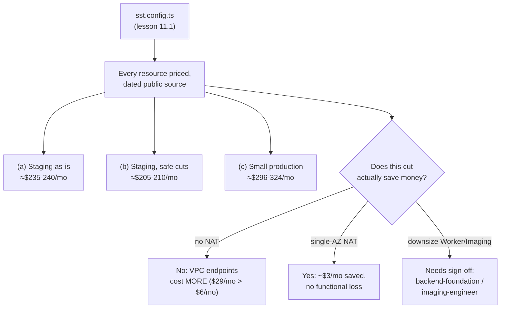

# Lesson 11.2 — What InvAI would cost to run, priced before a dollar is spent

## 1. In one sentence
Before anything was deployed, `invai-docs/ops/cost-estimate-aws.md` priced every single
resource in `sst.config.ts` against real, dated AWS and Anthropic list prices, so the
owner can see roughly $235–240/month for staging and roughly $296–324/month for a small
(1–3 shop) production — plus exactly which lines are the biggest, and which proposed cuts
are real savings versus false economy.

## 2. Why it exists
"How much will this cost?" is a question that's easy to answer badly — either by guessing,
or by not answering it until the first real AWS bill arrives. Module 11.1's `sst.config.ts`
describes real, billable resources; pricing them *before* deployment means a cost surprise
gets caught during review instead of during the owner's first invoice. And because nothing
was actually running yet, the whole exercise had to be disciplined about the difference
between "priced from the config as it exists" and "measured from a real bill" — the
document says this about itself in its very first lines: "Read-only exercise: no `aws` or
`sst` command was run, nothing was deployed... Actual bills will differ."

## 3. How it works

### Every price has a source and a fetch date
`cost-estimate-aws.md` §2 is a table of roughly 30 unit prices — Fargate ARM vCPU-hours,
RDS instance classes, ElastiCache node types, ALB and WAF rates, S3 storage and request
pricing, CloudWatch Logs, KMS, SES, Anthropic and OpenAI per-million-token rates, GitHub
Actions minutes — and every single row cites where the number came from and when it was
fetched (2026-09-30, or 2026-10-01 for the Anthropic/OpenAI comparison). This matters
because a cost estimate with no source is just a guess dressed up as a number; one with a
dated source can be checked, and re-checked when prices change.

### Three scenarios, not one number
Rather than one "it costs $X" figure, the document prices three concrete situations:
- **(a) Staging as configured today** — ≈$179/mo in AWS resources, plus ≈$2–6/mo in
  Anthropic usage (light dev/QA smoke calls) and ≈$52/mo in GitHub Actions overage, for a
  total of **≈$235–240/mo**.
- **(b) Staging with realistic cost cuts** — single availability zone instead of two, the
  smallest RDS instance class, and (as a separate, bigger, not-yet-built step) a scheduled
  stop/start of the database outside testing hours — bringing the AWS subtotal to
  **≈$150/mo** and the total to **≈$205–210/mo**.
- **(c) Small production (1–3 pilot shops)**, priced at the *minimum* always-on footprint
  rather than the autoscaled ceiling — **≈$286/mo** in AWS resources plus **≈$10–38/mo** in
  Anthropic usage, for a total of **≈$296–324/mo**, called "≈$310/mo" for a round number.

Separating these three matters because they answer different questions: (a) is "what does
it cost to keep staging running right now," (b) is "what's the cheapest responsible way to
run staging," and (c) is "what does a first real pilot actually cost" — collapsing them
into one number would hide which lever is being pulled.

### The most useful part: a cut that turns out not to be a cut
§4's "no NAT" analysis is the single best example of why this kind of modeling earns its
keep. The obvious-looking cost cut — remove the NAT (Network Address Translation) gateway
entirely, since it's an always-on line item — turns out to **cost more money**, not less,
once the actual mechanism is traced through: "Fargate's own container agent needs a network
path to pull the image from ECR and to resolve the `ssm:` secrets in the task definition...
Without NAT, that path has to come from VPC interface endpoints: `ecr.api`, `ecr.dkr`,
`logs`, and `ssm` at minimum — 4 endpoints × $0.01/hr × 1 AZ × 730h = **$29.20/mo**, before
any data-processing charge. That's more than the $3.07–6.13/mo the NAT EC2 instance(s) cost
in the first place." The recommendation that follows — keep NAT, take the single-AZ cut
instead, which saves almost the same amount without breaking task startup — is exactly the
kind of finding that only shows up when someone actually traces the dependency chain
instead of eyeballing which line item looks biggest.

### Usage-based costs get their own honest math
§6 walks through Anthropic token costs specifically, because — unlike a fixed Fargate task
size — AI usage scales with how much shops actually use the product. It starts from real
code: `invai-backend/src/ai/models.ts`'s `ROUTES` and `MODEL_PRICES`, and the Starter plan's
500-AI-credit/shop/month allowance (`billing/service.ts`'s `PLAN_CATALOG`). From there it
gives a **low/typical/high** range (≈$10/mo, ≈$25–30/mo, ≈$37.50/mo for 1–3 shops at full
allowance) rather than one number, because the actual mix of input tokens, output tokens,
and cached reads genuinely varies by usage pattern — and it notes the OpenAI fallback
provider (decision 0021, module 7) runs at roughly 40% of Opus 5's per-token cost, so the
same credit usage costs proportionally less if a shop's calls route through it. GitHub
Actions minutes get the same treatment: real commit-rate data from the last 6 days of `git
log` (≈388 min/day, ≈11,620 min/mo) rather than a guess, with an explicit caveat that this
measures "intense multi-agent build activity," not necessarily a calmer steady state once
the team is done building.

### Who's allowed to make which cut
§8's recommended-cuts list is careful about authority, not just arithmetic: the single-AZ
NAT and smallest-RDS-class cuts for staging are marked as "all in `platform-sre`'s own
paths... no cross-role sign-off needed" — because they don't touch anyone else's area of
responsibility. But downsizing the Worker or Imaging Fargate tasks needs
`backend-foundation` to confirm BullMQ throughput still holds, or `imaging-engineer` to
confirm the render budget (module 7's peak-RSS and decode-pixel-cap rules) still holds —
and the document says plainly, "I did not apply these myself — they cross into other
roles' owned budgets." This is module 10's ownership model showing up inside a cost
estimate: even a seemingly pure infrastructure decision can have a correctness consequence
owned by a different role, and the estimate respects that boundary instead of just making
the call.

## 4. In our code
- `invai-docs/ops/cost-estimate-aws.md` §0–1 — what was priced, and the full resource
  inventory read off `sst.config.ts`.
- `invai-docs/ops/cost-estimate-aws.md` §2 — every unit price, with its source URL and
  fetch date.
- `invai-docs/ops/cost-estimate-aws.md` §3–5 — the three scenarios (staging as-is, staging
  with cuts, small production), each as a line-by-line table.
- `invai-docs/ops/cost-estimate-aws.md` §4 — the "no NAT" finding: why removing NAT costs
  more than keeping it, with the exact VPC-interface-endpoint math.
- `invai-docs/ops/cost-estimate-aws.md` §6 — Anthropic token-cost math tied to
  `invai-backend/src/ai/models.ts` `MODEL_PRICES` and the Starter plan's 500-credit
  allowance.
- `invai-docs/ops/cost-estimate-aws.md` §8 — the ranked list of cost drivers and which
  cuts need another role's sign-off.
- `.claude/skills/cost-review/SKILL.md` (backed up in `invai-docs/team/skills/`) — the
  recurring monthly playbook this one-time estimate feeds into once something is actually
  deployed.

## 5. What it uses
- **Public, dated list prices** — no committed-use discounts, Reserved Instances, or
  negotiated rates are assumed anywhere, so the estimate is deliberately conservative
  (likely an upper bound) rather than optimistic.
- **Real code as the source of usage assumptions** — `models.ts`'s pricing table and
  `PLAN_CATALOG`'s credit allowance drive the Anthropic estimate; real `git log` commit
  rates drive the GitHub Actions estimate — not guesses.
- **A scenario table, not a single figure** — because "what does InvAI cost" has a
  different honest answer depending on which stage and which configuration is actually
  asked about.

## 6. Try it yourself
1. Read §4's "no NAT" finding in full, then explain in your own words why Fargate's own
   container agent — not the application code — is the reason this specific cut doesn't
   work. What two AWS services does a Fargate task need to reach even before your own code
   starts running?
2. `grep -n "fetched 2026-09-30\|accessed 2026-" invai-docs/ops/cost-estimate-aws.md | wc
   -l` to see roughly how many individually dated sources back this estimate, then pick
   one price row and (if you have internet access) check whether that source's number has
   since changed.
3. In §6, compare the Anthropic "low" and "high" cost estimates for 1–3 shops. Write one
   sentence on what real-world difference in usage pattern (caching, output length)
   would move a shop from the low end to the high end.

## 7. Common mistakes
- Treating a cost estimate like this as a bill. The document's own first paragraph warns
  against this: "This is a **model**, not a bill... once anything is deployed, replace it
  with AWS Cost Explorer / Anthropic Console numbers via the monthly `cost-review`."
- Picking the resource that *looks* biggest and cutting it without tracing what it's
  actually needed for. The NAT example is the textbook counter-case: the obvious cut was
  the wrong one, and only tracing the actual dependency (image pulls, secret resolution)
  revealed that.
- Making a cut that crosses into another role's area of correctness (downsizing a worker
  or an imaging task) without that role's sign-off, just because the infra change itself is
  a one-line config edit. A config change being easy to make doesn't mean its consequences
  are easy to evaluate.

## 8. Check yourself

1. Why does the cost estimate separate "staging as configured today" from
"staging with realistic cost cuts," instead of just estimating the cut version?

Because the current, unoptimized configuration is what the team is actually running right
now and would actually be billed for if deployed as-is — showing both numbers makes the
*size* of the available savings visible and checkable, rather than presenting an optimized
number as if it were already the reality.

2. The "no NAT" cut looked like an obvious saving (NAT is an always-on line item)
but turned out to cost more. What made this finding possible — guessing, or something
else?

Tracing the actual dependency chain: Fargate's container agent needs network access to
pull images from ECR and resolve SSM secrets, and without NAT that access has to come from
paid VPC interface endpoints — a mechanism only visible by reading how the specific AWS
services involved actually work, not by comparing line-item dollar amounts at a glance.

3. Why does the Anthropic cost section cite `invai-backend/src/ai/models.ts`'s
`MODEL_PRICES` and the plan's credit allowance, instead of just estimating "AI costs
something, call it $X/mo"?

Because the actual per-token prices and the actual plan limit are both already defined in
real code, and using them ties the cost estimate to the same numbers that will govern real
billing and real usage limits once shops are live — a made-up placeholder number would be
disconnected from what the system will actually enforce.

## 9. Words to know
- **List price** — a vendor's published, undiscounted price, used here because no
  committed-use discount or negotiated rate exists yet.
- **NAT (Network Address Translation)** — lets resources in a private subnet reach the
  internet (or AWS services) without being directly internet-facing; removing it entirely
  turned out to require paid replacements (VPC interface endpoints) that cost more.
- **VPC interface endpoint** — a private, paid network path from a VPC directly to a
  specific AWS service (ECR, SSM, CloudWatch Logs), avoiding a trip through NAT or the
  public internet for that service's traffic.
- **Scenario-based estimate** — pricing several concrete configurations (staging as-is,
  staging optimized, a small production) instead of giving one number, so the estimate
  answers "what does this specific setup cost," not an average that fits nothing exactly.
