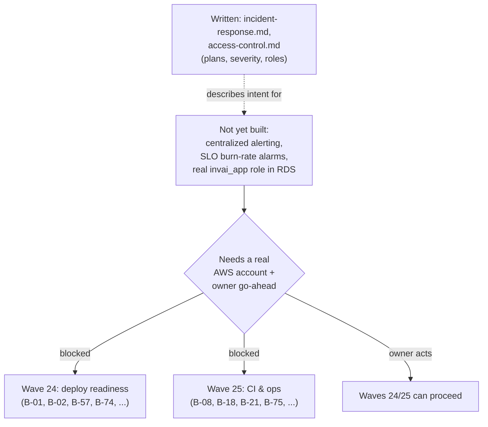

# Lesson 11.3 — Written plans, honest gaps, and why waves 24/25 are paused

## 1. In one sentence
InvAI's operational story is deliberately two-layered right now: a written incident-
response plan and access-control policy exist and are detailed, but the actual monitoring,
alerting, and AWS deployment they describe don't exist yet — and the team has explicitly
paused the two waves that would build them, waiting on the owner.

## 2. Why it exists
It's tempting to write "we have monitoring" once a plan for monitoring exists. InvAI's ops
documentation refuses that shortcut on purpose. `invai-docs/ops/access-control.md`
states the rule directly: "Every 'not yet' below is a real gap... **MUST NOT** answer
'yes' on a questionnaire for anything marked `[[OWNER]]` or 'not yet' here without new
evidence." This matters beyond honesty for its own sake — Amazon's SP-API Data Protection
Policy, Shopify's App Store security questionnaire, and any future pilot shop's own
security review will all ask these exact questions, and answering "yes" to something that
isn't actually true yet is the kind of gap that gets discovered at the worst possible time.

## 3. How it works

### What's written, and what it's for
Two ops documents exist today, both written for backlog item B-10: `incident-response.md`
and `access-control.md`. Each states its own purpose precisely: "This is the written
version of the `incident-response` playbook... which every agent runs during a real
incident; this document is what we show Amazon, Shopify, pilots and counsel as evidence
the plan exists." That's a specific, narrow claim — it's evidence a *plan* exists, not
evidence the plan has ever been exercised against a real incident. The severity table
(SEV1 through SEV4) ties directly back to module 9's language: SEV1 is explicitly "PII or
cross-tenant exposure (suspected is enough)... a leaked secret with data access, data loss,
or every shop blocked" — the same category of harm the security findings log's "High"
severity describes. Roles are assigned (an incident commander, usually `platform-sre`, or
`tech-lead` for a security SEV1; `customer-success` and `compliance-officer` draft outward
messages, never send them — "the human owner... keeps every outbound message, the Amazon
notice, spending, deploys, rollbacks and secret rotation").

### Detection: honest about having none yet
`incident-response.md` §3 doesn't dress up what exists: "No centralized alerting, log
store or SLO burn-rate alarms are wired up yet." Until that's built, detection is ad hoc —
whoever is working notices something's wrong, not an alert that pages someone. This is
flagged as research gap G30, and the two playbooks that own actually closing it
(`define-slo` and `add-observability`) are named explicitly as future work, not pretended
to already be running.

### Access control: naming the specific gaps, not just the categories
`access-control.md` is the more detailed of the two, and its format is worth studying
because of how specific each gap is. It's not "access control is incomplete" — it's rows
like this: database roles are correctly split locally (`invai` the table-owning migration
role, `invai_app` the RLS-respecting app role, matching module 4's `withTenant`/
`withSystem` split exactly) — but in the AWS config today, `sst.aws.Postgres` "only
provisions the master (owner) user," so `DATABASE_URL` in `sst.config.ts` currently points
the app *at the owner role*, meaning RLS wouldn't actually be enforced if this were
deployed as-is right now. The document calls this out as a named **P0** (must-fix-before-
any-AWS-use) item, not left implicit for someone to discover during a real deploy.

Another gap worth knowing because of what it reveals about hooks (module 10): the written
policy says GitHub branch protection on `main` should be owner-set, and the guard hook
blocks the literal command `gh repo edit`. But the document also records that it was
*probed directly* during a review: the way branch protection is actually normally set
(`gh api -X PUT repos/<org>/<repo>/branches/main/protection ...`) was tried against the
real hook and returned success — not blocked. "This is a real gap, not a documentation
error" — tracked as backlog item B-189, with the honest conclusion stated plainly: "Until
B-189 lands, the only thing stopping an agent from calling that API is this written
policy, not a technical control." This is the same distinction lesson 10.2 drew between
decisions (process, trusted to be followed) and the guard hook (mechanical, can't be
argued with) — and here, the document is caught admitting that a specific risky action
currently sits on the wrong side of that line.

### What's still paused, and why
`invai-docs/waves/status-2026-10-01.md:7` states the current wave count plainly: "v1
(2026-09-23/24), waves 1–23b, analytics A1–A2, polish P1–P7. Waves 24–25 are paused
(below)." The reason, per the same document (§"Paused: waves 24 and 25"): "They wait for
an AWS account and the owner's go-ahead; nothing in them can be verified locally." That's
not an arbitrary pause — it's the direct consequence of rule-following from module 10:
deploying to real AWS, spending real money, and creating real cloud accounts are all on
the explicit always-escalate list (lesson 10.1), so work that can genuinely only be
*verified* against a real AWS account structurally cannot proceed past planning and
local-config-review until the owner acts.

- **Wave 24 (deploy readiness)** covers exactly the gaps `access-control.md` names: B-01
  (create the real `invai_app` role in RDS so RLS actually applies — the P0 gap above),
  B-02 (Valkey production settings), B-03/B-59 (migrations as a real deploy step), B-57
  (the remaining SST deploy blockers), B-58 (email via SES), B-73/B-74 (S3 lifecycle rules
  and RDS production settings), B-77 (missing SST secrets), B-190/B-107 (production CSP,
  WAF, bundle size).
- **Wave 25 (CI and operations)** covers B-08 (dependency/secret/container scanning —
  Amazon's own 30-day scan requirement), B-18 (the observability baseline: traces, logs
  with `company_id`/`request_id`/`trace_id`), B-21 (CI hardening — the SHA-pinning gap
  `access-control.md` also names), B-22 (E2E in CI), B-37 (SSE fan-out, autoscaling), B-75
  (alarms, budget, log retention), B-76 (the deploy pipeline itself).

Everything in both waves has been *planned* — the backlog rows exist, their owners are
named, their dependencies on research gaps are cited — but none of it has been *built*
against anything real, because there's nothing real yet to build it against.

## 4. In our code
- `invai-docs/ops/incident-response.md` §1-3 — severities, roles, and the explicit
  "no centralized alerting yet" admission.
- `invai-docs/ops/access-control.md` §1,3 — the real `invai_app`-role-in-RDS gap (P0), with
  the exact `sst.config.ts` comment it's quoting.
- `invai-docs/ops/access-control.md` §2 — the branch-protection guard-hook gap (B-189),
  including the exact command that was tested and found unblocked.
- `invai-docs/ops/README.md` §"What's planned but not written yet" — the list of files
  (`incidents/`, `postmortems/`, `alerts.md`, `slos.md`, `restore-drills.md`,
  `cost-reviews/`, `releases/`) that don't exist until a real task card creates them, with
  an explicit instruction to check with `ls` rather than assume.
- `invai-docs/waves/status-2026-10-01.md:7,29-37` — the current wave count and the full
  list of backlog items waiting in waves 24 and 25.
- `invai-docs/waves/backlog.md` — B-01 through B-190, each row naming its owner and the
  research gap it closes.

## 5. What it uses
- **`[[OWNER]]` markers** — a consistent notation in ops docs flagging exactly which
  controls need the human owner's action (an AWS console click, a GitHub repo setting), so
  a reader can tell "policy, enforced by code" apart from "policy, waiting on a person"
  at a glance.
- **Named research gaps** (G15, G29, G30, from `invai-docs/research/12-security-quality-
  playbook.md`) — every written policy traces back to a specific, numbered gap it's
  closing, rather than existing in isolation.
- **Backlog rows with explicit dependencies** — each wave-24/25 item names what it's
  blocked on (an AWS account, a specific key, an approval), so "paused" is a checkable
  claim with a specific unblocking condition, not a vague "later."

## 6. Try it yourself
1. `grep -n "\[\[OWNER\]\]" invai-docs/ops/access-control.md | wc -l` to count how many
   distinct controls are currently marked as waiting on the human owner, then read three
   of them and classify each as "needs a real AWS account to exist" versus "needs a
   decision only a human can make" (they're not the same kind of blocker).
2. Read the branch-protection gap in `access-control.md` §2 in full (the `gh api -X PUT`
   probe). Explain in one sentence why finding this gap through an actual tested command,
   rather than by reading the hook's code and assuming it covered this case, was the right
   way to discover it.
3. `grep -n "Wave 24\|Wave 25" invai-docs/waves/status-2026-10-01.md` and pick three
   backlog ids from either wave. For each, trace it in `invai-docs/waves/backlog.md` and
   write one sentence on what real-world event would have to happen before that specific
   item could be built and verified.

## 7. Common mistakes
- Reading a written policy document and concluding the thing it describes already exists.
  `access-control.md`'s own stated rule exists specifically to prevent this: a written
  policy is evidence a plan exists, not evidence the plan is implemented.
- Assuming "paused" means "forgotten" or "deprioritized." Waves 24 and 25 are fully
  planned, with every backlog item's owner and dependency already recorded — the pause is
  a structural consequence of needing a real AWS account and the owner's go-ahead to verify
  any of it, not a loss of intent to build it.
- Treating every `[[OWNER]]` gap the same way. Some need a real AWS account to exist before
  anything can be configured (the `invai_app` RDS role); others need a human decision with
  no technical blocker at all (turning on GitHub's secret scanning). Conflating the two
  makes it harder to tell what's actually next.

## 8. Check yourself

1. Why does `incident-response.md` explicitly admit "no centralized alerting...
wired up yet," rather than describing the planned design as if it already existed?

Because this document is meant to be shown to Amazon, Shopify, pilots, and counsel as
evidence of InvAI's actual security posture — overstating what exists would mean a false
answer on a real compliance questionnaire, which is exactly the failure mode the
`[[OWNER]]`/"not yet" convention exists to prevent.

2. Why is "`invai_app` doesn't actually exist in RDS yet, so `DATABASE_URL` would
point at the owner role" marked as a P0 (must-fix-before-any-AWS-use) issue rather than a
normal backlog item?

Because if this were deployed as-is, every request would run as the unrestricted owner
role instead of the RLS-respecting app role — meaning Row-Level Security, the core tenancy
protection from module 4, would not actually be enforced at all in a real deployment,
which is a tenant-isolation failure of the highest severity the moment real data exists.

3. Waves 24 and 25 are described as "paused," not "cancelled" or "deprioritized."
What's the actual mechanism that would un-pause them?

Per `status-2026-10-01.md`, they wait specifically for an AWS account and the owner's
go-ahead — because nothing in either wave can be verified without a real account to deploy
against, so the moment the owner provides both, the already-planned backlog items in those
waves can proceed exactly as scoped.

## 9. Words to know
- **`[[OWNER]]` marker** — a notation in ops docs flagging a control that requires the
  human owner's direct action (an account, a credential, a repo setting) rather than
  something an agent can configure in code.
- **P0 (priority zero)** — the highest urgency tag for a gap, meaning it must be fixed
  before a specific risky action (here, any real AWS deployment) is allowed to proceed.
- **SEV1–SEV4** — InvAI's incident severity scale, from PII/cross-tenant exposure or a
  total outage (SEV1) down to a cosmetic issue or near-miss (SEV4).
- **Incident commander (IC)** — the role that directs a live incident (decides, keeps the
  timeline, assigns work) without fixing code itself, kept separate from the fixers.
- **Research gap** — a numbered item in `invai-docs/research/` identifying a known missing
  control; written ops policies and backlog items both trace back to these gap numbers so
  the reasoning behind a policy is always checkable.
