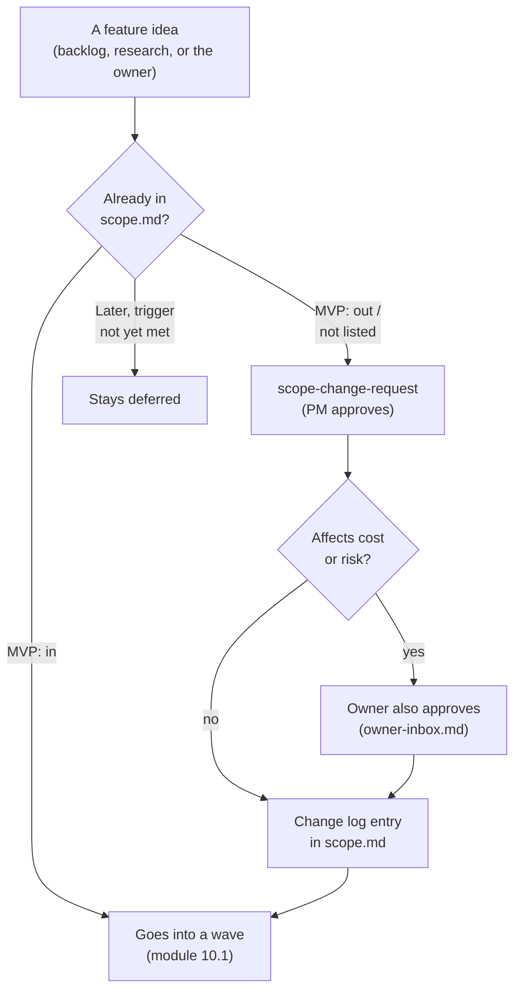

# Lesson 12.1 — Scope: one file that says what gets built, and what explicitly doesn't

## 1. In one sentence
`invai-docs/product/scope.md` is the single file that decides what the whole team is
allowed to build — segmented by shop size, split into "always in scope," "MVP: in," "MVP:
out," and "later, with a trigger" — and changing it requires a specific process, not just
a good idea.

## 2. Why it exists
Module 10 established that an AI agent team can build fast — fast enough that "build
whatever seems useful" would sprawl in a dozen directions at once, with no one actually
deciding whether any of them matter to a real shop. Rule 6 of the owner's non-negotiable
rules is blunt about the fix: "MVP scope lives in `invai-docs/product/scope.md`. The PM
owns it. Nothing outside it gets built." A scope document only works as a constraint if
it's specific enough to settle an argument — "is X in scope?" has to have a checkable
answer, not a debate every time it comes up.

## 3. How it works

### Segments first, because "a shop" isn't one thing
`scope.md` opens with three segments, not one undifferentiated customer: **Small** (1–3
people, under 100 orders/day, often Etsy-first, needs low price and self-serve setup),
**Mid** (5–30 staff, 100–1,000 orders/day, several marketplaces, needs the scan-checked
floor, vendor portal, inventory, profit), and **Large** (30+ staff or several locations,
1,000+ orders/day, needs throughput, roles/permissions, reliability, data migration — and
explicitly "come after the scale test passes"). This isn't academic — it directly answers
a question that would otherwise cause real disagreement: "pilots target **mid** first.
Small shops must be able to self-serve without a call." A feature request from a
hypothetical large shop gets evaluated differently than the same request from a mid shop,
because the document already states which segment the team is actually building for right
now.

### Four lists, in increasing order of "not yet"
- **Always in scope** — bugs in shipped features, security findings and incidents,
  compliance deadlines, and the reliability/observability needed to run pilots safely.
  These never compete with a backlog ranking; they're simply always current work (module
  10.1's wave-planning step 1 names this explicitly).
- **MVP: in** — the 17 numbered items that are the actual product: the Order Hub, CSV/API
  import, the SKU mapper, the Gang Sheet Builder, the floor app, blank inventory, shipping,
  profit, the vendor portal, AI listings with validators and disclosure, the trademark-risk
  check, personalization, the AI assistant, the Today command center, plan limits, and —
  added later, through the real scope-change process below — market signals and the
  weekly digest.
- **MVP: out** — AI design generation, direct Amazon SP-API (until the security review and
  pen test land), direct Etsy/TikTok/Walmart APIs (until approvals land, though "the
  adapters stay ready" — module 6's mock-provider pattern means being ready to flip a
  switch doesn't mean being allowed to flip it yet), SanMar, GPU upscaling, shape-aware
  nesting, statistical forecasting, silent label printing, and buyer message drafts. Each
  cut has a *reason* recorded in `decisions/0006-v1-cuts.md`, not just a name on a list —
  for instance, "Direct Amazon SP-API: deferred, because it needs a security review and
  pen test. CSV is used for now" ties straight back to module 9's Amazon DPP checklist.
- **Later, with a trigger** — a table pairing each deferred item with the *specific
  condition* that would bring it back into scope: a real Google Trends adapter waits for
  "owner applies to the alpha, Google accepts, and the alpha terms allow use in a paid
  product"; cross-shop production benchmarks wait for "10+ live shops per cell,
  counsel-reviewed ToS/DPA clause." A deferred item with no stated trigger would just be a
  permanent "no" dressed up as a "not yet" — naming the trigger is what keeps it honestly
  reconsiderable.

### Fences: narrower than a yes/no, and just as binding
Items 16 and 17 (market signals for the assistant, and the weekly business digest) are
in scope, but they ship with a specific, separately-labeled block of **fences** — "hard
limits, set with the owner's approval" — that constrain *how* an in-scope feature is
allowed to work, not just whether it exists at all. The fences are concrete and
enforceable, not vague aspirations: "No scraping, ever. No scraper APIs, no unofficial
Google Trends libraries, no reading marketplace or competitor web pages. Permanent, not a
deferral." "No cross-seller aggregation of marketplace data... It never feeds another
shop's answer, a benchmark or a model." "No automatic price or listing changes. Market
signals and the digest suggest; the shop acts." And — the one that most directly prevents
a specific kind of accident — "Mock outside data never reaches a real shop in production...
for a real shop in production a mock counts as 'no source'." A fence is a different tool
than an in/out decision: it lets a feature exist while still ruling out the specific ways
it could go wrong, which matters most for exactly the kind of feature (AI-assisted, pulling
from outside data) that's easiest to let scope-creep in small, risky increments.

### Changing scope is itself a process, not a conversation
`scope.md`'s own header states the rule for editing itself: "Changes come only through the
`scope-change-request` playbook: the PM approves, and the owner also approves when a
change affects cost or risk." The **change log** at the bottom of the file is the proof
this actually happens as a tracked process rather than an informal edit — every scope
change is a dated row naming what changed and who approved it: "2026-09-27 | Added item 16,
market signals for the assistant (SCR-001), with its fences... | owner (OI-6),
product-manager." A scope-change request (SCR) is also exactly how module 12.3's growth
ideas eventually, if ever, enter scope — they don't get built just because research ranked
them highly; they go through this same gate.

## 4. In our code
- `invai-docs/product/scope.md` — the whole document: segments, the four lists, the
  market/digest fences, the pricing hypothesis, and the dated change log.
- `invai-docs/decisions/0006-v1-cuts.md` — the recorded reasoning behind each "MVP: out"
  item.
- `invai-docs/decisions/0014-market-signals-and-digest-scope.md` — the decision record
  behind adding items 16/17 and their fences.
- `.claude/skills/scope-change-request/SKILL.md` (backed up in `invai-docs/team/skills/`)
  — the actual process for proposing a change to this file.
- `invai-docs/owner-inbox.md` OI-6, OI-7 — the real owner approvals the change log cites
  for items 16 and 17.

## 5. What it uses
- **A segment table** — three named shop profiles (small/mid/large), so "who is this for"
  has one answer the whole team shares instead of each role assuming differently.
- **A "Later, with a trigger" table** — pairs every deferred item with a specific,
  checkable condition, so "not now" never quietly becomes "never" without anyone deciding
  that on purpose.
- **A dated change log** — every scope change recorded with what changed and who approved
  it, the same discipline module 10's decision records (`invai-docs/decisions/`) apply to
  architecture choices.

## 6. Try it yourself
1. Read the "Fences on items 16 and 17" section in full and pick three fences. For each,
   write one sentence on what specific bad outcome it's preventing (a legal risk, a
   cross-tenant leak, an unwanted automated action).
2. `grep -n "^|" invai-docs/product/scope.md` to see the segment table and the "Later"
   table as raw markdown, then pick one "Later" row and explain, in your own words, why
   its specific trigger (not just "when it seems useful") is the right condition for
   reconsidering it.
3. Read the change log at the bottom of `scope.md` and trace one entry back to the
   decision record or owner-inbox item it cites (`decisions/0014-...`, OI-6, OI-7). Confirm
   the approval chain the header promises ("PM approves, owner also approves when cost or
   risk") actually shows up in that specific entry.

## 7. Common mistakes
- Treating "MVP: out" as a wish list of things to add whenever there's spare time, rather
  than items each cut for a stated reason that may still apply. Direct Amazon SP-API isn't
  "not done yet" — it's "deferred because it needs a security review and pen test," which
  is a different, specific condition than "we haven't gotten to it."
- Confusing a fence with a cut. A fenced feature (market signals, the digest) *is* in
  scope — the fence constrains how it's allowed to work, not whether it exists. Treating
  item 16 as "not really in scope because of all the restrictions" misreads the structure.
- Proposing a change to scope informally (a conversation, a quick edit) instead of through
  `scope-change-request`. The whole value of the change log is that every change is
  traceable to an approval; an informal edit breaks that chain even if the change itself
  was reasonable.

## 8. Check yourself

1. Why does `scope.md` segment shops into small/mid/large instead of describing
one generic "DTF shop"?

Because the three segments have genuinely different needs and different readiness levels
(a small shop needs low price and self-serve setup; a large shop needs throughput and a
passed scale test first) — without the segmentation, a feature request would be evaluated
against an imaginary average shop that doesn't actually match any real pilot.

2. What's the difference between an item on the "MVP: out" list and an item on the
"Later, with a trigger" list?

Both are currently not being built, but "Later, with a trigger" items carry a specific,
named condition that would bring them back into active consideration (an approval landing,
a pilot count being reached), making them deliberately reconsiderable — "MVP: out" items
are simply not in the current MVP, with their reasoning recorded in a decision but no
promise of when, or whether, they'll return.

3. Why does the fence "mock outside data never reaches a real shop in production"
matter specifically for items 16 and 17, given that mocks are used everywhere else in the
product (module 6)?

Because module 6's mock-provider pattern is safe precisely because a mock stands in for a
provider whose *absence* is obvious and expected (no real API key means no real call) —
but market data flowing into a shop's own dashboard or digest could easily look like real
information if nothing marked it otherwise, so this fence specifically prevents a mock
numeric answer from being mistaken for a real signal by an actual paying shop.

## 9. Words to know
- **Segment** — one of three named shop profiles (small/mid/large) `scope.md` uses to
  decide what to build for whom, and in what order.
- **SCR (scope-change request)** — the only process allowed to add or change what's in
  `scope.md`, requiring PM approval and, for anything touching cost or risk, the owner's
  approval too.
- **Fence** — a hard limit on *how* an in-scope feature is allowed to behave (not whether
  it exists), set with the owner's approval, such as "no scraping" or "no automatic price
  changes."
- **Trigger (deferred scope)** — the specific, named condition that would bring a deferred
  item back into active consideration, distinguishing "not yet, and here's what would
  change that" from an unstated, indefinite "no."
