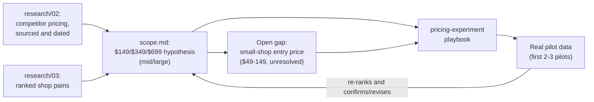

# Lesson 12.2 — Pricing is a hypothesis, built from research, not a guess

## 1. In one sentence
InvAI's prices ($149/$349/$699 per month for mid and large shops) are written down as a
**hypothesis to test**, not a final decision — grounded in what real competitors actually
charge and what research found real shop owners are willing to pay, with the owner holding
final say and a dedicated process for testing it before it's treated as settled.

## 2. Why it exists
Pricing a product nobody has paid for yet is a guess no matter how it's done. The honest
response to that isn't to pretend otherwise — it's to make the guess as informed as
possible, write it down as a hypothesis rather than a fact, and have a real plan for
finding out if it's right before betting the business on it. `scope.md`'s pricing section
is explicit about this: "**To test:** $149 / $349 / $699 per month for mid and large
shops... The owner decides prices." Everything in this lesson is the research behind that
hypothesis, and the process for actually testing it.

## 3. How it works

### What competitors actually charge, researched with sources
`invai-docs/research/02-competitors.md` doesn't guess at competitor pricing — it reads
real pricing pages and cites them. The closest direct competitor to InvAI's wedge,
**Pythias Technologies Fulfillment Cloud** (a "production-floor OS" for garment print
shops, covering order intake, production, shipping and tracking), charges "Starter $199
(500 orders, 2 integrations), Professional $599, Business $1,499, Scale $3,000/mo" — and
the research doesn't stop at the number, it finds the gap: "Its weak points are price for
small shops (only 2 channels at $199) and no visible listing, SEO or design AI." That gap
is a direct input to where InvAI's own pricing and feature set should sit, not just
competitive trivia. **MyDesigns.io**, the closest competitor on the *selling* side (AI
design, mockups, bulk listing publishing), prices far lower — "Free, Starter $19.99, Pro
$39.99, Pro Plus $79.99/mo" — but the research is specific about why that's not really
comparable: its "Self Fulfillment" mode "only turns off routing to a POD provider... There
is no blank inventory, gang-sheet building, production queue or label workflow." A shop
comparing InvAI's price to MyDesigns' price without that context would be comparing two
genuinely different products.

Decorator-category tools (built for custom B2B orders, not marketplace-selling shops) sit
in a similar range to Pythias: Printavo "Lite about $109/mo... Standard about $244/mo,"
shopVOX "Express $99, PRO $199/mo." The pattern across this whole table is what matters for
InvAI's own pricing logic: tools built specifically for this niche (DTF/DTG shops selling
on marketplaces, with real production-floor features) cluster in the $100–600/mo range
for small-to-mid shops, while general-purpose or lighter tools (Craftybase at $49/mo,
MyDesigns at $20–80/mo) sit well below that but also do far less.

### What shop owners actually complain about, ranked
`invai-docs/research/03-pain-points.md` is the other half of the pricing input: not what
competitors charge, but what real pain is severe enough that a shop would pay to fix it.
Pricing that doesn't map to a ranked pain is pricing built on hope rather than evidence —
`scope.md`'s own segment design (module 12.1) already reflects this research: mid shops get
priced access to the scan-checked floor, vendor portal, inventory, and profit tracking
*because* those are the pains research 03 found actually matter at that shop size, not
because they sounded impressive to build.

### The hypothesis itself, and its honest gaps
`scope.md`'s pricing hypothesis section states three things plainly:
1. **The number to test**: $149/$349/$699/mo for mid and large shops.
2. **A smaller-shop caveat, with research cited directly**: "Research 02: small shops pay
   $49–149 per month. The PM must decide the small-shop entry plan through a
   `pricing-experiment` before public launch" — notice this isn't resolved yet. The small-
   shop price point is explicitly left open, with a named process (not a guess the PM
   makes alone) for closing that gap before it matters (public launch).
3. **Final authority, stated once, clearly**: "The owner decides prices." Research informs
   the hypothesis; it doesn't set the number.

Research 16 (module 12.3's main source) adds one more honest data point worth knowing: "the
data-analyst should add the label-fee comparison ($0.01 Printavo, $0 Veeqo) to the OI-1
pricing experiment" — a reminder that pricing isn't just the monthly subscription number;
competitors differentiate on *fee structure* too (a per-label fee versus a free one), and a
real pricing experiment has to account for that, not just the headline monthly price.

### Testing it for real: the `pricing-experiment` playbook
A hypothesis that's never tested stays a hypothesis forever. `.claude/skills/
pricing-experiment/SKILL.md` exists specifically so "test the price" means something
concrete: a stated hypothesis, a segment, an offer, a method sized to the actual number of
pilots available (not a statistically naive A/B test nobody has the sample size for), a
success metric, and a readout plan — the same discipline as `define-metric` (module 8) and
`experiment-readout` applied to the single highest-stakes number in the business. This
connects straight back to `research/16-growth-opportunities.md`'s own humility about its
own pricing-adjacent findings: "There is still no pilot evidence. `customers/` is empty.
Every score below is from desk research, so confidence is capped at 0.8. The first 2–3
pilots should re-rank this list" — the same caveat applies to pricing. Desk research gives
a defensible starting hypothesis; it doesn't replace what a real pilot actually pays.

## 4. In our code
- `invai-docs/product/scope.md` §"Pricing hypothesis" — the stated numbers, the small-shop
  caveat citing research 02, and "the owner decides prices."
- `invai-docs/research/02-competitors.md` — sourced, dated competitor pricing: Pythias,
  MyDesigns, Printavo, shopVOX, Craftybase, each with its price and its gap.
- `invai-docs/research/03-pain-points.md` — the ranked pain points pricing and scope both
  trace back to.
- `invai-docs/research/16-growth-opportunities.md` §9 — "add the label-fee comparison
  ($0.01 Printavo, $0 Veeqo) to the OI-1 pricing experiment," a concrete next step for the
  pricing hypothesis.
- `.claude/skills/pricing-experiment/SKILL.md` (backed up in `invai-docs/team/skills/`) —
  the process for actually testing a price, not just proposing one.

## 5. What it uses
- **Sourced, dated competitor research** — every price in research 02 cites a URL and a
  fetch date, the same discipline as the AWS cost estimate in module 11.2, applied to
  market research instead of infrastructure.
- **A stated confidence cap with no pilot evidence** — research 16 explicitly caps its own
  confidence at 0.8 until real pilots exist, modeling honest uncertainty rather than false
  precision.
- **The `pricing-experiment` and `experiment-readout` playbooks** — turn "we think $X is
  the right price" into an actual measured test with a hypothesis, a segment, and a
  readout plan.

## 6. Try it yourself
1. Read the Pythias and MyDesigns entries in `research/02-competitors.md` side by side.
   Write two sentences: one on why their prices differ so much, and one on which of
   InvAI's MVP-in features (module 12.1) would justify pricing above MyDesigns and where
   near or below Pythias.
2. `grep -n "pricing hypothesis\|Research 02" invai-docs/product/scope.md` and read the
   small-shop caveat. Explain why "the PM must decide... through a `pricing-experiment`"
   is a more honest statement than just picking a small-shop number right now.
3. Open `.claude/skills/pricing-experiment/SKILL.md` and find the specific guidance on
   sizing a test's method to the number of real pilots available. Why would a standard
   A/B test design be the wrong tool here?

## 7. Common mistakes
- Treating a competitor's price as something to simply match or undercut, without reading
  what that competitor's price actually buys. MyDesigns' $19.99–79.99/mo looks cheap next
  to InvAI's hypothesis, but it's missing blank inventory, gang-sheet building, a
  production queue, and a label workflow entirely — comparing raw numbers without comparing
  feature scope is comparing the wrong thing.
- Treating the pricing hypothesis in `scope.md` as a final, settled price. The document's
  own language ("to test") and the explicit open gap on small-shop pricing both say
  otherwise — the number exists to be tested against real pilots, not announced as final.
- Running a pricing test sized like a consumer-app A/B test (thousands of users, a few
  percentage points of difference) when the actual number of pilot shops available is
  small. `pricing-experiment`'s whole design point is sizing the method to the real sample
  available, the same honesty `experiment-readout` (module 8-adjacent) brings to statistics
  with small numbers.

## 8. Check yourself

1. Why does `scope.md` cite research 02 by name when stating the small-shop
pricing caveat ("Research 02: small shops pay $49–149 per month"), instead of just stating
a number?

So the claim is checkable — anyone reading the pricing hypothesis can go verify where the
$49–149 range came from (sourced, dated competitor research) rather than trusting an
unattributed number, the same citation discipline this whole course cites code and docs by
file and line.

2. What's the practical difference between "the owner decides prices" and "the
PM researches and sets prices"?

Pricing is explicitly on the always-escalate list (module 10.1) because it's a business
risk decision with real revenue and positioning consequences — research and a tested
hypothesis inform the decision, but the actual commitment to a price is reserved for the
human owner, the same separation the team applies to spending, deploys, and legal
submissions.

3. Research 16 caps its own confidence at 0.8 because "there is still no pilot
evidence." Why does a cost estimate (module 11.2) get to cite hard, sourced prices with
high confidence, while a pricing hypothesis stays capped lower even with sourced competitor
research?

Because the AWS cost estimate prices known, fixed resource costs from public list prices —
a fact that doesn't depend on customer behavior — while a pricing hypothesis is a bet on
what real shop owners will actually agree to pay, which competitor pricing can inform but
not prove; only real pilots paying (or not) actually resolves that uncertainty.

## 9. Words to know
- **Pricing hypothesis** — a stated price to be tested against real pilot data, not a
  final, settled number; `scope.md`'s own phrase is "to test."
- **Pricing experiment** — a structured test (hypothesis, segment, offer, a method sized
  to the real sample available, a success metric, a readout plan) for actually finding out
  if a price works, rather than guessing or asking in the abstract.
- **Sourced research** — a research claim that cites exactly where it came from (a URL and
  a fetch date), so it can be independently checked rather than trusted on faith.
- **Confidence cap** — an explicit upper limit research applies to its own certainty (0.8,
  here) when it has no real pilot evidence yet, so a desk-research finding isn't mistaken
  for a proven one.
