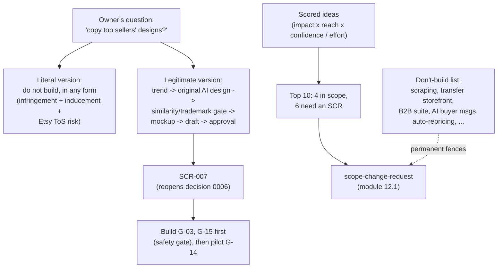

# Lesson 12.3 — Ranking growth ideas, and the discipline of saying "don't build"

## 1. In one sentence
When the owner asked for research on what to add next, the resulting document
(`invai-docs/research/16-growth-opportunities.md`) didn't just list ideas — it scored them
against evidence, flagged which ones need an outside approval before they can even be
considered, and named a specific list of ideas the team recommends **never** building, with
a reason for each.

## 2. Why it exists
"What should we build next?" is a question that's easy to answer badly by just listing
whatever sounds exciting. The discipline this lesson is really about is *ranking with
evidence* and, just as importantly, being willing to say "no, not this one, and here's
why" about ideas that might otherwise seem obviously good — including, in this case, an
idea the owner explicitly asked about. A growth research document that only ever says
"yes, build it" isn't doing its job; the valuable part is the ideas it rules out and the
reasons it gives.

## 3. How it works

### A formula, not a feeling
Research 16 §6 scores every idea with an explicit formula: **impact (1–5) × reach (1–5) ×
confidence (0.2–1.0) ÷ effort (S=1, M=2, L=4)**. Impact is measured against the already-
ranked pains from research 03; reach is the share of target shops (mid first, per module
12.1's segment priority) that actually have the pain; confidence is capped at 0.8 with no
pilot evidence (the same cap lesson 12.2 saw applied to pricing) and lowered further for
weaker sources; effort uses the same S/M/L sizing the rest of the team uses for task
cards. And there's a tiebreaker rule that overrides the raw score: "Items blocked on an
outside approval rank below every usable item... whatever their score" — an idea that
scores highest but can't be started without, say, Amazon's SP-API approval, is explicitly
not worth ranking above an idea the team can actually begin today.

The top of the resulting list is concrete and specific, not abstract: **G-01, a
dispatch-scan guard** (catching "label bought, never scanned" before it becomes a late
dispatch penalty) scores highest — impact 5, reach 5, because it directly protects the
exact wedge (module 1's core workflow) the whole product is built around. **G-03, a design
license record**, ranks second for a reason worth sitting with: "most shops print bought
designs; nobody tracks caps or rights" — a real, under-served pain with low effort (S) to
address, even though it sounds unglamorous next to AI design generation (which, per the
scores, ranks 17th).

### The owner's two questions, answered honestly
The owner asked two specific, pointed questions, and research 16 §5 answers both without
flinching from an uncomfortable answer to the first one.

**"Can InvAI automate 'take top Etsy sellers' designs, put them on a shirt and post the
listing'?"** The verdict is unambiguous: "**do not build it, in any form.** The shops
would carry strict, per-work liability and account bans. InvAI would carry inducement
exposure and lose its marketplace access. No price or speed advantage is worth that."
The reasoning traces three separate failure modes at once: it's "infringement at scale"
(each copied design is a real legal violation, not a gray area); it "breaks Etsy's API
terms," which would put the company's actual Etsy integration — and therefore every shop's
order import through that channel — at risk, not just the one feature; and it fits
"the one theory of vendor liability the courts still recognize: inducement" — meaning
InvAI itself, not just the shops using it, would carry legal exposure for building a tool
whose main use is infringement. This is recorded permanently, not just answered once: it
goes into both the "don't build" list (§7) and the scope fences (module 12.1's "No Etsy
competitor data" and "no scraping, ever" rules in `scope.md` already reflect this
conclusion directly).

**The legitimate version of the same underlying goal** — original speed, not stolen
designs — turns out to be buildable, and the research lays out the actual pipeline: a
trend signal feeds an *original* AI-generated design from a niche brief, which passes
through a similarity-and-trademark gate (module 7's trademark check, generalized), becomes
a mockup, becomes a listing draft, and only then gets a human's batch approval before
publishing. Costs are estimated concretely (≈$0.06–0.20 per design, plus ≈$0.20 per Etsy
listing), and the realistic speed is stated honestly too: "immediately" only really works
on Shopify; Etsy needs Commercial Access first; Amazon, TikTok and Walmart all review
listings for hours to days regardless of how fast InvAI itself could generate them. Because
this reopens the "AI design generation" cut from decision 0006, it's correctly routed as
its own scope-change request (SCR-007) rather than just built — and the recommended
sequence is telling: build the two *safety* pieces (G-03's license record and G-15's
design-risk gate) first, because they're useful standalone and because they're the exact
guardrail the generator would need before it could ship responsibly.

### The "don't build" list: specific reasons, not vibes
§7's table is worth reading in full because each entry gives a *mechanism*, not just a
verdict:
- **Scraping Etsy, Amazon, or TikTok** — "permanent fence... risks Etsy Commercial Access
  and SP-API" — the same reasoning as the design-copying answer above, generalized.
- **A storefront gang-sheet builder selling transfers to other decorators** — "crowded
  (Build A Gang Sheet claims 4,600 shops...), a price war below cost... and off our wedge
  (marketplace sellers)." This one isn't a legal or ethical objection at all — it's a pure
  market-positioning one: the idea might be viable for *someone*, just not for InvAI,
  because it competes on a different axis (price, against an already-crowded field) than
  InvAI's actual strength (the marketplace-to-floor-to-profit wedge).
- **A full B2B decorator suite** (quotes, invoices, web stores) — "Taivo, Printavo,
  DecoNetwork and InkSoft own it with 11,000+ clients. We take only the thin slice
  (G-16)." A deliberate choice to stay narrow rather than compete head-on against
  entrenched incumbents in a category InvAI isn't built for.
- **AI buyer messages or auto-replies** — already cut in decision 0006, and reinforced
  here with a specific policy fact: "Etsy's rules say never email Etsy buyers... Etsy API
  v3 has no conversations endpoint." Sometimes "don't build" isn't a judgment call at
  all — it's simply not possible within the platform's own rules.
- **Per-person productivity ranking, on by default** — "trust and state monitoring-law
  risk; no evidence shops want it." A reminder that even a technically easy feature (count
  scans per presser) can carry a real legal and trust cost that outweighs its apparent
  usefulness — the recommended alternative (station-level first, per-person opt-in) keeps
  the useful signal while removing the default-surveillance problem.
- **Automatic repricing** — "Fence: suggest only." The same no-automatic-action principle
  as the market-signals fences in `scope.md` (module 12.1), applied to a different feature
  area with the same reasoning.

### What this feeds, and what it doesn't
Research 16's own framing is explicit about its limits: "**This is research and ranking
only. Nothing here is in scope.**" Even the top-ranked ideas don't get built just because
they scored well — they still go through `scope-change-request` (module 12.1), and five of
the top ten are explicitly drafted as SCRs sent to the owner as one inbox item (OI-17),
while the four fully in-scope ones (no outside approval needed) simply queue into the next
`prioritize-backlog` run with real specs. Ranking research earns ideas a place in line; it
doesn't skip the line.

## 4. In our code
- `invai-docs/research/16-growth-opportunities.md` §0 — the summary: top 10 ranked ideas,
  the owner's design question answered, the don't-build list.
- `invai-docs/research/16-growth-opportunities.md` §5.1–5.3 — the full reasoning on design
  copying (don't build), the legitimate pipeline (SCR-007), and ready-made/bought designs.
- `invai-docs/research/16-growth-opportunities.md` §6 — the scoring formula and the full
  ranked table, including the outside-approval tiebreaker rule.
- `invai-docs/research/16-growth-opportunities.md` §7 — the "don't build" table, one row
  per idea with its specific reason.
- `invai-docs/research/16-growth-opportunities.md` §8 — the five drafted scope-change
  requests (SCR-003 through SCR-007) and the owner-inbox routing (OI-17).
- `invai-docs/decisions/0006-v1-cuts.md` — the original "AI design generation: cut" entry
  that SCR-007 would reopen.
- `invai-docs/product/scope.md` §"Fences on items 16 and 17" — the scraping/automatic-
  action fences this research's reasoning directly reinforces.

## 5. What it uses
- **A weighted scoring formula** — impact × reach × confidence ÷ effort, so ranking isn't
  just a gut call, and an outside-approval dependency is treated as a hard tiebreaker, not
  just another factor.
- **The `prioritize-backlog` and `scope-change-request` playbooks** — the actual mechanism
  that turns a ranked idea into real work, or routes it to the owner when it reopens a
  decision.
- **A named, reasoned "don't build" list** — every entry states a specific mechanism
  (legal risk, market crowding, a policy that makes it literally impossible, a trust cost),
  not just a verdict.

## 6. Try it yourself
1. Read §7's "don't build" table in full. For each entry, classify its reason into one of
   three categories: a legal/policy risk, a market-positioning call, or a trust/ethics
   concern. Notice that not all "don't build" calls have the same kind of reasoning behind
   them.
2. `grep -n "SCR-007\|decision 0006" invai-docs/research/16-growth-opportunities.md
   invai-docs/decisions/0006-v1-cuts.md` and trace how an idea that was already cut once
   (AI design generation) can still resurface through a formal process (SCR-007) rather
   than simply being built because the research ranked a related idea highly.
3. Pick one of the four in-scope top-10 ideas (G-01, G-11, G-04, G-10) and one of the six
   that need an SCR. Explain in one sentence what specifically makes the first group
   buildable without new approval and the second group not.

## 7. Common mistakes
- Treating a high-scoring idea as automatically approved to build. Research 16 says this
  explicitly: "nothing here is in scope" — even the top-ranked idea still has to go through
  `scope-change-request` if it isn't already in `scope.md`.
- Assuming "don't build" means "this idea is bad." Several don't-build entries (the
  transfer-selling storefront, the full B2B suite) are rejected for pure market-
  positioning reasons, not because they're objectively poor ideas — they just don't fit
  InvAI's specific wedge or would mean competing against entrenched incumbents on their
  own turf.
- Answering "can we build X" with only a yes/no, instead of separating the literal version
  from a legitimate version of the same underlying goal. The owner's design-copying
  question is the clearest example: the literal version is a hard no, but the underlying
  goal (originality, at speed) has a real, buildable answer once it's decoupled from
  infringement.

## 8. Check yourself

1. Why does an idea blocked on an outside approval rank below every usable idea
in research 16's scoring, "whatever their score"?

Because a score measures how valuable an idea *would be* if built, but says nothing about
whether it can actually be started — ranking a blocked idea above a usable one would
mislead the backlog into prioritizing something the team can't yet act on over something
it genuinely can, wasting the ranking's whole purpose.

2. The research separates "copy top sellers' designs" (don't build) from
"generate original AI designs from a niche brief" (buildable, via SCR-007). What's the
actual difference that makes one permanently off the table and the other just gated behind
a process?

The first copies specific existing protected work, which is infringement regardless of how
it's automated; the second generates new, original material informed by a trend signal —
no one's existing design is copied — so the legal and policy risk that makes the first
option a permanent "no" simply doesn't apply to the second, leaving only the normal gating
(cost, new spend, reopening a scope decision) a scope-change request exists to handle.

3. Why does the research recommend building G-03 (design license record) and
G-15 (design risk gate) *before* a possible AI design generator (G-14), even though the
generator ranked lower on its own score?

Because G-03 and G-15 are useful on their own regardless of whether the generator is ever
built, and they're also exactly the safety mechanism (tracking rights, catching similarity
and trademark risk) a design generator would need in order to ship responsibly — building
them first means the generator, if it's ever approved, launches on top of an already-
tested gate instead of needing one built from scratch under pressure.

## 9. Words to know
- **Impact × reach × confidence ÷ effort** — research 16's scoring formula for ranking
  growth ideas against evidence rather than intuition, with confidence explicitly capped
  without real pilot data.
- **Outside-approval tiebreaker** — the rule that any idea blocked on an approval the team
  doesn't control (an API access tier, a marketplace program) ranks below every idea that
  isn't, regardless of its raw score.
- **Don't-build list** — a specific, reasoned list of ideas the research recommends never
  building, each with its own stated mechanism (legal risk, market fit, policy
  impossibility, trust cost).
- **SCR (scope-change request)** — the formal process (module 12.1) a ranked idea must go
  through before it can actually be built, whether or not it scored well.
- **Inducement** — a legal theory of liability for building or providing a tool whose
  main foreseeable use is enabling someone else's infringement, cited as part of why
  automated design-copying carries risk for InvAI itself, not just for the shops using it.
