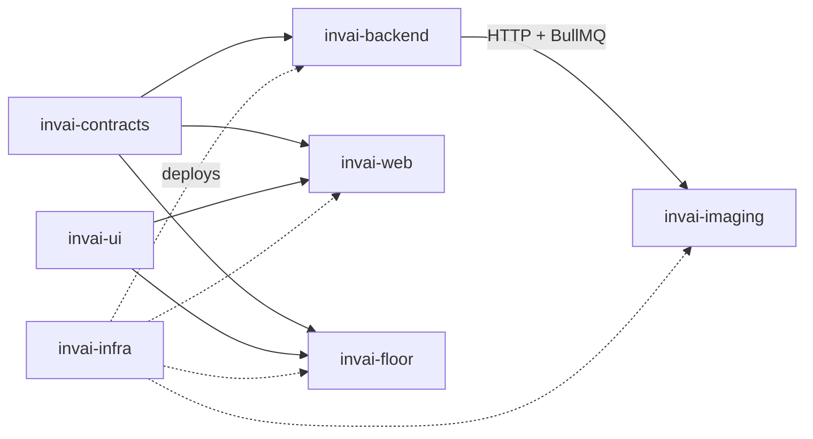

# InvAI workspace

InvAI is one platform for DTF t-shirt shops that sell on Etsy, Amazon, Shopify, TikTok Shop and Walmart: AI listings, one order queue, automatic gang sheets, blank inventory, scan-checked production, labels and profit.

This folder holds one Git repository per part. Clone them all side by side.

| Repo | What it is | Stack |
| --- | --- | --- |
| [invai-docs](invai-docs) | Research, concept, architecture, tool stack, cost model | Markdown, Python |
| [invai-contracts](invai-contracts) | Shared API contract, schemas, order states, events (`@invai/contracts`) | TypeScript, Zod, oRPC |
| [invai-ui](invai-ui) | Shared components, theme, English/Spanish strings (`@invai/ui`) | React, shadcn/ui, Tailwind |
| [invai-backend](invai-backend) | API server + background workers, database, integrations, AI gateway | Node 24, Hono, oRPC, Drizzle, BullMQ, Better Auth |
| [invai-imaging](invai-imaging) | Rendering, gang-sheet nesting and composing, print checks, mockups | Python, FastAPI, pyvips, rectpack |
| [invai-web](invai-web) | Dashboard for owners, office staff, designers and DTF vendors | Vite, React, TanStack |
| [invai-floor](invai-floor) | Tablet app for pick/press/QC/pack stations | Vite PWA, Dexie |
| [invai-infra](invai-infra) | AWS (SST) and local Docker services | SST, Docker Compose |

## How they depend on each other



- **Shared packages** (`@invai/contracts`, `@invai/ui`) are linked locally with `link:../<repo>`. Later, CI publishes them to GitHub Packages and consumers switch to version ranges.
- **Change order for a new feature:** contracts → backend → web/floor. A contract change that breaks consumers must be updated in all of them the same day.

## Run everything locally

```
cd invai-infra && pnpm install && pnpm local:up
cd ../invai-contracts && pnpm install
cd ../invai-ui && pnpm install
cd ../invai-backend && cp .env.example .env && pnpm install && pnpm db:migrate && pnpm dev:api
cd ../invai-backend && pnpm dev:worker                    # second terminal
cd ../invai-imaging && uv sync && uv run uvicorn app.main:app --port 8000
cd ../invai-web && cp .env.example .env && pnpm install && pnpm dev     # :5173
cd ../invai-floor && cp .env.example .env && pnpm install && pnpm dev   # :5174
```
